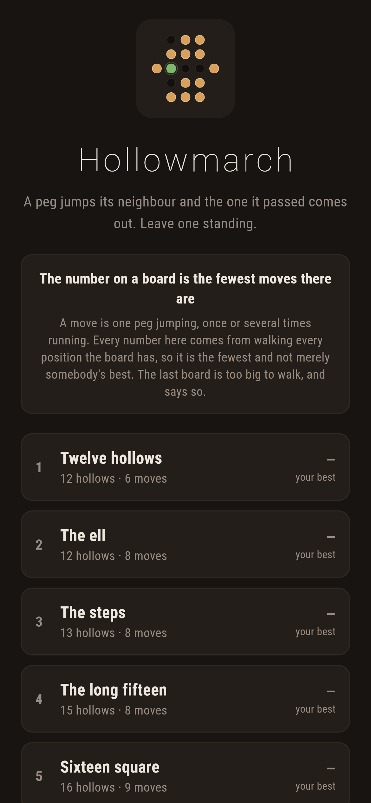
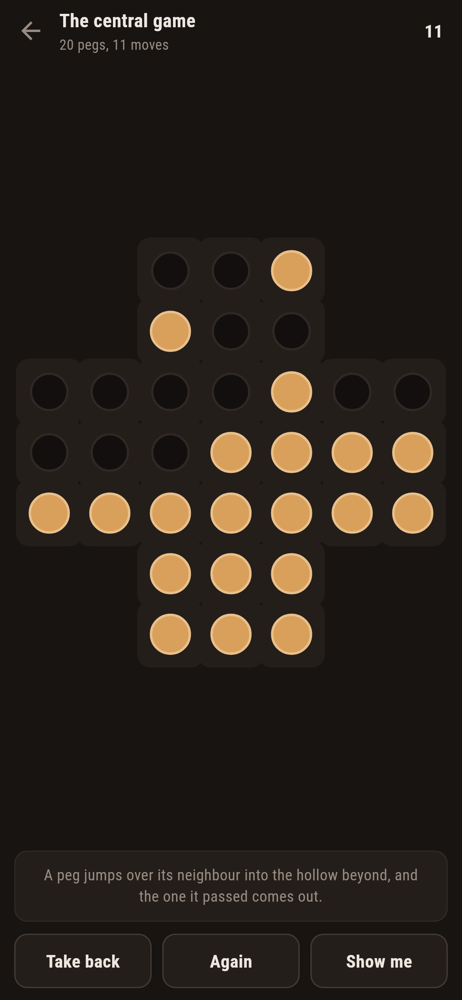
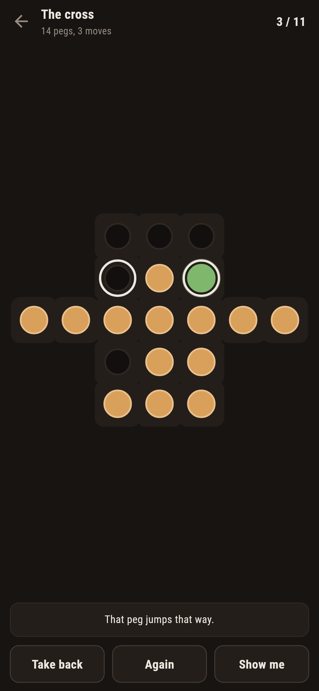
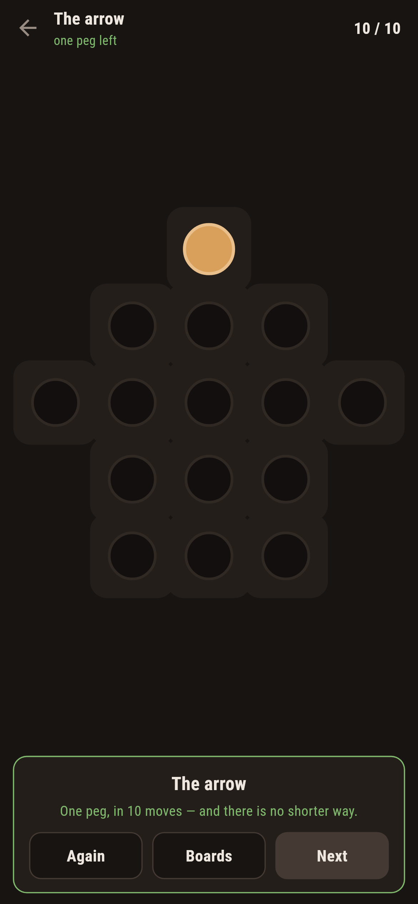
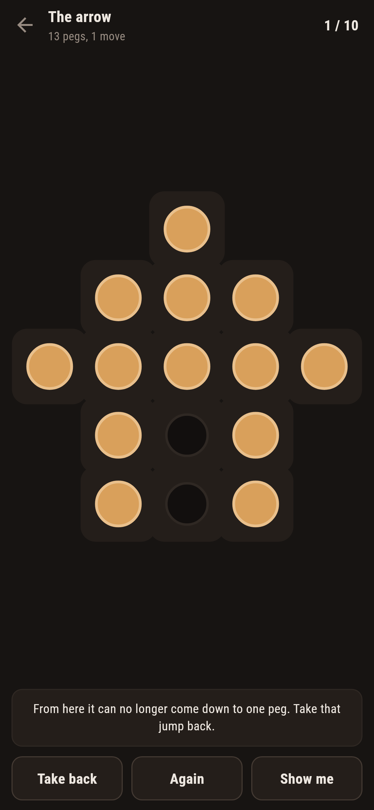

# Hollowmarch

A peg puzzle for phones, in Flutter, for Android and iOS.

A peg jumps over its neighbour into the hollow beyond, and the one it passed
comes out. Leave one peg standing. The number on each board is the fewest
moves there are, and it is not a guess.

| | | | |
|---|---|---|---|
|  |  |  |  |

## An invariant, which is a proof that costs nothing to check

Number the four values of the smallest field after the one everybody knows:
0, 1, and the two roots of x² = x + 1. Call one of them **a**. Then

```
a² = a + 1,  so  a^k + a^(k+1) = a^k(1 + a) = a^k · a² = a^(k+2)
```

Label the hollow in row r and column c with a^(r+c), and add up the labels of
every hollow that has a peg in it. Three hollows in a row carry a^k, a^(k+1)
and a^(k+2). A jump takes the pegs off the first two and puts one on the
third, and by that identity **the sum does not change**. Not for that jump:
for every jump, in every direction, from any position whatever. Do it again
with a^(r−c) and there are two such sums.

So a position can only ever become a position with the same pair of sums. One
peg left in a hollow is a position whose pair is that hollow's own pair. Which
means: *if the sums on the board do not match a hollow's, no sequence of jumps
however long ends there*, and no searching was done to find that out.

A test plays a hundred positions on every shipped board and checks the sums
against every jump available from each of them. If that ever failed, every
"you cannot finish from here" this game says would be saying it for no reason.

## Two halves of one old result

The last board is the one this game has been played on since somebody at the
court of Louis XIV was bored: thirty three hollows in a cross, the middle one
empty. `make prove` runs both halves of what is known about it:

```
$ make prove
the rule of three allows 5 of 33 hollows:
  (0,3)  (3,0)  (3,3)  (3,6)  (6,3)

and the search reaches:
  (0,3): 31 jumps  7609491 positions, 6958ms
  (3,0): 31 jumps  7574268 positions, 6948ms
  (3,3): 31 jumps     1065 positions, 2ms
  (3,6): 31 jumps  6494107 positions, 5831ms
  (6,3): 31 jumps     1065 positions, 2ms
```

The sums rule out twenty eight of the thirty three hollows in no time at all.
The search then reaches every one of the five that are left. Neither half is
worth much alone. The rule allows hollows that cannot be reached on other
boards, and a search that finds five says nothing about the twenty eight it
did not try. Together there is nothing left to wonder about.

Thirty one jumps every time, and that is not a result: every jump takes
exactly one peg off, so a board of thirty two pegs always takes thirty one of
them whoever plays it.

## The number worth competing over is moves, not jumps

A move is one peg jumping, **once or several times running**. That is how the
game has always been counted, and it is the only count that can be beaten. So
a peg that lands somewhere it can jump again stays on the move, nothing else
may go until it is let go, and the game says so.

Every par here is the fewest moves there are, found by a breadth-first walk
over positions with one step of the walk being a whole run. A test works each
one out again from nothing and fails if it comes out different:

```dart
final fewest = Runs.fewest(board.field, board.start);
expect(fewest!.$1, board.par, reason: board.name);
```

**The big board ships with no par at all.** Nothing here can walk the
positions of the thirty three hollow board, so it says "no fewest known"
rather than printing a number somebody might take for one.

## It says the moment a board is spoiled



> From here it can no longer come down to one peg. Take that jump back.

Two things answer that and the cheap one goes first: the sums settle half of
the dead positions on their own, and only then is the search asked, with a
budget, so that on the big board it says *"I cannot see a way from here"*
rather than a "no" it has not earned.

## Running it

```
make deps    # flutter pub get
make test    # everything
make analyze
make shots   # render the screens into build/showcase, redraw the logo and icons
make prove   # the five hollows of the central game, both halves
make boards  # every shape, what it allows and how few moves it takes
make apk     # release APK
make ios     # release iOS build, unsigned
```

## Tests

`flutter test` runs the shape of a board (its hollows, every jump it allows
both ways round, and none that runs off the edge), the rule of three (that no
jump on any shipped board changes either sum, that a finish the search finds
was one the rule allowed, and that the central game comes out at exactly those
five hollows), every board (it can be brought down to one peg, its par is the
fewest there is, and the big one claims nothing), the playing (a jump takes
what it passed over, the five reasons a jump is refused, a run counted as one
move, nothing else moving until it is let go, taking a jump back into the
middle of a run, and the difference between stuck and finished), and the
guide (that it says "I cannot see" rather than guessing when it is given
almost nothing to look at).

Then the game through the screen: picking a peg up, jumping it, carrying on,
letting go, taking back, the warning when a board can no longer be finished,
the warning when nothing can jump at all, and every board played down to one
peg, in its par where there is one.

Screenshots come from `test/showcase_test.dart`, and every peg that has gone
in them went by being jumped over. `test/mark_test.dart` draws the logo, the
launcher icons at every density Android asks for and every size the iOS icon
set asks for; there is no image in this repository that was not produced by
it.
