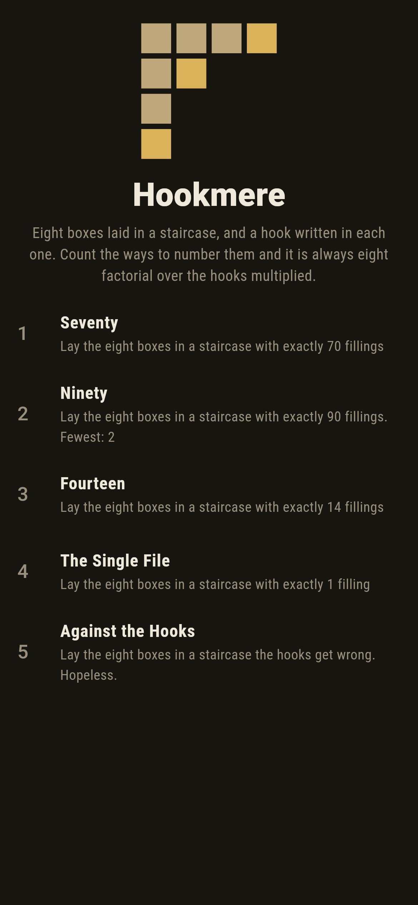
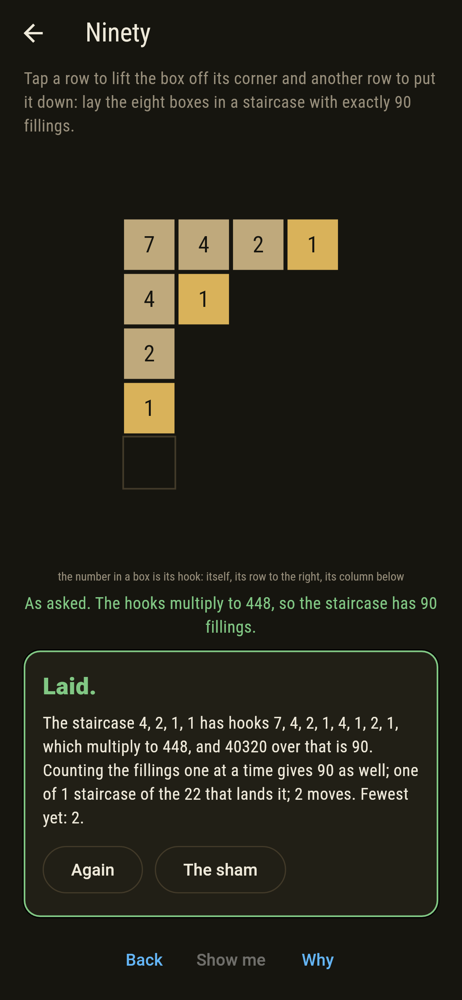
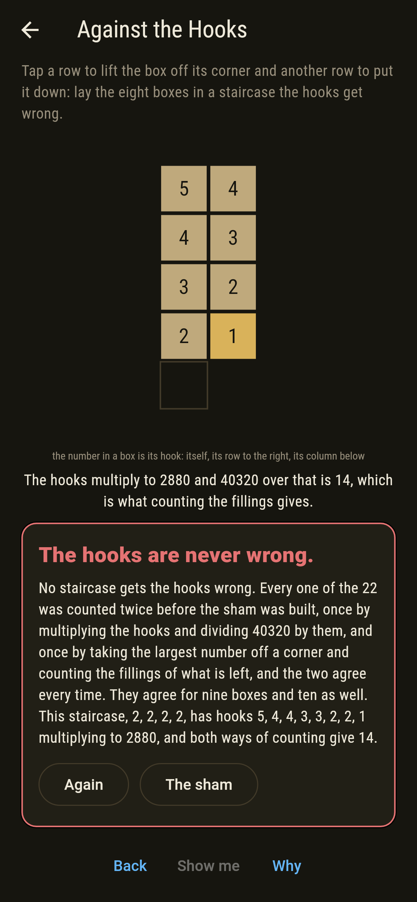
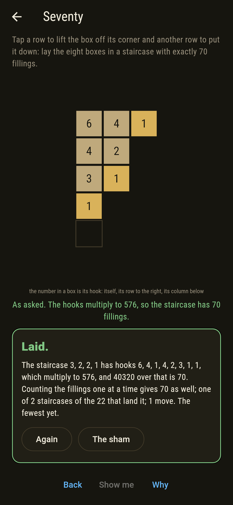
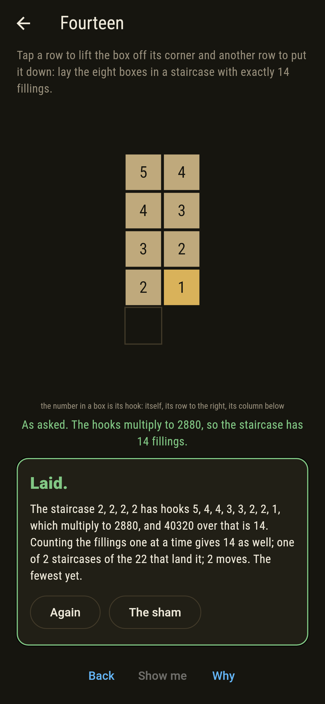
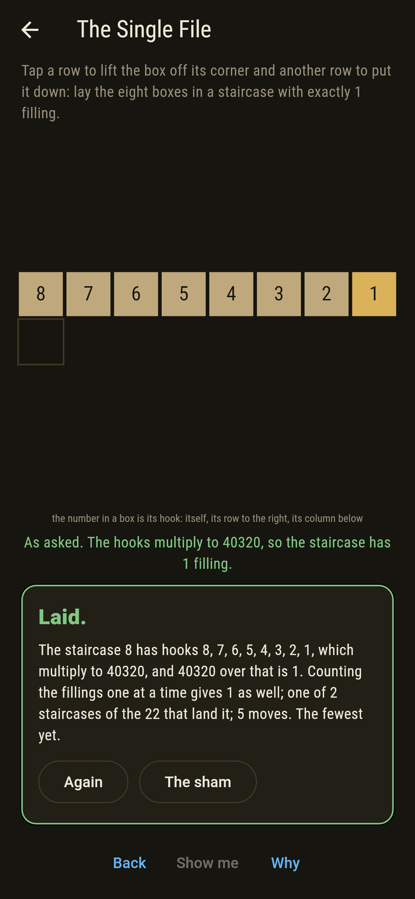
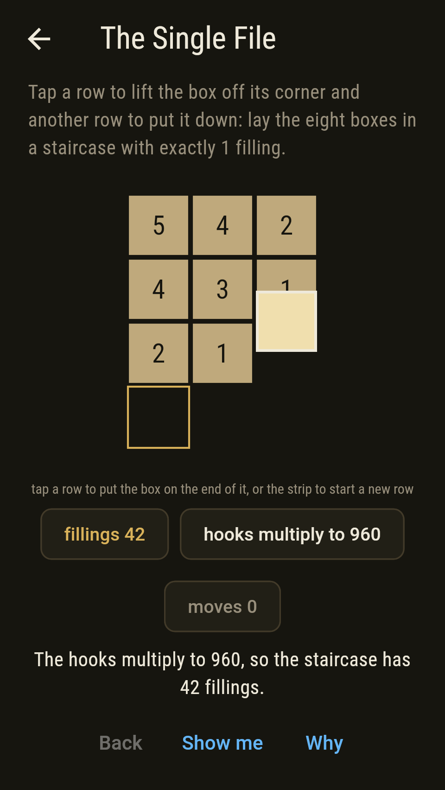
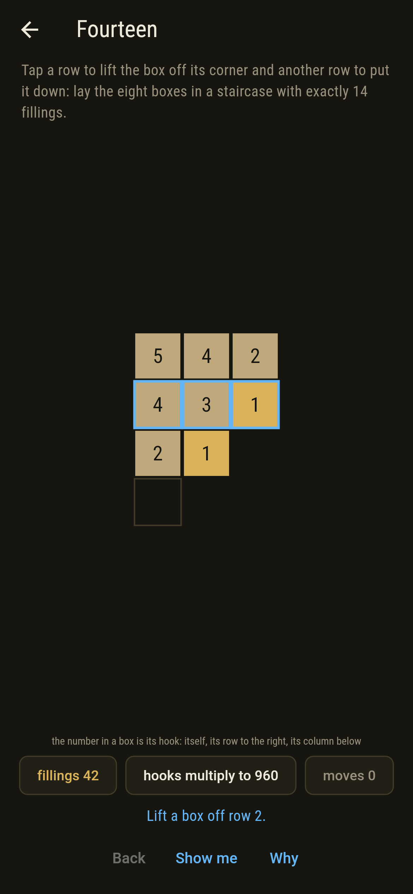
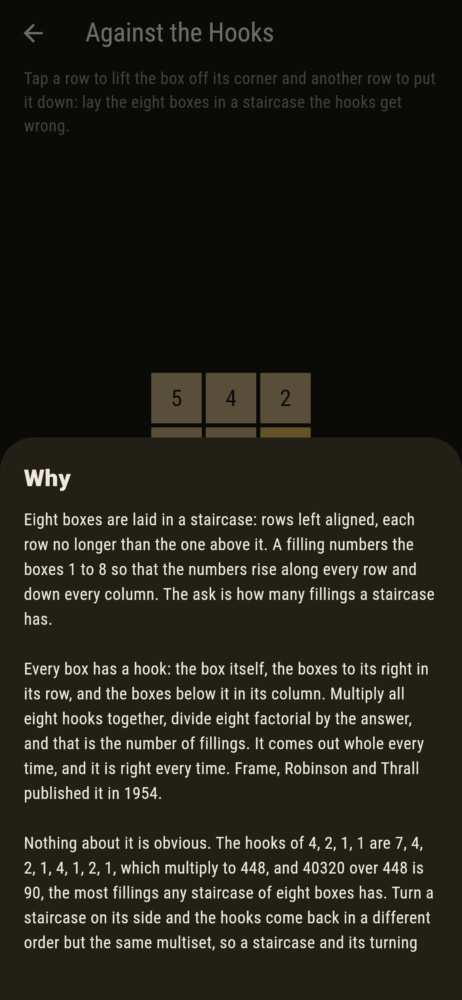

# Hookmere


Eight boxes laid in a staircase: rows left aligned, each row no longer
than the one above it. A filling numbers the boxes 1 to 8 so the
numbers rise along every row and down every column. Tap a row to lift
the box off its corner, tap another row to put it down, and the
staircase changes shape under your thumb.

Every box carries a hook: itself, the boxes to its right in its row,
and the boxes below it in its column. Multiply the eight hooks
together, divide 40320 by the answer, and that is exactly how many
fillings the staircase has. Frame, Robinson and Thrall published that
in 1954.

## The asks

1. **Seventy** - lay the eight boxes in a staircase with exactly 70 fillings
2. **Ninety** - lay the eight boxes in a staircase with exactly 90 fillings
3. **Fourteen** - lay the eight boxes in a staircase with exactly 14 fillings
4. **The Single File** - lay the eight boxes in a staircase with exactly 1 filling
5. **Against the Hooks** - lay the eight boxes in a staircase the hooks get wrong

Two staircases have 70 fillings and they are each other turned on
their side, 4, 3, 1 and 3, 2, 2, 1. One has 90, which is 4, 2, 1, 1,
and no staircase of eight boxes has more. Two have 14, the square 4, 4
and the tall 2, 2, 2, 2, again a pair of turnings. Two have exactly
one filling, all eight boxes in a row or all eight in a column, and
those are the furthest from the opening: five moves either way.
Against the Hooks says Hopeless on its tile, and the card at the end
of the ask says why on a finger.

## Why the hooks give the count

Nothing about it looks likely. The hooks of 4, 2, 1, 1 are 7, 4, 2, 1,
4, 1, 2, 1, which multiply to 448, and 40320 over 448 is 90. The hooks
of a single row are 8, 7, 6, 5, 4, 3, 2, 1, which multiply to 40320
exactly, leaving one filling, which is right: the numbers have only
one order they can go in.

Turn a staircase on its side, swapping rows for columns, and every
hook becomes a hook of the turned staircase. The multiset is the same,
so the product is the same, so the count is the same. That is why the
asks come in pairs.

The counts squared and added over all 22 staircases come to 40320, the
factorial of the boxes, and the same holds for every other size the
checker tries. That is the Robinson correspondence counting pairs of
fillings, and it gives the hook formula something else to be checked
against.

## Two voices

The game never asserts what it has not computed, and it computes
everything at least twice:

* **The hooks** count nothing. They multiply eight numbers and divide
  40320 by the product.
* **The counting** is the definition worked out in full. The largest
  number in a filling can only sit on a corner, so the fillings of a
  staircase are the fillings of each staircase left when a corner box
  is taken off, added up.

The two are set against each other on all 22 staircases of eight
boxes, and on every staircase of one box up to ten.

`tool/check_hooks.dart` runs the lot and refuses the bake on any
disagreement.

## The checker's ledger

What `dart run tool/check_hooks.dart` printed for the build this README
shipped with, word for word:

```
every staircase eight boxes can be laid in taken, all 22 of them, and each counted twice: once by multiplying the eight hooks and dividing 40,320 by them, which counts no fillings at all, and once by taking the largest number off a corner and counting the fillings of what is left, which is the definition worked out in full: the two agree on every staircase; and they agree from one box up to ten, 1 at 1, 2 at 2, 3 at 3, 5 at 4, 7 at 5, 11 at 6, 15 at 7, 22 at 8, 30 at 9, 42 at 10 staircases, where the counts squared and added come to the factorial of the boxes every time, 40,320 at eight; a staircase and the same staircase turned on its side always count the same, since turning it swaps every hook for another hook of the same staircase; the most fillings eight boxes reach is 90, at the staircase 4, 2, 1, 1, whose hooks multiply to 448, and the fewest is 1, at the single row and the single column, whose hooks multiply to 40,320 exactly; and moving one box at a time off a corner and onto another, every one of the 22 staircases can be reached from the 3, 3, 2 the board opens on, the furthest of them 5 moves off

 1 Seventy           lay the eight boxes in a staircase with exactly 70 fillings: 2 of the 22 staircases land it, the nearest 1 move off
 2 Ninety            lay the eight boxes in a staircase with exactly 90 fillings: 1 of the 22 staircases lands it, the nearest 2 moves off
 3 Fourteen          lay the eight boxes in a staircase with exactly 14 fillings: 2 of the 22 staircases land it, the nearest 2 moves off
 4 The Single File   lay the eight boxes in a staircase with exactly 1 filling: 2 of the 22 staircases land it, the nearest 5 moves off
 5 Against the Hooks lay the eight boxes in a staircase the hooks get wrong: none of the 22, nor of the staircases of nine boxes or ten, and the hooks say why
```

## Screenshots

| The sham | Ninety | Against the hooks |
| --- | --- | --- |
|  |  |  |

| Seventy | Fourteen | The single file | A box in hand, on the small phone | Show me | The why |
| --- | --- | --- | --- | --- | --- |
|  |  |  |  |  |  |

Screenshots are drawn by `test/showcase_test.dart` at real phone sizes
with the app's own painter, then copied into `docs/` as they came out;
every box in them was moved by a tap on a row, so nothing pictured is a
staircase the game could not reach. The staircase across the top of the
sham shot is the mark rather than a run of taps. The logo and every
launcher icon come out of `test/mark_test.dart` the same way: the mark
is 4, 2, 1, 1, the staircase with the most fillings there are.

## Building

```
flutter test          # 58 tests, the sweep among them
dart run tool/check_hooks.dart
flutter build apk     # or: flutter build ios
```
