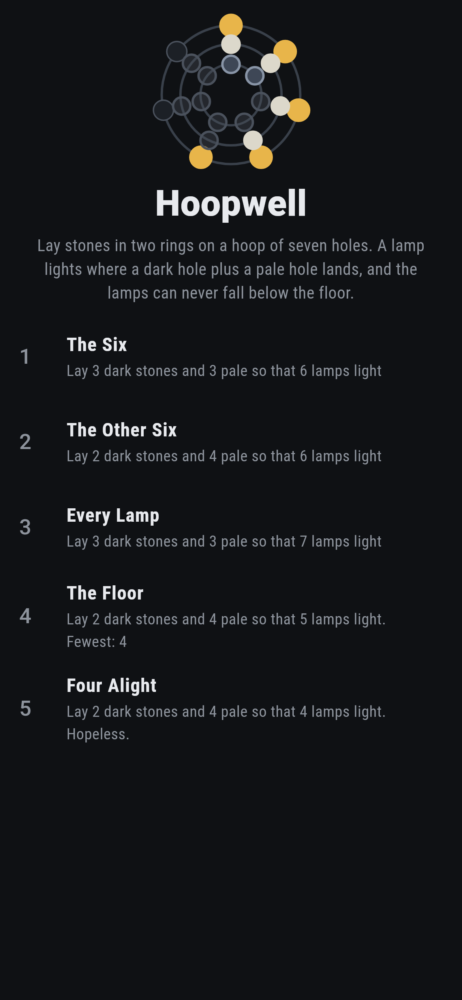
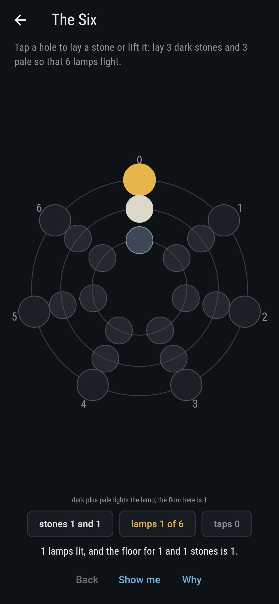
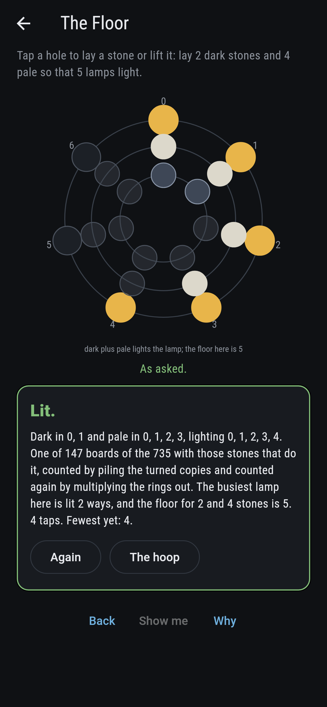
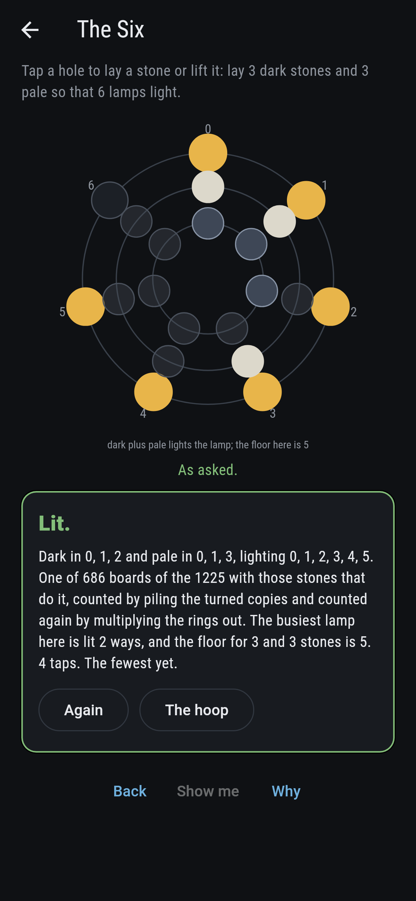
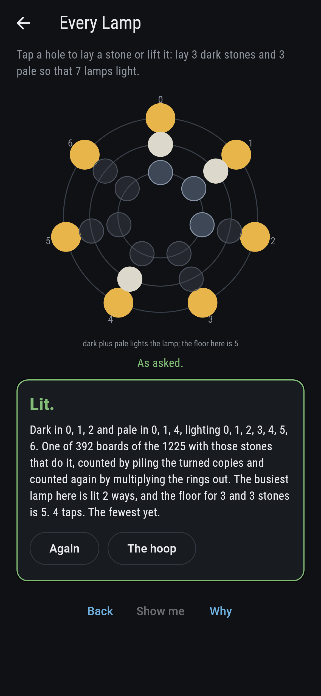
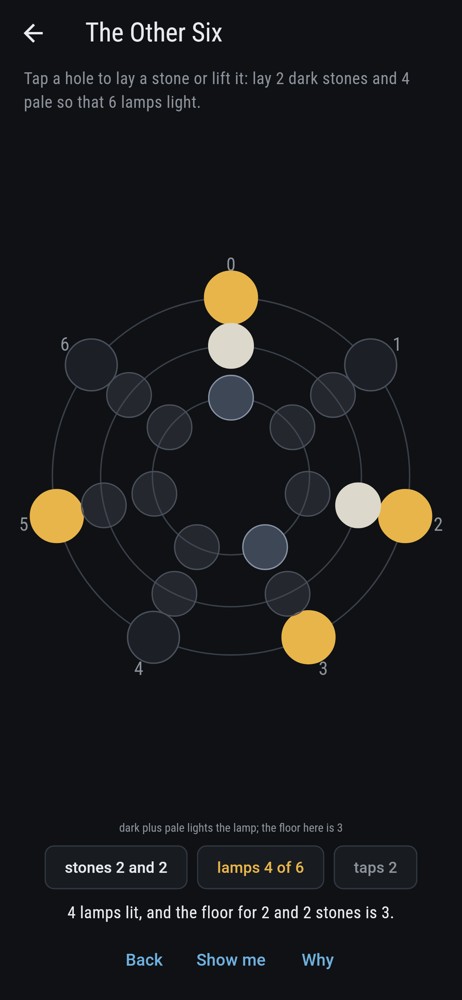
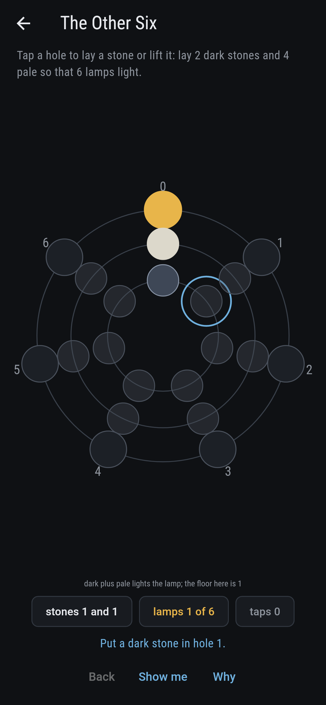
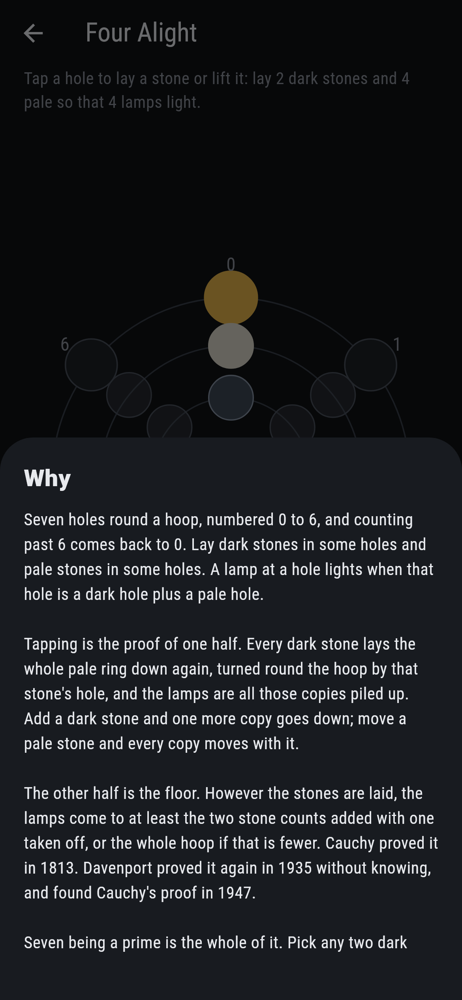
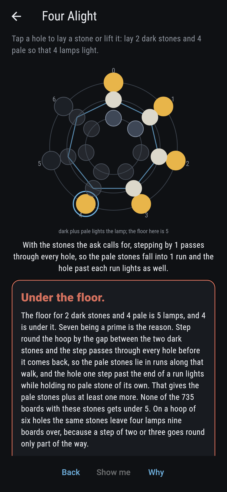

# Hoopwell


Seven holes round a hoop, numbered 0 to 6, and counting past 6 comes
back to 0. Lay dark stones in some holes and pale stones in some
holes. A lamp lights at every hole that is a dark hole plus a pale
hole. Tapping is one half of the proof: each dark stone lays the
whole pale ring down again, turned round the hoop by that stone's
own hole, and the lamps are those copies piled up. The other half is
the floor. However the stones are laid, the lamps come to at least
the two stone counts added with one taken off, or the whole hoop if
that is fewer. Cauchy proved it in 1813; Davenport proved it again
in 1935 without knowing, and found Cauchy's proof in 1947. Seven
being a prime is the whole of it, and the game is built so that a
player can see why: step round by the gap between any two dark
stones and, seven having no divisor but itself and one, that step
passes through every hole before it comes back. Every board the hoop
allows is laid before the bake, all 16,384 of them, with the lamps
lit twice and the floor read a third way that lights nothing at all.

## The asks

1. **The Six** - lay 3 dark stones and 3 pale so that 6 lamps light
2. **The Other Six** - lay 2 dark stones and 4 pale so that 6 lamps light
3. **Every Lamp** - lay 3 dark stones and 3 pale so that 7 lamps light
4. **The Floor** - lay 2 dark stones and 4 pale so that 5 lamps light
5. **Four Alight** - lay 2 dark stones and 4 pale so that 4 lamps light

The asks land 686, 441, 392, 147 and none of the boards their stones
allow, and every one of them is 4 taps from the opening, which is a
single stone of each colour in hole 0. Three dark stones and three
pale can leave 5, 6 or 7 lamps and nothing else, 147 and 686 and 392
boards of the 1,225; two and four have the same floor of five but a
different spread, 147 and 441 and 147 of the 735. The Floor asks for
the fewest five stones can leave, and every one of the 147 boards
that manages it turns out to be the same shape: the dark stones and
the pale stones are both runs at one shared step round the hoop.
Vosper proved in 1956 that they have to be. Four Alight is labeled
hopeless on its tile, and the walk is the why: the four pale stones
lie in runs along it, the hole one step past the end of a run lights
without holding a pale stone of its own, so the lamps come to the
pale stones plus the runs, and there is always at least one run.
Take the hoop to six holes and the argument fails with it, because a
step of two or three goes round only part of the way: the same
stones leave four lamps there, nine boards over.

## Three voices

The game never asserts what it has not computed, and it computes
everything at least twice:

* **The piling** turns the pale ring round the hoop by each dark hole
  in turn and lays the copies on top of one another. It is what a tap
  does, and every count on the tile and the card is its.
* **The pouring** multiplies the two rings out hole by hole, so it
  knows how many ways each lamp is lit rather than only that it is.
  That is a thing the piling cannot see, and it pays for itself: its
  counts have to add up to the two stone counts multiplied, which is
  a check on every board.
* **The divisors** light nothing and turn nothing. The fewest lamps
  two sets of given sizes can leave on a hoop of n holes is read off
  the divisors of n, since a set sitting inside the multiples of a
  divisor is the only way to beat the floor. Seven has no divisors
  but itself and one, so the reading comes back to the floor, and on
  a hoop of six it does not.

`tool/check_hoops.dart` runs the lot and refuses the bake on any
disagreement. It also holds the walk to the lamps: on all 2,667
boards with two dark stones, the lamps came to the pale stones plus
the runs the walk passes, every time.

Thrissleton in this collection is Erdos, Ginzburg and Ziv, so it is
the nearest neighbour by subject, both of them counting sums in a
ring of remainders. It dials one hand of five stones and counts the
triples that sum to a multiple of three. This lays two sets side by
side and puts the size of their sumset on the board, which nothing
else here has done.

## The checker's ledger

What `dart run tool/check_hoops.dart` printed for the build this
README shipped with, word for word:

```
every board a hoop of 7 holes allows laid, all 16,384 of them, a dark stone or none in each hole and a pale stone or none in each: the lamps were lit twice on every one, once by turning the pale ring round the hoop by each dark hole in turn and piling the copies up, and once by multiplying the rings out hole by hole, and the two agreed 16,384 times out of 16,384; the multiplying knows more than the piling, since it counts how many ways each lamp is lit rather than only that it is, and its counts came to the two stone counts multiplied on every board, at most 7 ways to one lamp; the lamps never came under the two stone counts added with one taken off, or the whole hoop when that is fewer, on any of the 16,384, and a third voice that lights nothing read the same floor off the divisors of seven every time; 9,857 boards sit exactly on that floor, and of the 882 of them with two or more stones of each colour and a floor below six, every single one is a run of dark stones and a run of pale stones at one shared step round the hoop; on all 2,667 boards with two dark stones, stepping round by the gap between them visits every hole, and the lamps came to the pale stones plus the runs the walk passes, every time; two dark stones and four pale leave five lamps at least on all 735 boards, and never four, though on a hoop of six holes the same shape leaves four lamps 9 boards over

 1 The Six       lay 3 dark stones and 3 pale so that 6 lamps light: 686 of the 1,225 boards with those stones do it, the nearest 4 taps away
 2 The Other Six lay 2 dark stones and 4 pale so that 6 lamps light: 441 of the 735 boards with those stones do it, the nearest 4 taps away
 3 Every Lamp    lay 3 dark stones and 3 pale so that 7 lamps light: 392 of the 1,225 boards with those stones do it, the nearest 4 taps away
 4 The Floor     lay 2 dark stones and 4 pale so that 5 lamps light: 147 of the 735 boards with those stones do it, the nearest 4 taps away
 5 Four Alight   lay 2 dark stones and 4 pale so that 4 lamps light: none of the 735, and the floor of 5 said so first
```

## Screenshots

| The hoop | An ask as it opens | The floor, five lamps |
| --- | --- | --- |
|  |  |  |

| The six | Every lamp | Mid-laying | Show me | The why | Under the floor |
| --- | --- | --- | --- | --- | --- |
|  |  |  |  |  |  |

Screenshots are drawn by `test/showcase_test.dart` at real phone
sizes with the app's own painter, then copied into `docs/` as they
came out; every stone in them was laid by a tap on a hole, so
nothing pictured is a board the game could not reach. The logo and
every launcher icon come out of `test/mark_test.dart` the same way:
the mark is two dark stones and four pale laid as runs at one step,
lighting five lamps, which is the floor.

## Building

```
flutter test          # 60 tests, the three voices among them
dart run tool/check_hoops.dart
flutter build apk     # or: flutter build ios
```
