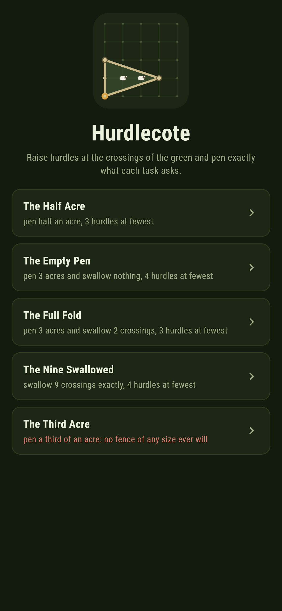
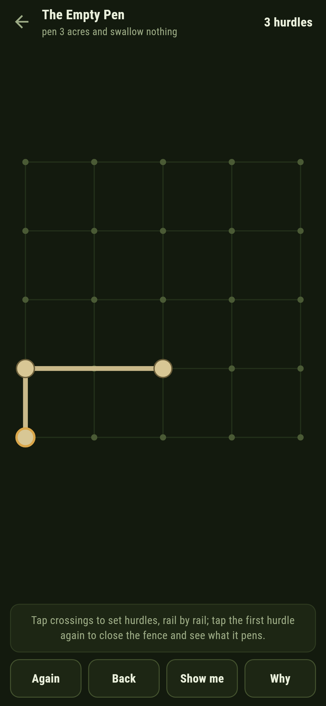
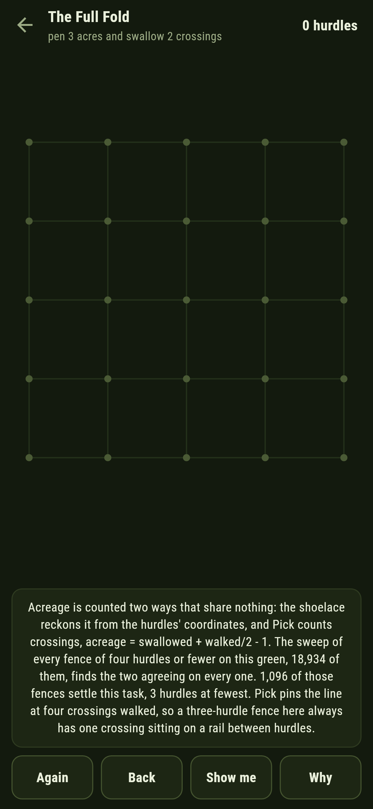
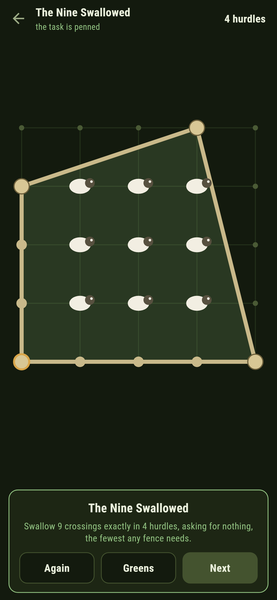
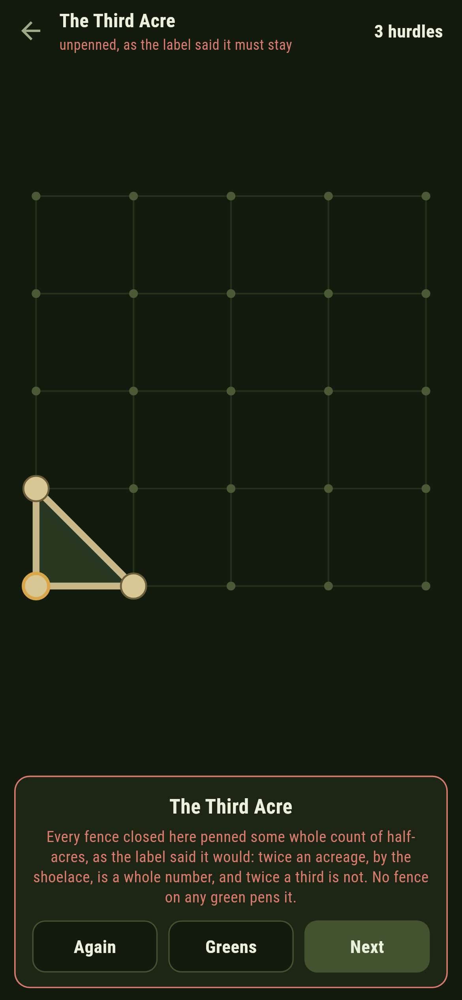
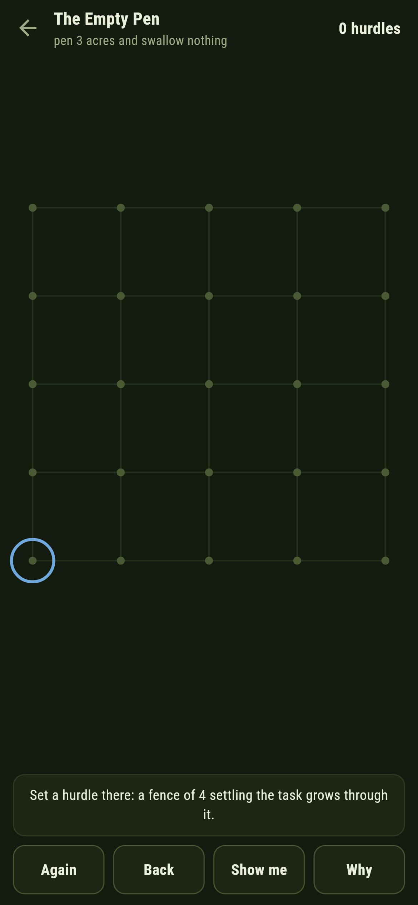

# Hurdlecote

A fencing puzzle for phones, in Flutter, for Android and iOS.

A village green of crossings, hurdles to raise at them, and a task
each time: pen half an acre, pen three acres swallowing nothing,
swallow nine crossings exactly. Tap crossings to stand hurdles rail
by rail, tap the first hurdle again to close the fence, and the pen
fills with sheep at every crossing it swallowed. This is Pick's
theorem worked with a fence: acreage is the swallowed crossings plus
half the walked ones less one, and the shoelace count from the
hurdles' coordinates says the same number by a road that never looks
at a crossing.

| | | | |
|---|---|---|---|
|  |  |  |  |

## Two ways of knowing

The suite knows every fence two ways that share nothing. The
shoelace reckons twice the acreage from hurdle coordinates alone and
never counts a crossing; Pick counts the swallowed and the walked
crossings one by one and never reads a coordinate. On every simple
fence of four hurdles or fewer that the green can hold, the two
agree exactly, and every written count below is the sweep's own. The
sweep itself is held against a second enumeration written separately
in Python: both count 2,148 triangles and 16,786 four-hurdle fences.

```
$ make greens
every simple fence of four hurdles or fewer on the five-by-five green, 18934 of them: what the shoelace reckons from coordinates and what Pick counts from crossings agree on every one, and twice the acreage is always a whole number, from 1 up to 32

 1 The Half Acre      pen half an acre — 320 fences do it, 3 hurdles at fewest
 2 The Empty Pen      pen 3 acres and swallow nothing — 300 fences do it, 4 hurdles at fewest
 3 The Full Fold      pen 3 acres and swallow 2 crossings — 1096 fences do it, 3 hurdles at fewest
 4 The Nine Swallowed swallow 9 crossings exactly — 47 fences do it, 4 hurdles at fewest
 5 The Third Acre     pen a third of an acre — no fence of any size does: twice an acreage is whole, and two thirds is not
```

## The third acre

One task ships labelled hopeless in the house tradition of maps
nobody can win: pen a third of an acre. Twice any fence's acreage,
by the shoelace, is a whole number, and twice a third is not, so no
fence on this green or any other ever pens it; the sweep confirms
from the other side that the green's acreages march in steps of a
half from the bare triangle up to the whole sixteen. The game says
so on the way in, tells every closed fence its true numbers, and
after three misses writes the futility down rather than let anyone
grind at it.



## The fence that knows its numbers

Nothing about the theorem is folklore here. Every closed fence is
told what it pens and what it swallowed, the walked crossings are
marked on its rails, and **Why** counts the fence in front of you
both ways in words. **Show me** points the next hurdle of a fence
the walk of every extension found, then points the close, and a
hurdle that strands the task or lengthens the fence is called out
the moment it stands.



## Building

```
make deps      # fetch packages
make check     # analyze + every test
make greens    # sweep every fence and prove Pick against the shoelace
make shots     # render the screenshots and redraw the icons
make apk       # Android release build
make ios       # iOS release build (unsigned)
```

The logo and every app icon are drawn by the game's own painter in
`test/mark_test.dart`. There is no image in this repository that was not
produced by code in it.

## How it is put together

```
lib/fold/rules.dart      the shoelace, the crossing counts, the
                         simplicity law, the sweep, the growing walk
lib/fold/green.dart      a green: its size and its task
lib/fold/greens.dart     the five greens that ship
lib/fold/play.dart       a fence being raised: hurdles, the close,
                         take-back
lib/ui/                  the painter, the screens, the mark
tool/check_greens.dart   the sweep and the ledger above
```

The tests reckon hand-drawn fences all three ways, refuse the broken
ones, pin the sweep's counts against the separate Python
enumeration, prove Pick against the shoelace on all 18,934 fences,
settle every winnable green in its fewest hurdles by following the
game's own pointer, watch a stranding hurdle get called out, watch
the third acre miss three times and be admitted, and hold the
pictures against the real widget tree. If any of that drifts,
`make check` goes red before anything leaves the machine.
