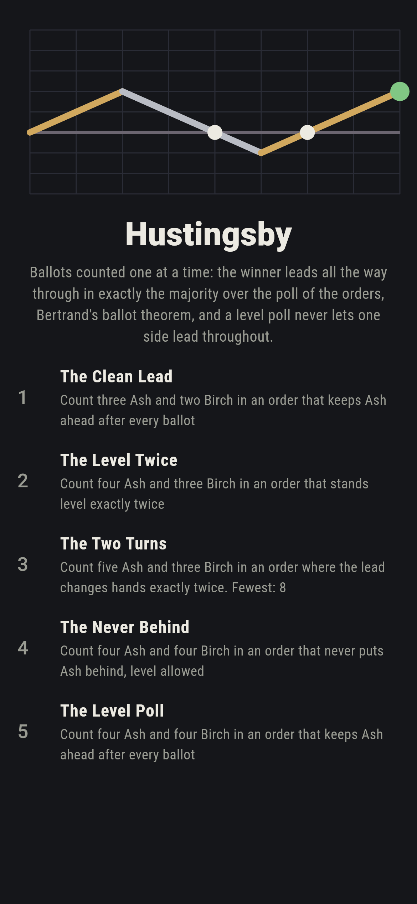
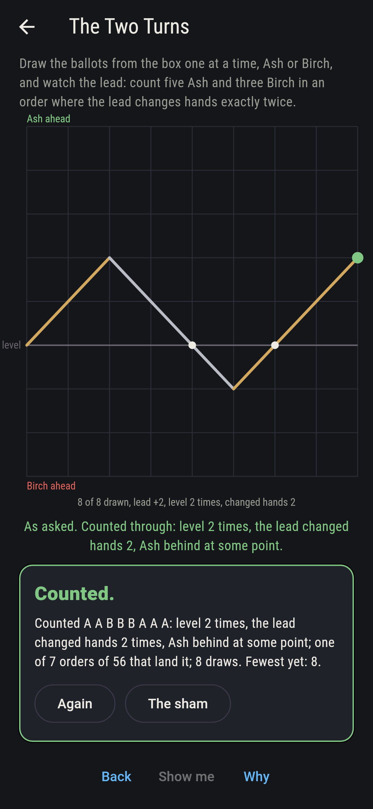
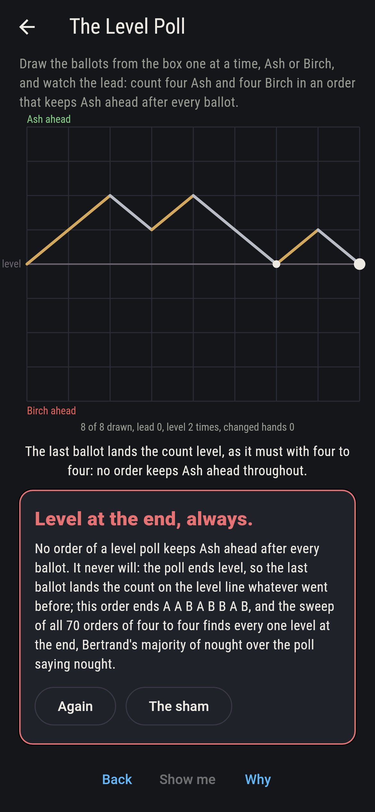
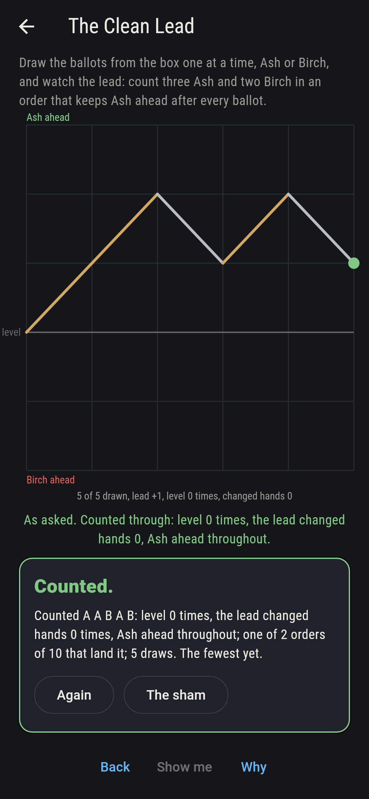
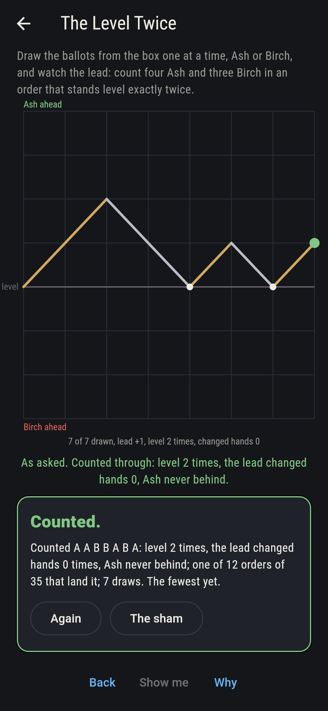
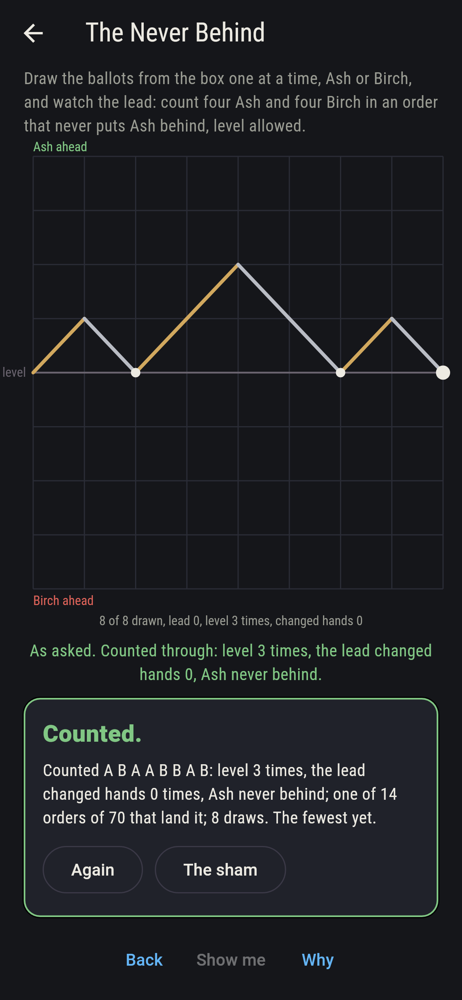
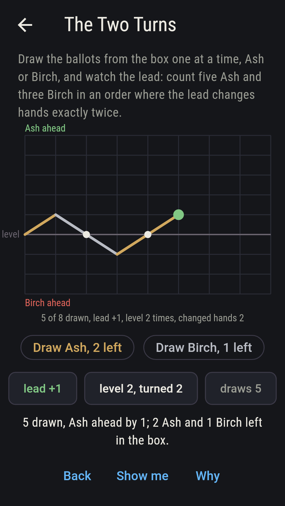
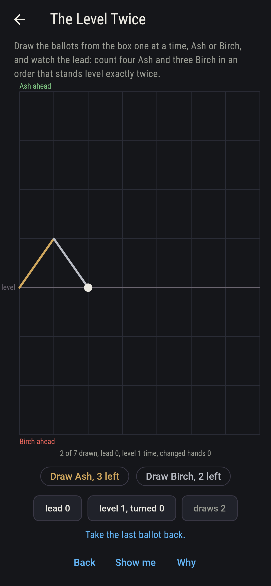
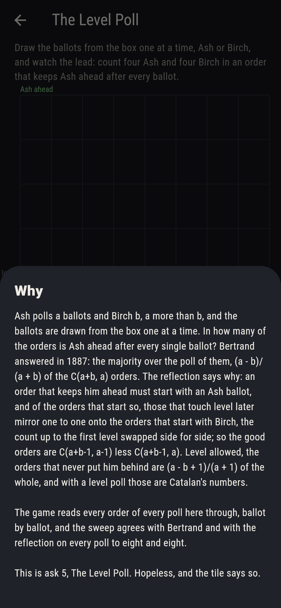

# Hustingsby


Ballots counted one at a time. Ash polls a ballots and Birch b, a
more than b, and the ballots are drawn from the box in some order:
in how many of the orders is Ash ahead after every single ballot?
Bertrand answered in 1887: the majority over the poll of them, (a -
b)/(a + b) of the C(a+b, a) orders. The reflection says why: an
order that keeps him ahead must start with an Ash ballot, and of the
orders that start so, those that touch level later mirror one to one
onto the orders that start with Birch, so the good orders are
C(a+b-1, a-1) less C(a+b-1, a). Level allowed, the orders that never
put him behind are (a - b + 1)/(a + 1) of the whole, Catalan's
numbers when the poll is level. Draw the ballots yourself, Ash or
Birch, and watch the lead; the game reads every order of every poll
to eight and eight through, 48,619 orders, and the sweep agrees with
Bertrand and with the reflection on every one.

## The asks

1. **The Clean Lead** - count three Ash and two Birch in an order that keeps Ash ahead after every ballot
2. **The Level Twice** - count four Ash and three Birch in an order that stands level exactly twice
3. **The Two Turns** - count five Ash and three Birch in an order where the lead changes hands exactly twice
4. **The Never Behind** - count four Ash and four Birch in an order that never puts Ash behind, level allowed
5. **The Level Poll** - count four Ash and four Birch in an order that keeps Ash ahead after every ballot

Three to two keeps Ash ahead in two orders of ten, A A A B B and A A
B A B, one in five, the majority of one over the poll of five; four
to three stands level twice in 12 of 35, once in 10, three times in
8 and never in 5, those five being the orders that keep Ash ahead
throughout; five to three sees the lead change hands exactly twice in
7 of 56, and 14 of the 56 keep Ash ahead throughout, one in four; and
four to four never puts Ash behind in 14 of 70, Catalan's fourteen.
The Level Poll is labeled hopeless on its tile: the poll ends level,
so no order keeps Ash ahead after the last ballot; the sham admits
it the moment the count is through.

## Two voices

The game never asserts what it has not computed, and it computes
everything at least twice:

* **The sweep** reads every order of the poll through, ballot by
  ballot, and marks the lead after each: which orders keep Ash ahead
  throughout, which never put him behind, how often each stands level
  and how often the lead changes hands; every count on the sham is
  the sweep's, on every poll to eight and eight.
* **Bertrand and the reflection** count nothing through: (a - b)/(a +
  b) of C(a+b, a), and C(a+b-1, a-1) less C(a+b-1, a), and the two
  agree with the sweep on every one of the 81 polls, nought on every
  level poll; and (a - b + 1)/(a + 1) of the whole for the orders that
  never put him behind agrees on every poll too, Catalan's numbers
  down the level ones.

`tool/check_counts.dart` runs the lot and refuses the bake on any
disagreement.

## The checker's ledger

What `dart run tool/check_counts.dart` printed for the build this
README shipped with, word for word:

```
every order of every poll to eight Ash and eight Birch read through ballot by ballot, 81 polls and 48,619 orders: the orders that keep Ash ahead after every ballot are the majority over the poll of them all, Bertrand's (a - b)/(a + b) of C(a+b, a), and the reflection's C(a+b-1, a-1) less C(a+b-1, a), on every poll, and nought on every level poll; the orders that never put him behind are (a - b + 1)/(a + 1) of the whole, Catalan's numbers when the poll is level; three to two keeps Ash ahead in 2 orders of 10, A A A B B and A A B A B; four to three stands level twice in 12 of 35; five to three sees the lead change hands exactly twice in 7 of 56; four to four never puts Ash behind in 14 of 70 and never keeps him ahead throughout

 1 The Clean Lead   count three Ash and two Birch in an order that keeps Ash ahead after every ballot: 2 of the 10 orders land it
 2 The Level Twice  count four Ash and three Birch in an order that stands level exactly twice: 12 of the 35 orders land it
 3 The Two Turns    count five Ash and three Birch in an order where the lead changes hands exactly twice: 7 of the 56 orders land it
 4 The Never Behind count four Ash and four Birch in an order that never puts Ash behind, level allowed: 14 of the 70 orders land it
 5 The Level Poll   count four Ash and four Birch in an order that keeps Ash ahead after every ballot: none of the 70, and the level end said so first
```

## Screenshots

| The sham | The two turns | The level poll admitted |
| --- | --- | --- |
|  |  |  |

| The clean lead | The level twice | The never behind | Midway, on the small phone | Show me | The why |
| --- | --- | --- | --- | --- | --- |
|  |  |  |  |  |  |

Screenshots are drawn by `test/showcase_test.dart` at real phone
sizes with the app's own painter, then copied into `docs/` as they
came out; every ballot in them was drawn by a tap, so nothing
pictured is a count the game could not reach. The logo and every
launcher icon come out of `test/mark_test.dart` the same way: the
mark is the count of five to three that turns twice.

## Building

```
flutter test          # 44 tests, the sweep among them
dart run tool/check_counts.dart
flutter build apk     # or: flutter build ios
```
