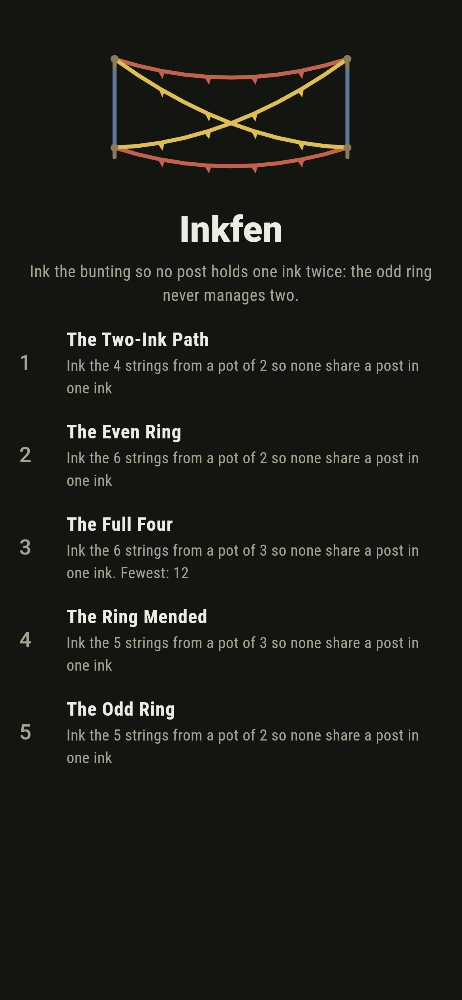
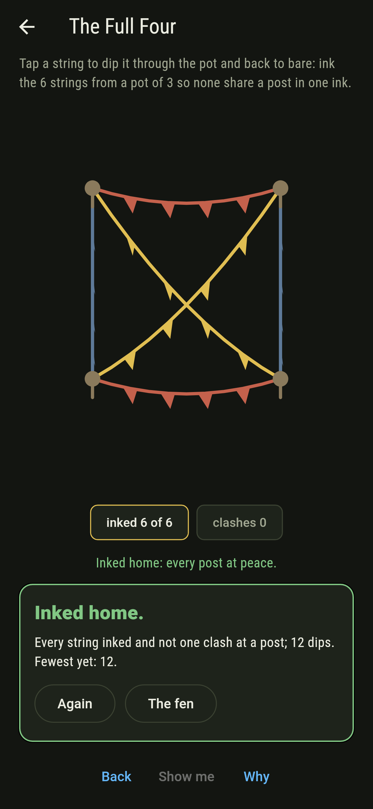
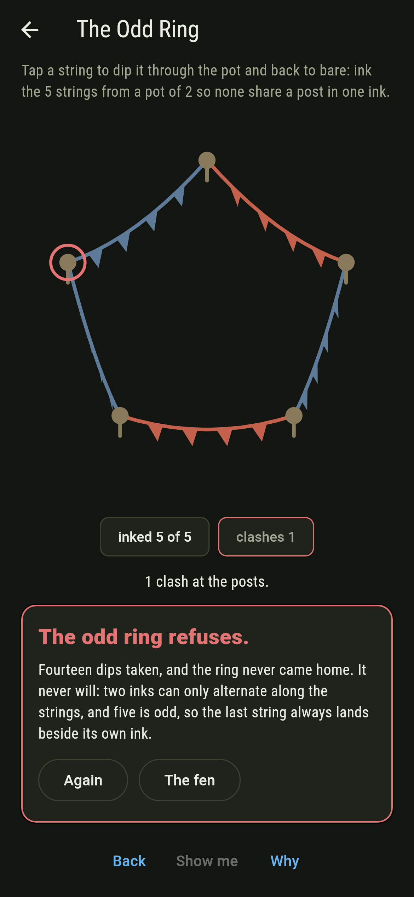
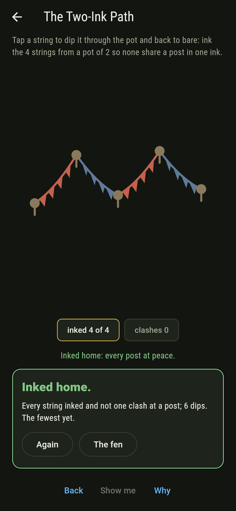
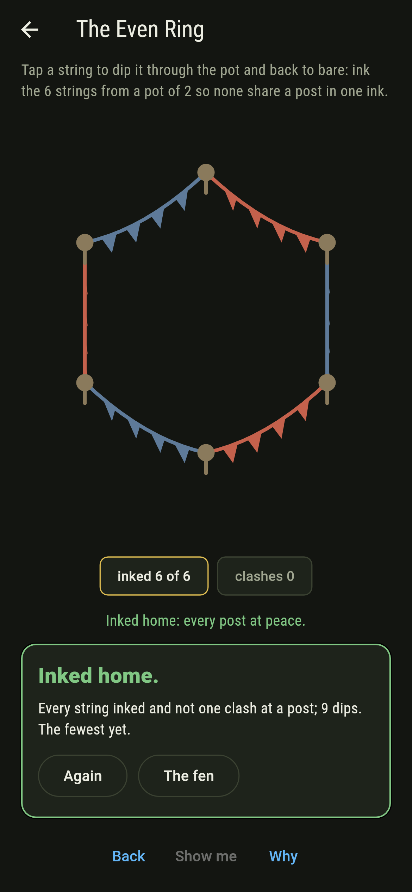
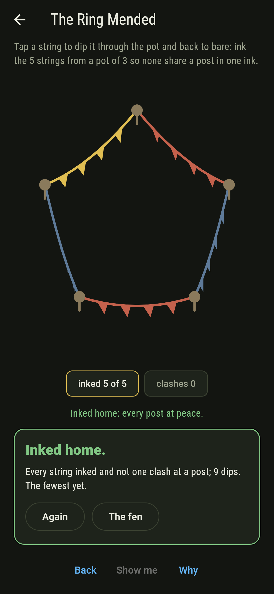
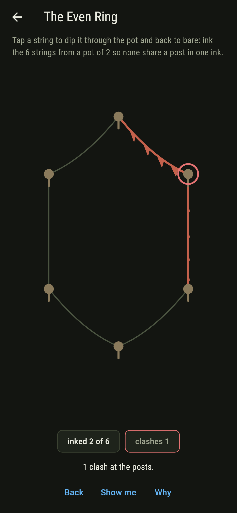
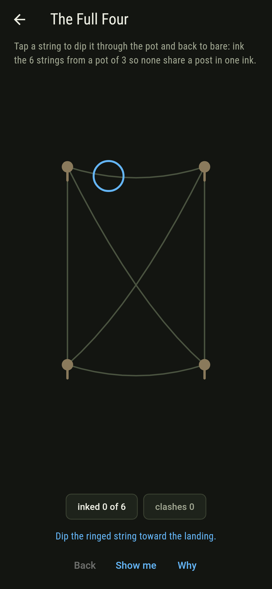
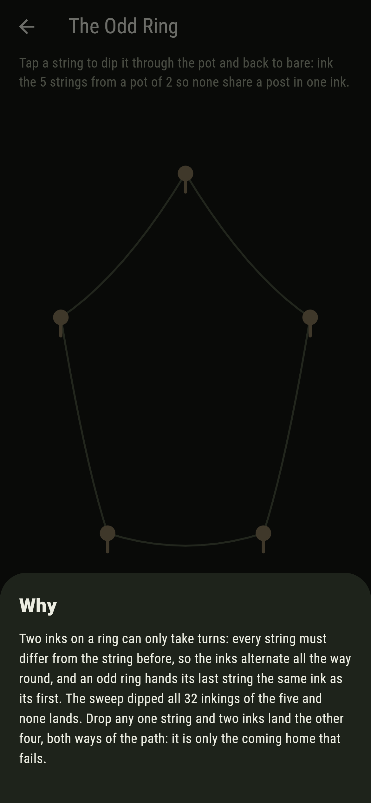

# Inkfen


Posts on a green, bunting strung between them, and a pot of
inks: every string wears one ink, and two strings sharing a
post must never share an ink. Paths and even rings take two
inks; the odd ring refuses them outright, since two inks can
only alternate and an odd ring comes home wrong; and the full
four takes three inks in exactly the six orders of its three
perfect matchings.

## The lines

1. **The Two-Ink Path** - ink the 4 strings from a pot of 2
2. **The Even Ring** - ink the 6 strings from a pot of 2
3. **The Full Four** - ink the 6 strings from a pot of 3
4. **The Ring Mended** - ink the 5 strings from a pot of 3
5. **The Odd Ring** - ink the 5 strings from a pot of 2

The path is forced string by string once the first ink is
picked, two ways. The even ring alternates home, two ways
again. Every landing of The Full Four splits its strings into
the three matchings, one ink each, and every landing of The
Ring Mended wears some ink exactly once. The Odd Ring is
labeled hopeless on its tile: drop any one of its strings and
two inks land the rest, both ways; it is only the coming home
that fails.

## Two voices

The game never asserts what it has not computed, and it computes
everything at least twice:

* **The clash census** walks every post's strings pair by
  pair, rims the sore posts rust, and keeps the tally live as
  the strings are dipped.
* **The sweep** dips every inking of every line, 16 and 32 and
  64 and 243 and 729 of them, counts the landings outright,
  and holds the matching law and the worn-once law on every
  landing besides.

`tool/check_inks.dart` runs the lot, the drop-a-string fact
included, and refuses the bake on any disagreement.

## The checker's ledger

What `dart run tool/check_inks.dart` printed for the build
this README shipped with, word for word:

```
every inking of every line dipped, 16 and 32 and 64 and 243 and 729 of them: the path and the even ring take two inks two ways each, the full four takes three inks in exactly the six orders of its three matchings, the odd ring refuses two inks outright yet lands thirty ways with three, and dropping any one of its strings hands the other four back to two inks

 1 The Two-Ink Path   ink the 4 strings from a pot of 2 so none share a post in one ink: 2 inkings of the sweep land it
 2 The Even Ring      ink the 6 strings from a pot of 2 so none share a post in one ink: 2 inkings of the sweep land it
 3 The Full Four      ink the 6 strings from a pot of 3 so none share a post in one ink: 6 inkings of the sweep land it
 4 The Ring Mended    ink the 5 strings from a pot of 3 so none share a post in one ink: 30 inkings of the sweep land it
 5 The Odd Ring       ink the 5 strings from a pot of 2 so none share a post in one ink: none of the 32, and the alternation said so first
```

## Screenshots

| The fen | The full four | The odd ring admitted |
| --- | --- | --- |
|  |  |  |

| The two-ink path | The even ring | The ring mended | A clash | Show me | The why |
| --- | --- | --- | --- | --- | --- |
|  |  |  |  |  |  |

Screenshots are drawn by `test/showcase_test.dart` at real phone
sizes with the app's own painter, then copied into `docs/` as
they came out; every dip in them was tapped, so nothing
pictured is an inking the game could not reach. The logo and
every launcher icon come out of `test/mark_test.dart` the same
way: the mark is the full four inked home, its matchings in
their three inks.

## Building

```
flutter test          # 43 tests, the sweep among them
dart run tool/check_inks.dart
flutter build apk     # or: flutter build ios
```
