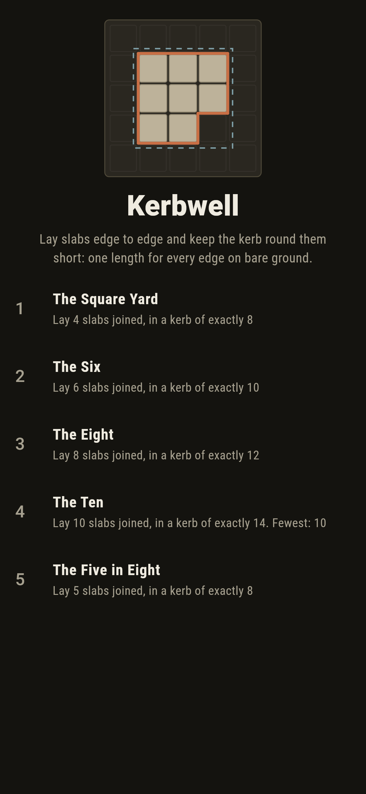
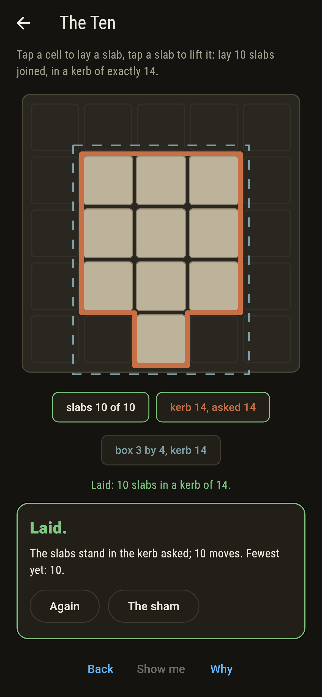
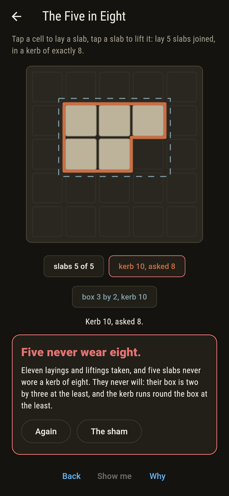
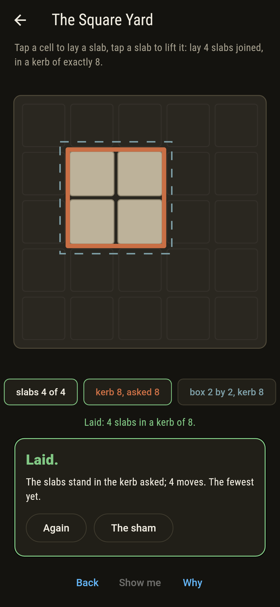
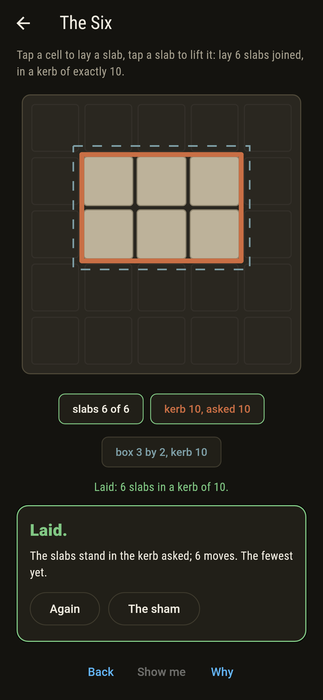
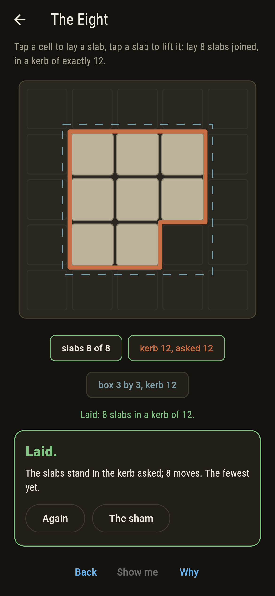
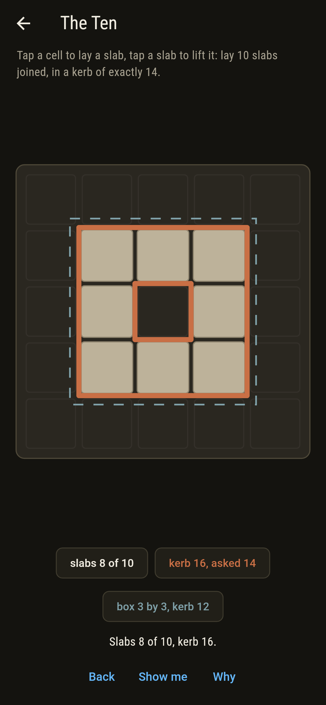
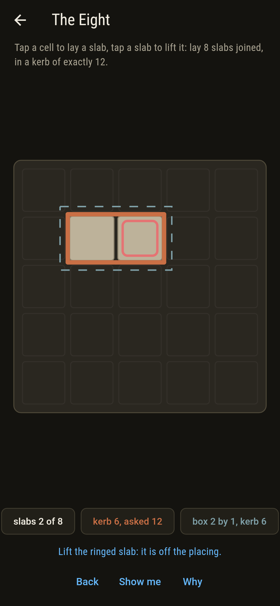
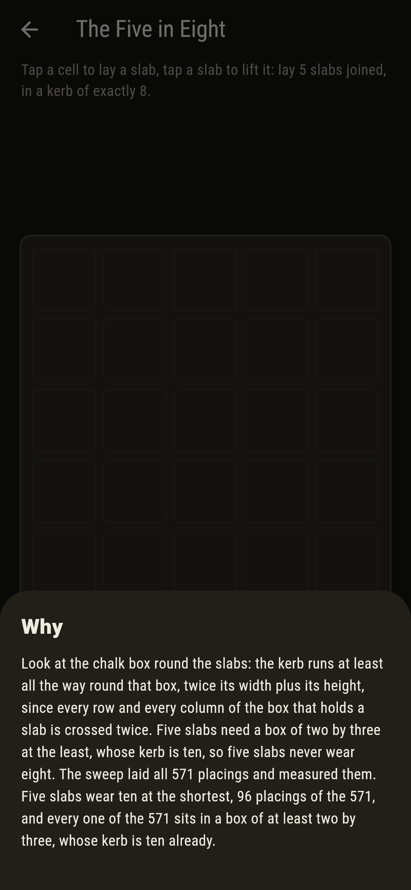

# Kerbwell


Slabs laid in the cells of a five-by-five yard, joined edge to
edge, and a kerb run round the outside of them: one length of kerb
for every slab edge that meets bare ground. How short can the kerb
be for a given count of slabs? Harary and Harborth's answer is
twice the least whole number not below twice the square root of
the count, and the sweep here lays every joined placing of up to
ten slabs and finds exactly that. The proof is a box: the kerb
round a placing is at least the kerb round the smallest box that
holds it, and five slabs need a box of two by three.

## The yards

1. **The Square Yard** - lay 4 slabs joined, in a kerb of exactly 8
2. **The Six** - lay 6 slabs joined, in a kerb of exactly 10
3. **The Eight** - lay 8 slabs joined, in a kerb of exactly 12
4. **The Ten** - lay 10 slabs joined, in a kerb of exactly 14
5. **The Five in Eight** - lay 5 slabs joined, in a kerb of exactly 8

Four slabs wear eight only as the square, six wear ten only as a
two by three, eight wear twelve as a two by four or a three by
three less a corner, and ten wear fourteen in 176 placings, eight
of them the two by five and the rest in a three by four with two
cells bare. The Five in Eight is labeled hopeless on its tile, and
its box is chalked on the yard as you lay.

## Two voices

The game never asserts what it has not computed, and it computes
everything at least twice:

* **The sweep** lays every joined placing of one to ten slabs on
  the yard, 25 through 39,622 of them, by Redelmeier's method so
  each is laid once, and measures every kerb edge by edge.
* **The formula and the box**: the shortest kerb at every count is
  Harary and Harborth's twice the least whole number not below
  twice the square root of the count, and it is also the shortest
  kerb round any box holding that many cells; the kerb round the
  box never exceeds the kerb round the slabs, checked on every
  placing, and every placing of five sits in a box of at least two
  by three.

`tool/check_yards.dart` runs the lot and refuses the bake on any
disagreement.

## The checker's ledger

What `dart run tool/check_yards.dart` printed for the build this
README shipped with, word for word:

```
every joined placing of one to ten slabs laid on the yard, 25 through 39,622 of them, and every kerb measured: the shortest at each count is twice the least whole number not below twice the square root of the count, 4, 6, 8, 8, 10, 10, 12, 12, 12 and 14, the kerb round the box never exceeds the kerb itself, and every placing of five sits in a box of at least two by three, so no kerb of eight ever holds five

 1 The Square Yard    lay 4 slabs joined, in a kerb of exactly 8: 16 placings of the 228 land it
 2 The Six            lay 6 slabs joined, in a kerb of exactly 10: 24 placings of the 1,436 land it
 3 The Eight          lay 8 slabs joined, in a kerb of exactly 12: 52 placings of the 8,409 land it
 4 The Ten            lay 10 slabs joined, in a kerb of exactly 14: 176 placings of the 39,622 land it
 5 The Five in Eight  lay 5 slabs joined, in a kerb of exactly 8: none of the 571, and the box said so first
```

## Screenshots

| The sham | The ten laid | The five in eight admitted |
| --- | --- | --- |
|  |  |  |

| The square yard | The six | The eight | Mid-laying | Show me | The why |
| --- | --- | --- | --- | --- | --- |
|  |  |  |  |  |  |

Screenshots are drawn by `test/showcase_test.dart` at real phone
sizes with the app's own painter, then copied into `docs/` as they
came out; every slab in them was laid by a tap, so nothing pictured
is a yard the game could not reach. The logo and every launcher
icon come out of `test/mark_test.dart` the same way: the mark is
eight slabs in a kerb of twelve, the three by three less a corner.

## Building

```
flutter test          # 47 tests, the sweep among them
dart run tool/check_yards.dart
flutter build apk     # or: flutter build ios
```
