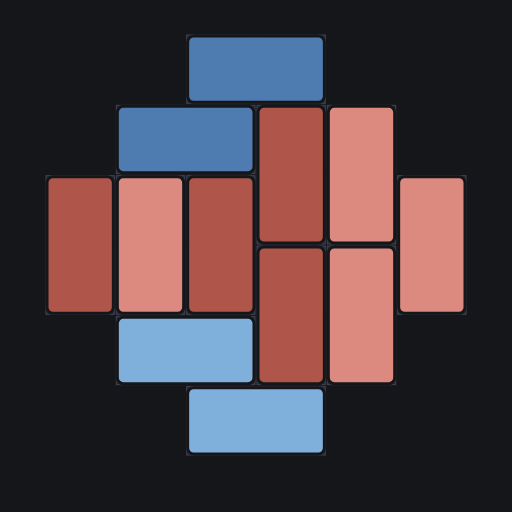
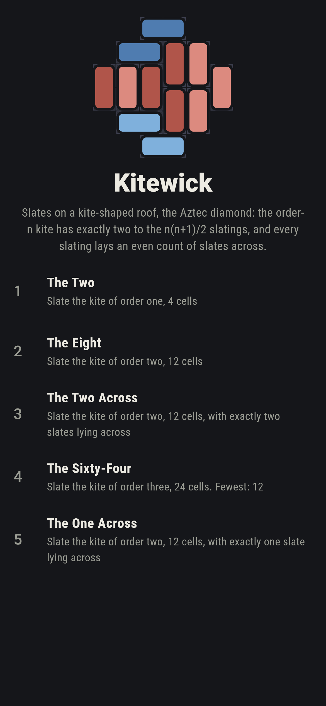
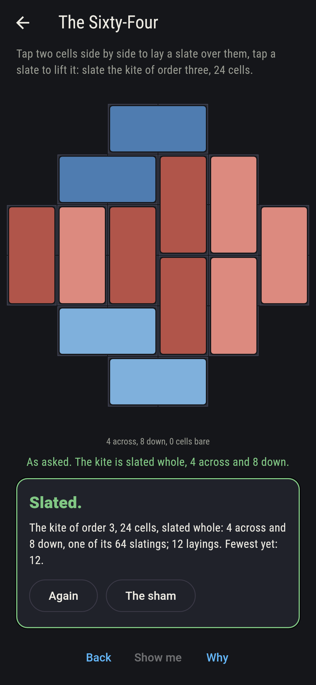
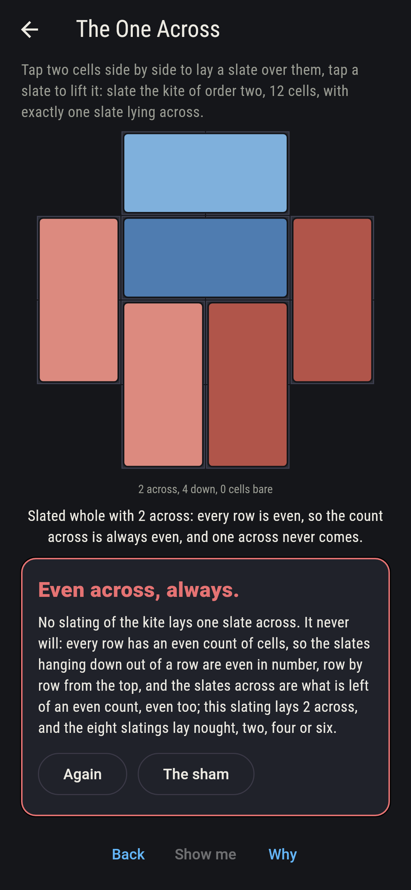
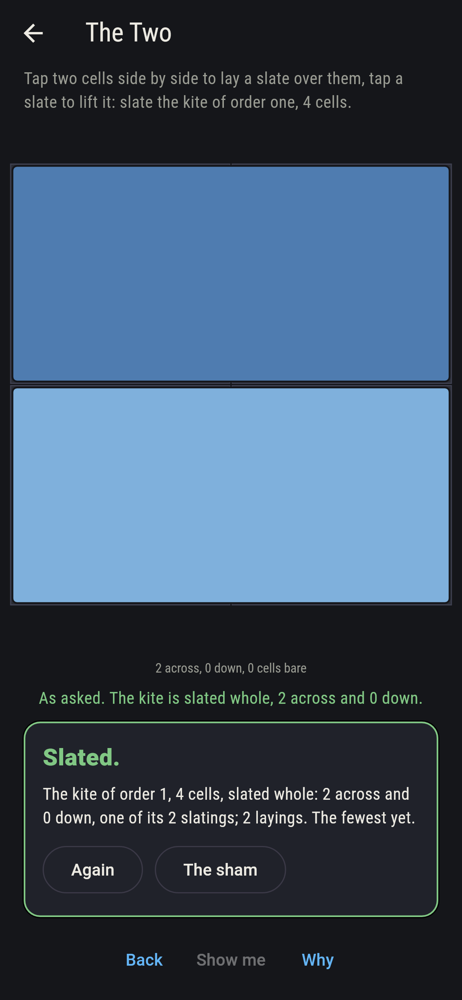
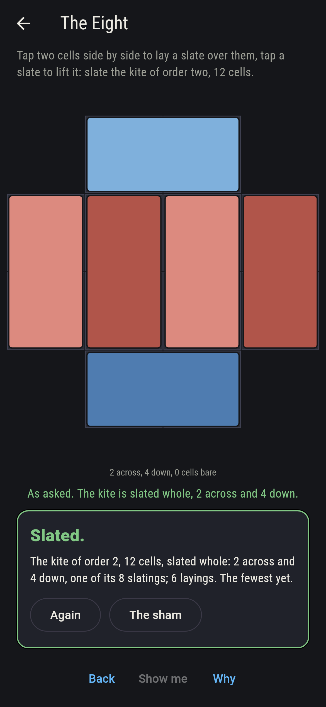
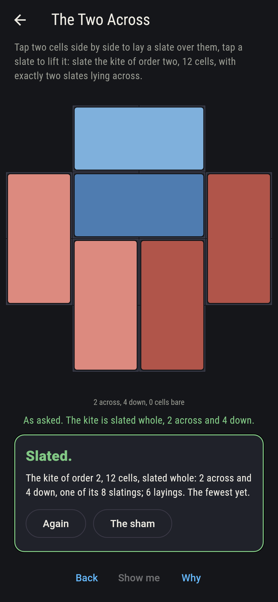
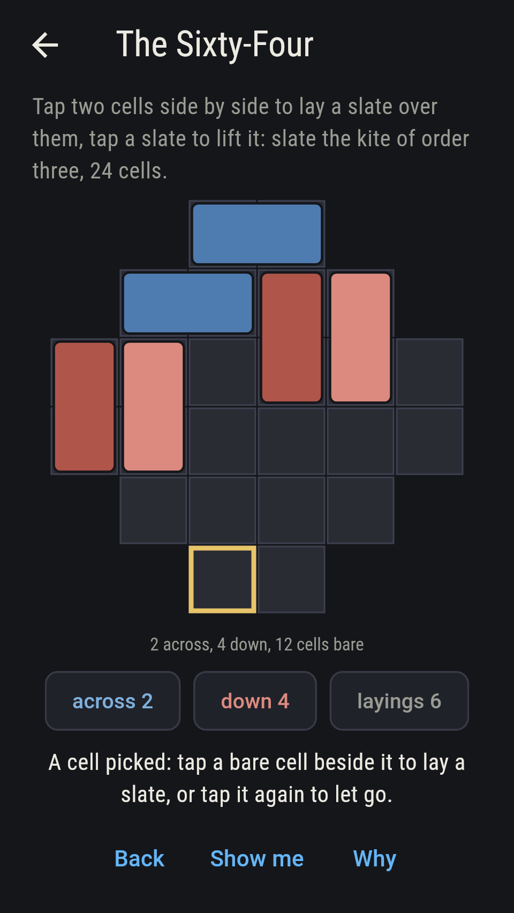
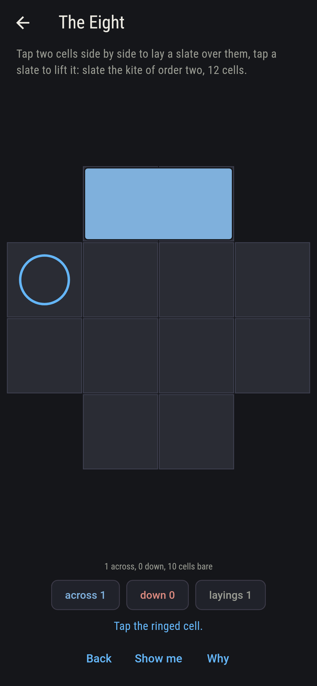
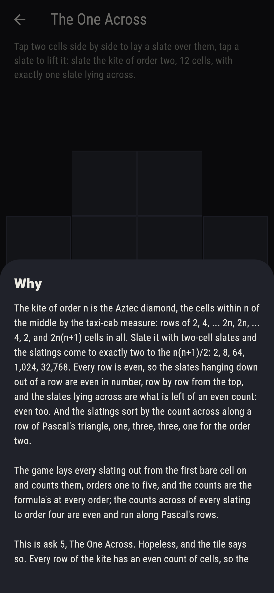

# Kitewick



Slates on a kite-shaped roof. The kite of order n is the Aztec
diamond, the cells within n of the middle by the taxi-cab measure:
rows of 2, 4, ... 2n, 2n, ... 4, 2, and 2n(n+1) cells in all. Tap two
cells side by side to lay a two-cell slate over them, tap a slate to
lift it, and slate the kite whole. The slatings come to exactly two
to the n(n+1)/2: 2, 8, 64, 1,024, 32,768, every one of them laid out
from the first bare cell on and counted. Every row is even, so the
slates hanging down out of a row are even in number, row by row from
the top, and the slates lying across are what is left of an even
count, even too; and the slatings sort by that count along a row of
Pascal's triangle, one, three, three, one for the order two.

## The asks

1. **The Two** - slate the kite of order one, 4 cells
2. **The Eight** - slate the kite of order two, 12 cells
3. **The Two Across** - slate the kite of order two, 12 cells, with exactly two slates lying across
4. **The Sixty-Four** - slate the kite of order three, 24 cells
5. **The One Across** - slate the kite of order two, 12 cells, with exactly one slate lying across

The square of four cells slates two ways; the kite of twelve eight
ways, laying nought, two, four or six slates across, one, three,
three and one of them; the kite of twenty-four sixty-four ways, its
counts across running 1, 6, 15, 20, 15, 6, 1 over nought to twelve;
and the order after has 1,024 slatings along Pascal's row of ten,
and the one after that 32,768. The One Across is labeled hopeless on
its tile: every row is even, so the count across is always even; the
sham admits it the moment the kite is slated whole, whatever the
count.

## Two voices

The game never asserts what it has not computed, and it computes
everything at least twice:

* **The sweep** lays every slating out, the first bare cell mated
  rightward or downward and nothing else, orders one to five, and
  counts them; every count on the sham is the sweep's, every slating
  is checked to cover the kite exactly, and the counts across of
  every slating to order four are read off and tallied.
* **The formula** counts nothing: two to the n(n+1)/2, and it agrees
  with the sweep at every order; every row of every kite to order
  five is even; and the tallies of slates across are Pascal's rows,
  the binomial coefficients of n(n+1)/2, at every order to four,
  which the sweep checks number by number.

`tool/check_kites.dart` runs the lot and refuses the bake on any
disagreement.

## The checker's ledger

What `dart run tool/check_kites.dart` printed for the build this
README shipped with, word for word:

```
every slating of the kite laid out from the first bare cell on, orders one to five, 4, 12, 24, 40 and 60 cells: 2, 8, 64, 1,024 and 32,768 slatings, two to the n(n+1)/2 at every order; every row of every kite has an even count of cells; every slating to order four lays an even count of slates across, and the slatings sort by that count along a row of Pascal's triangle, 1 and 1 for the order one, 1, 3, 3, 1 for the order two, 1, 6, 15, 20, 15, 6, 1 for the order three and 1, 10, 45, 120, 210, 252, 210, 120, 45, 10, 1 for the order four; so the order two lays two across 3 ways of 8 and one across never

 1 The Two         slate the kite of order one, 4 cells: 2 of the 2 slatings land it
 2 The Eight       slate the kite of order two, 12 cells: 8 of the 8 slatings land it
 3 The Two Across  slate the kite of order two, 12 cells, with exactly two slates lying across: 3 of the 8 slatings land it
 4 The Sixty-Four  slate the kite of order three, 24 cells: 64 of the 64 slatings land it
 5 The One Across  slate the kite of order two, 12 cells, with exactly one slate lying across: none of the 8, and the even rows said so first
```

## Screenshots

| The sham | The sixty-four | The one across admitted |
| --- | --- | --- |
|  |  |  |

| The two | The eight | The two across | Midway, on the small phone | Show me | The why |
| --- | --- | --- | --- | --- | --- |
|  |  |  |  |  |  |

Screenshots are drawn by `test/showcase_test.dart` at real phone
sizes with the app's own painter, then copied into `docs/` as they
came out; every slate in them was laid by taps, so nothing pictured
is a slating the game could not reach. The logo and every launcher
icon come out of `test/mark_test.dart` the same way: the mark is the
kite of order three, slated.

## Building

```
flutter test          # 46 tests, the sweep among them
dart run tool/check_kites.dart
flutter build apk     # or: flutter build ios
```
