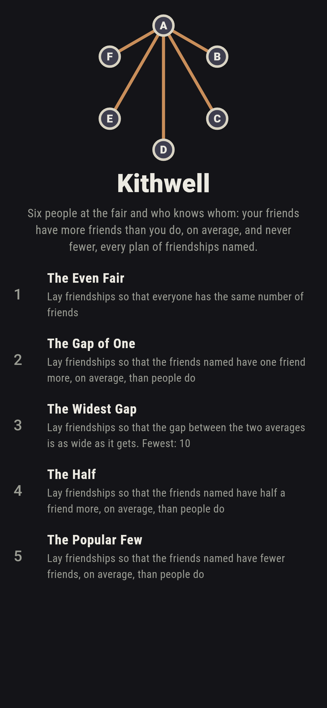
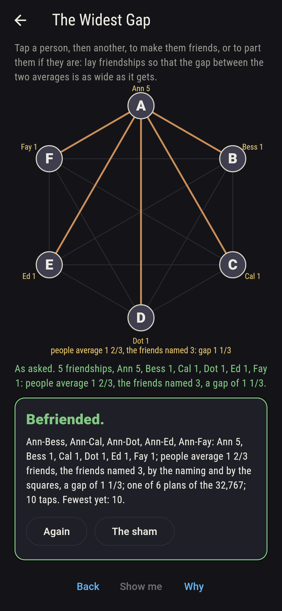
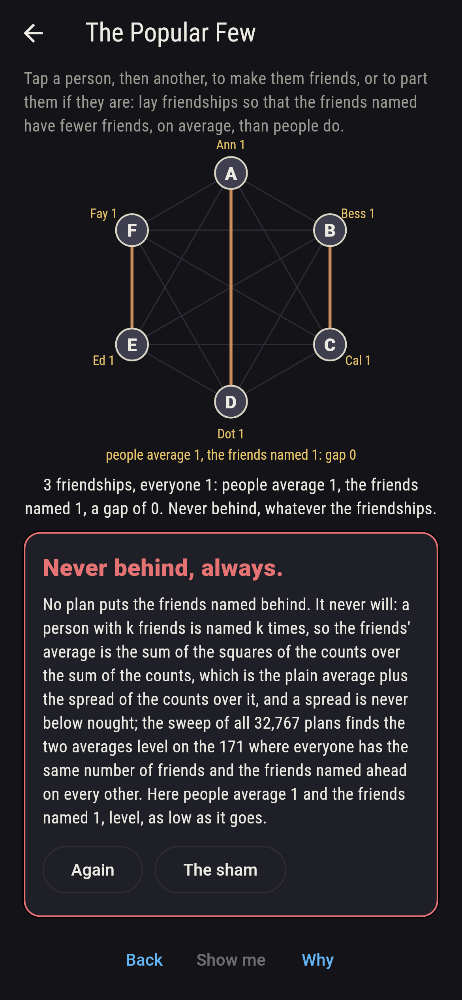
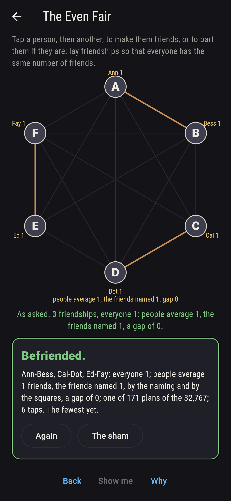
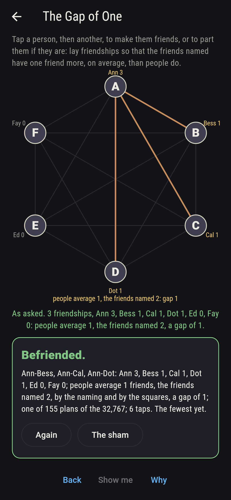
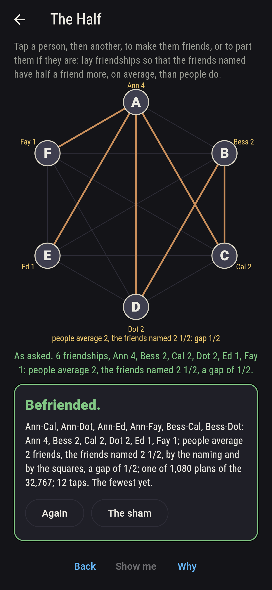
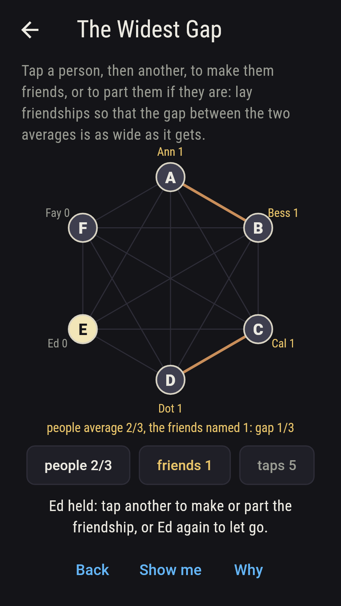
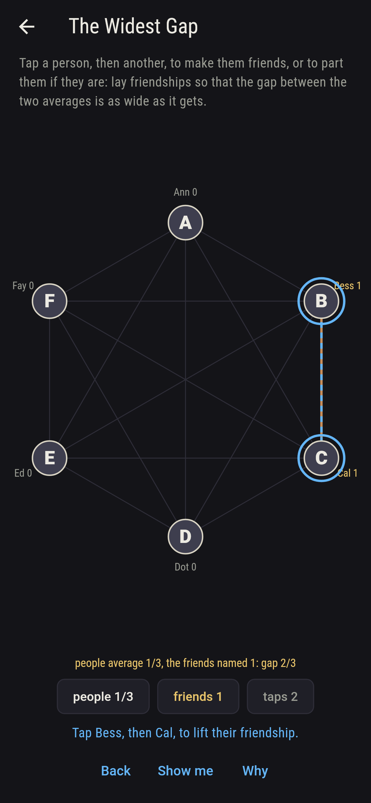
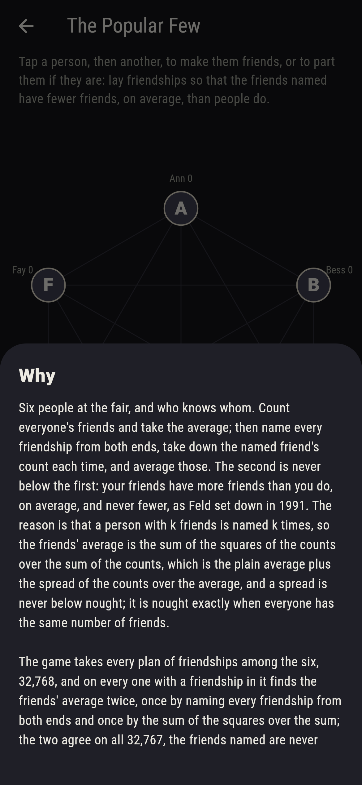

# Kithwell


Six people at the fair, and who knows whom. Count everyone's friends
and take the average; then name every friendship from both ends,
take down the named friend's count each time, and average those.
The second is never below the first: your friends have more friends
than you do, on average, and never fewer, as Feld set down in 1991.
The reason is that a person with k friends is named k times, so the
friends' average is the sum of the squares of the counts over the
sum of the counts, which is the plain average plus the spread of the
counts over the average, and a spread is never below nought; it is
nought exactly when everyone has the same number of friends. Tap a
person, then another, to make them friends, or to part them if they
are. The game takes every plan of friendships among the six, 32,768,
and on every one with a friendship in it finds the friends' average
twice, once by naming every friendship from both ends and once by
the sum of the squares over the sum; the two agree on all 32,767,
the friends named are never behind, level on the 171 plans where
everyone has the same number of friends and ahead on the rest, and
it finds the same person by person as well.

## The asks

1. **The Even Fair** - lay friendships so that everyone has the same number of friends
2. **The Gap of One** - lay friendships so that the friends named have one friend more, on average, than people do
3. **The Widest Gap** - lay friendships so that the gap between the two averages is as wide as it gets
4. **The Half** - lay friendships so that the friends named have half a friend more, on average, than people do
5. **The Popular Few** - lay friendships so that the friends named have fewer friends, on average, than people do

The two averages agree exactly when everyone has the same number of
friends: 171 plans do it, fifteen of three pairs, seventy rings and
pairs of trios, seventy of three friends each, fifteen of four and
the one of five. The friends named have one friend more on 155
plans; the gap is the spread of the counts over their average, and
the commonest gap of all, on 5,742 plans, is a third. The gap is
widest, 1 1/3, on the six stars, one person friends with all five
and the five with nobody else: people average 1 2/3 friends, but the
friends named, the star five times over and each of the others once,
average 3. A gap of a half comes on 1,080 plans and of a quarter on
only 80, and 41 different gaps come in all, from nought to 1 1/3.
The Popular Few is labeled hopeless on its tile: the spread said so
first, and the sweep finds the friends named behind on no plan; the
sham admits it after three even plans have shown the gap at nought,
as low as it goes, or after forty taps.

## Two voices

The game never asserts what it has not computed, and it computes
everything at least twice:

* **The naming** takes every friendship from both ends, takes down
  the named friend's count of friends each time, and averages the
  lot; every friends' average on the sham is that naming's, and it
  finds the gap over the plain average nought on 171 plans and above
  it on every other, and finds the same person by person, each
  person's own friends averaged and those averages averaged.
* **The squares** name nobody: the sum of the squares of everyone's
  count over the sum of the counts is the friends' average, and it
  agrees with the naming on all 32,767 plans with a friendship; and
  the gap is the spread of the counts, the average of their squares
  less the square of their average, over the average, on every one,
  which is why it is never below nought.

`tool/check_fairs.dart` runs the lot and refuses the bake on any
disagreement.

## The checker's ledger

What `dart run tool/check_fairs.dart` printed for the build this
README shipped with, word for word:

```
every plan of friendships among the six taken, 32,768, and on every one with a friendship in it, 32,767, the friends' average found two ways, by naming every friendship from both ends and taking down the named friend's count, and by the sum of the squares of the counts over the sum of the counts, the two agreeing on all: the friends named are never behind, level on the 171 plans where everyone has the same number of friends and ahead on the rest, the gap being the spread of the counts over their average; person by person too, each one's own friends averaged and those averaged, they are never behind, on all 32,767; the gap is widest, 1 1/3, on the six stars, where people average 1 2/3 friends and the friends named 3, and 41 different gaps come in all, a third the commonest on 5,742 plans, one on 155, a half on 1,080 and a quarter on 80; one friendship alone gives an average of a third and a friends' average of one

 1 The Even Fair   lay friendships so that everyone has the same number of friends: 171 of the 32,767 plans land it
 2 The Gap of One  lay friendships so that the friends named have one friend more, on average, than people do: 155 of the 32,767 plans land it
 3 The Widest Gap  lay friendships so that the gap between the two averages is as wide as it gets: 6 of the 32,767 plans land it
 4 The Half        lay friendships so that the friends named have half a friend more, on average, than people do: 1,080 of the 32,767 plans land it
 5 The Popular Few lay friendships so that the friends named have fewer friends, on average, than people do: none of the 32,767, and the spread said so first
```

## Screenshots

| The sham | The widest gap | The popular few admitted |
| --- | --- | --- |
|  |  |  |

| The even fair | The gap of one | The half | Midway, on the small phone | Show me | The why |
| --- | --- | --- | --- | --- | --- |
|  |  |  |  |  |  |

Screenshots are drawn by `test/showcase_test.dart` at real phone
sizes with the app's own painter, then copied into `docs/` as they
came out; every friendship in them was made by two taps on the
people, so nothing pictured is a plan the game could not reach. The
logo and every launcher icon come out of `test/mark_test.dart` the
same way: the mark is the star, Ann friends with all five, the widest
gap there is.

## Building

```
flutter test          # 44 tests, the sweep among them
dart run tool/check_fairs.dart
flutter build apk     # or: flutter build ios
```
