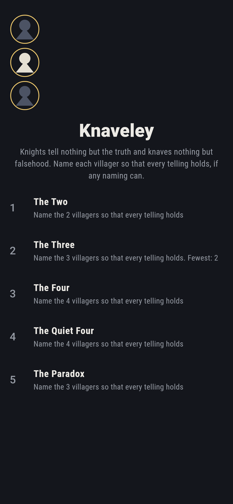
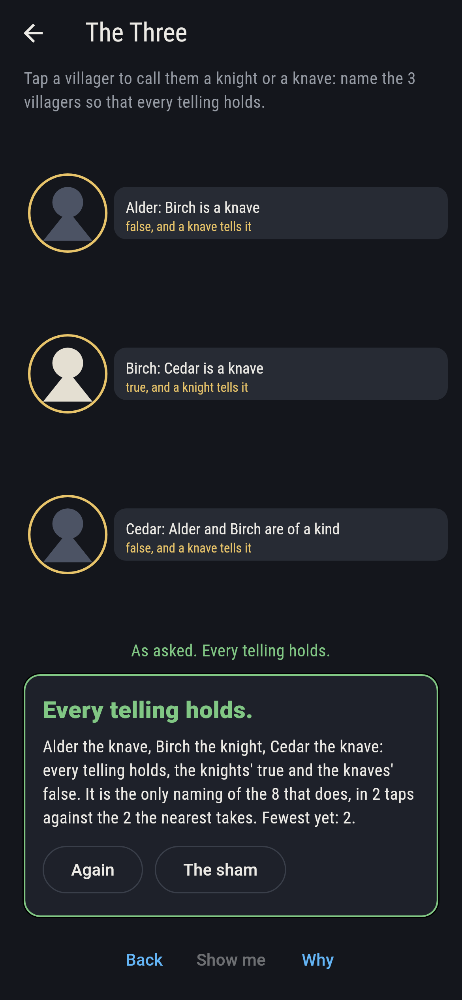
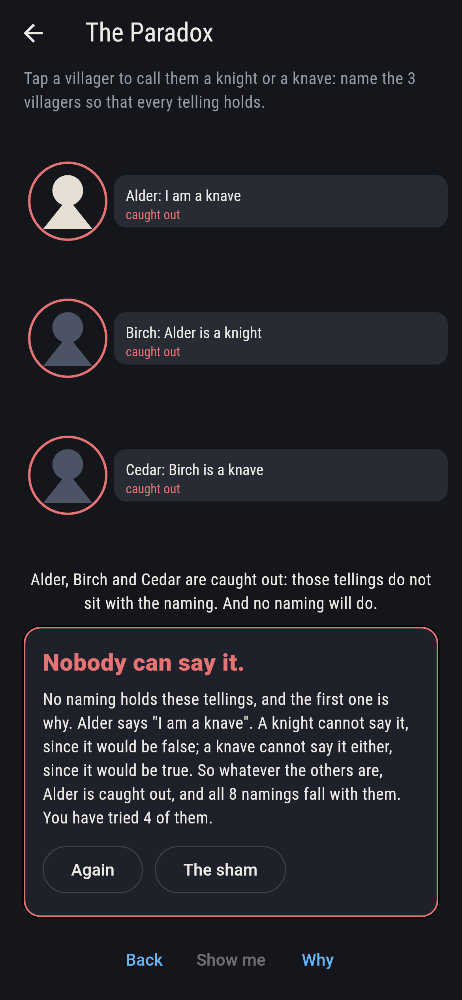
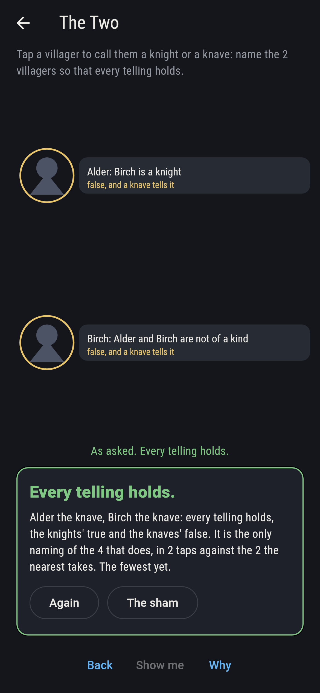
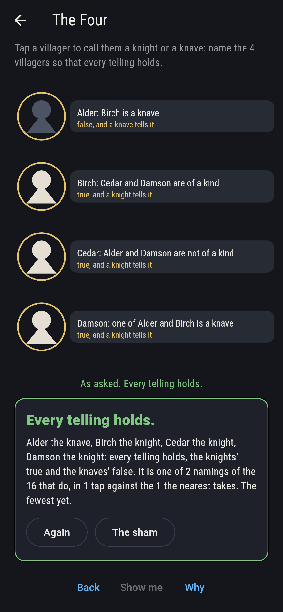
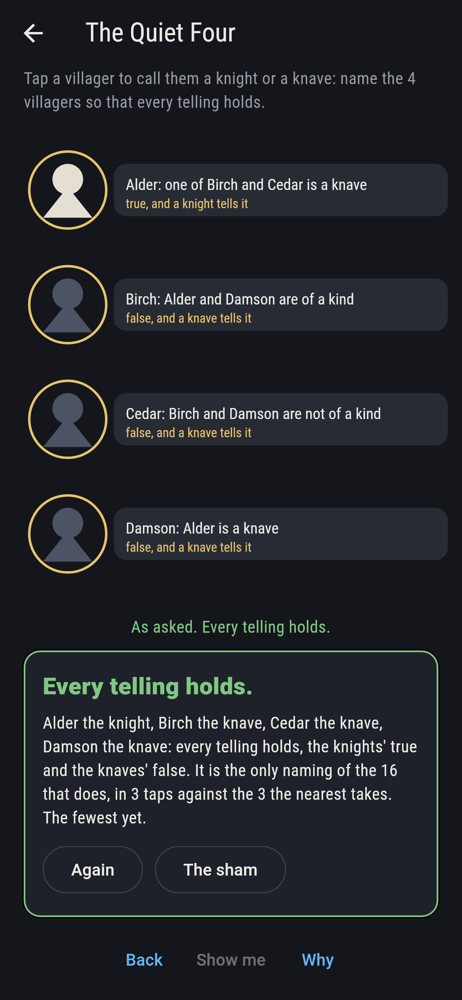
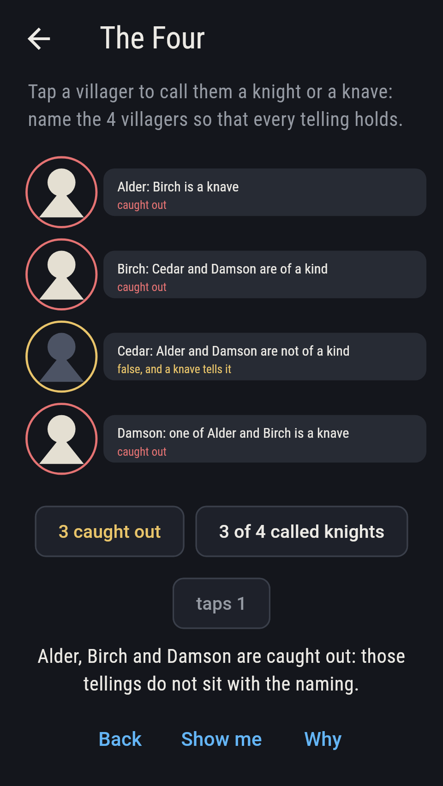
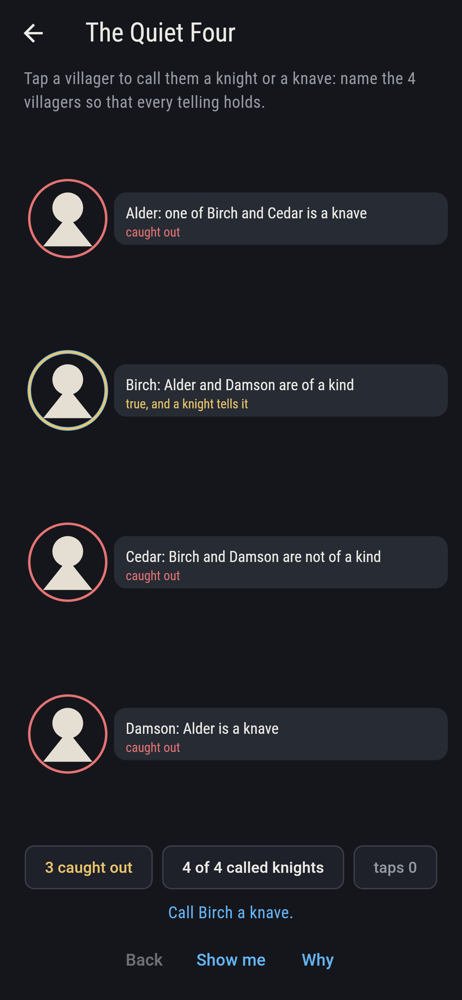
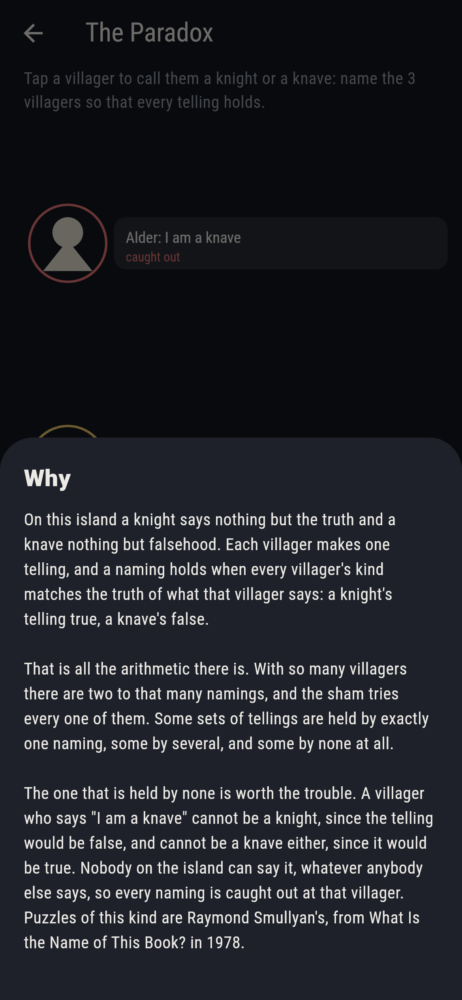

# Knaveley


An island where every villager is a knight, who says nothing but the
truth, or a knave, who says nothing but falsehood. Each one makes a
telling about the others, and the game is naming who is which so that
every telling holds: a knight's true, a knave's false. A naming is a
row of knights and knaves, and with so many villagers there are two to
that many namings to try. Some sets of tellings are held by exactly
one naming, some by several, and some by none at all. The last is
worth the trouble. A villager who says "I am a knave" cannot be a
knight, since the telling would be false, and cannot be a knave
either, since it would be true, so every naming is caught out at that
villager whatever anybody else says. Puzzles of this kind are Raymond
Smullyan's, from What Is the Name of This Book? in 1978.

## The asks

1. **The Two** - name the 2 villagers so that every telling holds
2. **The Three** - name the 3 villagers so that every telling holds
3. **The Four** - name the 4 villagers so that every telling holds
4. **The Quiet Four** - name the 4 villagers so that every telling holds
5. **The Paradox** - name the 3 villagers so that every telling holds

The two are held by one naming of the four: both are knaves. The three
are held by one of the eight, with Birch alone a knight. The four are
held by two of the sixteen, which disagree about three villagers out
of four, so a set of tellings need not settle who is who. The quiet
four are held by one of the sixteen, with Alder a knight and the rest
knaves. The Paradox is held by none of its eight, and the first
telling is the reason: Alder says "I am a knave", which nobody on the
island can say. The sham admits it once four namings have been tried,
or after fourteen taps.

## Two voices

Every number the game says out loud was worked out here rather than
guessed, and every naming is read two ways:

* **The whole naming.** Each villager's kind is set against the truth
  of that villager's telling, and the naming holds when they all
  agree.
* **The villagers caught out.** The same reading kept as a list of who
  is caught, which the board shows in red as you name them, and the
  naming holds exactly when the list is empty.

The two agree on every naming of every ask. Beyond the asks the
checker takes every set of tellings three villagers could make from
the fourteen this island allows each of them, 2,744 sets, and counts
how many namings hold each: 1,361 sets are held by none, 1,048 by
exactly one, 323 by two, 10 by three and 2 by four. Every one of the
547 sets in which somebody says "I am a knave" is held by none.

`tool/check_tellings.dart` runs the lot and refuses the bake on any
disagreement.

## The checker's ledger

What `dart run tool/check_tellings.dart` printed for the build this
README shipped with, word for word:

```
every naming of every ask tried against every telling, 52 namings in all, and each read twice, once by asking whether the whole naming holds and once by counting the villagers caught out by it: the two agree on every naming, and a naming holds exactly when nobody is caught; the asks come out at 1 of 4 for The Two, 1 of 8 for The Three, 2 of 16 for The Four, 1 of 16 for The Quiet Four, 0 of 8 for The Paradox; the telling "I am a knave" catches out every naming there is, on an island of one villager or five, since a knight saying it would speak falsely and a knave saying it would speak true; and taking every set of tellings three villagers could make from the fourteen this island allows each of them, 2,744 sets in all: 1,361 sets are held by 0 namings, 1,048 sets are held by 1 naming, 323 sets are held by 2 namings, 10 sets are held by 3 namings, 2 sets are held by 4 namings, and every one of the 547 sets in which somebody says "I am a knave" is held by none

 1 The Two        name the 2 villagers so that every telling holds: 1 of the 4 namings holds it, the nearest 2 taps from calling everybody a knight
 2 The Three      name the 3 villagers so that every telling holds: 1 of the 8 namings holds it, the nearest 2 taps from calling everybody a knight
 3 The Four       name the 4 villagers so that every telling holds: 2 of the 16 namings hold it, the nearest 1 tap from calling everybody a knight
 4 The Quiet Four name the 4 villagers so that every telling holds: 1 of the 16 namings holds it, the nearest 3 taps from calling everybody a knight
 5 The Paradox    name the 3 villagers so that every telling holds: none of the 8, and the first telling says why
```

## Screenshots

| The sham | The three | The paradox |
| --- | --- | --- |
|  |  |  |

| The two | The four | The quiet four | A villager caught out, on the small phone | Show me | The why |
| --- | --- | --- | --- | --- | --- |
|  |  |  |  |  |  |

Screenshots are drawn by `test/showcase_test.dart` at real phone sizes
with the app's own painter, then copied into `docs/` as they came out.
On the board shots every villager was named by a tap on that villager,
so no naming pictured is one the game could not reach. The logo and
every launcher icon come out of `test/mark_test.dart`, drawn by the
same painter: the mark is the second ask named the one way that holds,
and it stands there with no taps behind it.

## Building

```
flutter test          # 40 tests, the sweep among them
dart run tool/check_tellings.dart
flutter build apk     # or: flutter build ios
```
