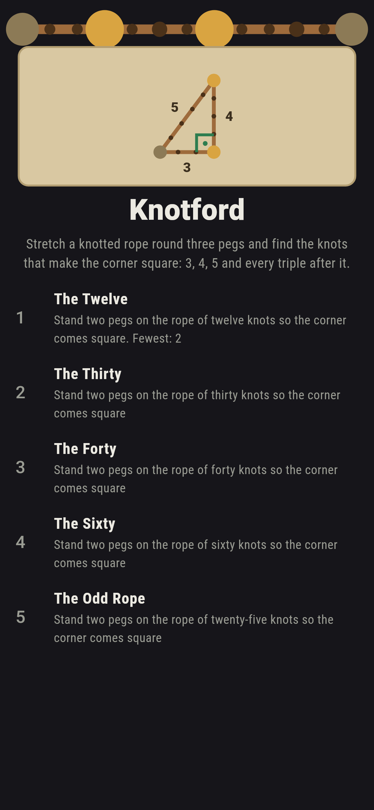
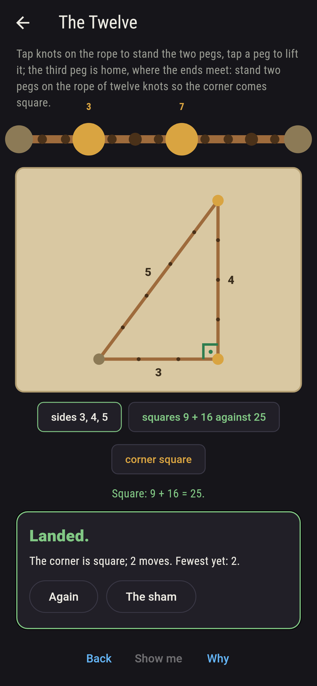
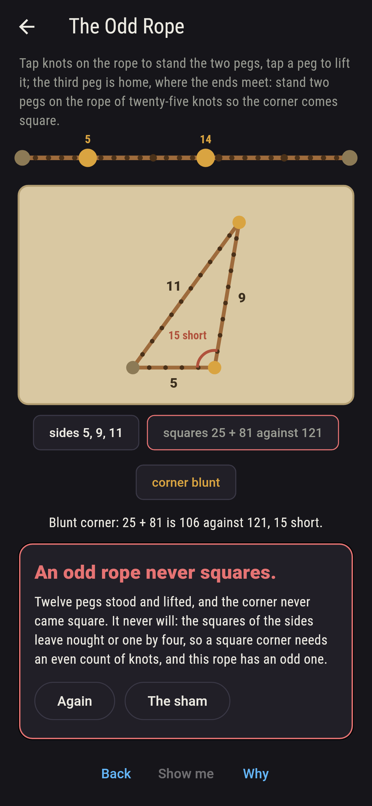
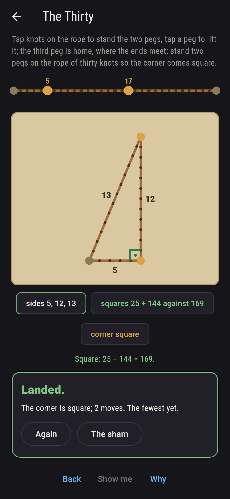
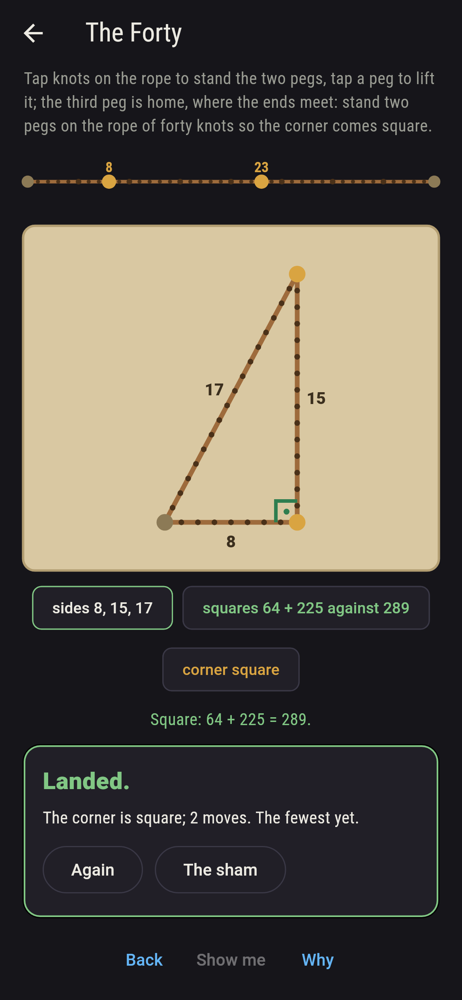
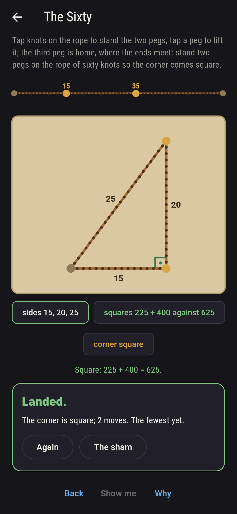
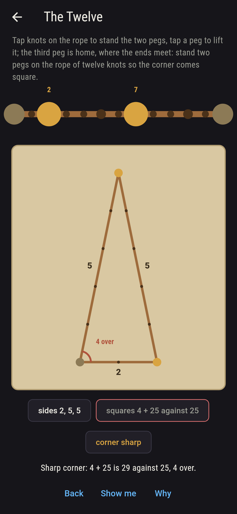
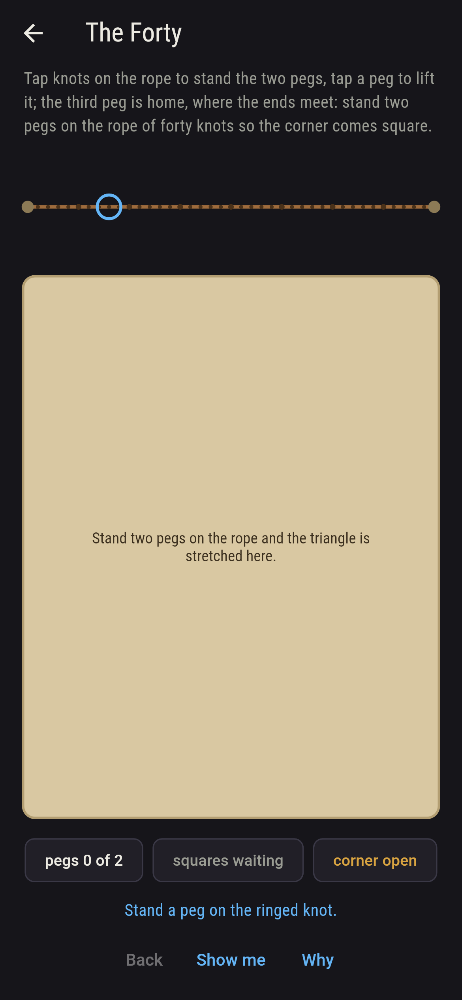
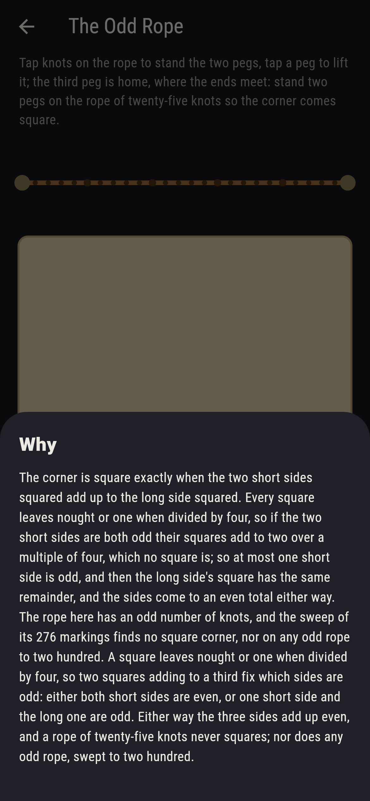

# Knotford


A rope tied in a loop with knots at even gaps, and three pegs to
stretch it round. One peg is home, where the ends meet; you stand
the other two on knots, and the rope makes a triangle whose sides
are counted in gaps. The corner across from the longest side is
square exactly when the two shorter sides squared add up to the
longest squared, which is the old rope-stretchers' rope of twelve
knots, 3 and 4 and 5. Every marking of every rope to two hundred
knots is swept, and the right triangles it finds are exactly the
ones Euclid's formula writes down from two numbers, k times
m squared less n squared, twice mn and m squared plus n squared.
An odd rope never squares, and the why says why in remainders.

## The ropes

1. **The Twelve** - stand two pegs on the rope of twelve knots so the corner comes square
2. **The Thirty** - stand two pegs on the rope of thirty knots so the corner comes square
3. **The Forty** - stand two pegs on the rope of forty knots so the corner comes square
4. **The Sixty** - stand two pegs on the rope of sixty knots so the corner comes square
5. **The Odd Rope** - stand two pegs on the rope of twenty-five knots so the corner comes square

Twelve knots square one way, 3, 4, 5, and six of the 55 markings
run those sides round the pegs in one order or another; thirty
give 5, 12, 13; forty give 8, 15, 17; sixty give two triangles,
10, 24, 26 and 15, 20, 25, twelve markings of the 1,711. Nothing
shorter than twelve squares, and to sixty knots the ropes that do
are twelve, twenty-four, thirty, thirty-six, forty, forty-eight,
fifty-six and sixty. The Odd Rope is labeled hopeless on its
tile, and the why counts remainders by four.

## Two voices

The game never asserts what it has not computed, and it computes
everything at least twice:

* **The sweep** stands the two pegs every way on every rope and
  squares the sides: the corner is square when the two shorter
  squares add to the longest, and each triangle turns up six
  times, its sides in every order round the pegs.
* **Euclid's formula** searches nothing: every right triangle
  with whole sides is k times m squared less n squared, twice mn,
  m squared plus n squared, for m more than n, coprime and not
  both odd, and its knots come to 2km(m + n); built for every
  rope to two hundred, it gives the sweep's triangles exactly.
  The remainders of squares by four are walked too, all
  sixty-four ways three can fall, and they never let a square
  corner sit on an odd rope.

`tool/check_ropes.dart` runs the lot and refuses the bake on any
disagreement.

## The checker's ledger

What `dart run tool/check_ropes.dart` printed for the build this
README shipped with, word for word:

```
every marking of every rope to two hundred knots swept, and the right triangles it finds are Euclid's exactly, k times m squared less n squared, twice mn and m squared plus n squared, on every rope: 32 ropes square, 43 triangles among them, six markings to a triangle, none shorter than twelve knots, twelve, twenty-four, thirty, thirty-six, forty, forty-eight, fifty-six and sixty up to sixty, and never an odd rope, since the remainders of squares by four fix the sides even in sum

 1 The Twelve   stand two pegs on the rope of twelve knots so the corner comes square: 6 markings of the 55 land it
 2 The Thirty   stand two pegs on the rope of thirty knots so the corner comes square: 6 markings of the 406 land it
 3 The Forty    stand two pegs on the rope of forty knots so the corner comes square: 6 markings of the 741 land it
 4 The Sixty    stand two pegs on the rope of sixty knots so the corner comes square: 12 markings of the 1,711 land it
 5 The Odd Rope stand two pegs on the rope of twenty-five knots so the corner comes square: none of the 276, and the remainders said so first
```

## Screenshots

| The sham | The twelve squared | The odd rope admitted |
| --- | --- | --- |
|  |  |  |

| The thirty | The forty | The sixty | Mid-marking | Show me | The why |
| --- | --- | --- | --- | --- | --- |
|  |  |  |  |  |  |

Screenshots are drawn by `test/showcase_test.dart` at real phone
sizes with the app's own painter, then copied into `docs/` as they
came out; every peg in them was stood by a tap, so nothing
pictured is a rope the game could not reach. The logo and every
launcher icon come out of `test/mark_test.dart` the same way: the
mark is the twelve-knot rope round three pegs, 3, 4 and 5, the
corner square.

## Building

```
flutter test          # 49 tests, the sweep among them
dart run tool/check_ropes.dart
flutter build apk     # or: flutter build ios
```
