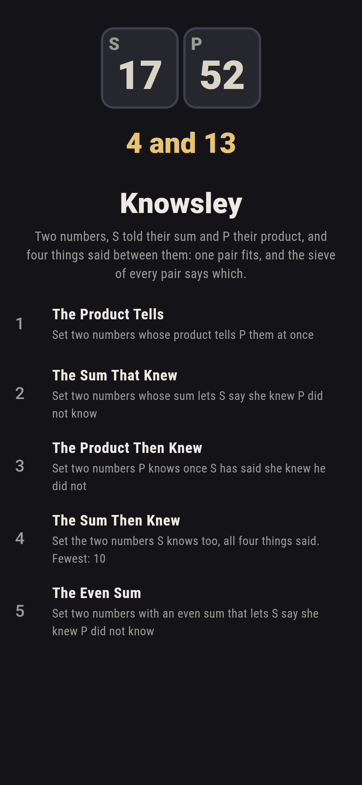
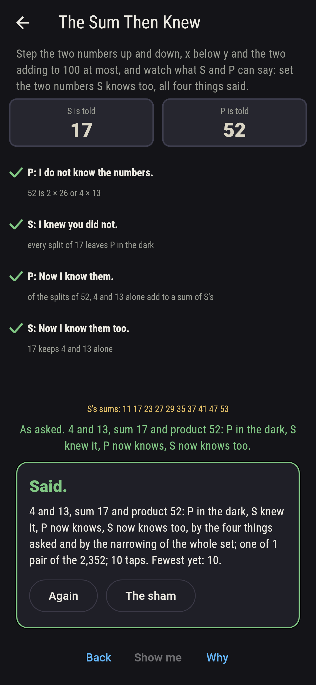
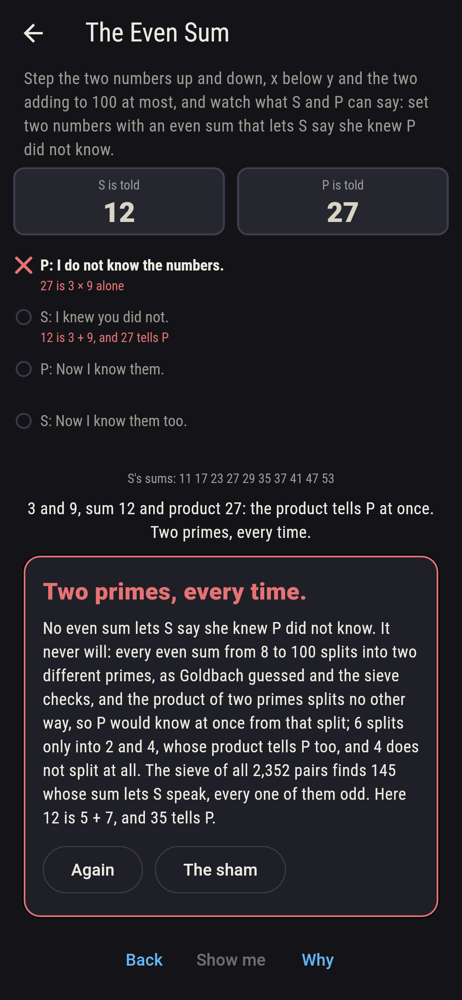
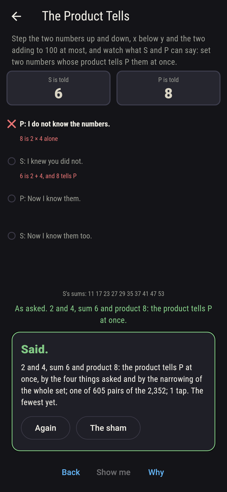
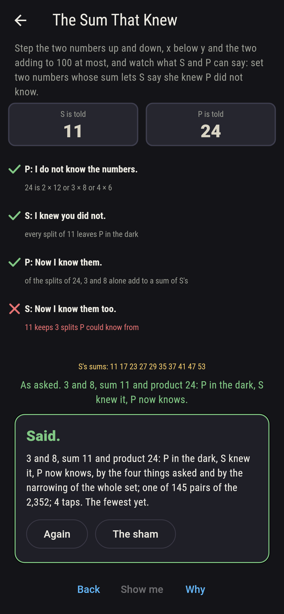
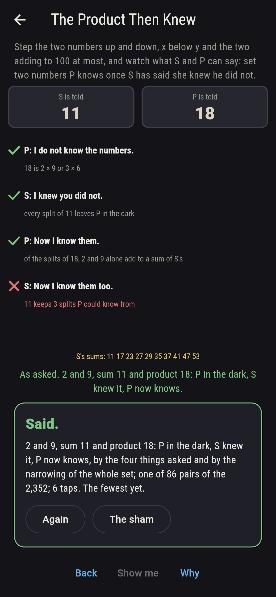
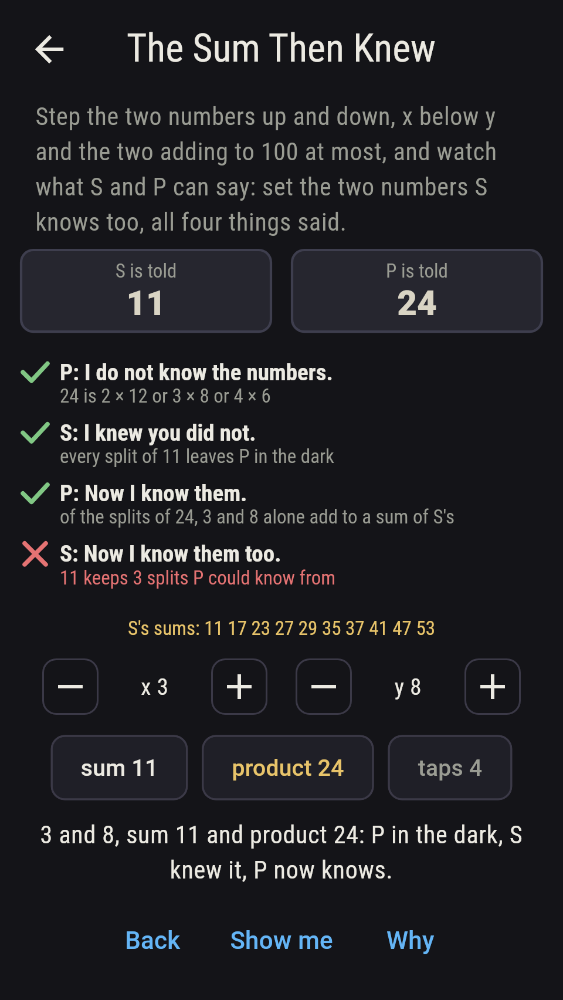
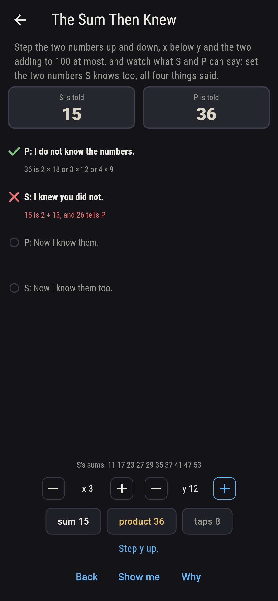
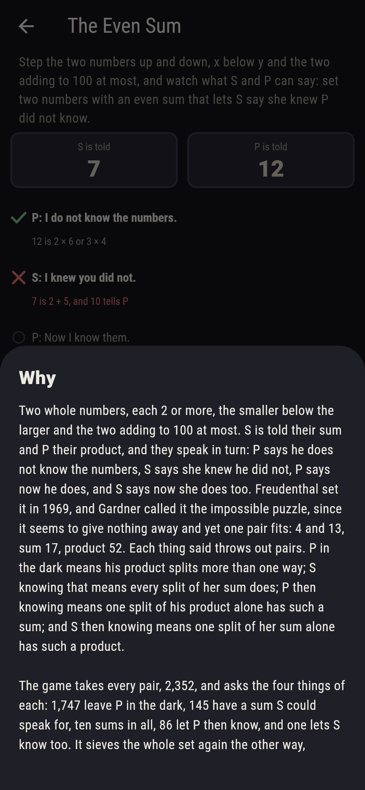

# Knowsley


Two whole numbers, each 2 or more, the smaller below the larger and
the two adding to 100 at most. S is told their sum and P their
product, and they speak in turn: P says he does not know the
numbers, S says she knew he did not, P says now he does, and S says
now she does too. Freudenthal set it in 1969, and Gardner called it
the impossible puzzle, since it seems to give nothing away and yet
one pair fits: 4 and 13, sum 17, product 52. Each thing said throws
out pairs. P in the dark means his product splits more than one way;
S knowing that means every split of her sum does; P then knowing
means one split of his product alone has such a sum; and S then
knowing means one split of her sum alone has such a product. Step
the two numbers up and down and watch what S and P can say. The game
takes every pair, 2,352, and asks the four things of each: 1,747
leave P in the dark, 145 have a sum S could speak for, ten sums in
all, 86 let P then know, and one lets S know too. It sieves the
whole set again the other way, narrowing all the pairs by each thing
said in turn, and the two agree at every step, down to 4 and 13.

## The asks

1. **The Product Tells** - set two numbers whose product tells P them at once
2. **The Sum That Knew** - set two numbers whose sum lets S say she knew P did not know
3. **The Product Then Knew** - set two numbers P knows once S has said she knew he did not
4. **The Sum Then Knew** - set the two numbers S knows too, all four things said
5. **The Even Sum** - set two numbers with an even sum that lets S say she knew P did not know

Of the 2,352 pairs, 605 have a product that splits one way only, and
P knows them at once, 6 being 2 times 3 and nothing else, as the
product of any two primes; the other 1,747 leave him in the dark.
Ten sums let S say she knew he did not, 11, 17, 23, 27, 29, 35, 37,
41, 47 and 53, odd every one and none two more than a prime, and 145
pairs add to one of them. Once S has spoken, 86 pairs leave P
exactly one split with a sum of hers, 2 and 9 the first, since 18 is
2 times 9 or 3 times 6 and 11 is a sum of hers while 9 is not. And
one sum of the ten keeps exactly one split P could now know from,
17 with 4 and 13, where 11 and 23 keep three and 27 nine. The Even
Sum is labeled hopeless on its tile: every even sum from 8 to 100
splits into two different primes, and their product tells P at
once; the sham admits it after three even sums have shown their
telling splits, or after sixteen taps.

## Two voices

The game never asserts what it has not computed, and it computes
everything at least twice:

* **The four things asked** are put to every pair on its own: the
  splits of its product counted, the splits of its sum each looked
  at for a product that tells, the splits of the product kept whose
  sum S could speak for, and the splits of the sum kept whose
  product P could then know from; every tick on the board is that
  asking's, and every count on the sham.
* **The narrowing** asks nothing of a pair alone: it takes the whole
  set and throws out, at each thing said, the pairs that could not
  have heard it, those alone with their product, those whose sum
  shares a pair already out, and so on four times; the pairs left
  after each step are exactly the pairs the asking passes, 1,747,
  145, 86 and one, and the one is 4 and 13.

`tool/check_pairs.dart` runs the lot and refuses the bake on any
disagreement.

## The checker's ledger

What `dart run tool/check_pairs.dart` printed for the build this
README shipped with, word for word:

```
every pair of whole numbers from 2 up, the smaller below the larger and the two adding to 100 at most, taken, 2,352 pairs, and the four things asked of each, P in the dark, S knowing it, P then knowing and S then knowing, then the whole set narrowed by each thing said in turn, the two agreeing at every step: 1,747 pairs leave P in the dark and 605 tell him at once, 145 add to a sum S could speak for, ten sums, 11, 17, 23, 27, 29, 35, 37, 41, 47 and 53, every one odd and none two more than a prime, 86 let P then know, and one lets S know too, 4 and 13, sum 17 and product 52; of the ten sums 17 alone keeps one split once P has spoken, 11 and 23 keeping three and 27 nine; and every even sum from 8 to 100 splits into two different primes whose product tells P at once, so no even sum lets S speak, 6 splitting only into 2 and 4 and 4 not at all

 1 The Product Tells     set two numbers whose product tells P them at once: 605 of the 2,352 pairs land it
 2 The Sum That Knew     set two numbers whose sum lets S say she knew P did not know: 145 of the 2,352 pairs land it
 3 The Product Then Knew set two numbers P knows once S has said she knew he did not: 86 of the 2,352 pairs land it
 4 The Sum Then Knew     set the two numbers S knows too, all four things said: 1 of the 2,352 pairs lands it
 5 The Even Sum          set two numbers with an even sum that lets S say she knew P did not know: none of the 2,352, and the two primes said so first
```

## Screenshots

| The sham | The answer | The even sum admitted |
| --- | --- | --- |
|  |  |  |

| The product tells | The sum that knew | The product then knew | Midway, on the small phone | Show me | The why |
| --- | --- | --- | --- | --- | --- |
|  |  |  |  |  |  |

Screenshots are drawn by `test/showcase_test.dart` at real phone
sizes with the app's own painter, then copied into `docs/` as they
came out; every pair in them was reached by the dials, so nothing
pictured is a pair the game could not reach. The logo and every
launcher icon come out of `test/mark_test.dart` the same way: the
mark is S's 17 and P's 52 on their cards, and the pair beneath, 4
and 13.

## Building

```
flutter test          # 44 tests, the sieve among them
dart run tool/check_pairs.dart
flutter build apk     # or: flutter build ios
```
