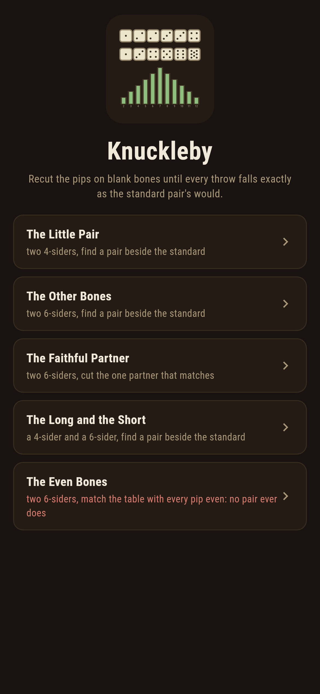
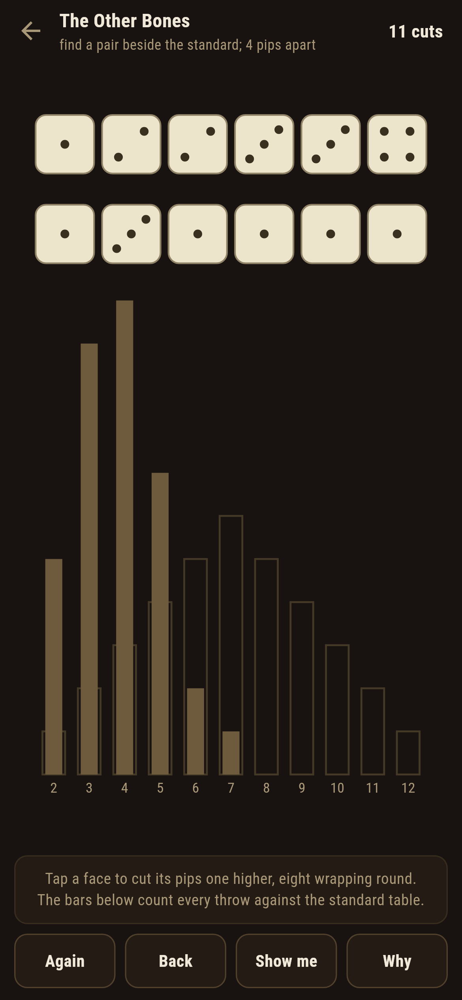
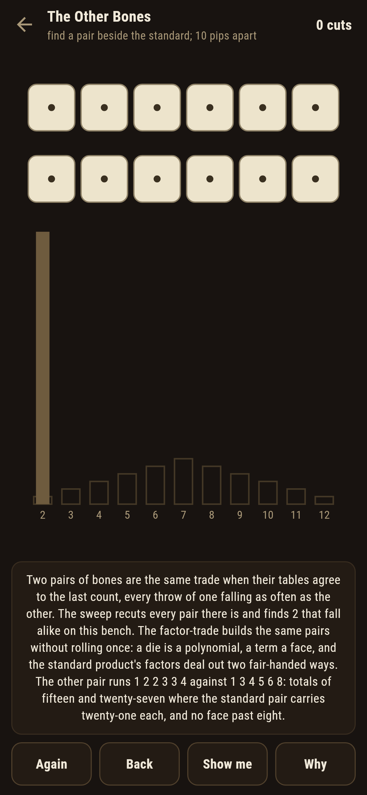
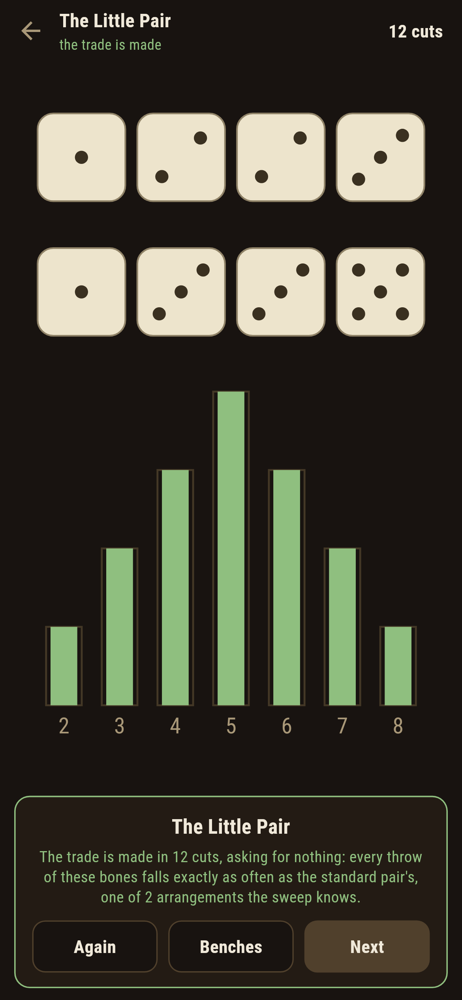
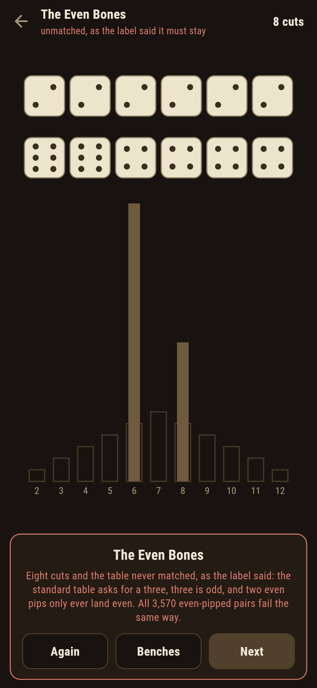
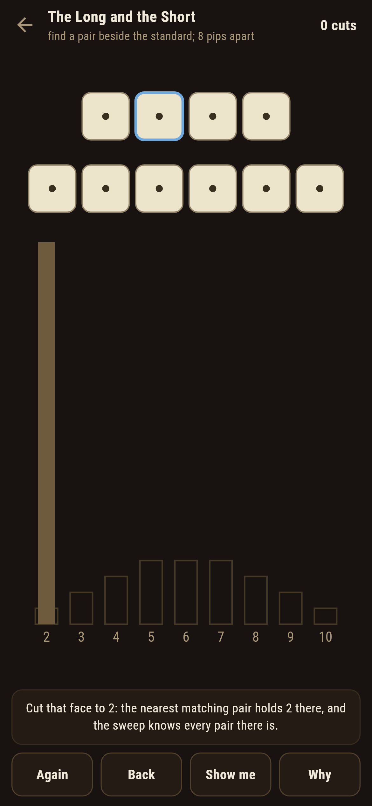

# Knuckleby

A dice-cutting puzzle for phones, in Flutter, for Android and iOS.

Blank bones on the tavern bench, a knife, and one asking: cut the
pips so that every throw of your pair falls exactly as often as the
standard pair's, and cut something other than the standard itself.
These are Sicherman's dice worked by hand, the bars beneath the
bench counting all thirty-six throws live against the standard
table, and the famous other pair, 1 2 2 3 3 4 against 1 3 4 5 6 8,
waiting to be found.

| | | | |
|---|---|---|---|
|  |  |  |  |

## Two ways of knowing

The suite knows every bench two ways that share nothing. The sweep
recuts every pair of dice there is, pips one to eight, and compares
whole tables; the factor-trade never rolls once: a die is a
polynomial with a term a face, a matching pair multiplies to the
standard product, and dealing that product's factors out two
fair-handed ways builds the pairs directly. On both square benches
the two roads meet to the last pip, every matching die keeps exactly
one ace, and every written count below is the sweep's own.

```
$ make benches
the sweep of every pair of dice against the factor-trade that never rolls: they build the same pairs to the last pip, every matching die keeps exactly one ace, and no even-pipped pair of the 3,570 ever lands an odd throw

 1 The Little Pair        two 4-siders  find a pair beside the standard: 2 pairs fall alike in all
 2 The Other Bones        two 6-siders  find a pair beside the standard: 2 pairs fall alike in all
 3 The Faithful Partner   two 6-siders  cut the one partner that matches: 1 pair falls alike in all
 4 The Long and the Short a 4-sider and a 6-sider  find a pair beside the standard: 4 pairs fall alike in all
 5 The Even Bones         two 6-siders  match the table with every pip even: no pair of the 3,570 does
```

## The even bones

One bench ships labelled hopeless in the house tradition of maps
nobody can win: match the table with every pip even. The standard
table asks for a three, three is odd, and two even pips only ever
land even; the sweep says the same the long way round, recutting all
3,570 even-pipped pairs and matching none. The game says so on the
way in, leaves the odd totals standing empty in the bars however you
cut, and after eight cuts writes the futility down rather than let
anyone grind at it.



## The table that counts itself

Nothing about the trade is folklore here. The bars under the bench
count every throw of the standing dice against the standard table,
green where they agree, and a pair that matches by being the
standard itself is told the bench wants the other one. **Show me**
points a face and names the pip the nearest matching pair holds
there, a cut that moves the bones further off is called out with the
distance, and **Why** speaks the sweep and the factor-trade over the
bench in front of you.



## Building

```
make deps      # fetch packages
make check     # analyze + every test
make benches   # recut every pair and run the factor-trade
make shots     # render the screenshots and redraw the icons
make apk       # Android release build
make ios       # iOS release build (unsigned)
```

The logo and every app icon are drawn by the game's own painter in
`test/mark_test.dart`. There is no image in this repository that was not
produced by code in it.

## How it is put together

```
lib/bones/rules.dart      the tables, the sweep of every pair, the
                          factor-trade
lib/bones/bench.dart      a bench: its dice and its asking
lib/bones/benches.dart    the five benches that ship
lib/bones/play.dart       a bench being cut: pips, take-back, the
                          distance to the nearest matching pair
lib/ui/                   the painter, the screens, the mark
tool/check_benches.dart   the sweeps, the trade, and the ledger above
```

The tests table small pairs by hand, sweep every pair of every bench
and hold the factor-trade against the sweep, count the lone ace on
every matching die, cut the standard pair and watch it refused where
the other is asked, make every winnable trade by following the
game's own pointer, watch a wandering cut called out with its
distance, watch the even bones never match and the bench admit it,
and hold the pictures against the real widget tree. If any of that
drifts, `make check` goes red before anything leaves the machine.
