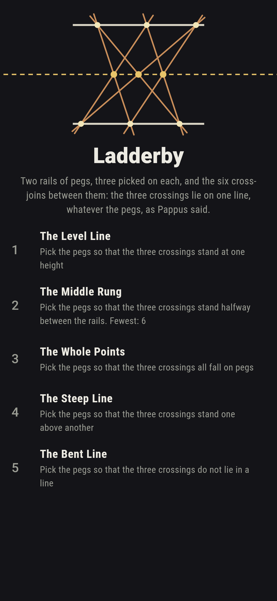
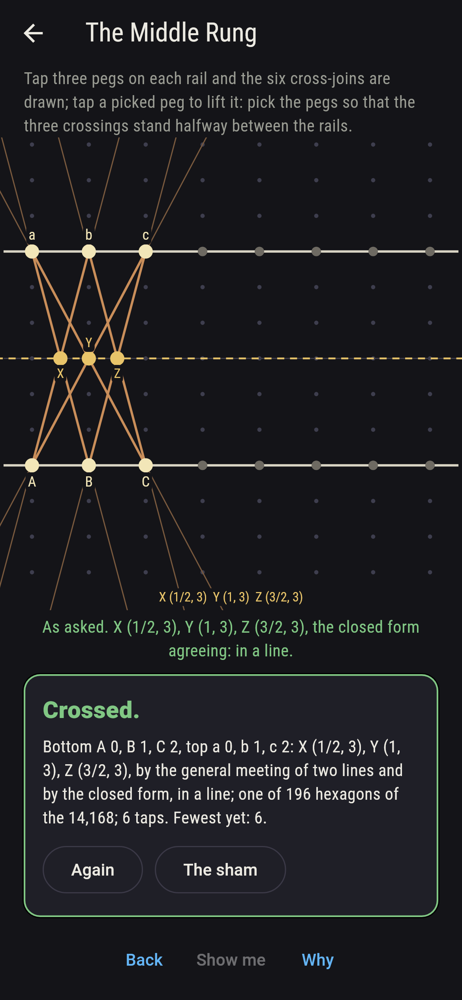
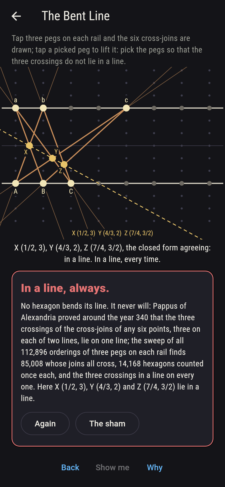
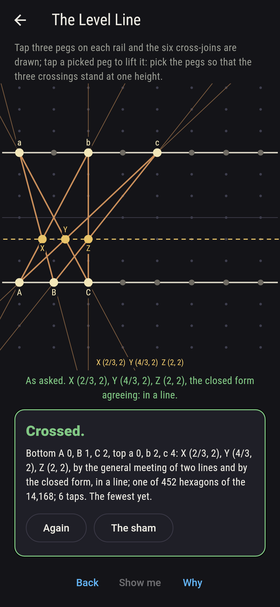
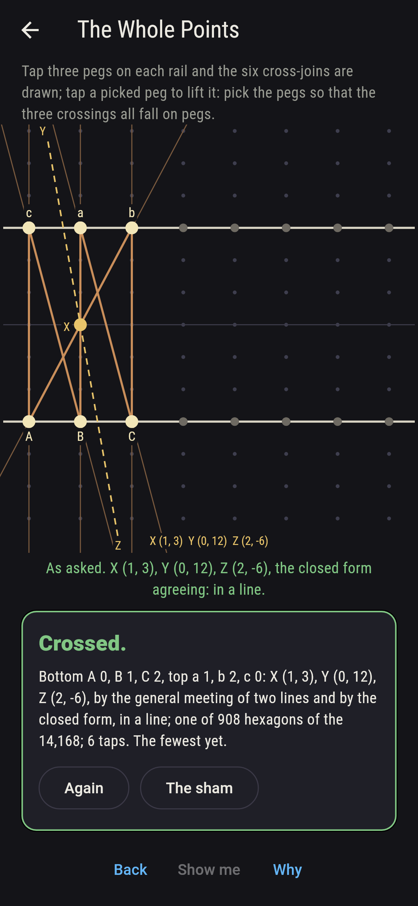
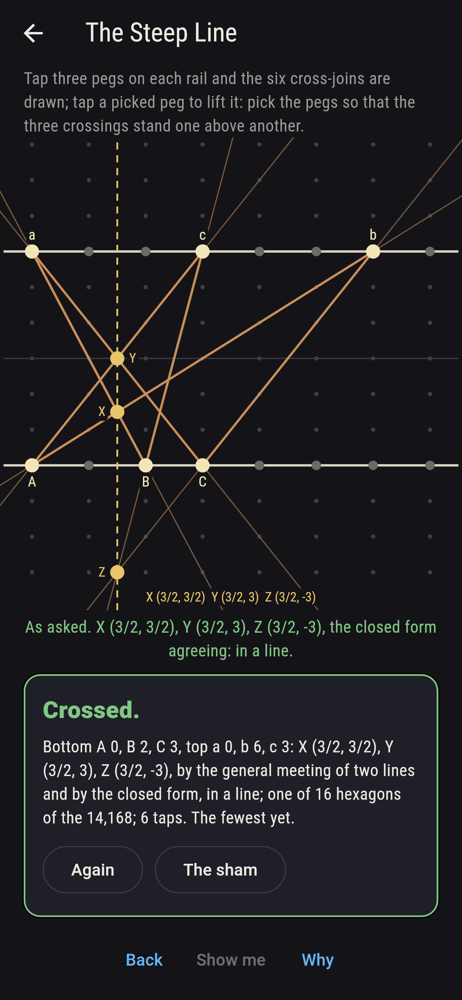
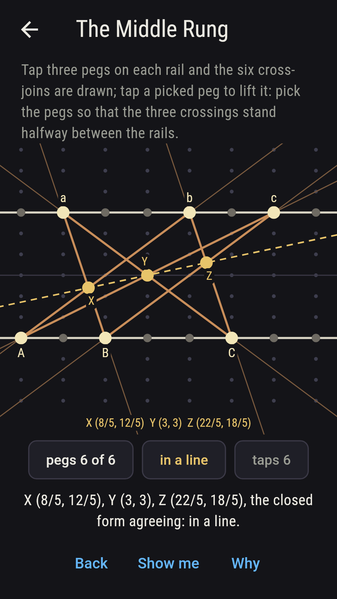
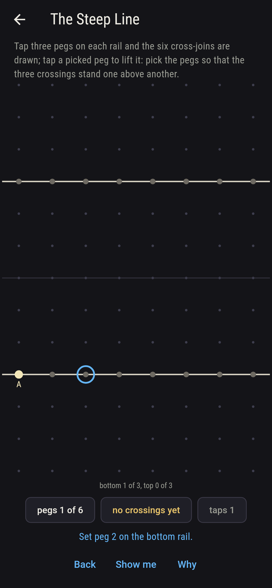
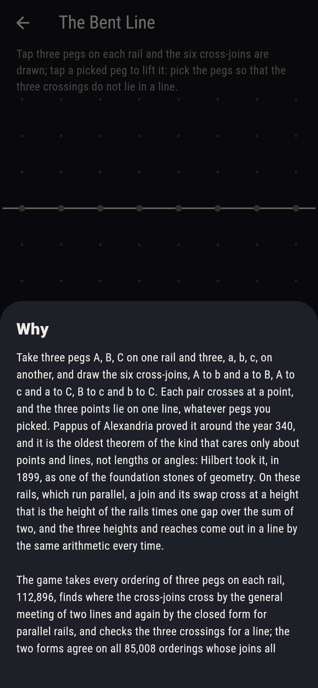

# Ladderby


Two rails of pegs, one above the other, and three pegs picked on
each, A, B, C below and a, b, c above. Draw the six cross-joins, A
to b and a to B, A to c and a to C, B to c and b to C: each pair
crosses at a point, and the three points lie on one line, whatever
pegs were picked. Pappus of Alexandria proved it around the year
340, the oldest theorem of the kind that cares only about points and
lines and never about lengths or angles, and Hilbert took it in 1899
as a foundation stone of geometry. On rails that run parallel a join
and its swap cross at a height that is the rails' gap times one
distance over the sum of two, and the three heights and reaches come
out in a line by the same arithmetic every time. Tap three pegs on
each rail and the six cross-joins are drawn. The game takes every
ordering of three pegs on each rail, 112,896, finds where the
cross-joins cross by the general meeting of two lines and again by
the closed form for parallel rails, and checks the three crossings
for a line: the two forms agree on all 85,008 orderings whose joins
all cross, 14,168 hexagons counted once each, and the crossings lie
in a line on every one.

## The asks

1. **The Level Line** - pick the pegs so that the three crossings stand at one height
2. **The Middle Rung** - pick the pegs so that the three crossings stand halfway between the rails
3. **The Whole Points** - pick the pegs so that the three crossings all fall on pegs
4. **The Steep Line** - pick the pegs so that the three crossings stand one above another
5. **The Bent Line** - pick the pegs so that the three crossings do not lie in a line

The three crossings stand at one height for 452 of the 14,168
hexagons, and bottom 0, 1, 2 with top 0, 1, 2 puts them at (1/2, 3),
(1, 3) and (3/2, 3), while bottom 0, 2, 5 with top 1, 4, 6 has them
rising, (8/5, 12/5), (3, 3) and (22/5, 18/5), still in a line. When
they stand level they may stand halfway up, and 196 of the 452 do:
every hexagon whose top three are its bottom three shifted along,
since a join and its swap then meet halfway whatever the shift. The
crossings all fall on pegs for 908 hexagons, and bottom 0, 1, 2 with
top 1, 2, 0 puts them at (1, 3), (0, 12) and (2, -6), far above and
below the rails, since a crossing may stand anywhere on the plane.
Only 16 hexagons stand their three crossings one above another, the
line straight up: bottom 0, 2, 3 with top 0, 6, 3 at (3/2, 3/2),
(3/2, 3) and (3/2, -3). The Bent Line is labeled hopeless on its
tile: Pappus said so first, and the sweep finds no hexagon of the
14,168 that bends; the sham admits it after three hexagons have lain
in their lines, or after eighteen taps.

## Two voices

The game never asserts what it has not computed, and it computes
everything at least twice:

* **The general meeting** crosses two joins as any two lines are
  crossed, the one join run along until it stands on the other, and
  every crossing on the sham is that meeting's; every crossing is
  checked to lie on both its joins, the three crossings of every
  hexagon are checked to be three different points, and the three
  are checked for a line on all 85,008 orderings whose joins cross.
* **The closed form** meets nothing: for rails that run parallel the
  crossing of the join from bottom i to top j with the join from
  bottom k to top l stands at height h(k - i)/((k - i) + (j - l))
  and across at (jk - il)/((k - i) + (j - l)), and it agrees with the
  general meeting on every crossing of every one of the 85,008, and
  runs parallel exactly when the meeting does.

`tool/check_joins.dart` runs the lot and refuses the bake on any
disagreement.

## The checker's ledger

What `dart run tool/check_joins.dart` printed for the build this
README shipped with, word for word:

```
every ordering of three pegs on each of the two rails taken, 112,896 orderings, and the six cross-joins of each crossed by the general meeting of two lines and again by the closed form for parallel rails, the two agreeing wherever the joins cross, 85,008 orderings, 14,168 hexagons counted once each, every crossing on both its joins, and the three crossings three different points in a line on every one; the crossings stand at one height on 452 hexagons, halfway between the rails on 196 of those, every hexagon whose top three are its bottom three shifted along among them, on pegs throughout on 908, and one above another on 16; bottom 0, 1, 2 with top 0, 1, 2 crosses at (1/2, 3), (1, 3) and (3/2, 3), and with top 1, 2, 0 at (1, 3), (0, 12) and (2, -6)

 1 The Level Line   pick the pegs so that the three crossings stand at one height: 452 of the 14,168 hexagons land it
 2 The Middle Rung  pick the pegs so that the three crossings stand halfway between the rails: 196 of the 14,168 hexagons land it
 3 The Whole Points pick the pegs so that the three crossings all fall on pegs: 908 of the 14,168 hexagons land it
 4 The Steep Line   pick the pegs so that the three crossings stand one above another: 16 of the 14,168 hexagons land it
 5 The Bent Line    pick the pegs so that the three crossings do not lie in a line: none of the 14,168, and Pappus said so first
```

## Screenshots

| The sham | The middle rung | The bent line admitted |
| --- | --- | --- |
|  |  |  |

| The level line | The whole points | The steep line | Midway, on the small phone | Show me | The why |
| --- | --- | --- | --- | --- | --- |
|  |  |  |  |  |  |

Screenshots are drawn by `test/showcase_test.dart` at real phone
sizes with the app's own painter, then copied into `docs/` as they
came out; every hexagon in them was picked by taps on the rails, so
nothing pictured is a hexagon the game could not reach. The logo and
every launcher icon come out of `test/mark_test.dart` the same way:
the mark is bottom 0, 3, 6 with top 1, 4, 7, the bottom three
shifted along by one, its three crossings on the middle rung.

## Building

```
flutter test          # 45 tests, the sweep among them
dart run tool/check_joins.dart
flutter build apk     # or: flutter build ios
```
