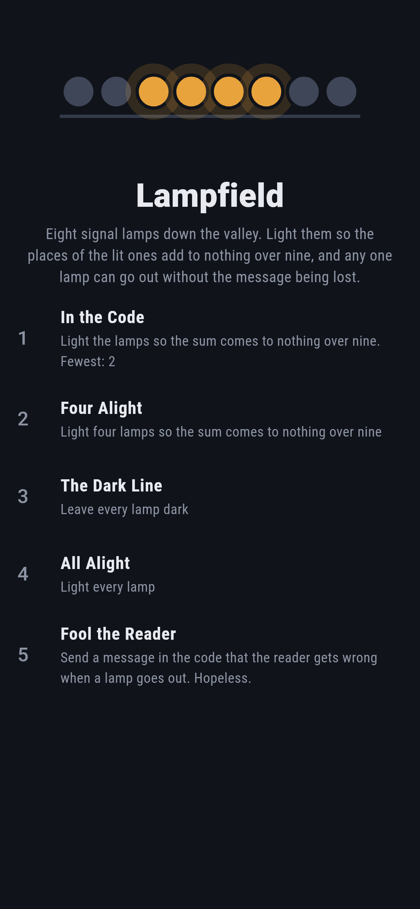
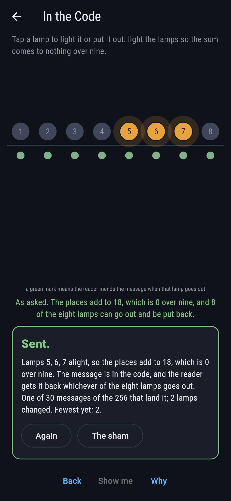
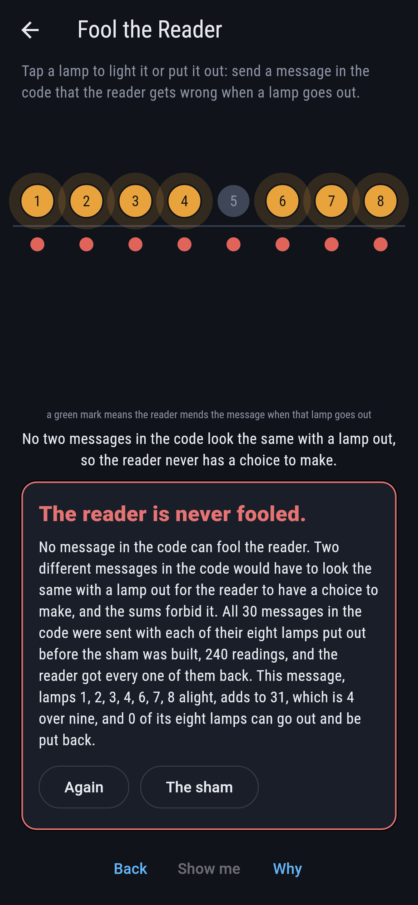
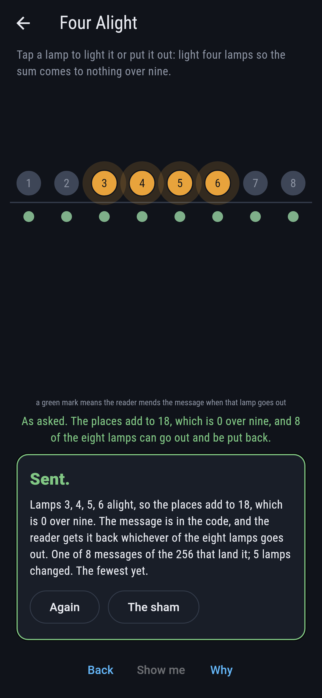
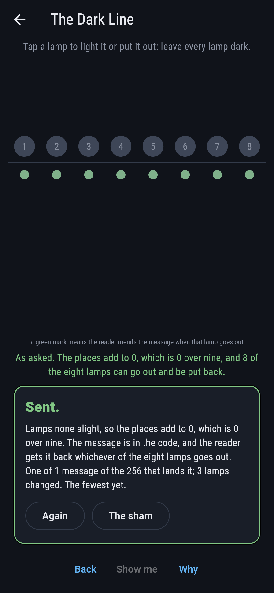
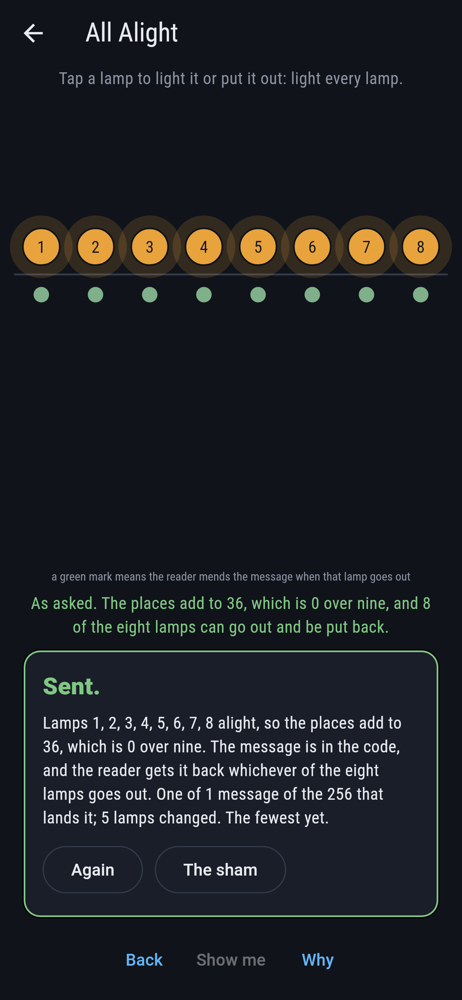
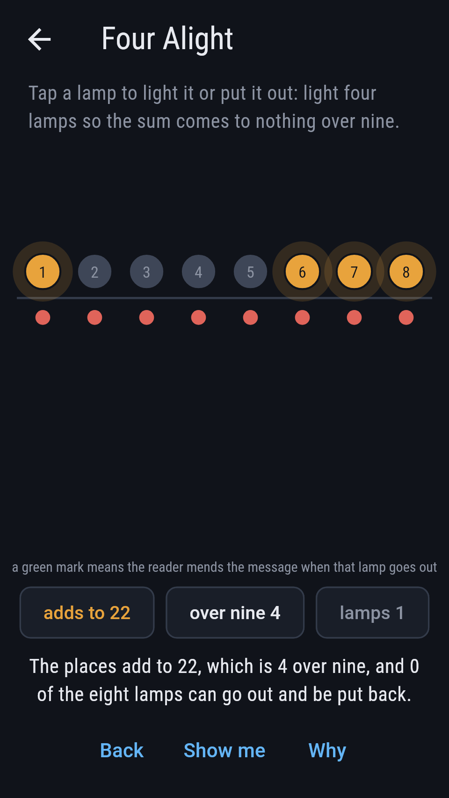
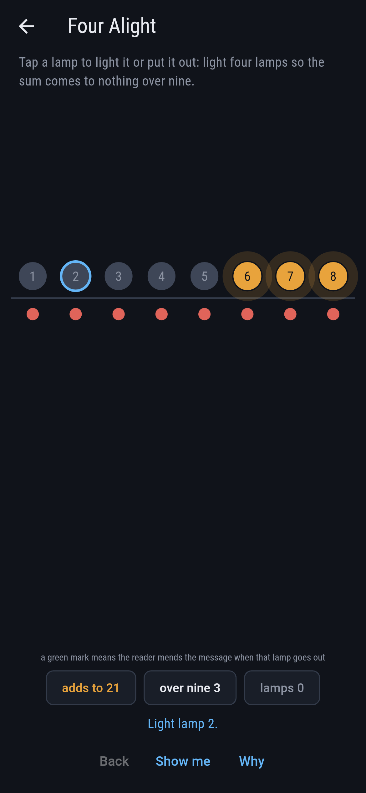
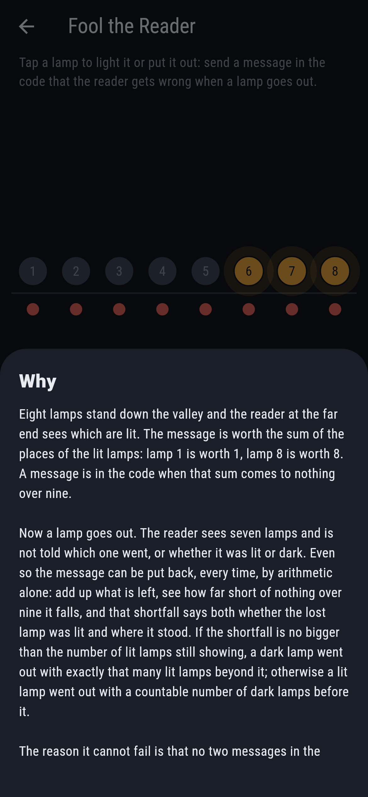

# Lampfield


Eight signal lamps stand down the valley, each lit or dark, and the
reader at the far end sees which are which. The message is worth the
sum of the places of the lit lamps: lamp 1 is worth 1, lamp 8 is worth
8. Tap a lamp to light it or put it out.

A message is in the code when that sum comes to nothing over nine.
Then any one lamp can go out and the reader still gets the message
back, without being told which lamp went or whether it had been lit.
Varshamov and Tenengolts published the code in 1965, and Levenshtein
showed the same year that it mends a lost lamp.

## The asks

1. **In the Code** - light the lamps so the sum comes to nothing over nine
2. **Four Alight** - light four lamps so the sum comes to nothing over nine
3. **The Dark Line** - leave every lamp dark
4. **All Alight** - light every lamp
5. **Fool the Reader** - send a message in the code that the reader gets wrong when a lamp goes out

30 of the 256 messages are in the code, which is more than any of the
other eight sums manages: nine sums cannot share 256 messages evenly,
so the largest holds at least 28, and this one holds 30. Eight of the
30 have exactly four lamps lit. The two extremes of the valley are
both in the code and both mendable: every lamp dark adds to nothing,
and every lamp lit adds to 36, which is four nines. Fool the Reader
says Hopeless on its tile, and the card at the end of the ask says why
on a finger.

## Why a lost lamp loses nothing

The reader sees seven lamps and is not told which one went. Add up
what is left, see how far short of nothing over nine the sum falls,
and that shortfall says both whether the lost lamp was lit and where
it stood. If the shortfall is no bigger than the number of lit lamps
still showing, a dark lamp went out with exactly that many lit lamps
beyond it. Otherwise a lit lamp went out, with a countable number of
dark lamps before it.

It cannot fail because no two messages in the code can look the same
with a lamp out. If two could, the reader would have a choice to make
and nothing to make it with. The sums forbid it.

## Two voices

The game never asserts what it has not computed, and it computes
everything at least twice:

* **The reader** works by arithmetic. It is told nothing but the seven
  lamps still showing, and it puts one back by counting how far short
  the sum falls.
* **The counting** reasons about nothing. It goes through all 256
  messages and keeps the ones in the code that could have left those
  seven lamps showing.

The two are set against each other on every one of the 240 readings
the code allows: 30 messages, each with each of its eight lamps put
out in turn. The counting never finds two, and the arithmetic never
gets one wrong.

`tool/check_lamps.dart` runs the lot and refuses the bake on any
disagreement.

## The checker's ledger

What `dart run tool/check_lamps.dart` printed for the build this README
shipped with, word for word:

```
every message the 8 lamps can send taken, all 256 of them, and sorted by what the places of their lit lamps add to over 9: 30 at 0, 28 at 1, 28 at 2, 29 at 3, 28 at 4, 28 at 5, 29 at 6, 28 at 7, 28 at 8, which is 256 messages between 9 sums, so the largest of them holds at least 28 and the code, the sum that comes to nothing, holds 30; then every one of the 30 messages in the code sent with each of its 8 lamps put out in turn, 240 readings, and each reading made twice: once by the reader's arithmetic, which is told nothing but the seven lamps still showing and puts one back by counting how far short of nothing the sum falls, and once by going through all 256 messages and keeping the ones in the code that could have left those seven showing; the two agree on every reading, the counting never finds two, and the arithmetic never gets one wrong; and no two of the 30 messages in the code look the same with a lamp out, which is why the reader never has a choice to make

 1 In the Code     light the lamps so the sum comes to nothing over nine: 30 of the 256 messages land it, the nearest 2 lamps off
 2 Four Alight     light four lamps so the sum comes to nothing over nine: 8 of the 256 messages land it, the nearest 3 lamps off
 3 The Dark Line   leave every lamp dark: 1 of the 256 messages lands it, the nearest 3 lamps off
 4 All Alight      light every lamp: 1 of the 256 messages lands it, the nearest 5 lamps off
 5 Fool the Reader send a message in the code that the reader gets wrong when a lamp goes out: none of the 256, and the sums say why
```

## Screenshots

| The sham | In the code | Fool the reader |
| --- | --- | --- |
|  |  |  |

| Four alight | The dark line | All alight | Out of the code, on the small phone | Show me | The why |
| --- | --- | --- | --- | --- | --- |
|  |  |  |  |  |  |

Screenshots are drawn by `test/showcase_test.dart` at real phone sizes
with the app's own painter, then copied into `docs/` as they came out;
every lamp in them was lit by a tap, so nothing pictured is a message
the game could not reach. The lamps across the top of the sham shot are
the mark rather than a run of taps. The logo and every launcher icon
come out of `test/mark_test.dart` the same way: the mark is lamps 3, 4,
5 and 6 alight, which add to 18 and so sit in the code.

## Building

```
flutter test          # 53 tests, the sweep among them
dart run tool/check_lamps.dart
flutter build apk     # or: flutter build ios
```
