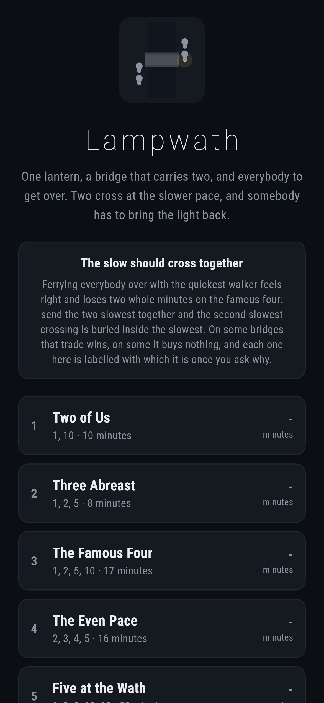
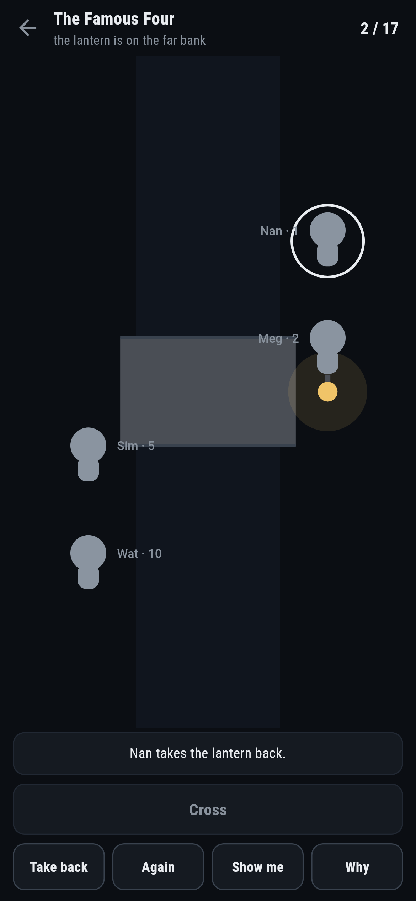
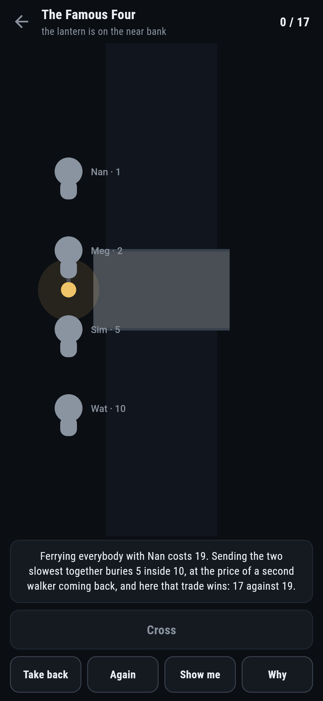
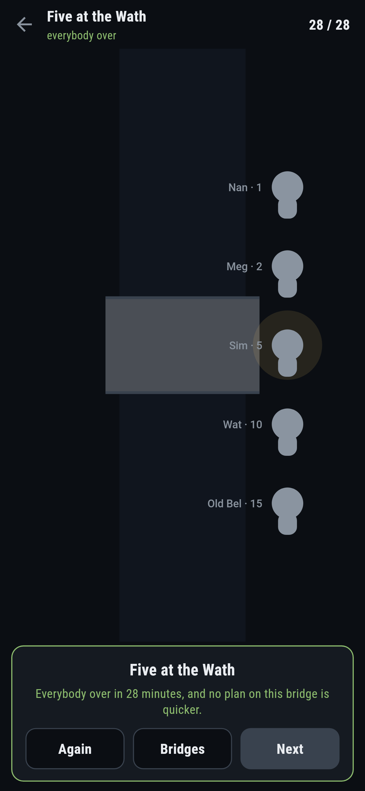
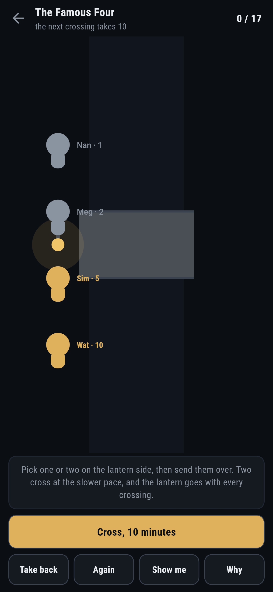

# Lampwath

A crossing puzzle for phones, in Flutter, for Android and iOS.

A stone bridge at night, one lantern, and everybody to get over. The bridge
carries two at most, two cross at the slower one's pace, and whoever crosses
must carry the light, so somebody has to keep bringing it back.

| | | | |
|---|---|---|---|
|  |  |  |  |

## The famous two minutes

Four walkers at one, two, five and ten minutes. Ferrying everybody over with
the quickest feels right and costs nineteen. The answer is seventeen: send the
two slowest together, so the five is buried inside the ten, and pay for it
with a second walker bringing the lantern back. That trade is the whole
puzzle, and this game ships bridges on both sides of it.

On the Even Pace, at two, three, four and five minutes, the same trade buys
nothing at all: burying the second slowest exactly pays for the extra trip
back, and ferrying is already the fewest. **Why** works the sum with each
bridge's own numbers either way.

```
$ make bridges
 1 Two of Us            2 walkers (1, 10)  fewest 10  written down 10  by trying 10  ferrying 10
 2 Three Abreast        3 walkers (1, 2, 5)  fewest 8  written down 8  by trying 8  ferrying 8
 3 The Famous Four      4 walkers (1, 2, 5, 10)  fewest 17  written down 17  by trying 17  ferrying 19
 4 The Even Pace        4 walkers (2, 3, 4, 5)  fewest 16  written down 16  by trying 16  ferrying 16
 5 Five at the Wath     5 walkers (1, 2, 5, 10, 15)  fewest 28  written down 28  by trying 28  ferrying 35
 6 The Whole Household  5 walkers (1, 3, 8, 9, 10)  fewest 29  written down 29  by trying 29  ferrying 33
```

## Minutes, not moves

Crossings cost minutes, so the settling behind the game is by cheapest first
rather than fewest steps: every state a night can be in, who is over and
where the lantern stands, settled in order of the minutes still needed. It is
the first game in this repository where the shortest way is weighed rather
than counted, and it is held to account by a brute force that tries every
night there is, on every shipped bridge and a hundred more made up at random.

The settling is also why the game is honest part way through: the moment a
crossing costs more than the night takes, it says so, because the minutes
still needed from anywhere are already known.



## Running it

```
make deps     # flutter pub get
make test     # everything
make analyze
make shots    # render the screens into build/showcase, redraw the logo and icons
make bridges  # every shipped bridge, three ways
make apk      # release APK
make ios      # release iOS build, unsigned
```

## Tests

`flutter test` runs the settling against a brute force on every shipped
bridge and a hundred random ones, the famous two minutes (seventeen against
nineteen, and the even pace where the trade buys nothing), every bridge
wearing the right ferry label, and a night at the bridge: picking two,
crossing at the slower pace, the refusals, the slow pair sent first and
called out at once, take back, and the settling finishing every bridge at
par.

Then the game through the screen: the same night by tapping walkers, the
lantern side enforced out loud, **Show me** naming the party, **Why** working
the trade with real numbers, and every bridge crossed at par.

Screenshots come from `test/showcase_test.dart`, and every crossing in them
was made by picking walkers and sending them over. `test/mark_test.dart`
draws the logo, the launcher icons at every density Android asks for and
every size the iOS icon set asks for; there is no image in this repository
that was not produced by it.
