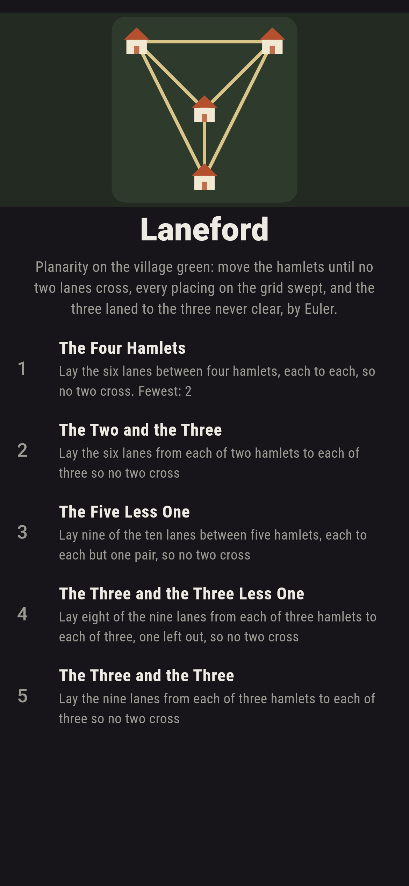
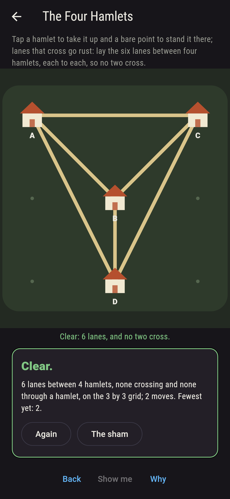
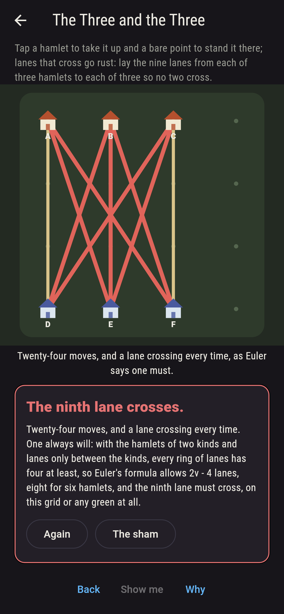
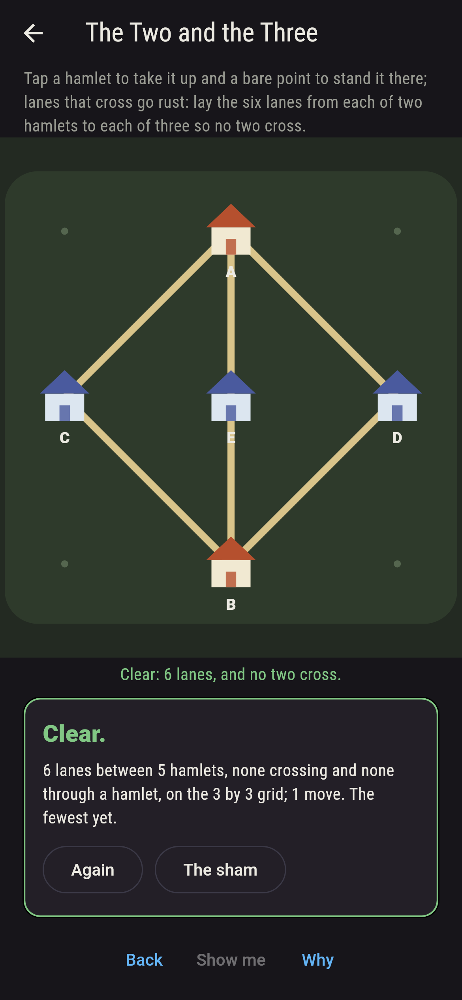
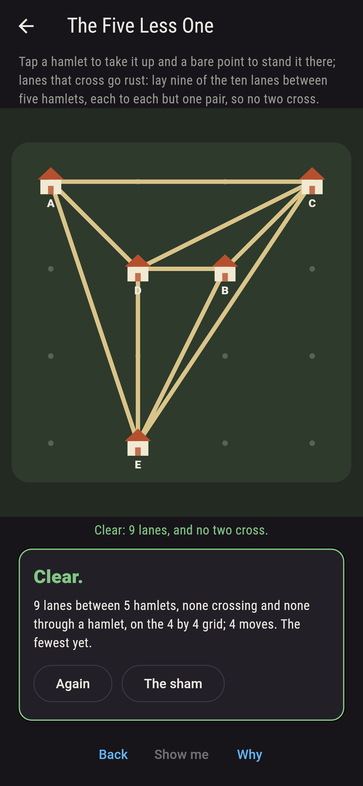
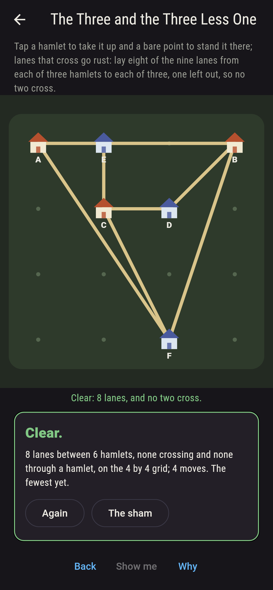
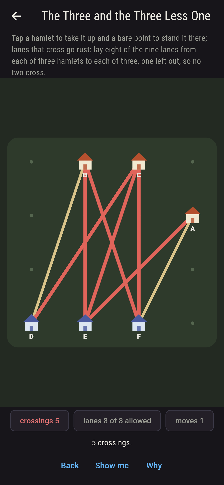
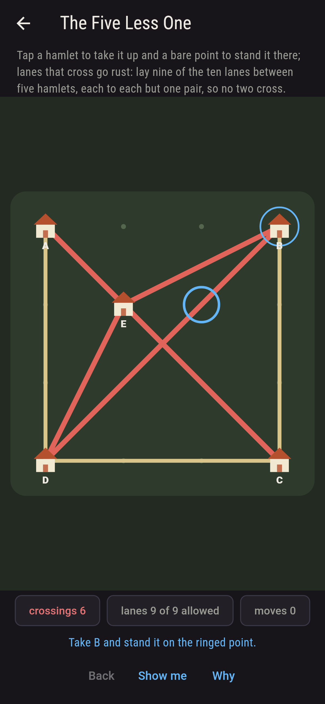
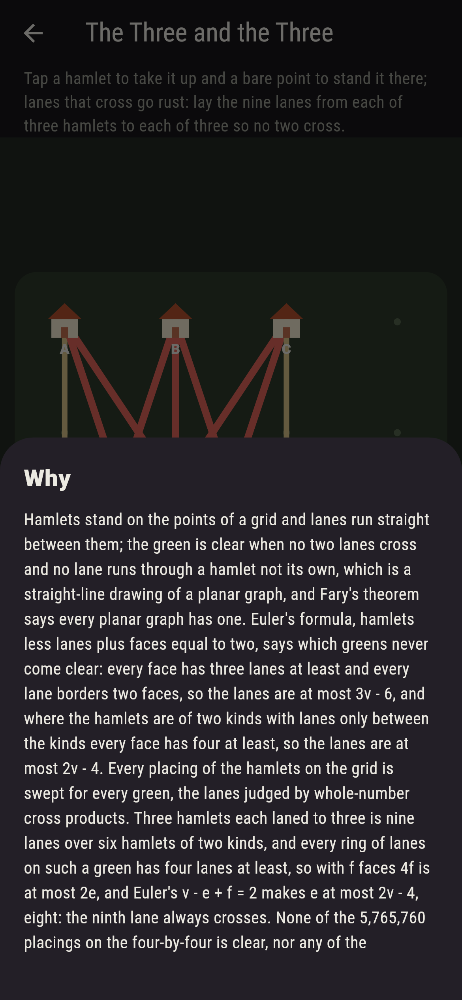

# Laneford


Planarity on the village green. Hamlets stand on the points of a
grid and lanes run straight between them; tap a hamlet to take it
up and a bare point to stand it there, and lanes that cross go
rust. The green is clear when no two lanes cross and no lane runs
through a hamlet not its own, which is a straight-line drawing of
a planar graph, and Fary's theorem says every planar graph has one.
Euler's formula, hamlets less lanes plus faces equal to two, says
which greens never come clear: every face has three lanes at least
and every lane borders two faces, so the lanes are at most 3v - 6,
and where the hamlets are of two kinds with lanes only between the
kinds every face has four at least, so the lanes are at most
2v - 4. Three hamlets each laned to three is nine lanes over six
hamlets of two kinds, and 2v - 4 is eight: the ninth lane always
crosses. Every placing of the hamlets on the grid is swept for
every green, the lanes judged by whole-number cross products.

## The greens

1. **The Four Hamlets** - lay the six lanes between four hamlets, each to each, so no two cross
2. **The Two and the Three** - lay the six lanes from each of two hamlets to each of three so no two cross
3. **The Five Less One** - lay nine of the ten lanes between five hamlets, each to each but one pair, so no two cross
4. **The Three and the Three Less One** - lay eight of the nine lanes from each of three hamlets to each of three, one left out, so no two cross
5. **The Three and the Three** - lay the nine lanes from each of three hamlets to each of three so no two cross

Four hamlets each to each, six lanes, Euler's ceiling exactly, lie
clear in 192 of the 3,024 placings on the three-by-three, the first
with a hamlet inside the triangle of the other three; two to each
of three, six lanes over five, in 912 of 15,120; five each to each
but one pair, nine lanes, in 1,200 of 524,160 on the four-by-four,
and all ten lanes, one over the ceiling, in none; three to each of
three less one lane, eight, in 26,432 of 5,765,760, and all nine,
one over, in none of the 5,765,760, nor in any of the 127,512,000
placings on the five-by-five. The Three and the Three is labeled
hopeless on its tile, and Euler is the why.

## Two voices

The game never asserts what it has not computed, and it computes
everything at least twice:

* **The sweep** stands the hamlets on the grid every way there is,
  one hamlet at a time and stopping at the first crossing among the
  lanes laid so far, and counts the placings that lay the green
  clear; every count on the sham is that sweep's, and every
  crossing is a whole-number cross product, so nothing is rounded.
* **Euler's ceiling** measures nothing: 3v - 6 lanes for any clear
  green, 2v - 4 for a green of two kinds, from hamlets less lanes
  plus faces equal to two and the faces' least sizes; every green
  over its ceiling the sweep finds never clear, and every green at
  or under it the sweep finds clear some way, on all five and on
  the five each to each besides.

`tool/check_lanes.dart` runs the lot and refuses the bake on any
disagreement.

## The checker's ledger

What `dart run tool/check_lanes.dart` printed for the build this
README shipped with, word for word:

```
every placing of the hamlets on the grid swept for every green, the lanes judged by whole-number cross products, and the counts held to Euler's ceiling, 3v - 6 lanes for a clear green and 2v - 4 for one of two kinds: four hamlets each to each, six lanes, the ceiling exactly, lie clear in 192 of 3,024 placings on the three-by-three; two to each of three, six lanes over five, the ceiling exactly, in 912 of 15,120; five each to each but one pair, nine lanes, in 1,200 of 524,160 on the four-by-four, and all ten lanes, one over the ceiling, in none; three to each of three less one lane, eight, the ceiling exactly, in 26,432 of 5,765,760, and all nine lanes, one over, in none of the 5,765,760, nor in any of the 127,512,000 on the five-by-five, as Euler says

 1 The Four Hamlets                 lay the six lanes between four hamlets, each to each, so no two cross: 192 of the 3,024 placings land it
 2 The Two and the Three            lay the six lanes from each of two hamlets to each of three so no two cross: 912 of the 15,120 placings land it
 3 The Five Less One                lay nine of the ten lanes between five hamlets, each to each but one pair, so no two cross: 1,200 of the 524,160 placings land it
 4 The Three and the Three Less One lay eight of the nine lanes from each of three hamlets to each of three, one left out, so no two cross: 26,432 of the 5,765,760 placings land it
 5 The Three and the Three          lay the nine lanes from each of three hamlets to each of three so no two cross: none of the 5,765,760, and Euler said so first
```

## Screenshots

| The sham | The four hamlets | The three and the three admitted |
| --- | --- | --- |
|  |  |  |

| The two and the three | The five less one | The three and the three less one | Mid-laying | Show me | The why |
| --- | --- | --- | --- | --- | --- |
|  |  |  |  |  |  |

Screenshots are drawn by `test/showcase_test.dart` at real phone
sizes with the app's own painter, then copied into `docs/` as they
came out; every hamlet in them was moved by taps, so nothing
pictured is a green the game could not reach. The logo and every
launcher icon come out of `test/mark_test.dart` the same way: the
mark is the four hamlets each laned to each, laid clear.

## Building

```
flutter test          # 50 tests, the sweep among them
dart run tool/check_lanes.dart
flutter build apk     # or: flutter build ios
```
