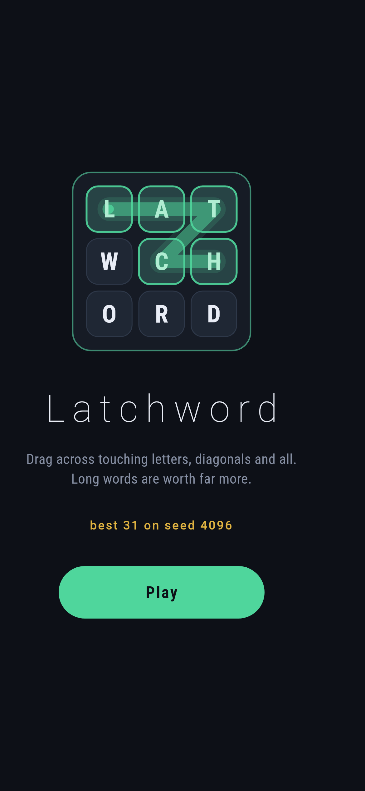
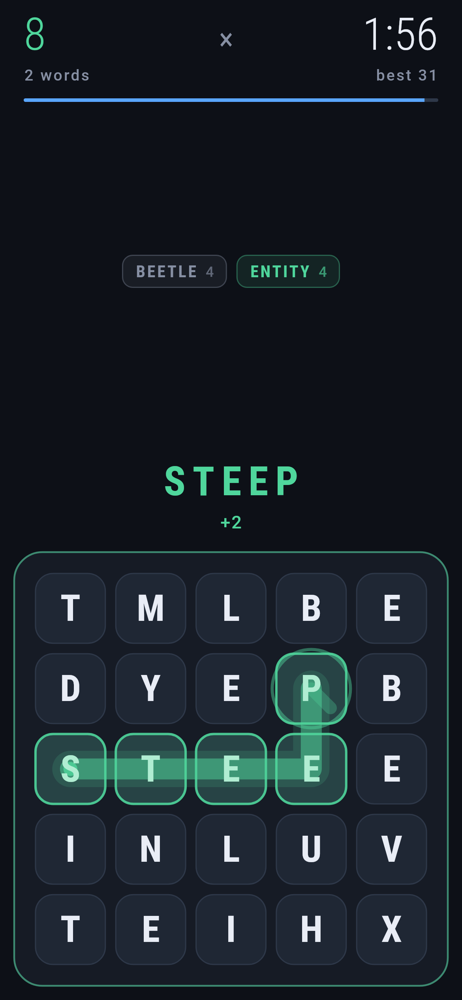
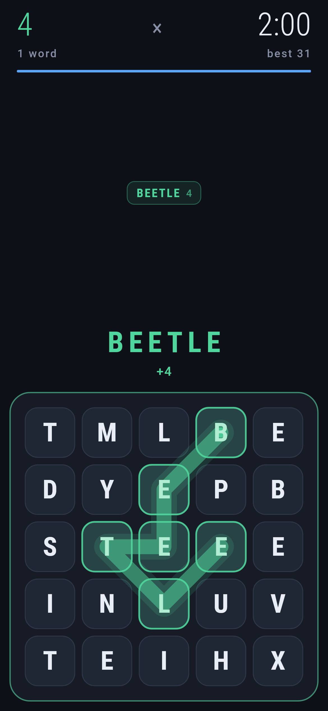
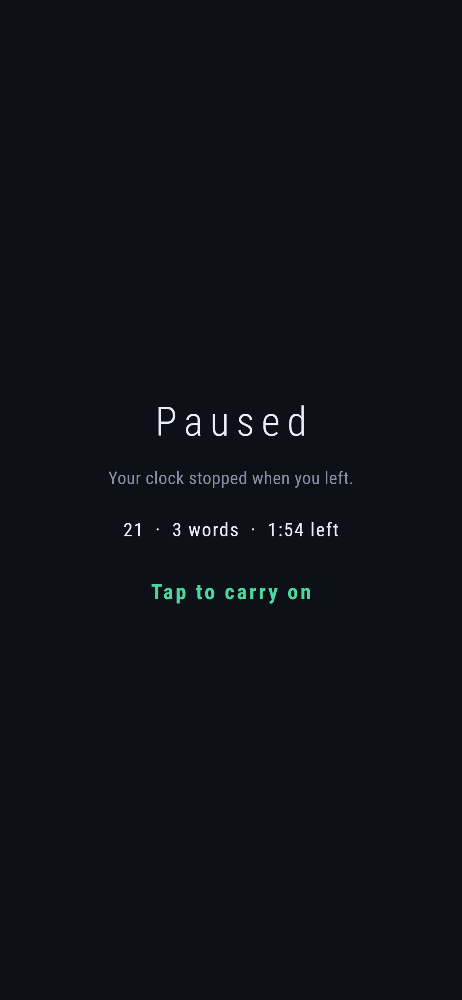
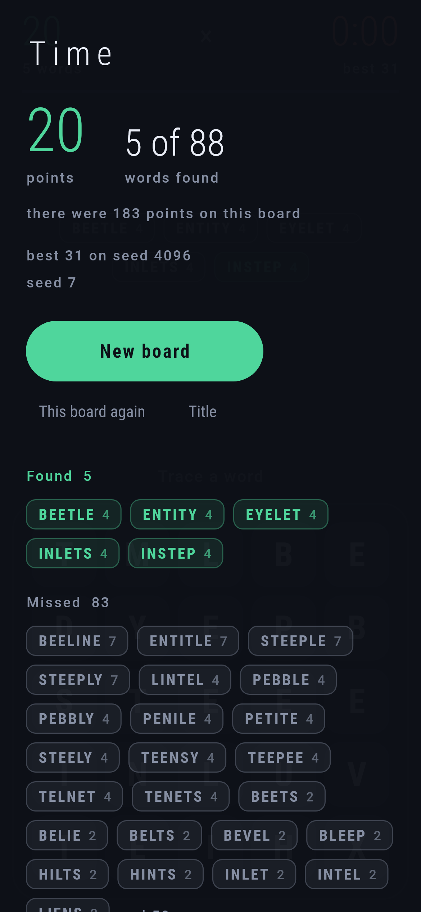

# Latchword

A word game for phones, in Flutter, for Android and iOS.

Five by five letters. Drag your thumb across touching squares, diagonals
included, and whatever you spell counts if the game knows it. Four letters is
one point and nine letters is sixteen, because finding a long word is much
harder than finding four short ones. Two minutes a round.

When the clock stops the game shows you the board's own answers: everything
that was in there, longest first, next to what you actually found.

| | | | | |
|---|---|---|---|---|
|  |  |  |  |  |

Leaving the game stops the clock and covers the board. A round has to survive
a phone call, so the twenty seconds spent answering it are not the round's to
lose; and a stopped clock over a board you can still read is a free think, so
the cover is solid rather than a dark wash. What it does show is where the
round stands, which is the thing you want to know coming back to it.

## How it is put together

`lib/game/` is the game and knows nothing about screens.

- `board.dart`: a `Board` is immutable. `judge` says what it thinks of a
  trace and `take` gives back a new board with the word in it. `everyWord`
  walks the grid and returns everything on it, which is what the end of a
  round shows.
- `lexicon.dart`: the words, and the set of prefixes that makes the walk
  practical, since a path stops the moment its letters cannot begin anything.
- `maker.dart`: boards are counted, not hoped for. A board is laid out
  around a real word, filled from English letter frequencies, and thrown away
  unless it holds at least twenty five findable words.
- `round.dart`: one go, which is the board a seed deals, everything on it, the score
  and what was missed. A round is a pure function of its seed, so a board can
  be played again, passed on to someone else, or photographed on a build
  server and still be the board a phone deals.

`lib/ui/` draws it. There is no art to load, so the board is a
`CustomPainter` over a `GridGeometry` that the painter, the gesture and the
tests all share. The drag is raw pointers rather than a pan recogniser,
because a pan waits for the finger to travel its slop, and half a square of
dead travel before the first letter lights is exactly the lag this game cannot
have. The trace runs centre to centre so it snaps between squares instead of
following every wobble, and it is blue while it is only letters, green the
moment it is a word, and amber when it is one you already have.

The best score lives in `shared_preferences` with the seed it was scored on,
and is read before the first frame so no screen is ever built without it.

## Running it

```
make deps      # flutter pub get
make           # analyze and test
make apk       # a debug APK
make shots     # render the screens into build/showcase as PNGs
```

With a phone or an emulator attached, `flutter run` plays it. The app is
locked upright in both platform projects as well as at runtime, because the
runtime lock is asked for after the engine is up and a phone held sideways
would otherwise show one landscape frame first.

`make shots` is the fastest way to see what a change did. It is the real
widget tree at real phone sizes, drawn by the same engine the app uses, with
no device attached: the title, a round with words found, a word being traced,
the moment one counts, a refusal, the last seconds, and the card at the end.
The four pictures above came from it.

Pictures of the game on a device need a device. No emulator is published for
this machine's architecture and there is no CI here to borrow one from, so
`integration_test/screenshot_test.dart` is driven by hand. On a machine with a
phone or a simulator attached:

    flutter drive --driver=test_driver/integration_test.dart \
      --target=integration_test/screenshot_test.dart -d DEVICE

which leaves them in `build/screenshots`.

## Tests

`flutter test` covers the board's rules, the tracer's idea of what a thumb
meant, the round, the best score, the screens fitting a small phone at the
largest system text setting, and the flow from the title through a round to
the end of it and back in again.
