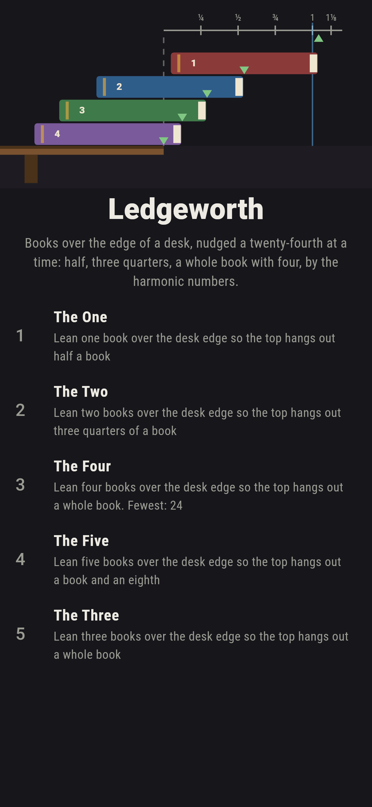
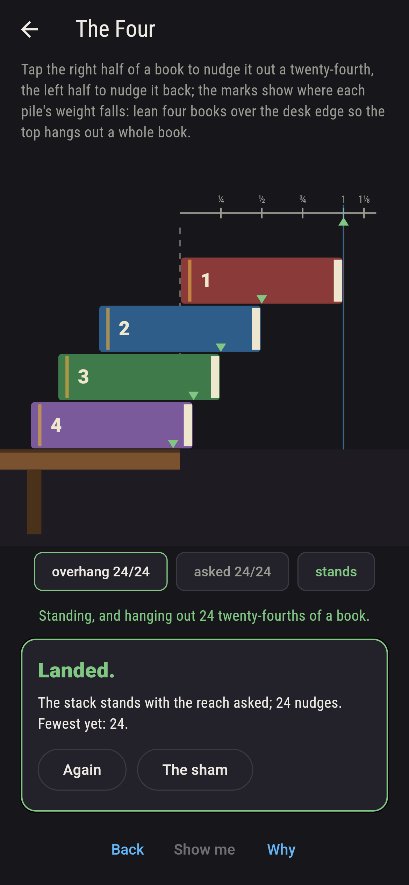
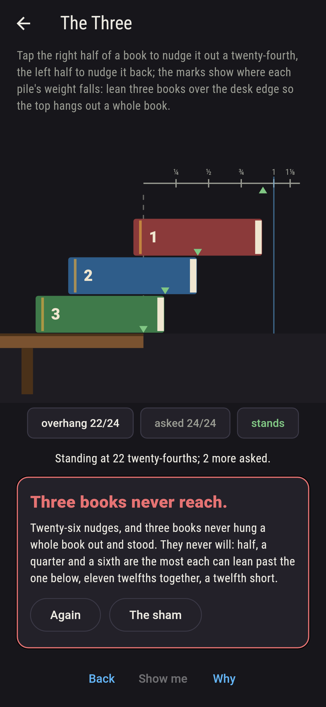
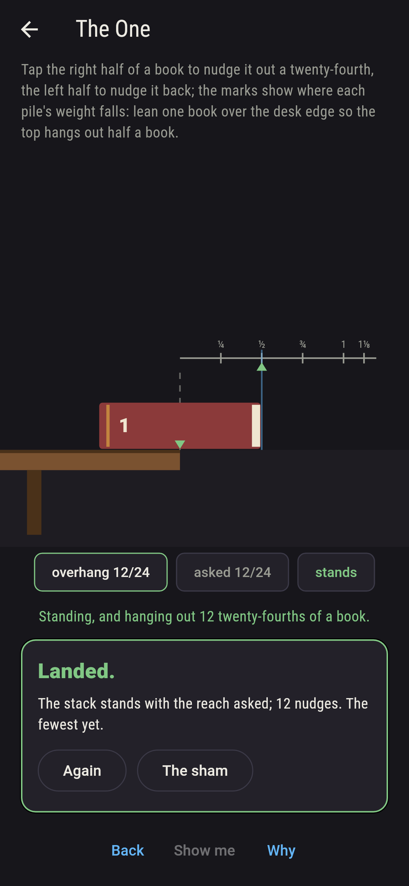
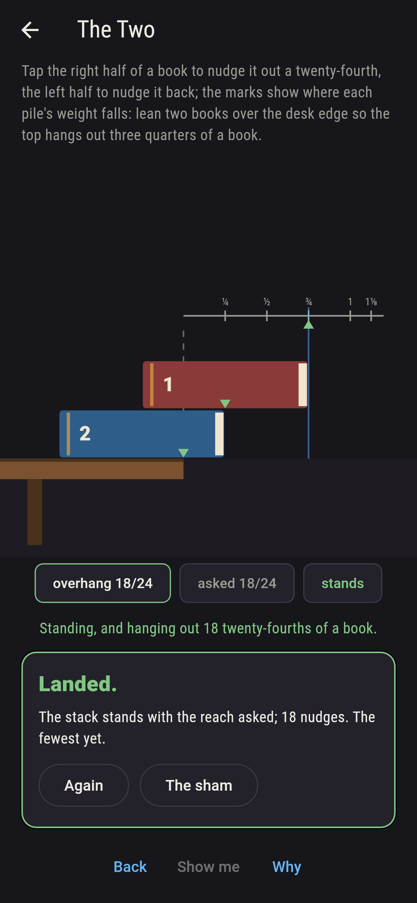
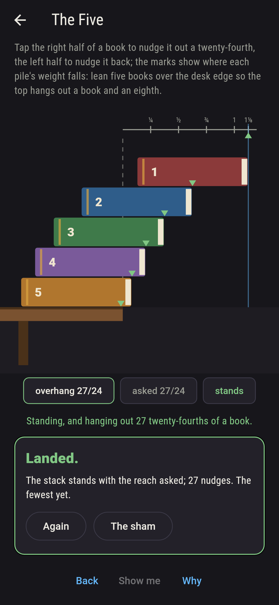
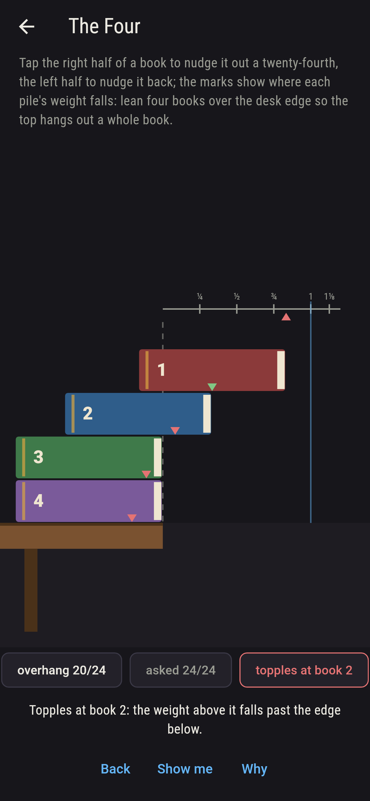
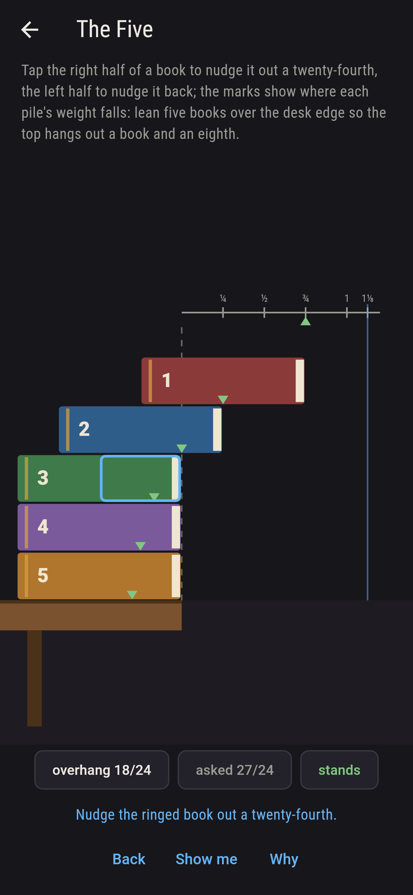
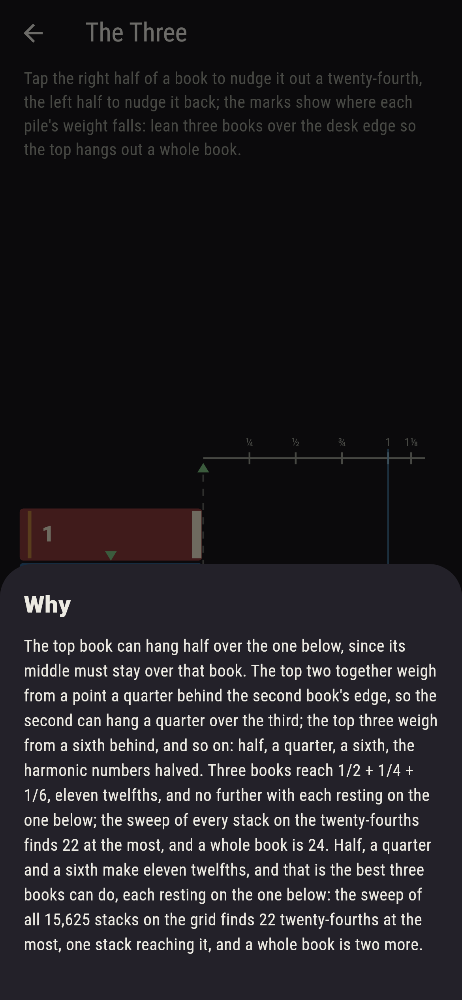

# Ledgeworth


Books stacked over the edge of a desk, each resting on the one
below and the lowest on the desk. Nudge any book out or back a
twenty-fourth of a book at a time; a pile stands while the weight
of the books above every level falls over the edge they rest on,
and the marks show where that weight falls. How far can the top
book hang out? Half a book with one, three quarters with two,
eleven twelfths with three, and with four a whole book and a
twenty-fourth past it: the harmonic numbers halved, 1/2 + 1/4 +
1/6 + 1/8, which is the best a stack can do with each book on the
one below. Every stack on the twenty-fourths is swept, one to
five books, nearly ten million of them, and the harmonic stack
reaches the sweep's best every time.

## The stacks

1. **The One** - lean one book over the desk edge so the top hangs out half a book
2. **The Two** - lean two books over the desk edge so the top hangs out three quarters of a book
3. **The Four** - lean four books over the desk edge so the top hangs out a whole book
4. **The Five** - lean five books over the desk edge so the top hangs out a book and an eighth
5. **The Three** - lean three books over the desk edge so the top hangs out a whole book

One book stands out to half exactly, and topples a twenty-fourth
past; two reach three quarters one way of 625; four reach a whole
book 16 ways of 390,625, and one of them a twenty-fourth past;
five reach a book and an eighth 4 ways of 9,765,625, and none
reach further on the grid. The Three is labeled hopeless on its
tile: half, a quarter and a sixth are eleven twelfths, and the
sweep of all 15,625 stacks finds 22 twenty-fourths at the most.

## Two voices

The game never asserts what it has not computed, and it computes
everything at least twice:

* **The sweep** takes every stack on the twenty-fourths, each book
  nought to a whole book past the one below, reads it for standing
  level by level with whole-number arithmetic, and counts those
  that reach; every count on the sham is that sweep's.
* **The harmonic stack** is worked out with no sweep: half, then a
  quarter, then a sixth, an eighth, a tenth, and its reach exactly
  as a fraction, 1/2, 3/4, 11/12, 25/24, 137/120 of a book for one
  to five. It stands, it reaches the sweep's best on the grid at
  every count of books, and every book of the harmonic five
  topples the stack at its own level when pushed one twenty-fourth
  further.

`tool/check_stacks.dart` runs the lot and refuses the bake on any
disagreement.

## The checker's ledger

What `dart run tool/check_stacks.dart` printed for the build this
README shipped with, word for word:

```
every stack of one to five books on the twenty-fourths swept, 25 and 625 and 15,625 and 390,625 and 9,765,625 of them, each read for standing level by level and for reach: the best standing stack hangs out 12, 18, 22, 25 and 27 twenty-fourths, which is the harmonic stack every time, half plus a quarter plus a sixth and on, rounded down to the grid, and the harmonic overhang exact is 1/2, 3/4, 11/12, 25/24, 137/120 of a book for one to five, so three books never reach a whole book and four do; and every book of the harmonic five topples the stack at its own level when pushed one twenty-fourth further

 1 The One   lean one book over the desk edge so the top hangs out half a book: 1 of the 25 stacks on the grid lands it
 2 The Two   lean two books over the desk edge so the top hangs out three quarters of a book: 1 of the 625 stacks on the grid lands it
 3 The Four  lean four books over the desk edge so the top hangs out a whole book: 16 of the 390,625 stacks on the grid land it
 4 The Five  lean five books over the desk edge so the top hangs out a book and an eighth: 4 of the 9,765,625 stacks on the grid land it
 5 The Three lean three books over the desk edge so the top hangs out a whole book: none of the 15,625, and eleven twelfths said so first
```

## Screenshots

| The sham | The four a whole book out | The three admitted |
| --- | --- | --- |
|  |  |  |

| The one | The two | The five | Mid-lean | Show me | The why |
| --- | --- | --- | --- | --- | --- |
|  |  |  |  |  |  |

Screenshots are drawn by `test/showcase_test.dart` at real phone
sizes with the app's own painter, then copied into `docs/` as they
came out; every book in them was nudged by taps, so nothing
pictured is a stack the game could not reach. The logo and every
launcher icon come out of `test/mark_test.dart` the same way: the
mark is the harmonic four, a whole book out and a twenty-fourth
past it.

## Building

```
flutter test          # 44 tests, the sweep among them
dart run tool/check_stacks.dart
flutter build apk     # or: flutter build ios
```
