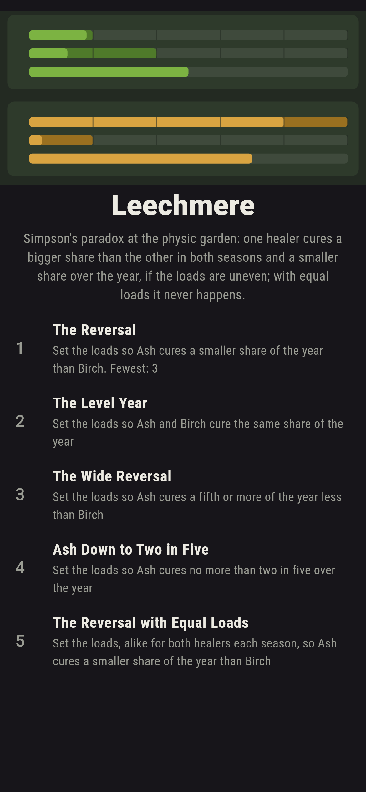
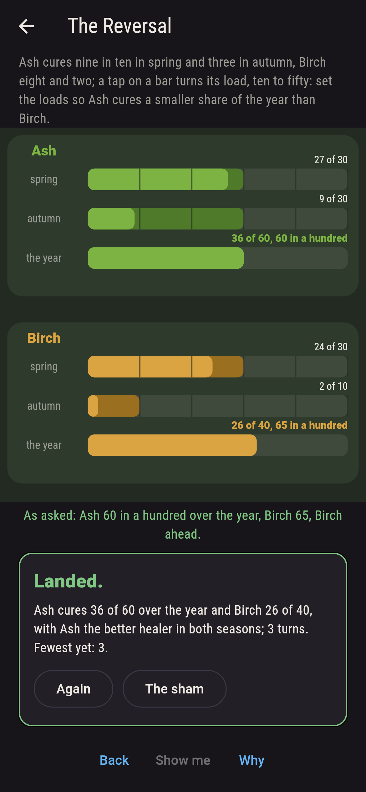
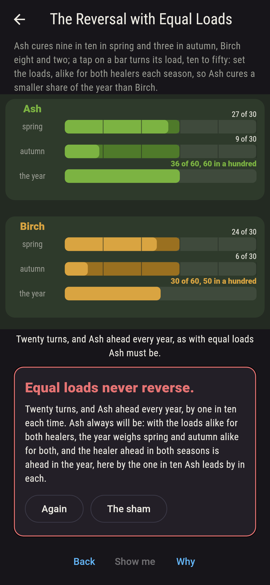
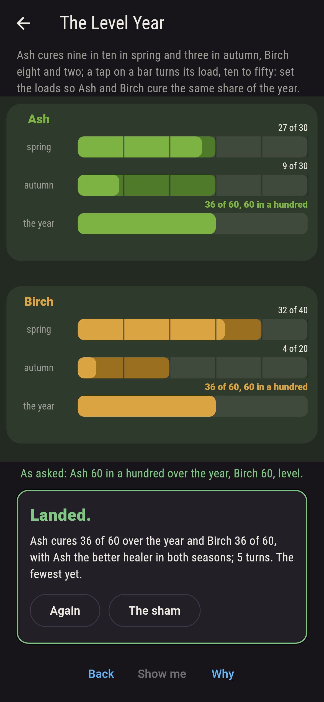
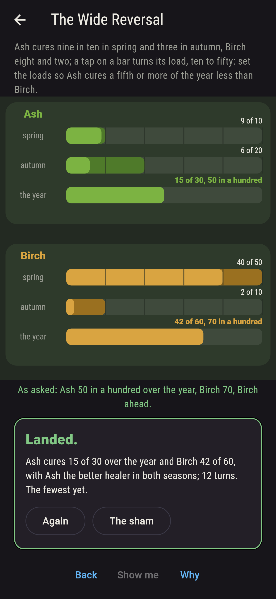
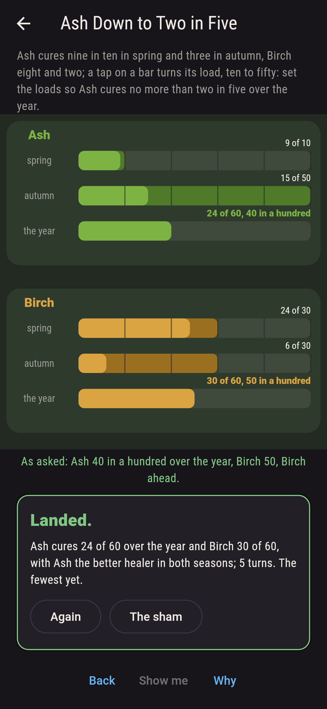
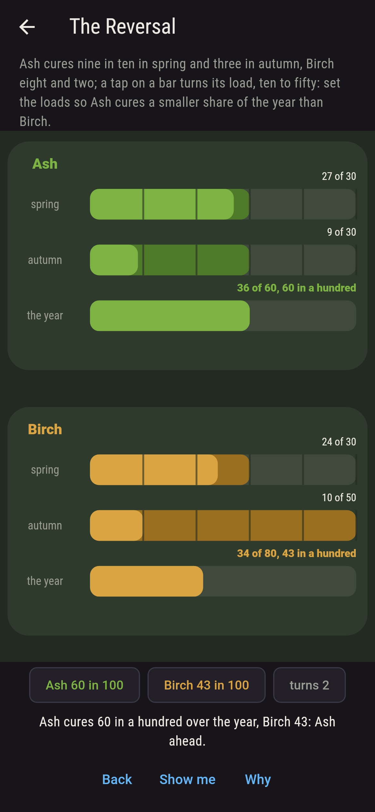
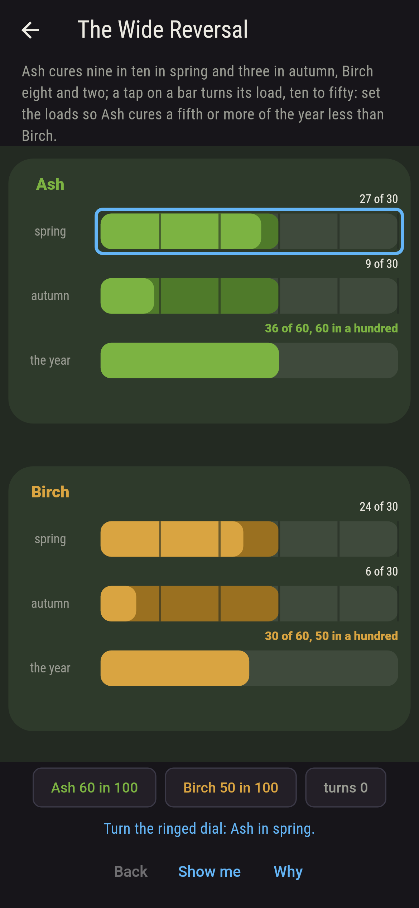
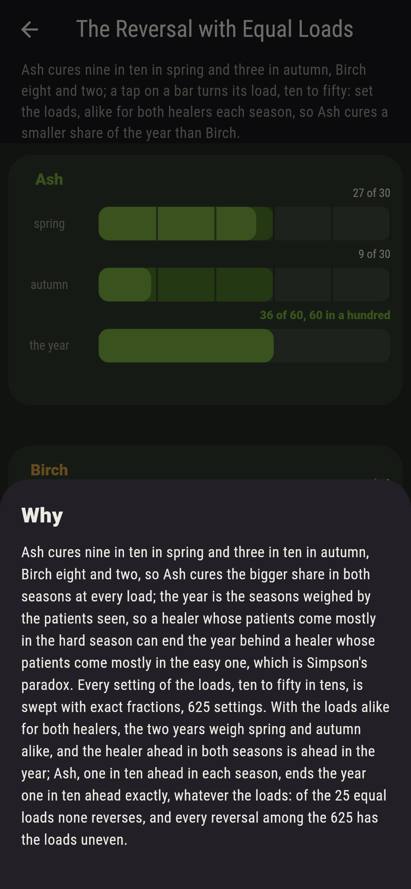

# Leechmere


Simpson's paradox at the physic garden. Two healers, Ash and Birch,
work two seasons, and each cures a fixed share of whoever comes:
Ash nine in ten in spring and three in ten in autumn, Birch eight
in ten and two in ten. Ash is the better healer in both seasons,
whatever the loads. Tap a season's bar to turn how many patients
that healer sees, ten to fifty in tens, and the year adds the two
seasons up, cured over seen. Set the loads so Ash cures the smaller
share of the year, and it can be done, 154 ways of the 625: the
year is the seasons weighed by the patients seen, so Ash seeing
most of them in autumn and Birch most in spring puts Ash behind
over the year while ahead in each half of it. With the loads alike
for both healers it never happens; Ash ends the year one in ten
ahead exactly, every time. Every setting is swept with exact
fractions.

## The asks

1. **The Reversal** - set the loads so Ash cures a smaller share of the year than Birch
2. **The Level Year** - set the loads so Ash and Birch cure the same share of the year
3. **The Wide Reversal** - set the loads so Ash cures a fifth or more of the year less than Birch
4. **Ash Down to Two in Five** - set the loads so Ash cures no more than two in five over the year
5. **The Reversal with Equal Loads** - set the loads, alike for both healers each season, so Ash cures a smaller share of the year than Birch

The reversal comes 154 ways of 625, the first with Ash seeing ten
and ten and Birch thirty and ten, twelve of twenty against
twenty-six of forty; three turns of Birch's autumn dial from the
start do it, Birch at thirty and ten against Ash at thirty and
thirty, sixty in a hundred to sixty-five. The two years come level
24 ways, Ash falls a fifth or more behind 17 ways, and Ash's year
sinks to two in five, and no lower, at ten in spring and fifty in
autumn, whatever Birch sees. On the fifth ask a tap turns both
healers' dials of that season together, and it is labeled hopeless
on its tile: the why is that with the same weights on the two
seasons, the healer ahead in both is ahead in the year.

## Two voices

The game never asserts what it has not computed, and it computes
everything at least twice:

* **The sweep** sets the four loads every way, ten to fifty in
  tens, 625 settings, works each healer's year as an exact
  fraction, cured over seen, and compares the two by
  cross-multiplying; every number on the sham is that sweep's,
  and it holds Ash ahead in both seasons at every load and finds
  the loads uneven in every one of the 154 reversals.
* **The weighing** takes the 25 settings with the loads alike and
  checks, as fractions, that Ash's year is Birch's plus one in ten
  exactly in every one, which is what one more cured in ten in each
  season comes to when the two years weigh the seasons alike; so
  the fifth ask never lands, and the sweep agrees.

`tool/check_loads.dart` runs the lot and refuses the bake on any
disagreement.

## The checker's ledger

What `dart run tool/check_loads.dart` printed for the build this
README shipped with, word for word:

```
every setting of the four loads swept with exact fractions, ten to fifty patients a healer a season in tens, 625 settings: Ash cures the bigger share in spring, nine in ten to eight, and in autumn, three in ten to two, at every load, and still cures the smaller share of the year in 154 settings, every one of them with the loads uneven, since the year is the seasons weighed by the patients seen; with the loads alike for both healers, 25 settings, Ash is ahead in the year every time, by one in ten exactly; the two years come level in 24 settings, Ash falls a fifth or more behind in 17, and down to two in five in 25; the reversal comes 154 ways of 625, the level year 24, the wide reversal 17, Ash down to two in five 25, and the reversal with equal loads never

 1 The Reversal                  set the loads so Ash cures a smaller share of the year than Birch: 154 of the 625 settings land it
 2 The Level Year                set the loads so Ash and Birch cure the same share of the year: 24 of the 625 settings land it
 3 The Wide Reversal             set the loads so Ash cures a fifth or more of the year less than Birch: 17 of the 625 settings land it
 4 Ash Down to Two in Five       set the loads so Ash cures no more than two in five over the year: 25 of the 625 settings land it
 5 The Reversal with Equal Loads set the loads, alike for both healers each season, so Ash cures a smaller share of the year than Birch: none of the 25, and the weighing said so first
```

## Screenshots

| The sham | The reversal | Equal loads admitted |
| --- | --- | --- |
|  |  |  |

| The level year | The wide reversal | Ash down to two in five | Mid-setting | Show me | The why |
| --- | --- | --- | --- | --- | --- |
|  |  |  |  |  |  |

Screenshots are drawn by `test/showcase_test.dart` at real phone
sizes with the app's own painter, then copied into `docs/` as they
came out; every dial in them was turned by a tap, so nothing
pictured is a year the game could not reach. The logo and every
launcher icon come out of `test/mark_test.dart` the same way: the
mark is the wide reversal, Ash at ten and twenty in green and Birch
at fifty and ten in ochre, half the year against seven in ten.

## Building

```
flutter test          # 53 tests, the sweep among them
dart run tool/check_loads.dart
flutter build apk     # or: flutter build ios
```
