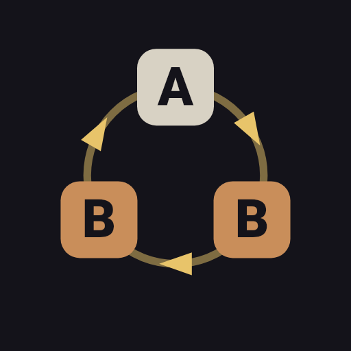
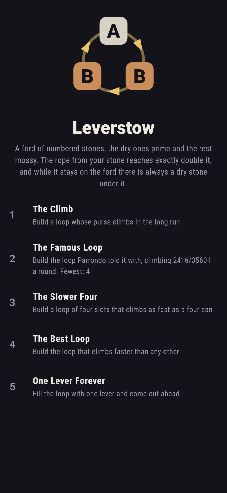
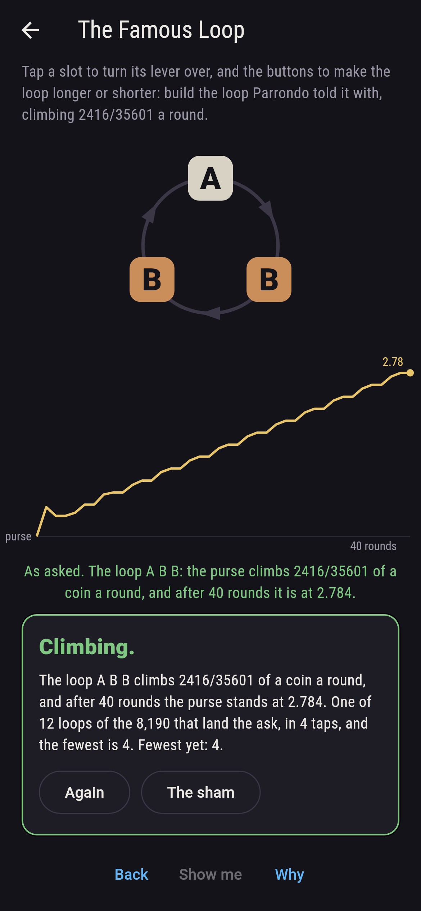
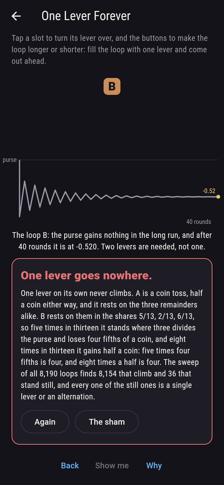
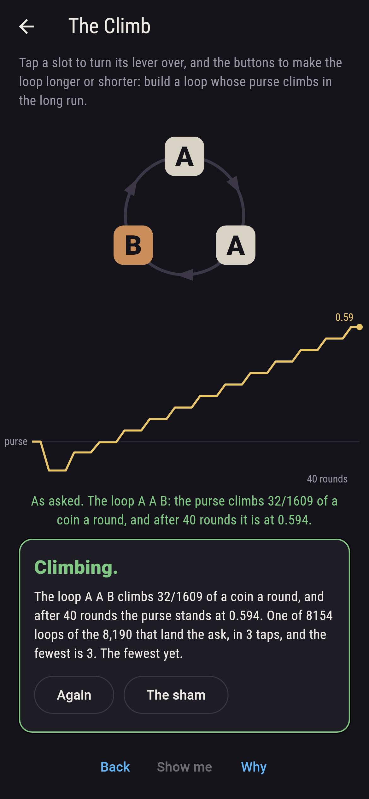
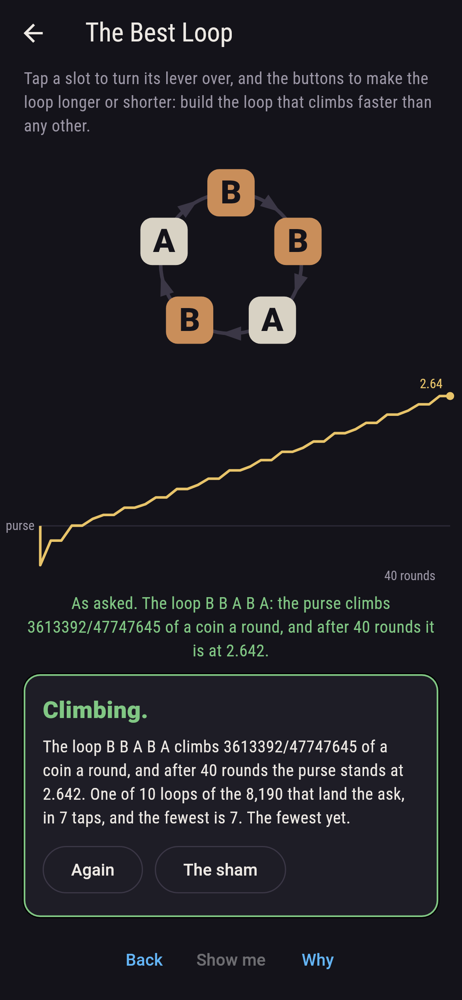
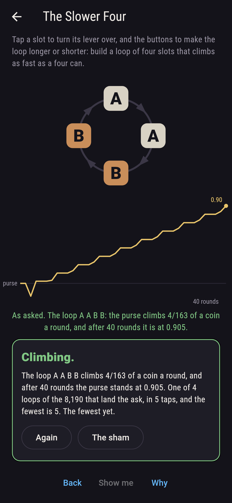
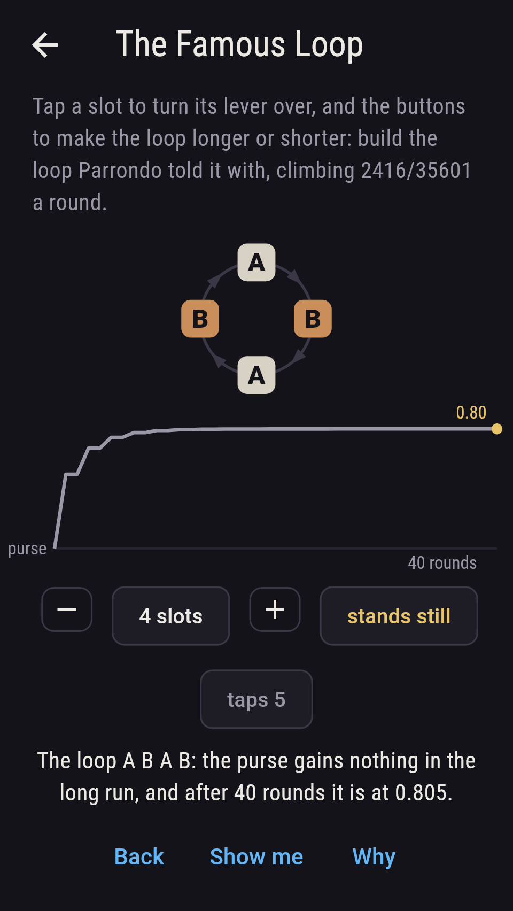
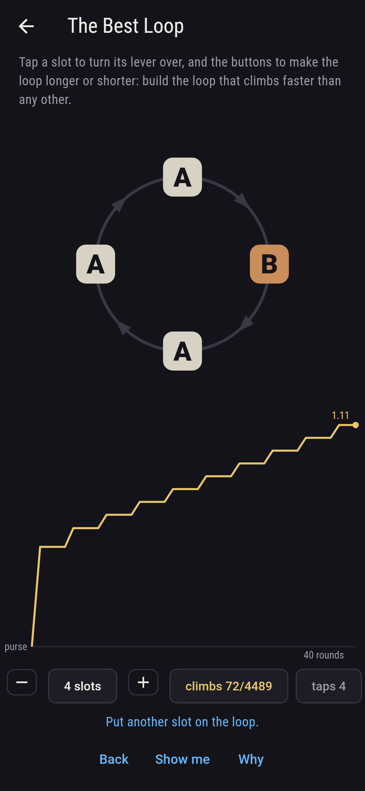
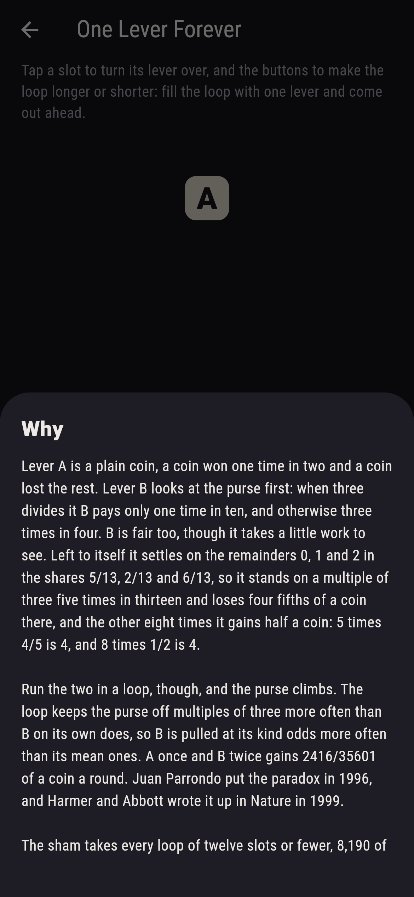

# Leverstow



A fairground machine with two levers and a purse that starts empty.
Lever A is a plain coin: a coin won one time in two, a coin lost the
rest. Lever B looks in the purse first. When three divides the purse
it pays only one time in ten; otherwise it pays three times in four.
Both levers are fair on their own, A because the coin is, and B
because of where the purse settles: left to itself B stands on the
remainders 0, 1 and 2 in the shares 5/13, 2/13 and 6/13, so five times
in thirteen it loses four fifths of a coin and eight times in thirteen
it gains half a coin, and five times four fifths is four as eight
times a half is. Yet run the two in a loop and the purse climbs. That
is Parrondo's paradox, put by Juan Parrondo in 1996 and written up by
Harmer and Abbott in Nature in 1999. Build a loop of up to twelve
slots, turn each slot to A or B, and watch the purse. The game takes
every loop there is, 8,190 of them, and solves each one's climb twice.

## The asks

1. **The Climb** - build a loop whose purse climbs in the long run
2. **The Famous Loop** - build the loop Parrondo told it with, climbing 2416/35601 a round
3. **The Slower Four** - build a loop of four slots that climbs as fast as a four can
4. **The Best Loop** - build the loop that climbs faster than any other
5. **One Lever Forever** - fill the loop with one lever and come out ahead

Of the 8,190 loops, 8,154 climb, 36 stand still and not one sinks. The
still ones are exactly the 24 loops of a single lever and the 12 that
alternate, ABAB and BABA, which is the first pattern most people try.
A once and B twice is the loop Parrondo told it with: it gains
2416/35601 of a coin a round, near enough a fifteenth, and twelve
loops climb at that rate, ABB, BAB and BBA and each of them written
out twice, three times and four. The fastest of all is
3613392/47747645, a coin every thirteen rounds or so, from the five
turnings of BBABA and those same five written out twice. A longer loop
is not a better one: the best a loop of four can do is 4/163, well
short of the best three. One Lever Forever is washed in red on the
board rather than gold, and the reason is countable on fingers: A is a
coin toss, and B on its own cancels itself, five times four fifths
against eight times a half. The sham admits it once both levers have
been run alone, or after twelve taps.

## Two voices

Every number the game says out loud is one it worked out, and each
loop's climb is worked out two ways:

* **The fold** takes the whole loop as one step. It works out where a
  purse starting on each of the three remainders ends up after a turn
  of the loop, and what it wins on the way, then solves the three
  shares that stay put under that step and weighs the winnings by
  them.
* **The long chain** never folds anything. It lays out one state for
  every remainder in every slot of the loop, up to thirty-six of them,
  writes down the whole step matrix and solves it the same way. It
  agrees with the fold on every loop of six slots or fewer, which is
  as far as the long chain is small enough to solve for all of them.

The purse itself is a third reckoning. It is carried as an exact
spread of purses rather than an average, and for short runs the
checker walks every run of wins and losses there is, two to the
rounds of them, and weighs each by how often it happens. After four
rounds of ABB both give 7/20 of a coin. Every odds in the game is a
twentieth, so every purse and every climb is an exact fraction, and
nothing becomes a decimal until the graph is drawn.

`tool/check_loops.dart` runs the lot and refuses the bake on any
disagreement.

## The checker's ledger

What `dart run tool/check_loops.dart` printed for the build this README
shipped with, word for word:

```
every loop of twelve slots or fewer taken, 8,190 of them, and each one's climb solved twice, once folded onto the three remainders three leaves of the purse and once on the long chain of remainder and slot, the two agreeing on every loop of six slots or fewer, which is where the long chain is still small enough to solve: both levers are fair on their own, A because the coin is and B because it rests on the remainders in the shares 5/13, 2/13, 6/13, so five times four fifths is four as eight times a half is; and yet 8,154 of the 8,190 loops climb, 36 stand still and none sinks, the still ones being exactly the 24 loops of a single lever and the 12 that alternate; the loop Parrondo told it with, A once and B twice, climbs 2416/35601 of a coin a round, 12 loops climb at that rate, and the best of all is 3613392/47747645 from 10 loops, the turnings of BBABA and those written out twice; the best a loop of four can do is 4/163, slower than the best three, so the best climb per slot does not grow with the loop: 0 at 1, 0 at 2, 2416/35601 at 3, 4/163 at 4, 3613392/47747645 at 5, 2416/35601 at 6; the purse itself is carried as a spread of purses rather than an average, and after four rounds of ABB it stands at 7/20 of a coin, which walking all sixteen runs of wins and losses gives too

 1 The Climb         build a loop whose purse climbs in the long run: 8,154 of the 8,190 loops land it, the fewest 3 taps from the opening
 2 The Famous Loop   build the loop Parrondo told it with, climbing 2416/35601 a round: 12 of the 8,190 loops land it, the fewest 4 taps from the opening
 3 The Slower Four   build a loop of four slots that climbs as fast as a four can: 4 of the 8,190 loops land it, the fewest 5 taps from the opening
 4 The Best Loop     build the loop that climbs faster than any other: 10 of the 8,190 loops land it, the fewest 7 taps from the opening
 5 One Lever Forever fill the loop with one lever and come out ahead: none of the 8,190, and the two levers say so on a finger
```

## Screenshots

| The sham | The famous loop | One lever forever |
| --- | --- | --- |
|  |  |  |

| The climb | The best loop | The slower four | The flat alternation, on the small phone | Show me | The why |
| --- | --- | --- | --- | --- | --- |
|  |  |  |  |  |  |

Screenshots are drawn by `test/showcase_test.dart` at real phone sizes
with the app's own painter, then copied into `docs/` as they came out;
every lever turned in them was turned by a tap on its slot and every
slot added by the button, so no loop pictured is one the game could not
build. The logo and every launcher icon come out of
`test/mark_test.dart`, drawn by the same painter: the mark is the
famous loop, A once and B twice.

## Building

```
flutter test          # 42 tests, the sweep among them
dart run tool/check_loops.dart
flutter build apk     # or: flutter build ios
```
