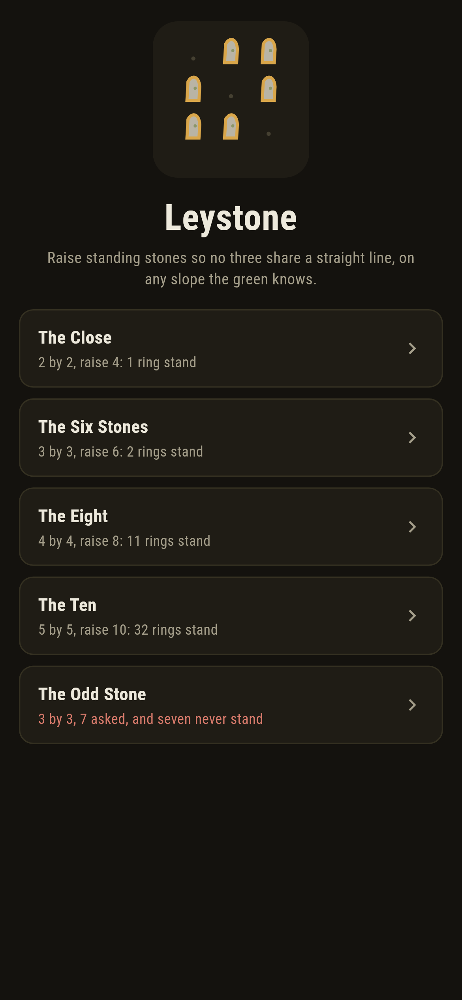
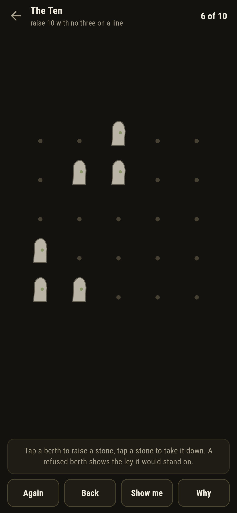
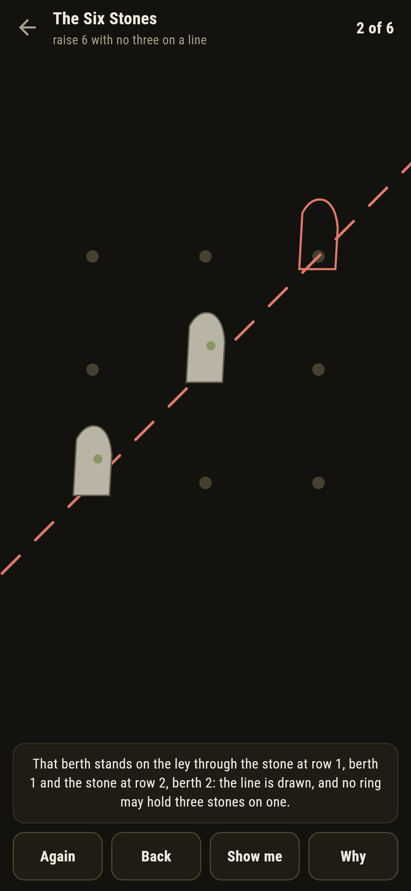
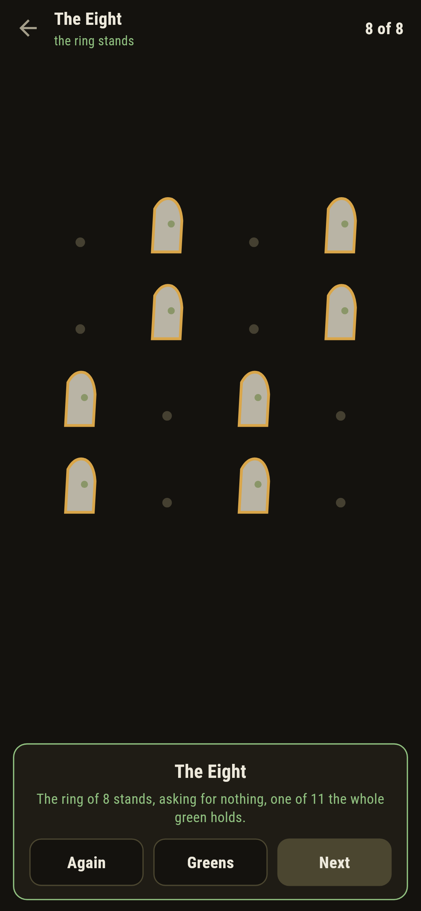
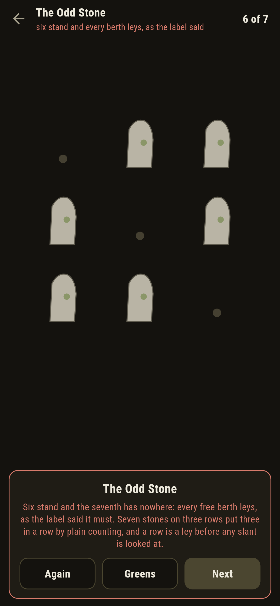
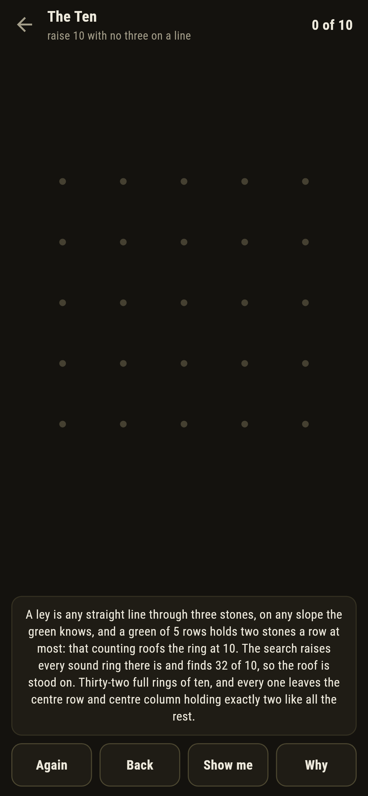

# Leystone

A placement puzzle for phones, in Flutter, for Android and iOS.

A green of berths on the moor, and standing stones to raise. Three
stones ley when one straight line passes through all three, on any
slope the green knows: rows, columns, diagonals, and every long
slant between. Raise the full ring the mason asks with no three on
a ley. This is the no-three-in-line problem raised in stone, and a
berth that would break the rule is refused with the line itself
drawn across the green.

| | | | |
|---|---|---|---|
|  |  |  |  |

## Two ways of knowing

The suite knows every green two ways that share nothing. The search
raises every sound ring there is and keeps the fullest; plain
counting never raises a stone: a green of n rows holds at most two
stones a row, so 2n is the roof, and the stone past it must put
three in some row, which is a ley before any slant is even looked
at. Every written count below is the search's own, and the maxima
and ways match an enumeration written separately in Python.

```
$ make greens
no three stones share a line, on any slope the green knows; a green of n rows holds two stones a row at most, so the stone past 2n must ley, and the search of every ring agrees with the counting

 1 The Close      2 by 2  4 of 4 berths stand, 1 ring
 2 The Six Stones 3 by 3  6 of 9 berths stand, 2 rings
 3 The Eight      4 by 4  8 of 16 berths stand, 11 rings
 4 The Ten        5 by 5  10 of 25 berths stand, 32 rings
 5 The Odd Stone  3 by 3  7 asked of 9: some row must hold three, and a row is a ley
```

## The odd stone

One green ships labelled hopeless in the house tradition of maps
nobody can win: seven stones asked of a three-by-three green. Seven
on three rows put three in some row by counting, and a row is a
straight line; the search says the same from the other side, trying
every laying-out of seven berths, all thirty-six, and finding a ley
in each. The game lets you raise the six that do stand, watches
every last berth refuse, and then writes the futility down rather
than let anyone grind at it.



## The line that draws itself

Nothing about the leys is folklore here. A refused berth names the
two stones it would stand between and draws their line clear across
the green, dashed red from edge to edge. **Show me** points the
next stone of a full ring the search raised, a pair of stones that
strands the ring is called out the moment it stands, and **Why**
counts the rings and speaks the row-counting for the green in front
of you.



## Building

```
make deps      # fetch packages
make check     # analyze + every test
make greens    # raise every ring and prove the counting
make shots     # render the screenshots and redraw the icons
make apk       # Android release build
make ios       # iOS release build (unsigned)
```

The logo and every app icon are drawn by the game's own painter in
`test/mark_test.dart`. There is no image in this repository that was not
produced by code in it.

## How it is put together

```
lib/ley/rules.dart       the ley test, the search over every ring,
                         the counting that bars the odd stone
lib/ley/green.dart       a green: its width and its asking
lib/ley/greens.dart      the five greens that ship
lib/ley/play.dart        a ring being raised: stones up and down,
                         take-back
lib/ui/                  the painter, the screens, the mark
tool/check_greens.dart   the searches and the ledger above
```

The tests try leys on every slope by hand, count the fullest rings
and the ways on every green, watch the two six-rings each spare a
whole diagonal, prove the odd stone barred by counting and by the
search of all thirty-six layings, raise every winnable ring by
following the game's own pointer, watch a stranding pair get called
out and a refused berth draw its ley, and hold the pictures against
the real widget tree. If any of that drifts, `make check` goes red
before anything leaves the machine.
