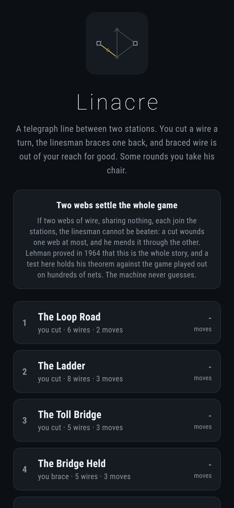
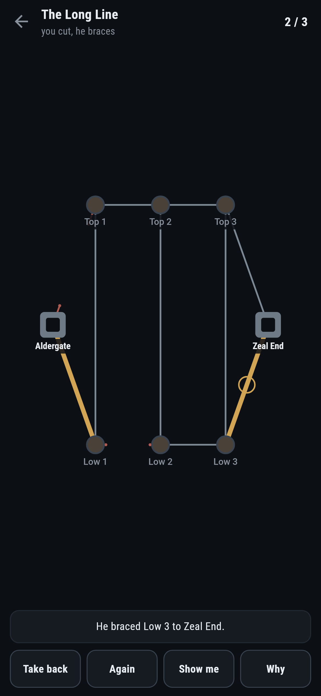
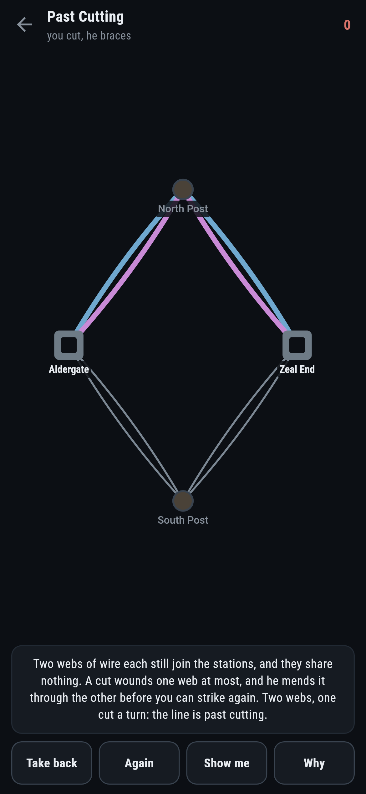
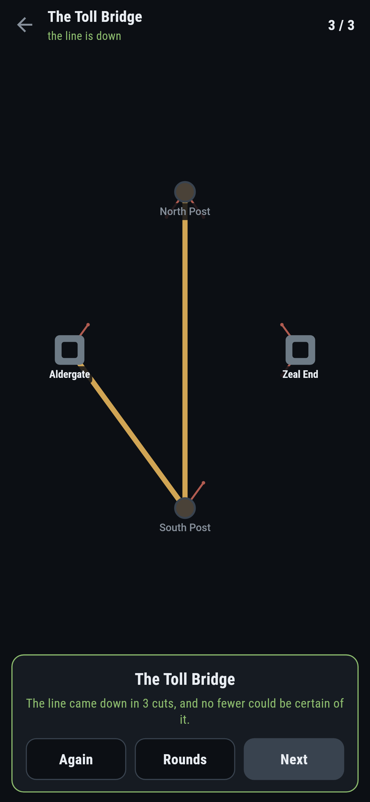
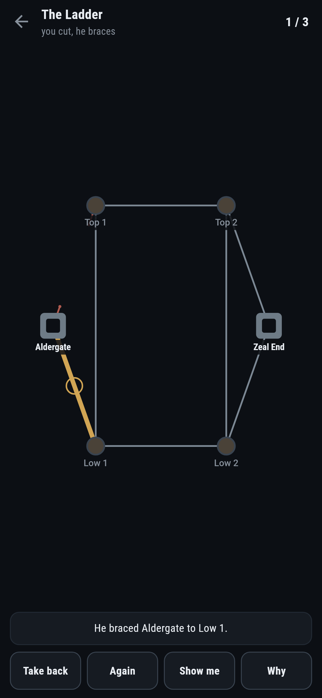

# Linacre

A wire cutting game for phones, in Flutter, for Android and iOS.

A telegraph line runs between two stations. You cut a wire a turn and the
linesman braces one back, and braced wire is out of your reach for good. You
win when nothing joins the stations; he wins when braced wire alone does. On
some rounds you take his chair and he takes the shears.

| | | | |
|---|---|---|---|
|  |  |  |  |

## Two webs settle the whole game

If two webs of wire, sharing nothing, each join the stations, the linesman
cannot be beaten even moving second. A cut wounds one web at most, and he
braces a wire of the other web that mends the wound. Two webs, one cut a turn:
both are never wounded at once.

Lehman proved in 1964 that this is the whole story: the linesman moving second
holds exactly when such a pair of webs exists, over some of the posts and not
always all of them. That last part matters and is easy to get wrong. A net can
have a spare post off to the side that no pair of webs could reach, and the
linesman wins through the posts that count. The first version here checked the
whole net and the anchor test caught it within a minute of being written.

The anchor test is the game played against the theorem: on two hundred nets
made up at random, a search that knows nothing about webs settles who wins,
and a web hunt that knows nothing about turns looks for the pair. They agree
every time, and the pair the hunt returns is checked to be real, no shared
wire and both joining the stations.

```
$ make rounds
 1 The Loop Road      5 posts  6 wires  player cuts    wins in 2  written down 2  two webs no
 2 The Ladder         6 posts  8 wires  player cuts    wins in 3  written down 3  two webs no
 3 The Toll Bridge    4 posts  5 wires  player cuts    wins in 3  written down 3  two webs no
 4 The Bridge Held    4 posts  5 wires  player braces  wins in 3  written down 3  two webs no
 5 The Long Line      8 posts 11 wires  player cuts    wins in 3  written down 3  two webs no
 6 The Doubled Line   4 posts  8 wires  player braces  wins in 2  written down 2  two webs yes
 7 Past Cutting       4 posts  8 wires  player cuts    cannot win  written down no number  two webs yes
```

## The machine never guesses

Every round is settled before it opens: a position is nothing but which wires
are cut, which are braced, and whose turn it is, so the search holds all of
them. The machine plays from that table, hurrying when it is winning and
dragging when it is not, so a par is a promise and a mistake is punished the
way a mistake should be.

One round is labelled on its list entry as impossible: the doubled line, you
cutting. It ships to be felt, the way Warrenshaw ships a map nobody can win.
**Why** draws the two webs in two colours, and the same net appears once more
with the chairs swapped, where holding those webs makes you the one past
beating.

The toll bridge appears from both chairs too, because whoever moves first on
that net wins it. The bridge wire is worth exactly the first move.

## What the game says



Every answer is spoken: which wire he braced, or which he cut. The moment your
move costs more than the round takes, the game says so, because the search
knows the value of every position, not only the first. **Why** shows the live
webs whenever they exist over what is left of the net, with the braced wire
shrunk away, so the reason updates as the game moves.

## Running it

```
make deps    # flutter pub get
make test    # everything
make analyze
make shots   # render the screens into build/showcase, redraw the logo and icons
make rounds  # who wins each round, in how many, and whether webs settle it
make apk     # release APK
make ios     # release iOS build, unsigned
```

## Tests

`flutter test` runs the net (joined by braced wire, cut apart, shrunk with the
braces merged away), the search on nets small enough to read (one wire, twin
wires), Lehman's theorem against the game on two hundred random nets, the webs
being real, every round that ships, and a round against the machine: the
answer spoken, a wire spoken for refused, a slower wire called out, take back,
the search winning every winnable round at par, the machine never losing the
hopeless round however it is played, and the live webs appearing exactly when
they settle the rest.

Then the game through the screen, ending with every winnable round won at par
by tapping wires against a machine playing as well as the game can be played.

Screenshots come from `test/showcase_test.dart`, and every cut and brace in
them was played for real. `test/mark_test.dart` draws the logo, the launcher
icons at every density Android asks for and every size the iOS icon set asks
for; there is no image in this repository that was not produced by it.
