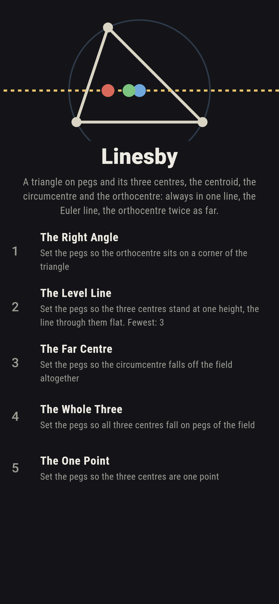
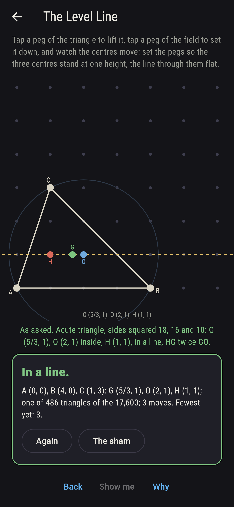
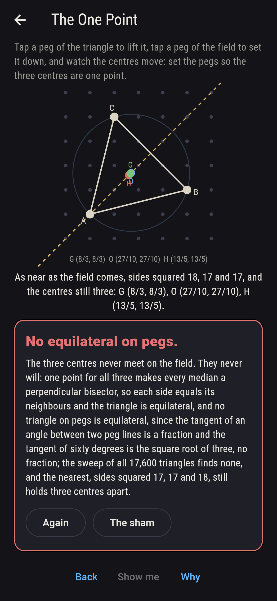
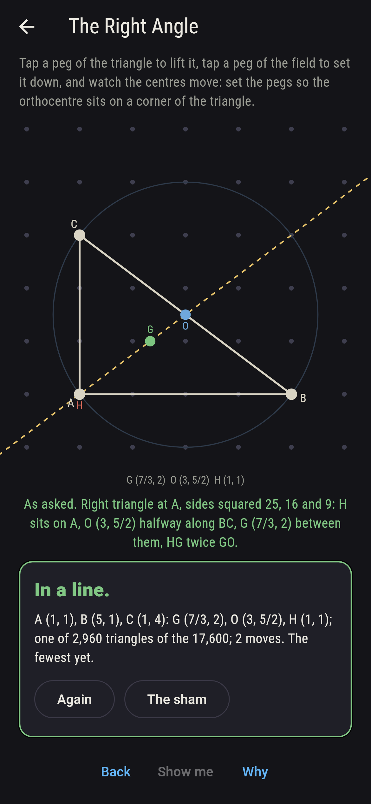
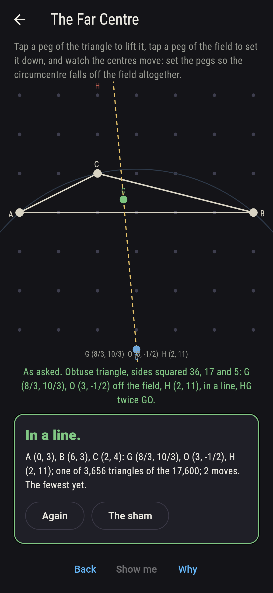
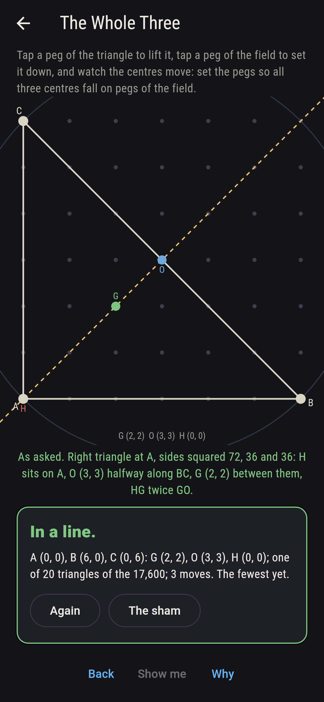
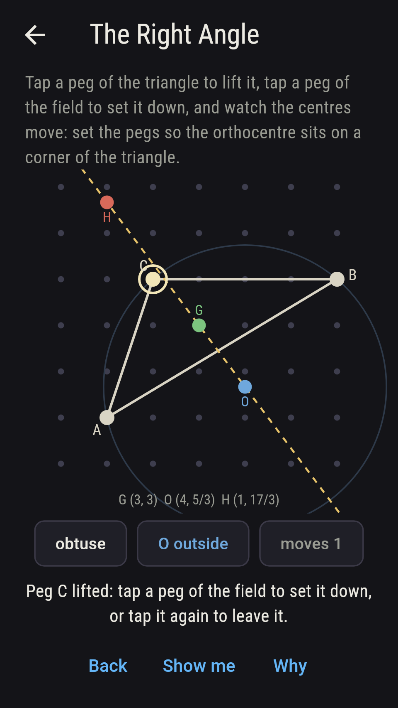
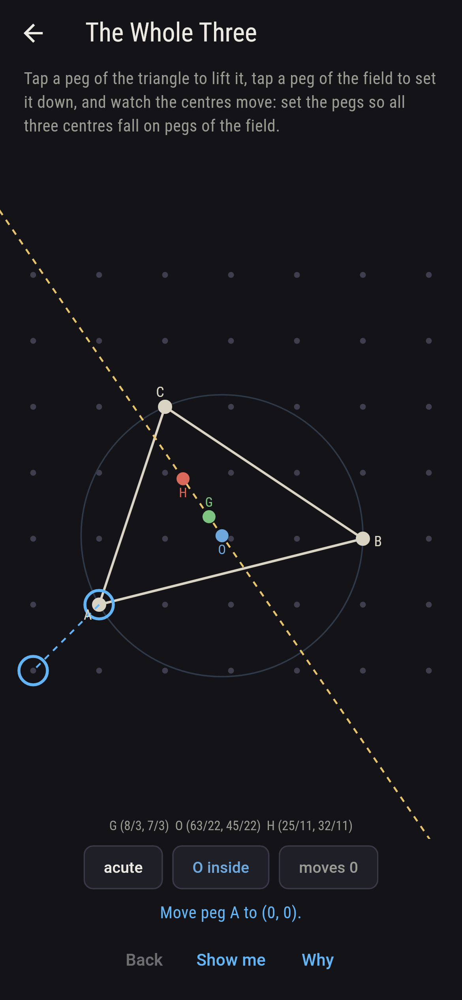
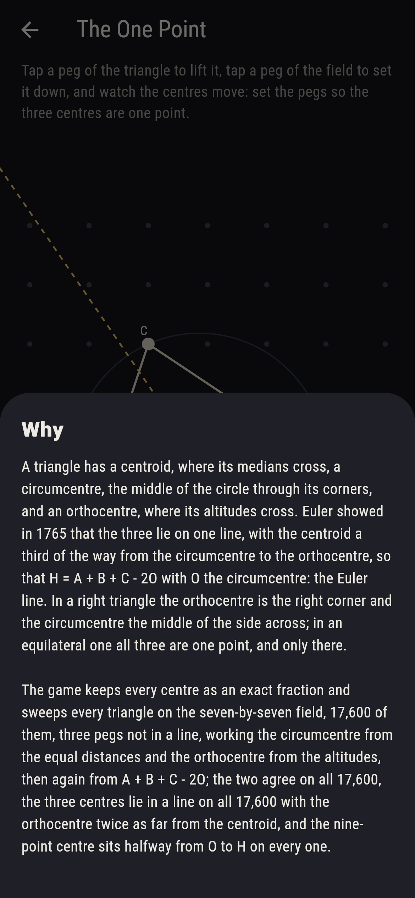

# Linesby


A triangle has a centroid, where its medians cross, a circumcentre,
the middle of the circle through its corners, and an orthocentre,
where its altitudes cross. Euler showed in 1765 that the three lie
on one line, the centroid a third of the way from the circumcentre
to the orthocentre, so that H = A + B + C - 2O with O the
circumcentre: the Euler line. In a right triangle the orthocentre is
the right corner and the circumcentre the middle of the side across;
in an equilateral one all three are one point, and only there. Tap
a peg of the triangle to lift it, tap a peg of the field to set it
down, and watch the three centres slide along their line. The game
keeps every centre as an exact fraction and sweeps every triangle on
the seven-by-seven field, 17,600 of them, three pegs not in a line,
working the circumcentre from the equal distances and the
orthocentre from the altitudes and then again from A + B + C - 2O;
the two agree on all 17,600, the centres lie in a line on all 17,600
with the orthocentre twice as far from the centroid, and the
nine-point centre sits halfway from O to H on every one.

## The asks

1. **The Right Angle** - set the pegs so the orthocentre sits on a corner of the triangle
2. **The Level Line** - set the pegs so the three centres stand at one height, the line through them flat
3. **The Far Centre** - set the pegs so the circumcentre falls off the field altogether
4. **The Whole Three** - set the pegs so all three centres fall on pegs of the field
5. **The One Point** - set the pegs so the three centres are one point

Of the 17,600 triangles, 2,960 have a right angle, and in every one
the orthocentre sits on the corner where it stands and the
circumcentre halfway along the side across, so the Euler line is the
median from that corner; the three-peg corner (0, 0), (1, 0), (0, 1)
is the first, G (1/3, 1/3), O (1/2, 1/2), H (0, 0). 486 triangles
hold their centres at one height, 378 of them isosceles with a flat
axis and 134 right-angled, (0, 0), (4, 0), (1, 3) the first with G
(5/3, 1), O (2, 1), H (1, 1). The circumcentre falls off the field
for 3,656, every one obtuse, (0, 0), (1, 0), (4, 1) the first with
its centre just off the top at (1/2, 13/2), and (0, 0), (1, 1), (6,
5) sends it farthest, to (51/2, -49/2), with the orthocentre flung to
(-44, 55). Twenty triangles set all three centres on pegs, every one
right-angled, (0, 0), (6, 0), (3, 3) the first. The One Point is
labeled hopeless on its tile: one point for all three centres makes
every median a perpendicular bisector, so the triangle is
equilateral, and none stands on pegs, since the tangent of an angle
between two peg lines is a fraction while the tangent of sixty
degrees is the square root of three, which is none; the sham admits
it at the nearest the field comes, sides squared 17, 17 and 18,
forty-four triangles such as (0, 0), (4, 1), (1, 4), or after twelve
moves.

## Two voices

The game never asserts what it has not computed, and it computes
everything at least twice:

* **The construction** works each centre from its own definition, as
  exact fractions: the centroid as the mean of the corners, the
  circumcentre from the two equations of equal distance to the
  corners, the orthocentre from two altitudes; every count on the
  sham is the sweep of these over all 17,600 triangles, and on each
  the circumcentre is checked as far from all three corners and the
  orthocentre square to all three sides.
* **The line** is Euler's own identity, H = A + B + C - 2O, worked
  from the circumcentre alone and set against the orthocentre the
  altitudes gave, on every triangle; and on every triangle the three
  centres are checked in a line with HG twice GO, the nine-point
  centre halfway from O to H checked as far from the three midpoints,
  and the circumcentre found inside the acute triangles, on the edge
  of the right ones and outside the obtuse, 3,880, 2,960 and 10,760.

`tool/check_lines.dart` runs the lot and refuses the bake on any
disagreement.

## The checker's ledger

What `dart run tool/check_lines.dart` printed for the build this
README shipped with, word for word:

```
every triangle of the seven-by-seven field swept, 17,600 of them, three pegs not in a line, with the 824 lines of three set aside; on every one the centroid, the circumcentre from the equal distances and the orthocentre from the altitudes were worked as exact fractions, and the orthocentre came out again as A + B + C less twice the circumcentre, the three centres lay in a line with the orthocentre twice as far from the centroid as the circumcentre, and the nine-point centre halfway from O to H stood as far from the three midpoints; 2,960 triangles are right-angled with the orthocentre on the corner and the circumcentre halfway along the side across, 10,760 obtuse with the circumcentre outside and 3,880 acute with it inside; the centroid lands on a peg for 1,716, the circumcentre for 2,428 and the orthocentre for 9,876; no triangle is equilateral, and the nearest, sides squared 17, 17 and 18, comes 44 times, its centres still apart

 1 The Right Angle set the pegs so the orthocentre sits on a corner of the triangle: 2,960 of the 17,600 triangles land it
 2 The Level Line  set the pegs so the three centres stand at one height, the line through them flat: 486 of the 17,600 triangles land it
 3 The Far Centre  set the pegs so the circumcentre falls off the field altogether: 3,656 of the 17,600 triangles land it
 4 The Whole Three set the pegs so all three centres fall on pegs of the field: 20 of the 17,600 triangles land it
 5 The One Point   set the pegs so the three centres are one point: none of the 17,600, and the tangent of sixty degrees said so first
```

## Screenshots

| The sham | The level line | The one point admitted |
| --- | --- | --- |
|  |  |  |

| The right angle | The far centre | The whole three | Midway, on the small phone | Show me | The why |
| --- | --- | --- | --- | --- | --- |
|  |  |  |  |  |  |

Screenshots are drawn by `test/showcase_test.dart` at real phone
sizes with the app's own painter, then copied into `docs/` as they
came out; every triangle in them was set by taps on the field, so
nothing pictured is a triangle the game could not reach. The logo
and every launcher icon come out of `test/mark_test.dart` the same
way: the mark is the triangle (0, 0), (4, 0), (1, 3) with its three
centres in a flat line through it.

## Building

```
flutter test          # 45 tests, the sweep among them
dart run tool/check_lines.dart
flutter build apk     # or: flutter build ios
```
