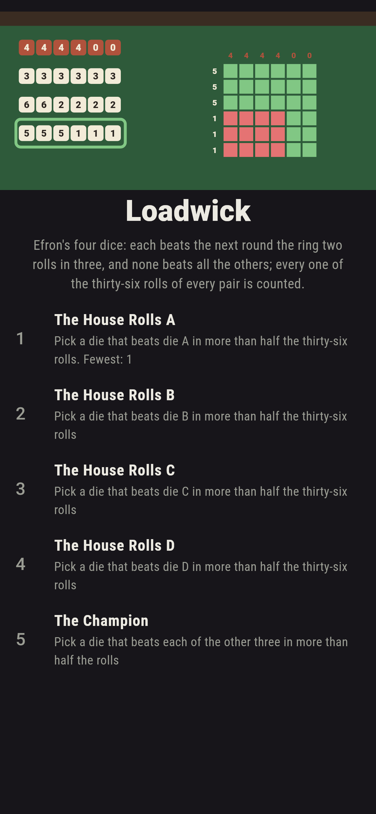
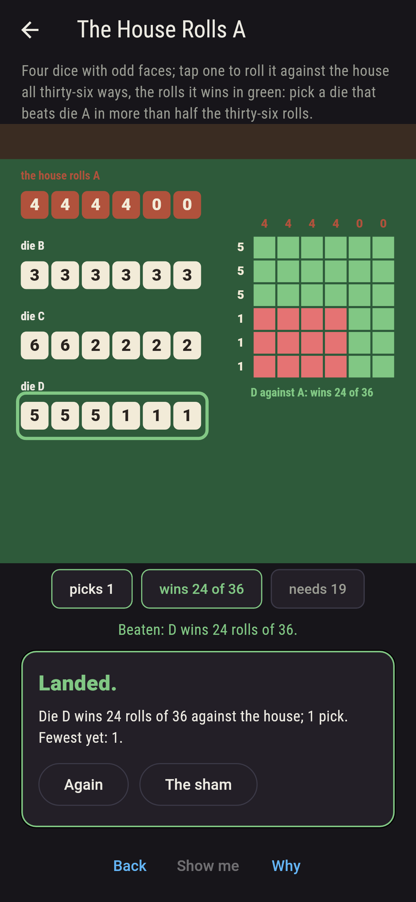
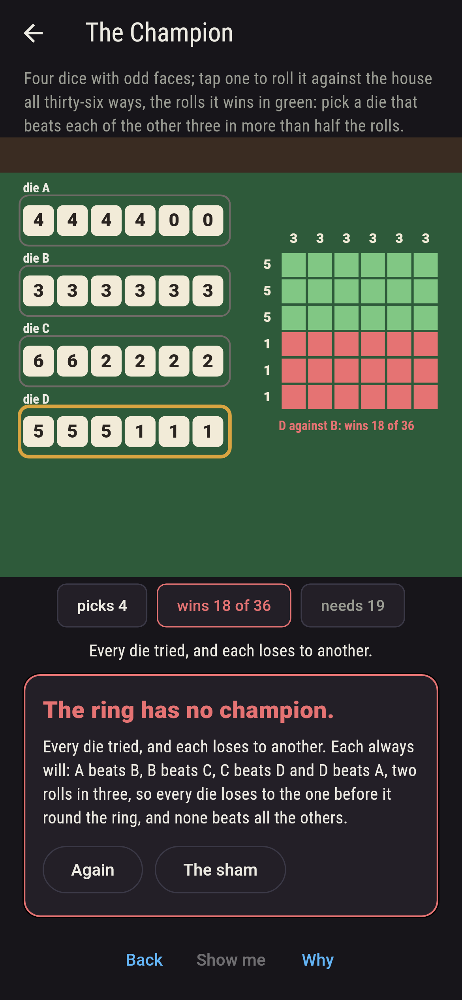
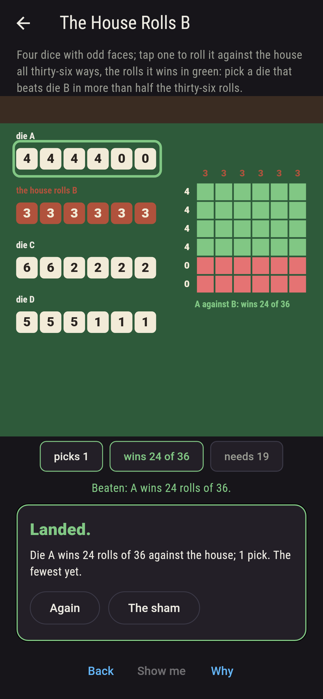
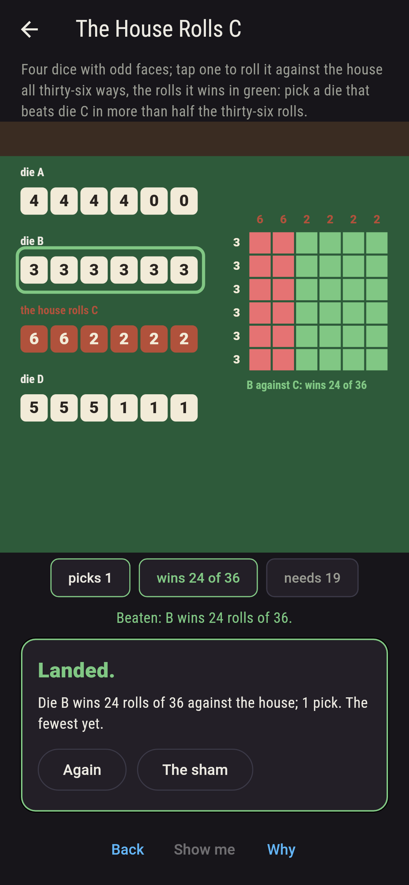
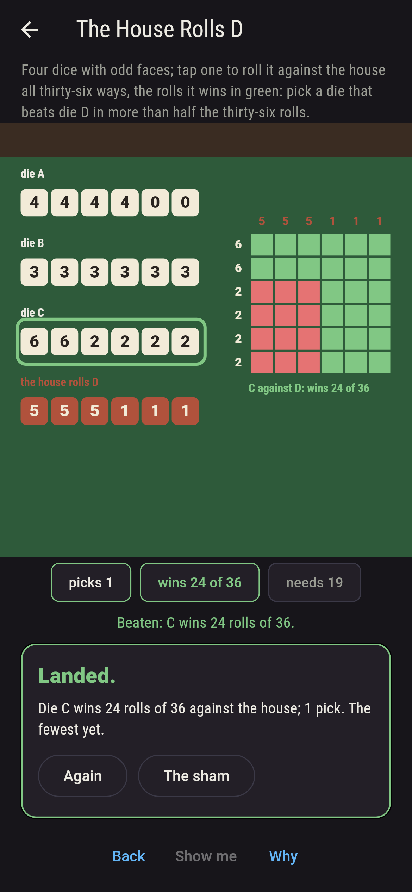
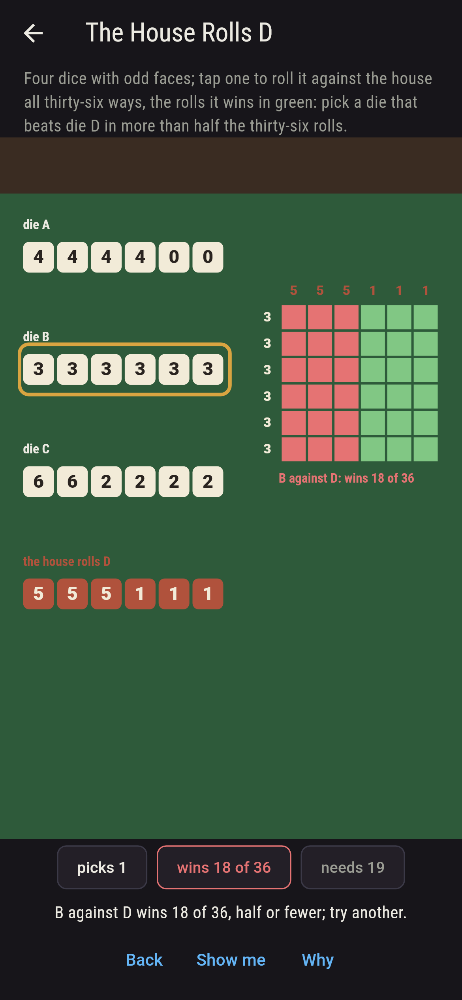
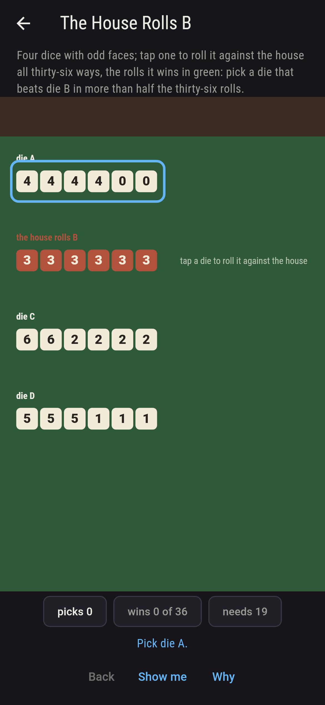
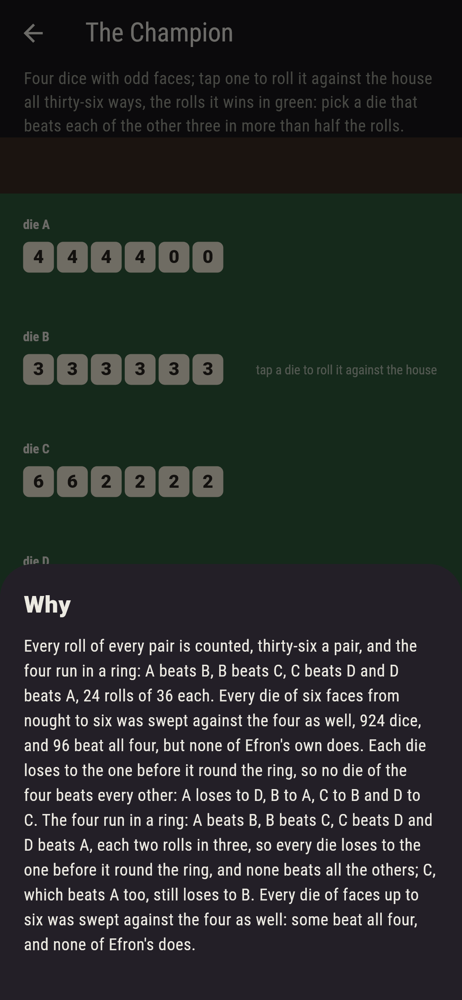

# Loadwick


Efron's dice at a fairground stall. Four dice with odd faces: A
shows four four times in six and nought twice, B three every time,
C six twice and two four times, D five three times and one three
times. Two dice rolled together make thirty-six rolls, and the die
showing the higher face wins the roll; a die beats another when it
wins more than half. Tap a die to roll it against the house all
thirty-six ways, the rolls it wins in green. The four run in a ring:
A beats B, B beats C, C beats D and D beats A, twenty-four rolls of
thirty-six each, so whichever die the house takes there is one that
beats it, and there is no die of the four that beats all the
others, since each loses to the one before it round the ring. Every
roll of every pair is counted, and every die of faces up to six is
swept against the four.

## The stalls

1. **The House Rolls A** - pick a die that beats die A in more than half the thirty-six rolls
2. **The House Rolls B** - pick a die that beats die B in more than half the thirty-six rolls
3. **The House Rolls C** - pick a die that beats die C in more than half the thirty-six rolls
4. **The House Rolls D** - pick a die that beats die D in more than half the thirty-six rolls
5. **The Champion** - pick a die that beats each of the other three in more than half the rolls

D beats A, twenty-four rolls, and so does C, twenty; A beats B; B
beats C; C beats D, twenty-four each; and D against B, or B against
D, is eighteen exactly, half and no more. The Champion is labeled
hopeless on its tile, and the why walks the ring.

## Two voices

The game never asserts what it has not computed, and it computes
everything at least twice:

* **The count** rolls every pair of the four dice all thirty-six
  ways, face against face, and tallies the rolls each wins, ties
  and loses, which come to thirty-six every time; every number on
  the sham is that count's, and the ring and the missing champion
  are read off it.
* **The sweep** takes every die of six faces from nought to six, 924
  of them, and rolls each against Efron's four the same way,
  counting how many beat A, B, C and D and how many beat all four:
  there are dice that beat all four, but none of Efron's own does,
  and each of the four is beaten by another of the four, as the
  ring says.

`tool/check_dice.dart` runs the lot and refuses the bake on any
disagreement.

## The checker's ledger

What `dart run tool/check_dice.dart` printed for the build this
README shipped with, word for word:

```
every roll of every pair of Efron's dice counted, thirty-six a pair, wins and ties and losses coming to thirty-six every time: A beats B, B beats C, C beats D and D beats A, 24 rolls of 36 each, a ring, and no die of the four beats every other, though C beats A as well, 20 rolls; the wins run A against B 24, A against C 16, A against D 12, B against A 12, B against C 24, B against D 18, C against A 20, C against B 12, C against D 24, D against A 24, D against B 18, D against C 12; every die of six faces from nought to six swept against the four, 924 dice, 353 beating A, 262 B, 252 C and 211 D, 96 beating all four and 451 none of them; the house rolling A is beaten by 2 picks of 3, B by 1, C by 1, D by 1, and the champion by none of 4

 1 The House Rolls A pick the die that beats die A in more than half the thirty-six rolls: 2 of the 3 picks land it
 2 The House Rolls B pick the die that beats die B in more than half the thirty-six rolls: 1 of the 3 picks lands it
 3 The House Rolls C pick the die that beats die C in more than half the thirty-six rolls: 1 of the 3 picks lands it
 4 The House Rolls D pick the die that beats die D in more than half the thirty-six rolls: 1 of the 3 picks lands it
 5 The Champion      pick a die that beats each of the other three in more than half the rolls: none of the 4, and the ring said so first
```

## Screenshots

| The sham | D against A | The champion admitted |
| --- | --- | --- |
|  |  |  |

| A against B | B against C | C against D | A losing pick | Show me | The why |
| --- | --- | --- | --- | --- | --- |
|  |  |  |  |  |  |

Screenshots are drawn by `test/showcase_test.dart` at real phone
sizes with the app's own painter, then copied into `docs/` as they
came out; every pick in them was made by a tap, so nothing pictured
is a stall the game could not reach. The logo and every launcher
icon come out of `test/mark_test.dart` the same way: the mark is D
picked against A, the table of thirty-six mostly green.

## Building

```
flutter test          # 41 tests, the count among them
dart run tool/check_dice.dart
flutter build apk     # or: flutter build ios
```
