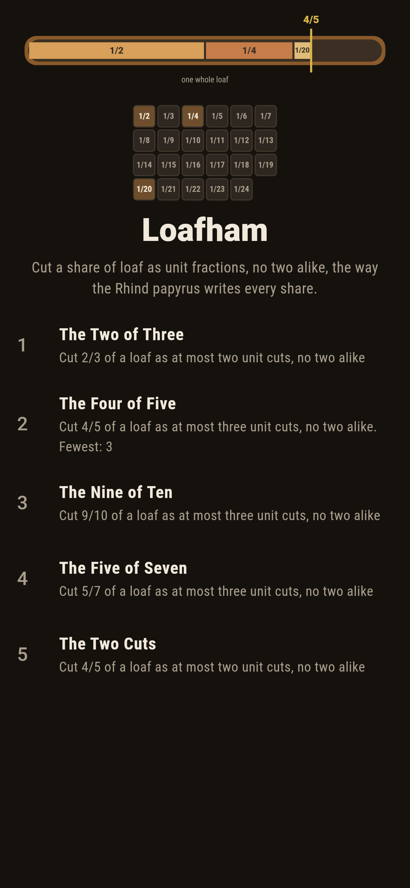
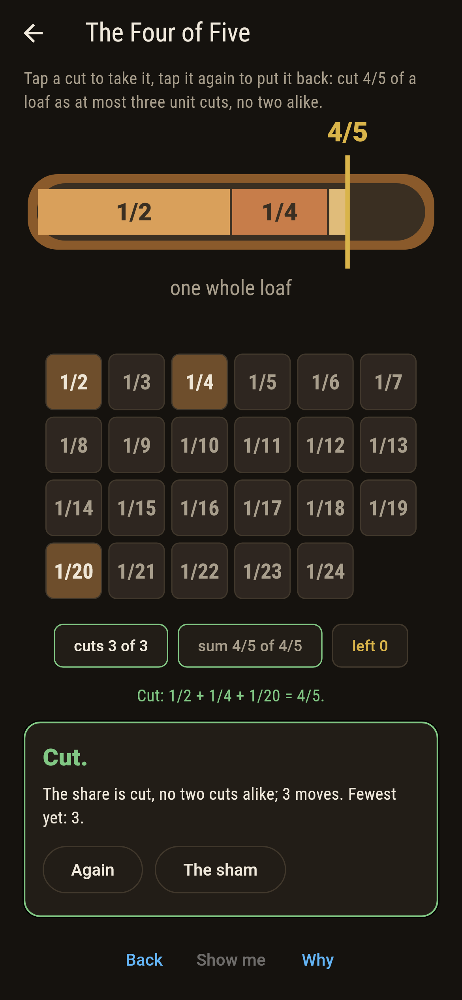
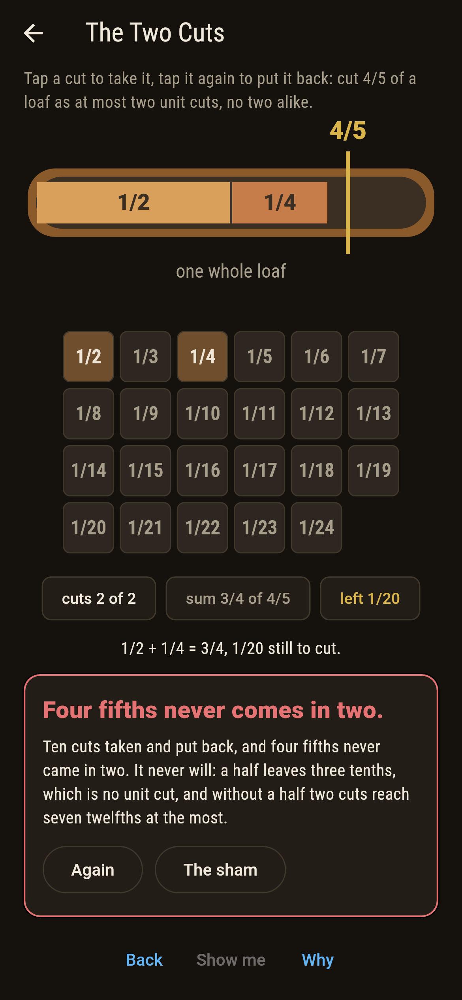
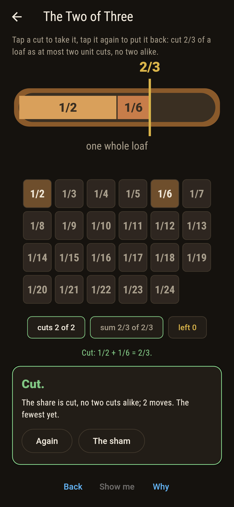
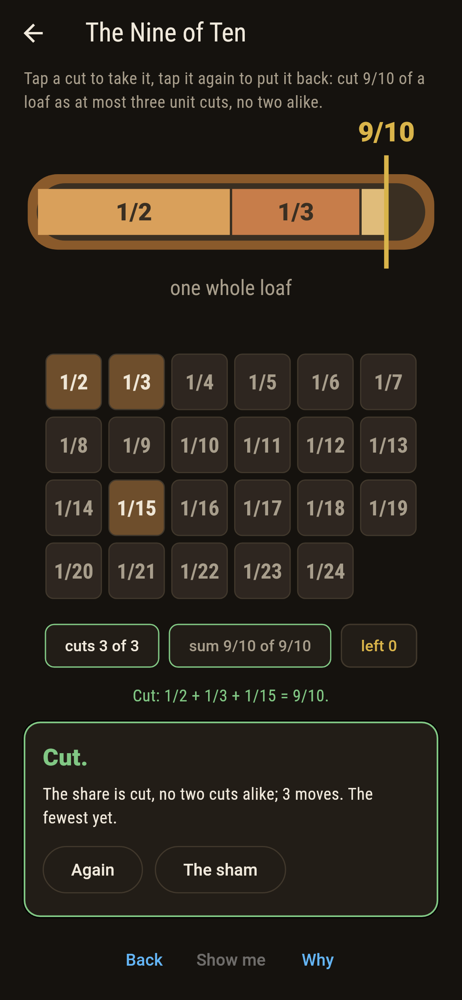
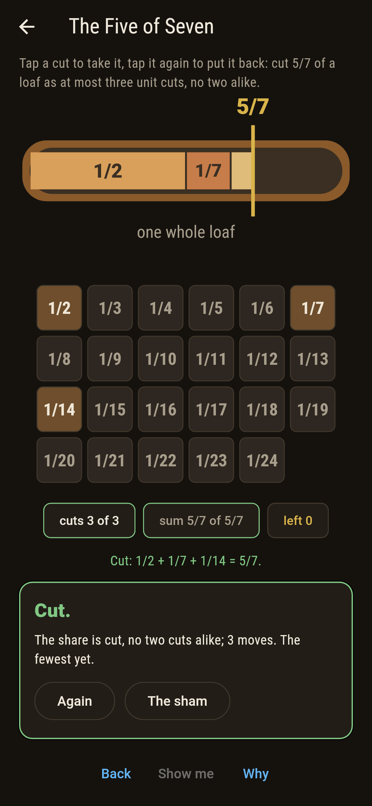
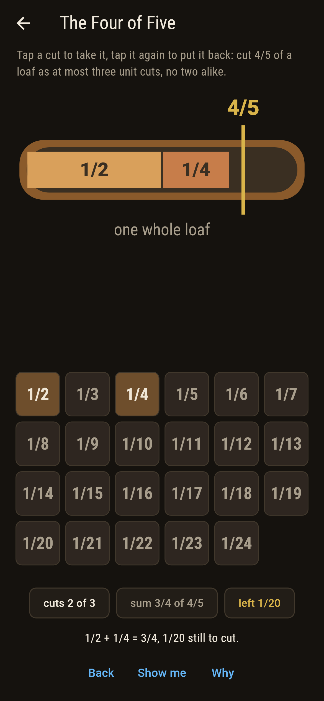
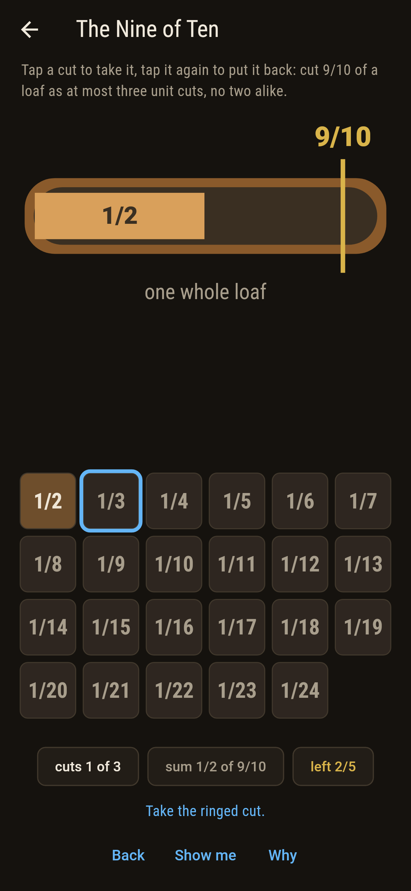
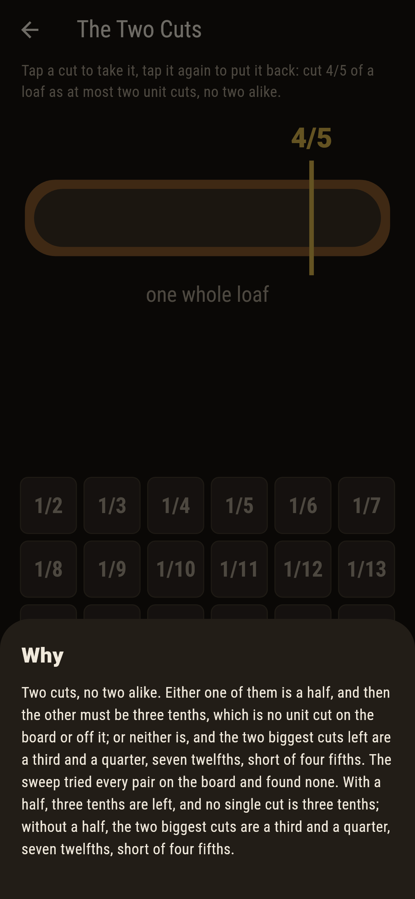

# Loafham


A share of loaf, four fifths say, to be cut as unit fractions with
no two alike: a half, a quarter and a twentieth. That is how the
Rhind papyrus writes every share, and Fibonacci showed in 1202
that the greedy cut, always the biggest unit fraction that fits,
finishes every share, since what is left has a smaller top each
time. The board offers cuts from a half to a twenty-fourth, and
the sweep tries every set of them. Four fifths never comes in two
cuts, on the board or off it, and the why says why in two lines.

## The shares

1. **The Two of Three** - cut 2/3 of a loaf as at most two unit cuts, no two alike
2. **The Four of Five** - cut 4/5 of a loaf as at most three unit cuts, no two alike
3. **The Nine of Ten** - cut 9/10 of a loaf as at most three unit cuts, no two alike
4. **The Five of Seven** - cut 5/7 of a loaf as at most three unit cuts, no two alike
5. **The Two Cuts** - cut 4/5 of a loaf as at most two unit cuts, no two alike

Two of three is a half and a sixth and nothing else. Four of five
comes two ways in three cuts, the greedy half, quarter and
twentieth or a half, a fifth and a tenth. Nine of ten comes one
way. Five of seven's greedy cut wants a seventieth, off the board,
and the sweep finds two ways within it. The Two Cuts is labeled
hopeless on its tile: with a half, three tenths are left and no
cut is three tenths; without, a third and a quarter are the most,
seven twelfths.

## Two voices

The game never asserts what it has not computed, and it computes
everything at least twice:

* **The sweep** tries every set of cuts on the board, adding in
  whole fractions, and counts the sets that make the share exactly.
* **The greedy cut** is Fibonacci's method run for real: on every
  share with a bottom of twelve or less it ends, in four cuts at
  most, its cuts distinct and adding up, and wherever its cuts sit
  on the board the sweep finds the same set; the two-cut case of
  four fifths is settled by the arithmetic of three tenths and
  seven twelfths, and swept to two hundredths besides.

`tool/check_loaves.dart` runs the lot and refuses the bake on any
disagreement.

## The checker's ledger

What `dart run tool/check_loaves.dart` printed for the build this
README shipped with, word for word:

```
every set of cuts from a half to a twenty-fourth tried on every share: two of three comes only as a half and a sixth, four of five two ways in three cuts and never in two, since a half leaves three tenths and no half leaves seven twelfths at the most, nine of ten one way, five of seven two ways though the greedy cut wants a seventieth, and Fibonacci's method ends in four cuts at most on every share with a bottom of twelve or less

 1 The Two of Three   cut 2/3 of a loaf as at most two unit cuts, no two alike: 1 set of cuts of the sweep makes it
 2 The Four of Five   cut 4/5 of a loaf as at most three unit cuts, no two alike: 2 sets of cuts of the sweep make it
 3 The Nine of Ten    cut 9/10 of a loaf as at most three unit cuts, no two alike: 1 set of cuts of the sweep makes it
 4 The Five of Seven  cut 5/7 of a loaf as at most three unit cuts, no two alike: 2 sets of cuts of the sweep make it
 5 The Two Cuts       cut 4/5 of a loaf as at most two unit cuts, no two alike: none on the board nor off it, and the three tenths said so first
```

## Screenshots

| The sham | The four of five cut | The two cuts admitted |
| --- | --- | --- |
|  |  |  |

| The two of three | The nine of ten | The five of seven | Mid-cut | Show me | The why |
| --- | --- | --- | --- | --- | --- |
|  |  |  |  |  |  |

Screenshots are drawn by `test/showcase_test.dart` at real phone
sizes with the app's own painter, then copied into `docs/` as they
came out; every cut in them was tapped, so nothing pictured is a
share the game could not reach. The logo and every launcher icon
come out of `test/mark_test.dart` the same way: the mark is four
fifths cut the greedy way.

## Building

```
flutter test          # 47 tests, the sweep among them
dart run tool/check_loaves.dart
flutter build apk     # or: flutter build ios
```
