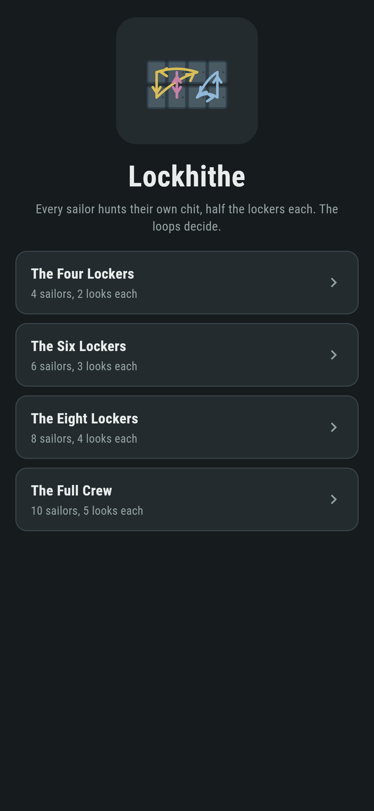
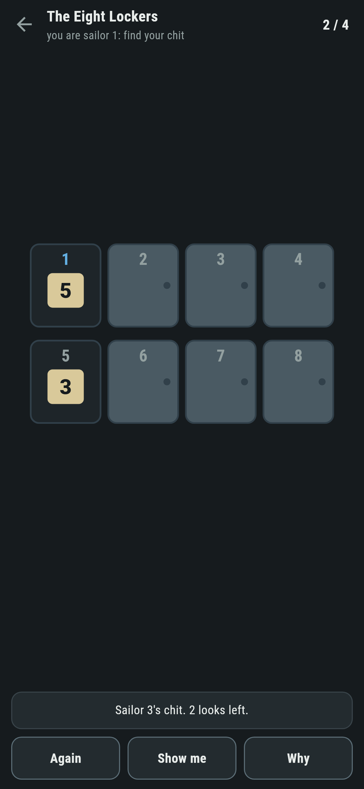
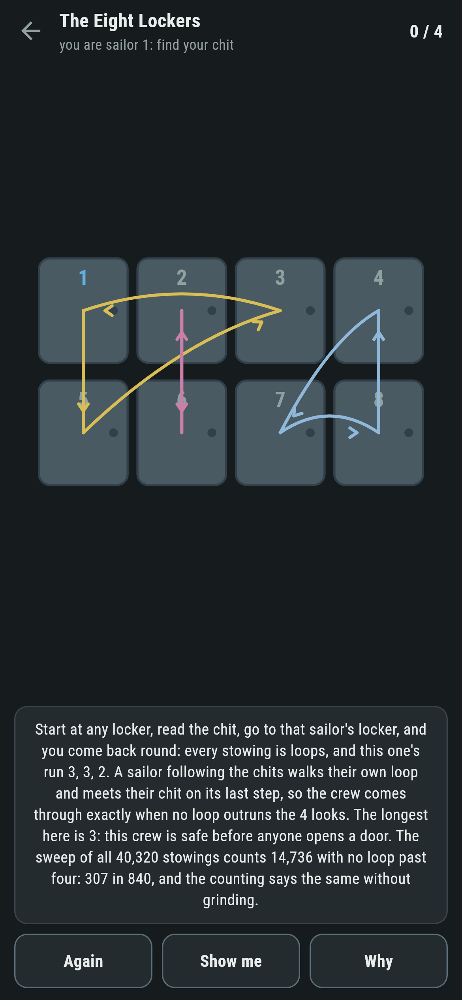
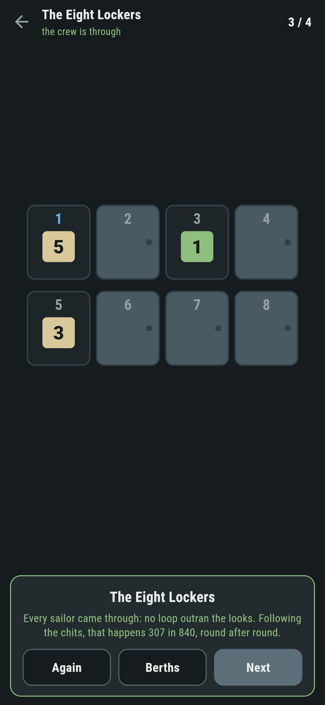
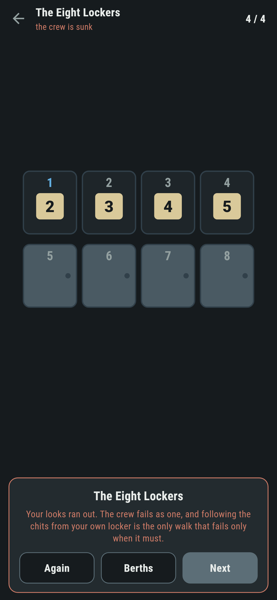

# Lockhithe

A locker-room gamble for phones, in Flutter, for Android and iOS.

The bosun has stowed one chit in each locker, every sailor's name on one,
nobody promised their own. Each sailor may open half the lockers, alone,
telling the others nothing. If every sailor finds their own chit, the
crew comes through; if one fails, the crew fails as one. Guessing, ten
sailors come through one round in a thousand. There is a better way, and
it is loops.

| | | | |
|---|---|---|---|
|  |  |  |  |

## Follow the chit you find

Open your own locker first. Read the chit, go to that sailor's locker,
read again, keep going. Every stowing breaks into loops, and that walk
is exactly your own loop: it meets your chit on its last step. So you
fail only when your loop is longer than your looks, and the crew comes
through exactly when no loop outruns the half. The crew's fate was
sealed the moment the bosun stowed the chits; following just refuses to
add any failure of its own.

**Why** ropes the loops over the doors in front of you and reads their
lengths, and says plainly whether this crew was safe or sunk before the
first door opened.


## Three reckonings, one truth

The chance of coming through is one minus the sum of 1/k over the loop
lengths past the half, an exact fraction. The sweep grinds every stowing
of eight lockers, all 40,320, and counts. The luck baseline is the half
raised to the crew. `make berths` holds them together:

```
$ make berths
 1 The Four Lockers  4 sailors, 2 looks  following 5 in 12  guessing 1 in 16  (sweep agrees)
 2 The Six Lockers   6 sailors, 3 looks  following 23 in 60  guessing 1 in 64  (sweep agrees)
 3 The Eight Lockers 8 sailors, 4 looks  following 307 in 840  guessing 1 in 256  (sweep agrees)
 4 The Full Crew     10 sailors, 5 looks  following 893 in 2520  guessing 1 in 1024
```

Ten sailors guessing: one in a thousand. Following: better than one in
three, round after round, forever. The suite also proves the theorem the
long way, walking sailors through random stowings and checking they
tread exactly their loop and succeed exactly when it fits.

## The cards own the odds

Come through and the card says how often that should happen. Get sunk
and it names the sailor whose loop did it, and reminds you the loops
were set before anyone opened a door. Wander off your loop and you can
fail rounds the chits would have carried you through: the game lets you,
because feeling that is the point.



## Building

```
make deps    # fetch packages
make check   # analyze + every test
make berths  # every berth's chances, sweep against counting
make shots   # render the screenshots and redraw the icons
make apk     # Android release build
make ios     # iOS release build (unsigned)
```

The logo and every app icon are drawn by the game's own painter in
`test/mark_test.dart`. There is no image in this repository that was not
produced by code in it.

## How it is put together

```
lib/quay/stow.dart      a stowing and its loops
lib/quay/odds.dart      the counting, the sweep, and the luck baseline
lib/quay/berth.dart     a berth: sailors and looks
lib/quay/berths.dart    the four berths that ship
lib/quay/play.dart      a round: your looks, the crew's fate; the stow
                        is dealt outside, so tests hand in exact ones
lib/ui/                 the painter, the screens, the mark
tool/check_berths.dart  the ledger above
```

The tests check the loops close and cover, walk the theorem on random
stowings, hold the counting against the full sweep at every size it can
reach, pin the classic numbers, and hold the pictures against the real
widget tree. If any of that drifts, `make check` goes red before
anything leaves the machine.
