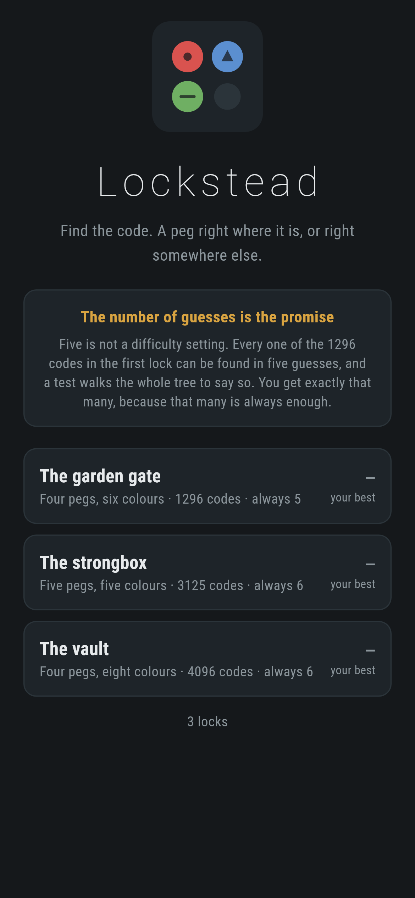
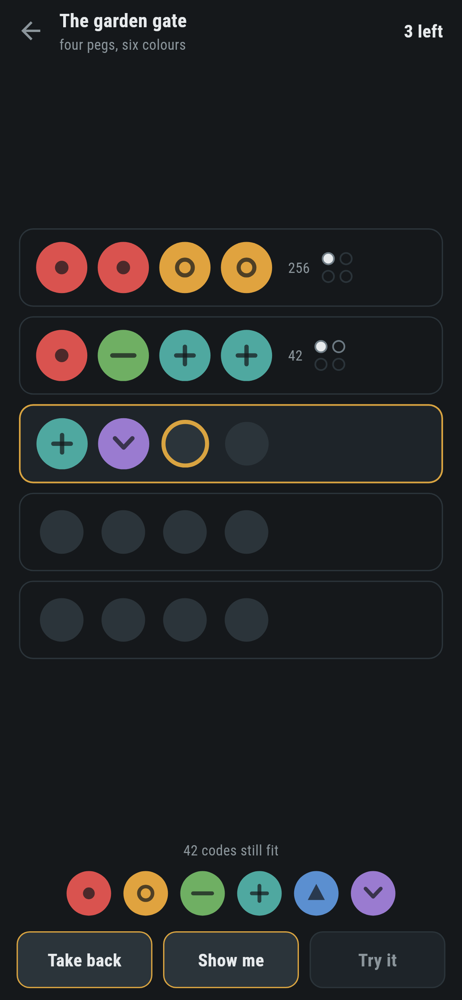
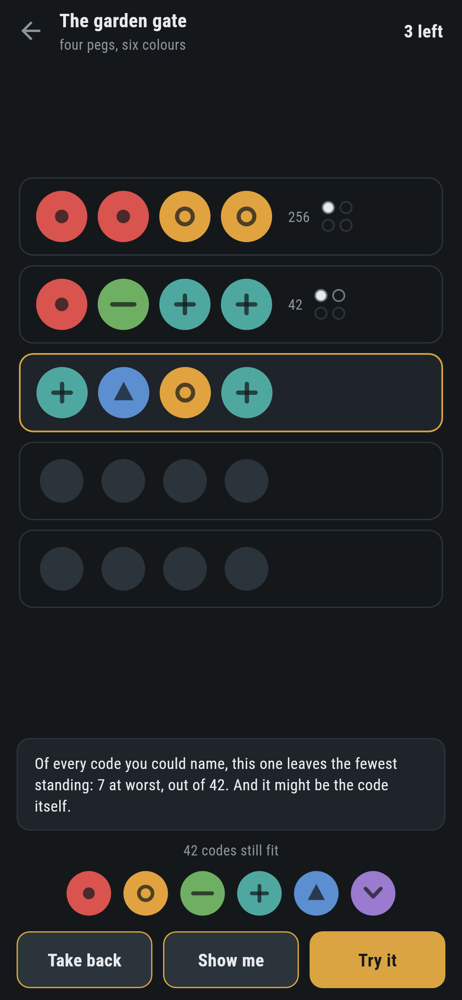
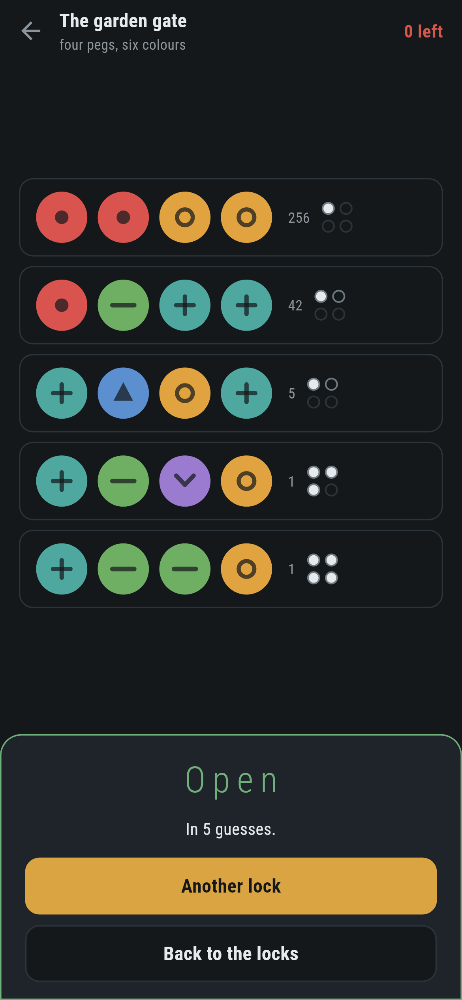
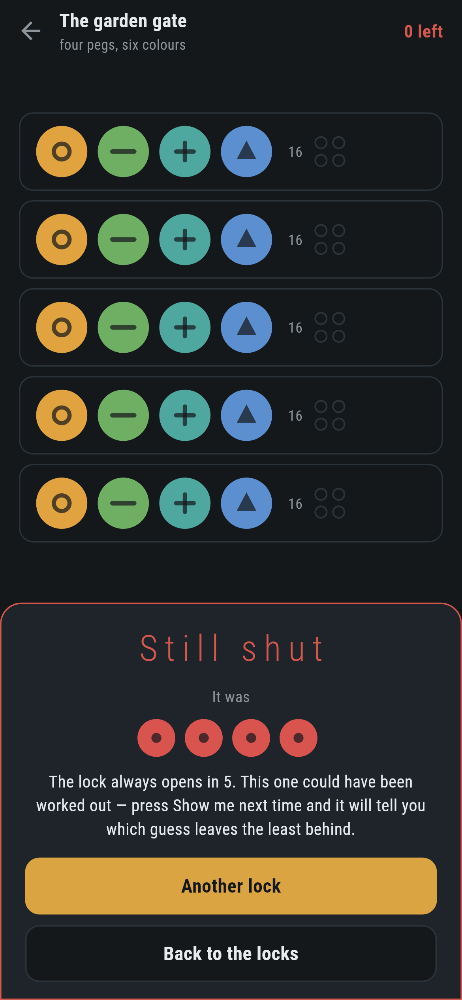

# Lockstead

A code-breaking game for phones, in Flutter, for Android and iOS.

Four pegs, six colours, and a lock that tells you how close you were: a filled
dot for a peg right where it is, a hollow one for a colour that is in the code
somewhere else. You get five guesses, because five is always enough.

| | | | |
|---|---|---|---|
|  |  |  |  |

## Five is not a difficulty setting

Every one of the 1296 codes in the first lock can be found in five guesses.
Not most of them, not on average, but all of them. So five is what you get.

That number is not somebody's estimate. `test/lock_test.dart` walks the whole
strategy tree and fails if the number printed on the board is not the deepest
leaf of it:

```
$ make prove
The garden gate  4x6   1296 codes  worst 5  average 4.476  [1: 1  2: 6  3: 62  4: 533  5: 694]
The strongbox    5x5   3125 codes  worst 6  average 4.437  [1: 1  2: 6  3: 141  4: 1479  5: 1473  6: 25]
The vault        4x8   4096 codes  worst 6  average 5.183  [1: 1  2: 1  3: 56  4: 500  5: 2169  6: 1369]
```

Four pegs and six colours in five guesses is Knuth's result from 1977, which
makes it the one number here that can be checked against somebody else's work
rather than only against itself.

**The tree, not a sample.** Replaying the game against each of 1296 codes in
turn would be 1296 searches. But the strategy *is* a tree, with one guess at
the top, a branch for every mark it can come back with and the same question
down each branch, and every code in the lock is a leaf of it. Walking it once
answers for all of them, which is why the proof is a test that takes half a
second rather than a tool you run overnight.

## The rule for choosing a guess

Of every code you could name, name the one whose worst outcome leaves the
fewest possibilities standing.

That is not a heuristic. It is the best guess against an adversary who gets to
choose the code *after* seeing yours, which is exactly the guarantee worth
having when the promise is "five, always". Ties go to a guess that could
itself be the code, because that one might end the game this turn and the
other one certainly will not.

Press **Show me** and the game puts that guess in the row and says what it is
worth:

> Of every code you could name, this one leaves the fewest standing: 7 at
> worst, out of 42. And it might be the code itself.

A test checks that claim the slow way: it takes the offered guess and compares
its worst case against all 1296 codes, one at a time.

## Marking a guess is where this game is usually wrong

Repeated colours are the whole difficulty. If the code has one red and you
guess three, exactly one can be credited, and walking the pegs left to right
crossing off matches gets that wrong in a way nobody notices until they are
already annoyed. Here the blacks come out first, and the whites are whatever
is left over on both sides:

```dart
whites += leftInCode[colour] < leftInGuess[colour]
    ? leftInCode[colour]
    : leftInGuess[colour];
```

There are tests either side of it, including one that four thousand random
pairs never come back as "three right and one in the wrong place", a mark
that cannot happen, because there is nowhere for the odd peg to go. A game
that offers it as a possible answer is a game that can lie to you.

## Colour is not the only thing telling them apart


Every peg carries a shape as well as a hue: a dot, a ring, a bar, a cross, a
triangle, a chevron, a square, a slash. Either would do for most people and
neither on its own does for everybody, and a code game that can only be played
by people who see colour the way whoever made it does is a code game half the
world cannot play.

## Cutting the key

Everything after the first moment is a table lookup. Marking every code
against every other is a few million pairs, which is half a second for the
biggest lock, and it happens once, on an isolate of its own, while the screen
says what it is doing. After that the solver, the count of what still fits and the
proof are all reading a byte out of an array.

The table is symmetric, so only half of it is worked out and the other half
copied.

## Running it

```
make deps    # flutter pub get
make test    # everything
make analyze
make shots   # render the screens into build/showcase, redraw the logo
make prove   # walk every lock's strategy tree and print how deep it goes
make apk     # release APK
make ios     # release iOS build, unsigned
```

## Tests

`flutter test` runs the lock (codes to pegs and back), marking (right place,
wrong place, repeated colours, the mark that cannot happen, and that it comes
out the same whichever way round it is asked), the table (against marking done
by hand, twenty thousand times), every board against its promise, and a game
(what narrows, what opens it, what happens when the guesses run out, and that
the code is never ruled out of what still fits).

Then the game through the screen: filling a row a peg at a time, taking one
back, a guess coming back marked, the count of what still fits going down, the
code being shown when the lock beats you, and every lock picked to the end by
pressing **Show me**, which has to open each one inside its promise without
the test ever being told the code.

Screenshots come from `test/showcase_test.dart`, and the guesses in them are
real: every row was put in a peg at a time and marked by the lock.
`test/mark_test.dart` draws the logo and the app icon; there is no image in
this repository that was not produced by it.

| | |
|---|---|
|  |  |
