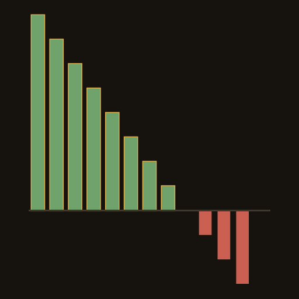
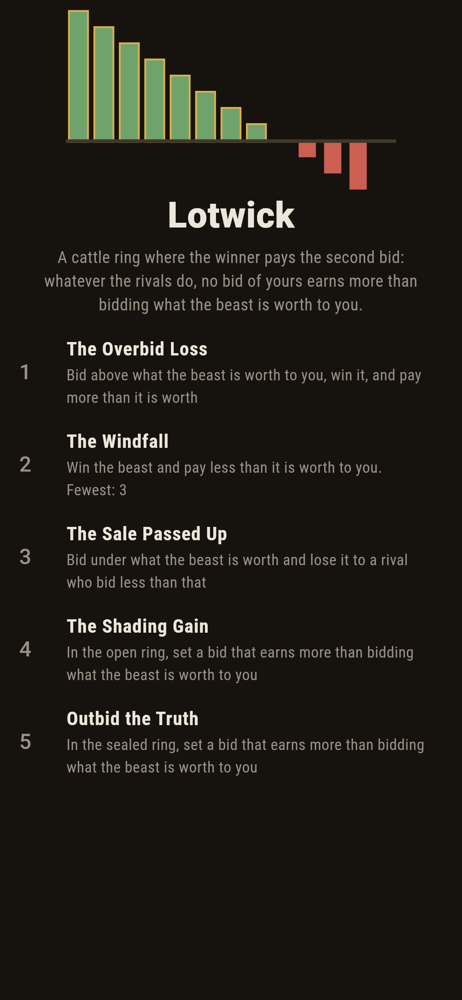
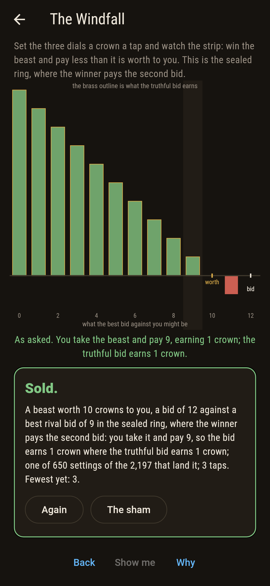
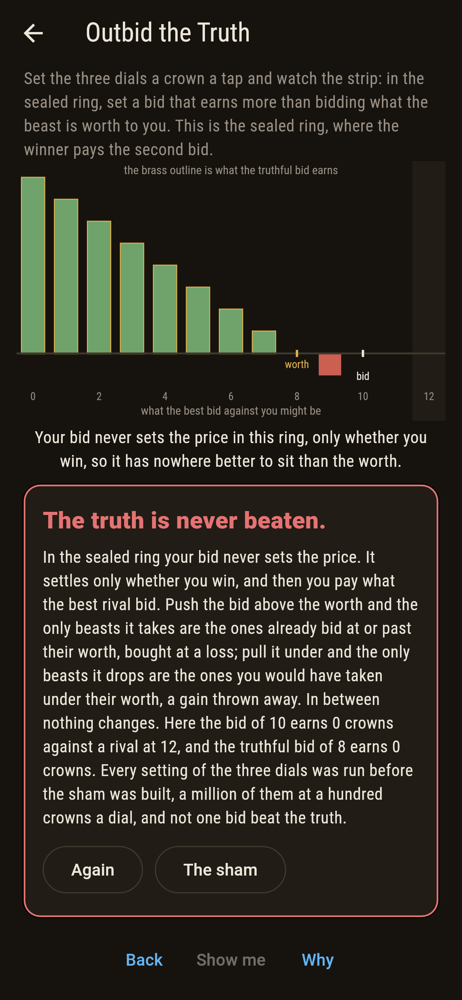
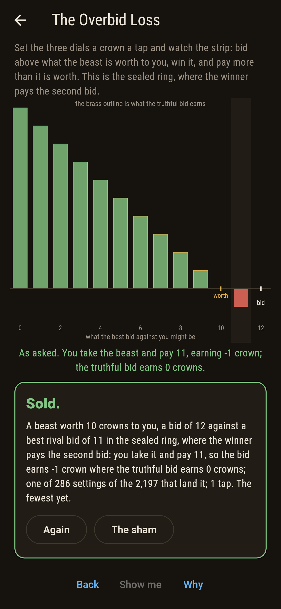
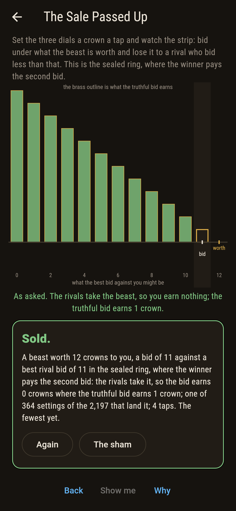
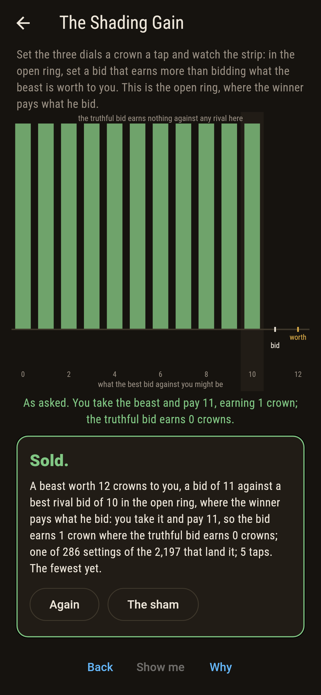
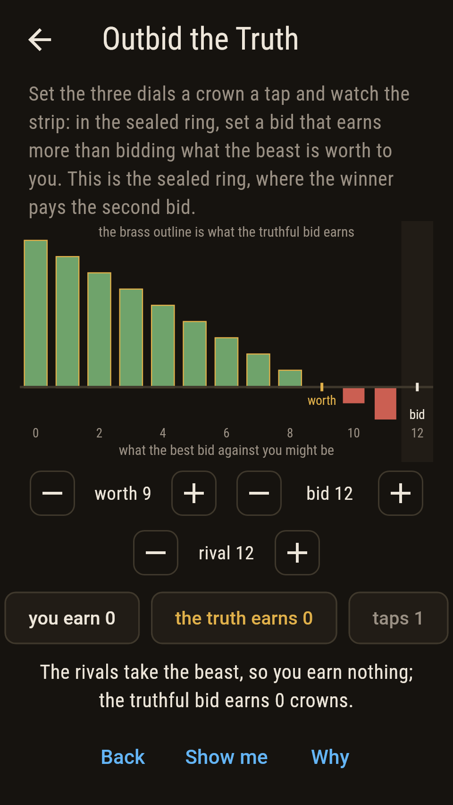
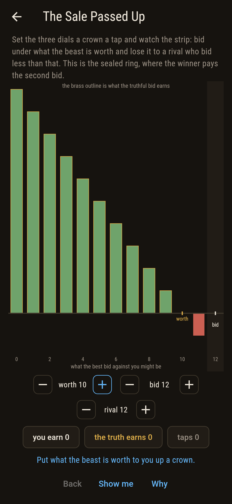
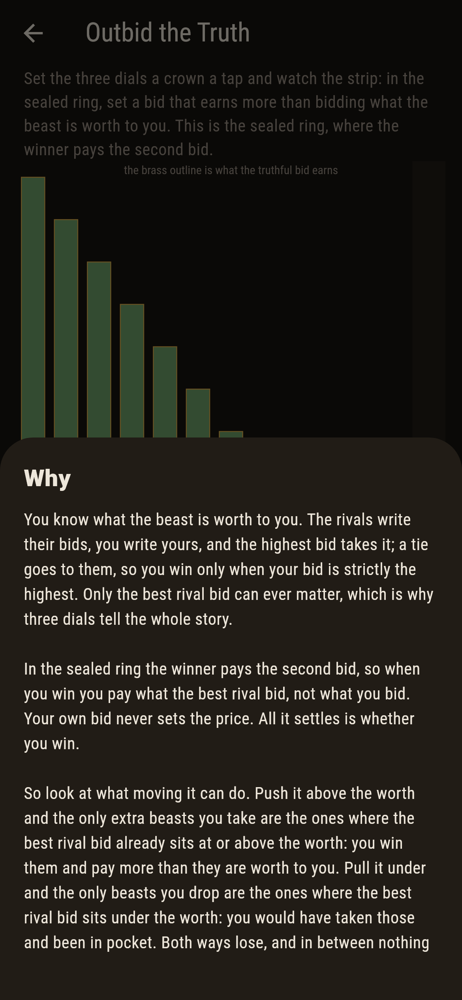

# Lotwick



A cattle ring with a sealed tender box. You know what the beast is
worth to you, the rivals write their bids, you write yours, and the
highest bid takes it; a tie goes to them. The winner pays the second
bid, not his own. Three dials set what the beast is worth, what you
bid, and the best bid against you, and the board draws what your bid
earns against every bid a rival might make, with the truthful bid
outlined in brass behind it. The outlined bar is never below yours.

## The asks

1. **The Overbid Loss** - bid above what the beast is worth to you, win it, and pay more than it is worth
2. **The Windfall** - win the beast and pay less than it is worth to you
3. **The Sale Passed Up** - bid under what the beast is worth and lose it to a rival who bid less than that
4. **The Shading Gain** - in the open ring, set a bid that earns more than bidding what the beast is worth to you
5. **Outbid the Truth** - in the sealed ring, set a bid that earns more than bidding what the beast is worth to you

The first three asks are the three things a bid can do in the sealed
ring: 286 settings of the 2,197 buy a beast for more than it is worth,
650 win one for less, and 364 pass up a sale the truthful bid would
have taken and profited by. The fourth is run in the open ring, where
the winner pays what he bid: there the truthful bid pays its whole
worth away and earns nothing at all, so 286 settings beat it and every
one of them is a bid shaded under the worth. Outbid the Truth is
labeled hopeless on its tile, and the card at the end of the ask says
why on a finger.

## Why the truth cannot be beaten

In the sealed ring your own bid never sets the price. It settles only
whether you win, and when you win you pay what the best rival bid.

So there are only two things moving the bid can do. Push it above the
worth and the extra beasts it takes are exactly the ones where the best
rival bid already sits at or above the worth: you win them and pay more
than they are worth to you. Pull it under the worth and the beasts it
drops are exactly the ones where the best rival bid sits under the
worth: those you would have taken and been in pocket. Everywhere else
nothing changes. Both directions lose, so the dial has nowhere better
to sit than the worth. William Vickrey published this in 1961.

The open ring is the other story, and the reason the sealed one was
invented. There the winner pays what he bid, so the truthful bid buys
only beasts that earn nothing, and shading under the worth is what
pays.

## Two voices

The game never asserts what it has not computed, and it computes
everything at least twice:

* **The auction** is run literally: the bids are compared, the winner
  found under the tie rule, the ring's price charged, and the earnings
  are the worth less the price or nothing at all.
* **The window** runs no auction. The bid and the truth differ only
  when the best rival bid falls in the window between them, and the
  window is closed at its lower end because a bid level with a rival
  loses. Inside it the difference is the worth less the rival bid when
  the bid is high and the rival bid less the worth when it is low,
  neither of them ever positive.

The two are set against each other on a million settings, a hundred
crowns on each of the three dials, in both rings.

`tool/check_ring.dart` runs the lot and refuses the bake on any
disagreement.

## The checker's ledger

What `dart run tool/check_ring.dart` printed for the build this README
shipped with, word for word:

```
every setting of the three dials taken at a hundred crowns a dial, what the beast is worth, what you bid and the best bid against you, 1,000,000 in all, and each one run in both rings and held to the window, which runs no auction: the two agree on every setting, and the window opens downward on all 328,350 settings where it opens at all; in the sealed ring, where the winner pays the second bid, not one of the 1,000,000 settings has a bid earning more than bidding what the beast is worth, whichever way the rivals go; in the open ring, where the winner pays what he bid, 161,700 settings beat the truthful bid and every one of them is a bid under the worth, since the truthful bid there pays its whole worth away and earns nothing at all; a tie goes to the rivals, so a bid level with the best rival bid loses, which is why the window is closed at its lower end: with a beast worth one crown and a rival bidding nothing, the truthful bid of one takes it for nothing and earns the whole crown, while a bid of nothing ties with the rival and comes away with neither; and on the 2,197 settings the dials of this sham reach, the same holds and the asks are counted

 1 The Overbid Loss   bid above what the beast is worth to you, win it, and pay more than it is worth: 286 of the 2,197 settings land it, the cheapest in 1 tap
 2 The Windfall       win the beast and pay less than it is worth to you: 650 of the 2,197 settings land it, the cheapest in 3 taps
 3 The Sale Passed Up bid under what the beast is worth and lose it to a rival who bid less than that: 364 of the 2,197 settings land it, the cheapest in 4 taps
 4 The Shading Gain   in the open ring, set a bid that earns more than bidding what the beast is worth to you: 286 of the 2,197 settings land it, the cheapest in 5 taps
 5 Outbid the Truth   in the sealed ring, set a bid that earns more than bidding what the beast is worth to you: none of the 2,197, nor of the 1,000,000, and the window says why
```

## Screenshots

| The sham | The windfall | Outbid the truth |
| --- | --- | --- |
|  |  |  |

| The overbid loss | The sale passed up | The shading gain | Midway, on the small phone | Show me | The why |
| --- | --- | --- | --- | --- | --- |
|  |  |  |  |  |  |

Screenshots are drawn by `test/showcase_test.dart` at real phone sizes
with the app's own painter, then copied into `docs/` as they came out;
every dial in them was set by taps, so nothing pictured is a setting
the game could not reach. The logo and every launcher icon come out of
`test/mark_test.dart` the same way: the mark is a beast worth eight
crowns with a bid of twelve, so the strip climbs while the rivals bid
low and drops below the line the moment they bid past what the beast
is worth.

## Building

```
flutter test          # 54 tests, the sweep among them
dart run tool/check_ring.dart
flutter build apk     # or: flutter build ios
```
