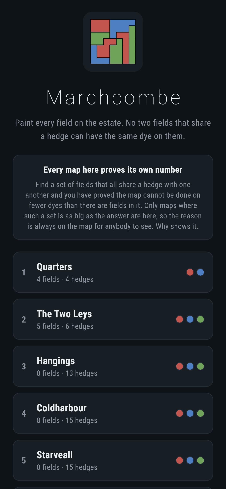
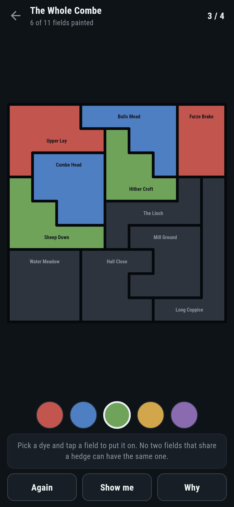
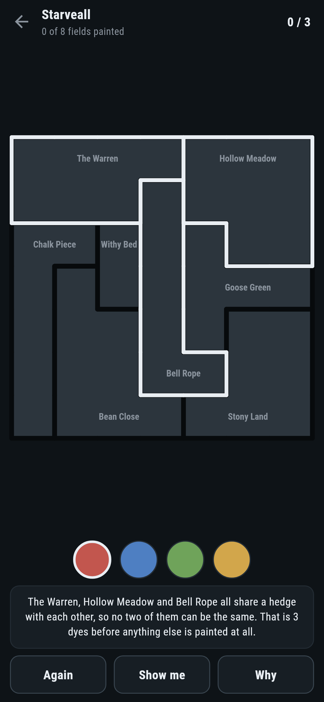
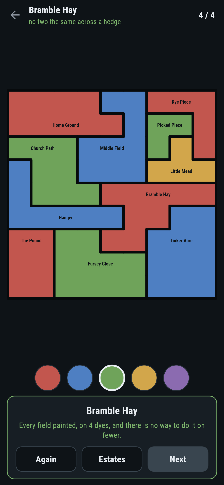
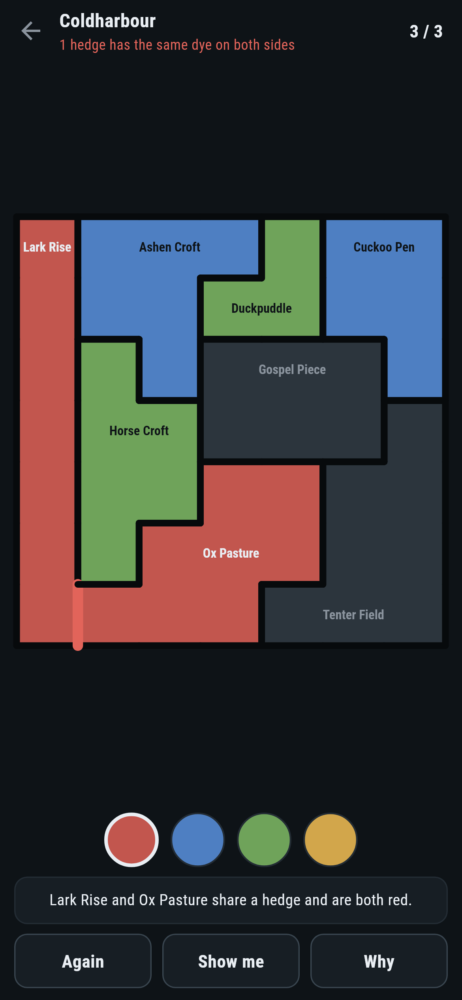

# Marchcombe

A map painting puzzle for phones, in Flutter, for Android and iOS.

Paint every field on the estate. No two fields that share a hedge can have the
same dye on them. The number on each estate is the fewest dyes it can possibly
be done in.

| | | | |
|---|---|---|---|
|  |  |  |  |

## Every map carries its own proof

Find a set of fields that all share a hedge with one another. Every one of them
has to be a different dye from every other, so the map cannot be done in fewer
dyes than there are fields in that set. It is a lower bound anybody can check
by looking at the map, and **Why** puts it on the screen:


Only maps where such a set is as big as the answer are here. `make find`
scatters fields across a grid and throws away everything else, along with
everything where painting the fields in the order they come, each in the first
dye that will do, happens to be the answer. About one map in a hundred gets
through both.

## The number itself, twice

```
$ make estates
 1 Quarters          4 fields  4 hedges  fewest 2  written down 2  by covering 2  the ring is 2  in order 2  2 paintings (ONE, up to swapping the pots)  4 tried
 2 The Two Leys      5 fields  6 hedges  fewest 3  written down 3  by covering 3  the ring is 3  in order 3  12 paintings  5 tried
 3 Hangings          8 fields  13 hedges  fewest 3  written down 3  by covering 3  the ring is 3  in order 4  6 paintings (ONE, up to swapping the pots)  14 tried
 4 Coldharbour       8 fields  15 hedges  fewest 3  written down 3  by covering 3  the ring is 3  in order 4  6 paintings (ONE, up to swapping the pots)  15 tried
 5 Starveall         8 fields  15 hedges  fewest 3  written down 3  by covering 3  the ring is 3  in order 4  6 paintings (ONE, up to swapping the pots)  9 tried
 6 Bramble Hay       11 fields  20 hedges  fewest 4  written down 4  by covering 4  the ring is 4  in order 5  3072 paintings  12 tried
 7 The Whole Combe   11 fields  22 hedges  fewest 4  written down 4  by covering 4  the ring is 4  in order 5  1632 paintings  16 tried
```

The first way paints. It tries every painting there is, in one dye first, then
two, and stops at the first number that works. It never gives a field a dye a
neighbour already has, and it never reaches for a new pot before it has tried
the ones already open, which is what stops it painting the same map over and
over with the dyes swapped round.

The second way never paints anything. Fields with the same dye on them never
share a hedge, so a painting in k dyes is the same thing as splitting the map
into k sets of fields that all keep out of each other's way. It works out, for
every set of fields on the map, the fewest such sets that set can be split
into, smallest sets first, and the answer for the whole map is the last one it
writes down. Three hundred maps made up at random are settled both ways and
the two always agree.

There is a third check that is slower and stupider than either. On small maps
a test tries every assignment of dyes to fields there is, one dye at a time,
and confirms that the answer works and one fewer never does.

## One painting, the pots aside

Three of the maps have exactly six paintings in three dyes, which is the same
painting with the pots swapped round all six ways. So there is only one way to
paint them, and everything you work out along the way is forced.

## What the game says



A clash first, because that is the thing somebody can put on a map without
noticing: two fields the same dye, and the hedge between them drawn in red.
Otherwise, whether the map can still be finished in the fewest dyes, which is
the same search that found the answer, run again with the fields already
painted held where they are.

**Show me** names a field and a dye that still leaves the map finishable in the
fewest. It comes from what is on the map rather than from an answer decided in
advance, so it is still right after a mistake. A test paints every map by doing
nothing else, and every one comes out on the fewest.

## Running it

```
make deps      # flutter pub get
make test      # everything
make analyze
make shots     # render the screens into build/showcase, redraw the logo and icons
make estates   # the fewest dyes each estate takes, two ways, and the ring
make find      # scatter fields and keep the maps worth playing
make apk       # release APK
make ios       # release iOS build, unsigned
```

## Tests

`flutter test` runs the map (fields read off the grid, which of them share a
hedge, what counts as a proper painting), the fewest dyes (a row, three fields
that all meet, three hundred random maps against the covering method, sixty
more against trying every painting there is, and the ring never claiming more
than the answer), counting the paintings, every estate that ships, and
painting one (dyes on and off, clashes, the spare pot, and asking the game
what to do next until the map is finished).

Then the game through the screen: picking a dye, painting a field, rubbing it
out, being told about a clash, being told the fewest has been thrown away,
**Again**, **Show me**, **Why**, and all seven estates painted on the fewest
dyes there are.

Screenshots come from `test/showcase_test.dart`, and every dye on them was put
there by tapping a field. `test/mark_test.dart` draws the logo, the launcher
icons at every density Android asks for and every size the iOS icon set asks
for; there is no image in this repository that was not produced by it.
