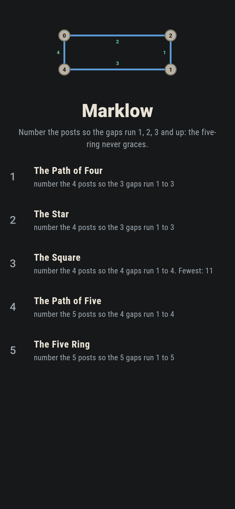
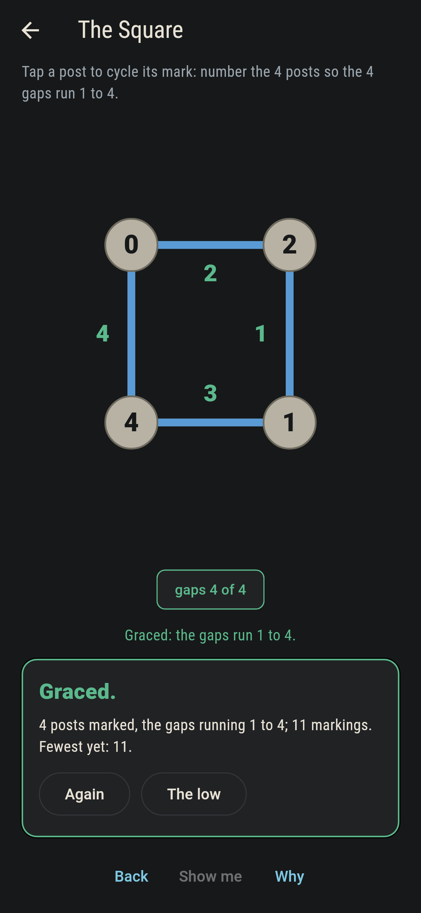
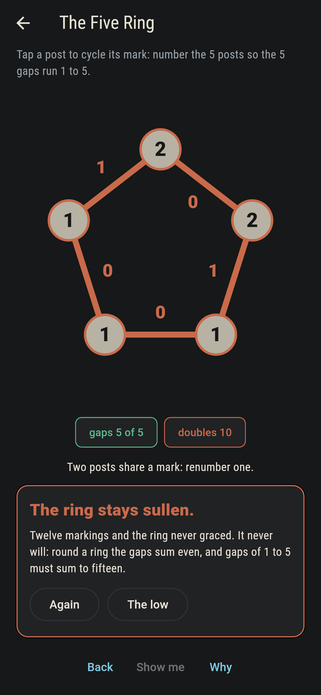
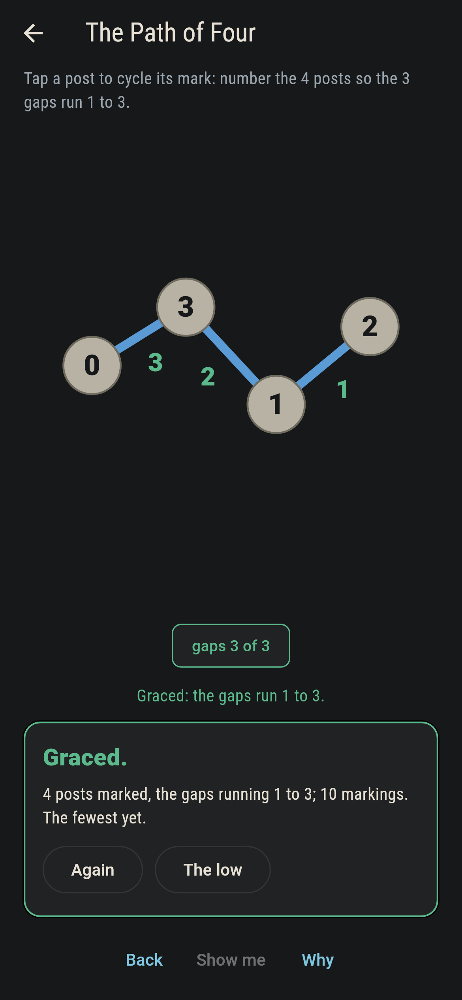
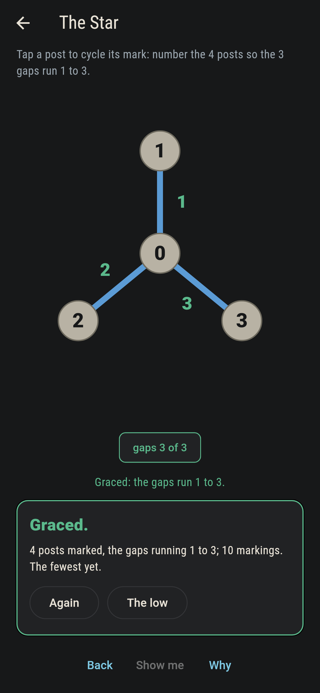
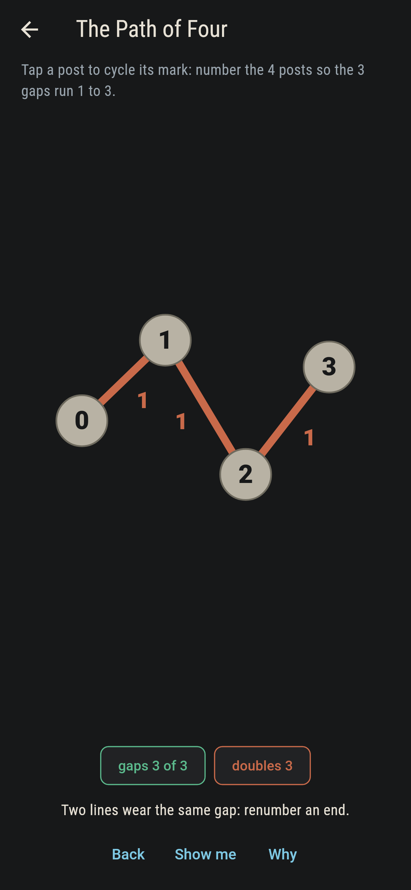
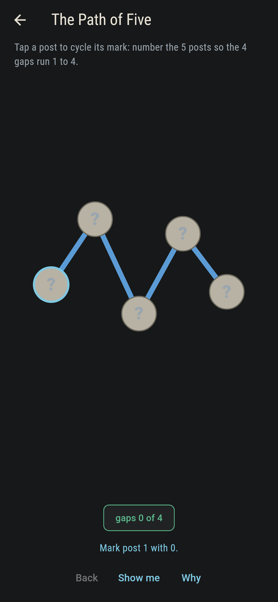
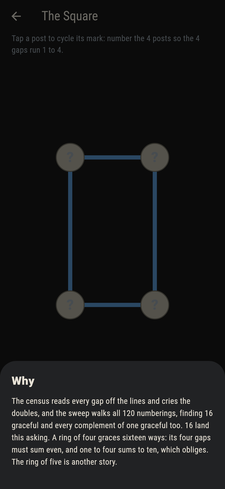

# Marklow


Posts joined by lines, a number on every post from nought up to
the count of lines, and each line wearing the gap between its
ends. A numbering is graceful when the gaps run 1, 2, 3 and up
with none repeated. Paths, stars and the square all take one;
the five-ring never will, and the reason is a parity you can
check on one hand.

## The lows

1. **The Path of Four** - number the 4 posts so the 3 gaps run 1 to 3
2. **The Star** - number the 4 posts so the 3 gaps run 1 to 3
3. **The Square** - number the 4 posts so the 4 gaps run 1 to 4
4. **The Path of Five** - number the 5 posts so the 4 gaps run 1 to 4
5. **The Five Ring** - number the 5 posts so the 5 gaps run 1 to 5

The graceful counts run 4, 12, 16 and 8, and every complement,
each mark turned to lines-less-it, keeps its grace. Round a ring
the gaps always sum even, since each gap shares its evenness
with the sum of its ends and every post is counted twice; the
square's asking of ten obliges, and the five-ring's asking of
fifteen does not.

## Two voices

The game never asserts what it has not computed, and it computes
everything at least twice:

* **The gap census** reads every line's gap, cries the doubled
  marks and the doubled gaps, and knows grace when it sees it.
* **The sweep** walks every numbering of every low, 24 to 720 by
  shape, counts the graceful, holds every complement graceful,
  and finds every ring's gap sum even.

`tool/check_lows.dart` runs the lot and refuses the bake on any
disagreement.

## The checker's ledger

What `dart run tool/check_lows.dart` printed for the build this
README shipped with, word for word:

```
every numbering of every low walked, 24 to 720 by shape: the graceful counts run 4, 12, 16, 8 and none, every complement of a graceful numbering stays graceful, every ring wears an even gap sum, and the five-ring's asking of fifteen is odd

 1 The Path of Four   number the 4 posts so the 3 gaps run 1 to 3: 4 numberings of the sweep land it
 2 The Star           number the 4 posts so the 3 gaps run 1 to 3: 12 numberings of the sweep land it
 3 The Square         number the 4 posts so the 4 gaps run 1 to 4: 16 numberings of the sweep land it
 4 The Path of Five   number the 5 posts so the 4 gaps run 1 to 4: 8 numberings of the sweep land it
 5 The Five Ring      number the 5 posts so the 5 gaps run 1 to 5: none of the 720, and the parity said so first
```

## Screenshots

| The lowland | The square graced | The five ring admitted |
| --- | --- | --- |
|  |  |  |

| The path of four | The star | A repeated gap | Show me | The why |
| --- | --- | --- | --- | --- |
|  |  |  |  |  |

Screenshots are drawn by `test/showcase_test.dart` at real phone
sizes with the app's own painter, then copied into `docs/` as
they came out; every mark in them was set by taps, so nothing
pictured is a low the game could not reach. The logo and every
launcher icon come out of `test/mark_test.dart` the same way:
the mark is the square graced.

## Building

```
flutter test          # 44 tests, the sweep among them
dart run tool/check_lows.dart
flutter build apk     # or: flutter build ios
```
