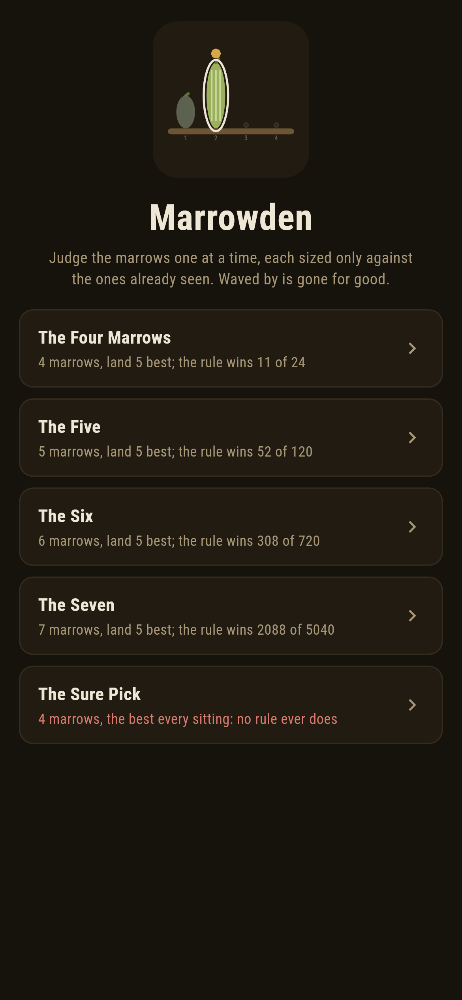
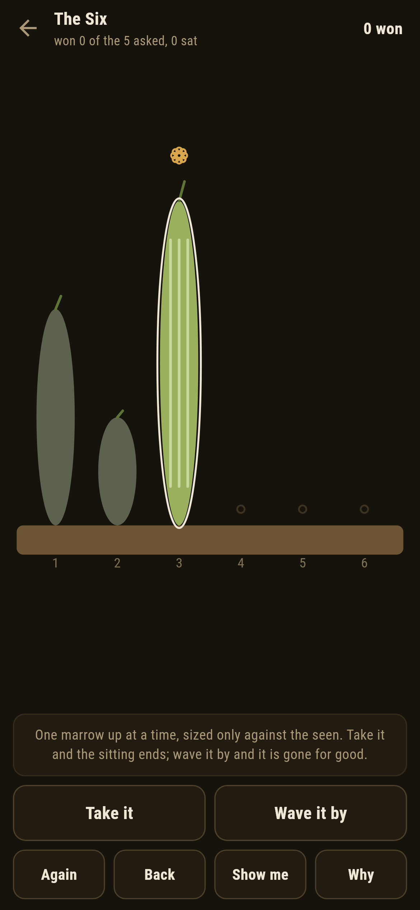
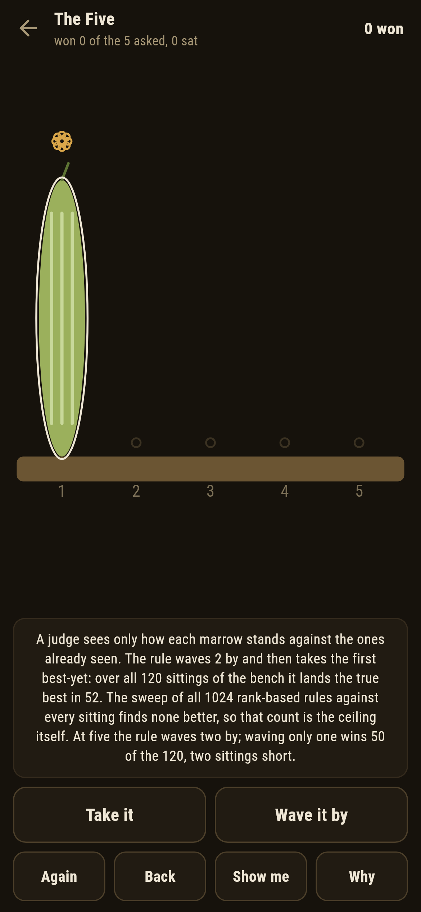
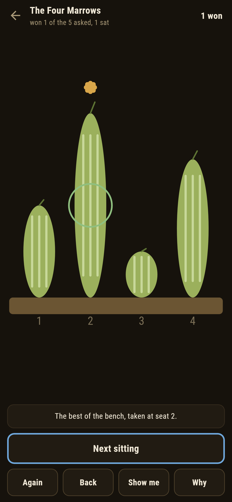
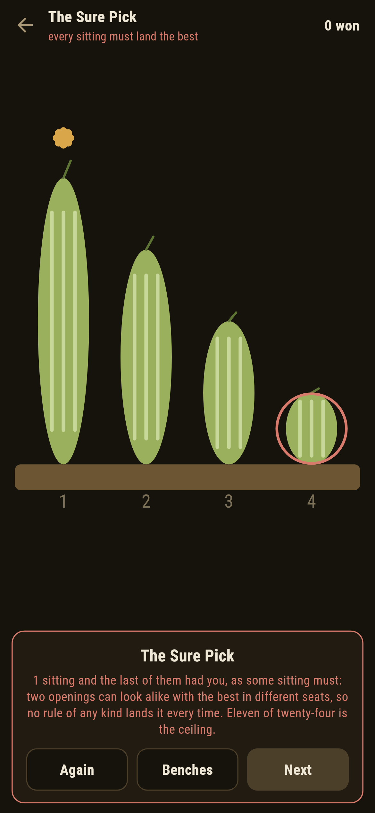
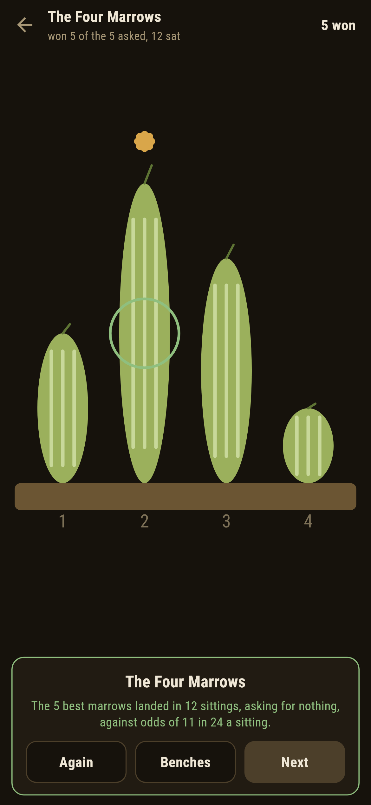

# Marrowden

A judging game for phones, in Flutter, for Android and iOS.

The marrows come up one at a time at the village show, and a judge
sees only how each stands against the ones already seen. Take one
and the sitting ends; wave it by and it is gone for good; the last
must be taken. The sitting is won when the marrow taken turns out
the best of the whole bench. This is the secretary problem judged at
a vegetable show, and the game carries its famous answer whole: wave
a fixed few by, then take the first best-yet, and no rule of any
kind does better.

| | | | |
|---|---|---|---|
|  |  |  |  |

## Two ways of knowing

The suite knows every bench two ways that share nothing. The
wave-them-by rule is a single sentence and plays every sitting of
the bench to its end; the sweep plays every rank-based rule there
is, all 64 on four marrows and all 1,024 on five, against every one
of those sittings, and knows nothing of the rule's shape. Where the
sweep can hold every rule, the rule's count is the ceiling itself,
and every written count below is the walk's own.

```
$ make shows
the wave-them-by rule against every sitting of the bench, and against every rank-based rule where the sweep can hold them all; two sittings open alike with the best in different seats, so no rule of any kind lands it every time

 1 The Four Marrows 4 marrows  wave 1 by: the best lands 11 of 24 sittings, and none of the 64 rules beats it
 2 The Five         5 marrows  wave 2 by: the best lands 52 of 120 sittings, and none of the 1024 rules beats it
 3 The Six          6 marrows  wave 2 by: the best lands 308 of 720 sittings
 4 The Seven        7 marrows  wave 2 by: the best lands 2088 of 5040 sittings
 5 The Sure Pick    4 marrows  land the best every sitting: no rule does, 11 of 24 being the ceiling of all 64
```

## The sure pick

One bench ships labelled hopeless in the house tradition of maps
nobody can win: land the best marrow of every sitting. Two sittings
can open with the same best-yet marrow and hide the true best in
different seats, so whichever way a rule jumps at that opening, one
of the two has it; certainty was never on the bench. The game says
so on the way in, and the first sitting that has you ends the bench
with the fork written out rather than let anyone grind at it. Sweep
all twenty-four sittings by luck and the card says exactly what that
proves, which is nothing.



## The tally that keeps honest

Nothing about the odds is folklore here. Every verdict names the
seat the best sat in and where the taken one truly stood, the tally
above the bench counts the sittings, and the closing card holds the
run against the rule's own fraction. **Show me** lights the button
the rule would press and says why in the rule's own terms, and
**Why** counts the sittings and the rules for the bench in front of
you.



## Building

```
make deps      # fetch packages
make check     # analyze + every test
make shows     # walk every sitting and sweep every rule
make shots     # render the screenshots and redraw the icons
make apk       # Android release build
make ios       # iOS release build (unsigned)
```

The logo and every app icon are drawn by the game's own painter in
`test/mark_test.dart`. There is no image in this repository that was not
produced by code in it.

## How it is put together

```
lib/show/rules.dart      the rule, every sitting of a bench, the
                         sweep of every rank-based rule
lib/show/show.dart       a bench: its marrows and its claims
lib/show/shows.dart      the five benches that ship
lib/show/play.dart       a sitting in progress, and the tally
lib/ui/                  the painter, the screens, the mark
tool/check_shows.dart    the walks, the sweeps, and the ledger above
```

The tests judge sittings by hand against written-out benches, walk
the rule through every sitting of every bench and land exactly the
written counts, sweep all 64 and all 1,024 rules and find the
ceilings, recompute every number the notes claim, run the fork's two
sittings and watch each answer lose one of them, close a bench at
five wins through the real buttons, watch the sure pick fall at its
first miss, and hold the pictures against the real widget tree. If
any of that drifts, `make check` goes red before anything leaves the
machine.
