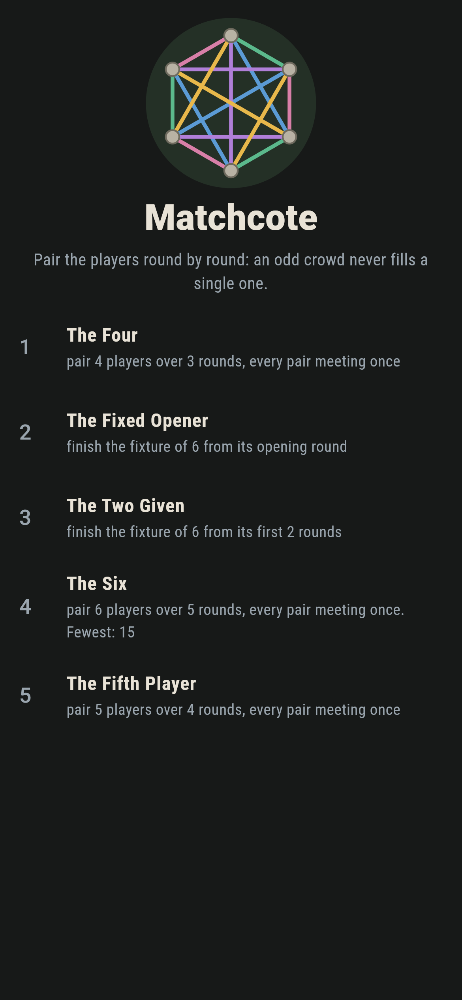
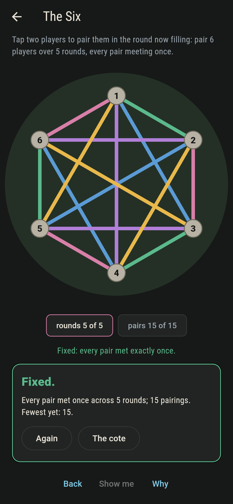
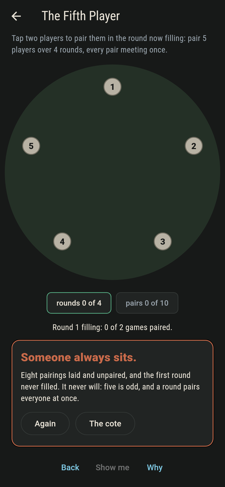
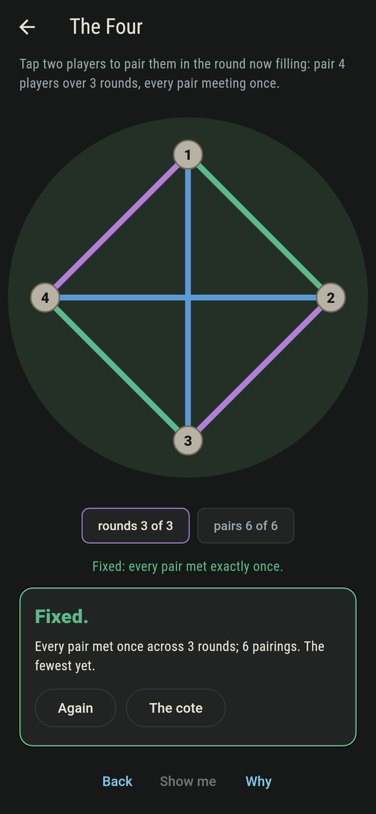
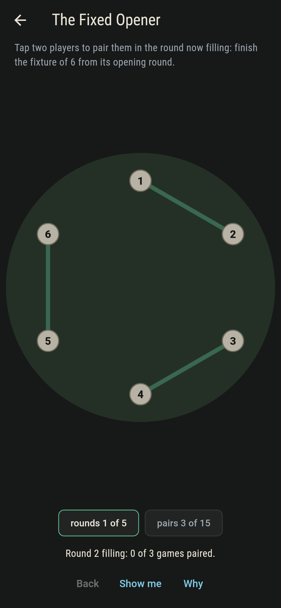
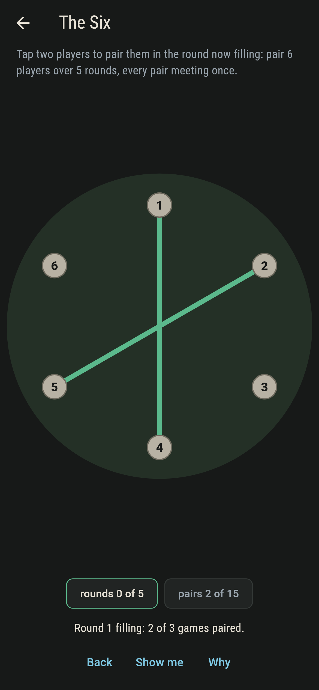
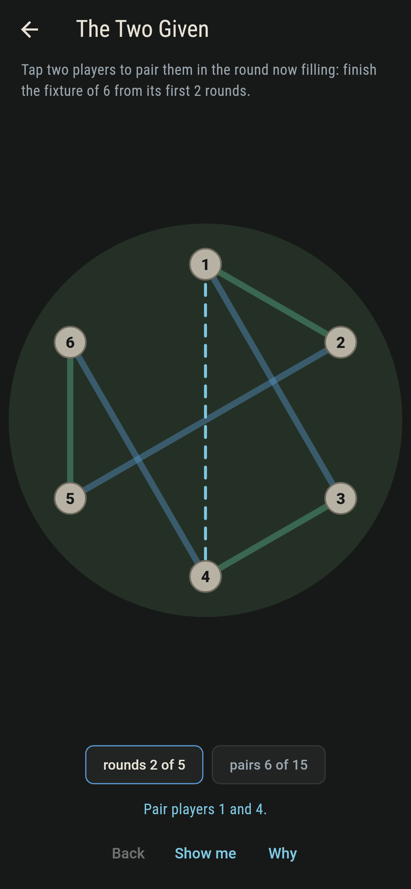
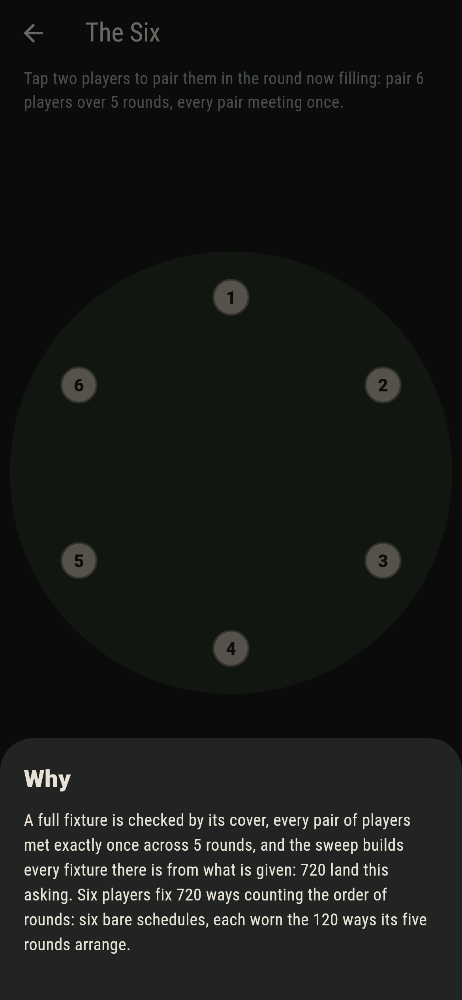

# Matchcote


Players in a ring, paired round by round: each round pairs
everyone at once, and by the last round every pair of players has
met exactly once. Six players fix 720 ways counting the order of
rounds; five players cannot fill a single round, someone sitting
out however the pairs fall.

## The cotes

1. **The Four** - pair 4 players over 3 rounds, every pair meeting once
2. **The Fixed Opener** - finish the fixture of 6 from its opening round
3. **The Two Given** - finish the fixture of 6 from its first 2 rounds
4. **The Six** - pair 6 players over 5 rounds, every pair meeting once
5. **The Fifth Player** - pair 5 players over 4 rounds, every pair meeting once

The Four's six fixtures are one schedule worn six ways. The
Six's 720 are six bare schedules times the 120 orders of their
rounds, and the part-fixed cotes narrow to 48 and then 6. The
Fifth Player asks the impossible politely: a round pairs
everyone, five is odd, and someone always sits.

## Two voices

The game never asserts what it has not computed, and it computes
everything at least twice:

* **The cover** checks a finished fixture pair by pair: every
  round a full pairing, every pair met exactly once.
* **The sweep** builds every fixture there is from whatever
  rounds are given, and counts them: 6, 48, 6, 720, and none
  at all for five players, who cannot fill round one.

`tool/check_cotes.dart` runs both, the orderings identity
included, and refuses the bake on any disagreement.

## The checker's ledger

What `dart run tool/check_cotes.dart` printed for the build this
README shipped with, word for word:

```
every fixture swept, four and six players alike: the counts run 6 and 720 with 48 and 6 from the part-fixed cotes, 720 is six bare schedules times the 120 orders of their rounds, every found fixture covers every pair exactly once, and five players cannot fill one round

 1 The Four           pair 4 players over 3 rounds, every pair meeting once: 6 fixtures of the sweep land it
 2 The Fixed Opener   finish the fixture of 6 from its opening round: 48 fixtures of the sweep land it
 3 The Two Given      finish the fixture of 6 from its first 2 rounds: 6 fixtures of the sweep land it
 4 The Six            pair 6 players over 5 rounds, every pair meeting once: 720 fixtures of the sweep land it
 5 The Fifth Player   pair 5 players over 4 rounds, every pair meeting once: none, since an odd crowd never fills a round
```

## Screenshots

| The coteland | The six fixed | The fifth player admitted |
| --- | --- | --- |
|  |  |  |

| The four | The opener given | A round mid-fill | Show me | The why |
| --- | --- | --- | --- | --- |
|  |  |  |  |  |

Screenshots are drawn by `test/showcase_test.dart` at real phone
sizes with the app's own painter, then copied into `docs/` as
they came out; every pairing in them was tapped, so nothing
pictured is a cote the game could not reach. The logo and every
launcher icon come out of `test/mark_test.dart` the same way:
the mark is a full fixture of six.

## Building

```
flutter test          # 44 tests, the sweep among them
dart run tool/check_cotes.dart
flutter build apk     # or: flutter build ios
```
