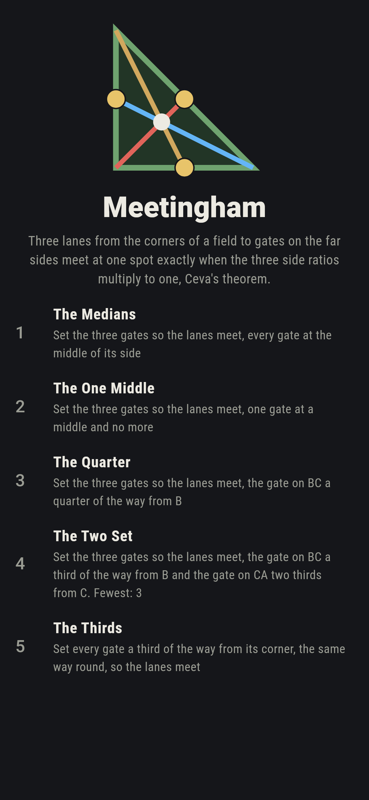
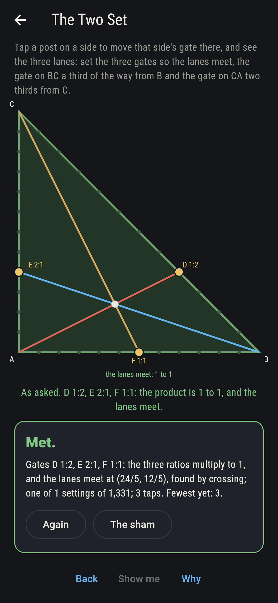
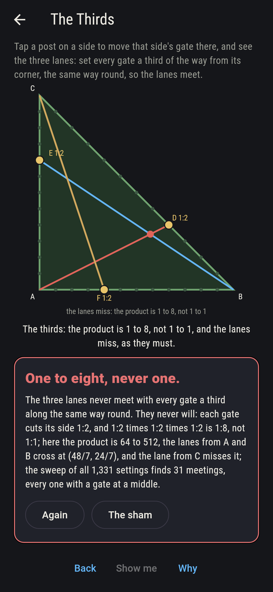
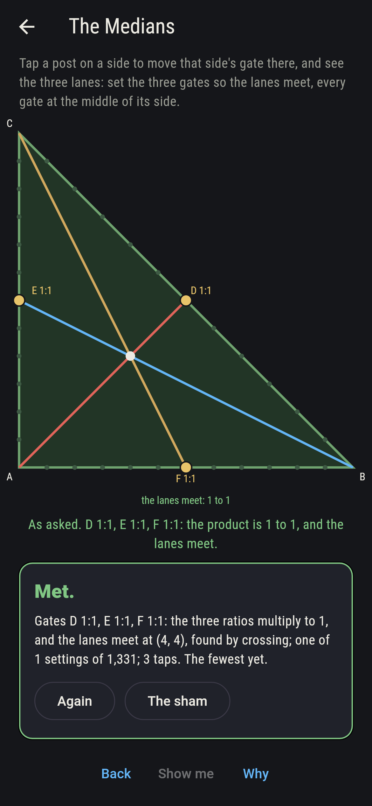
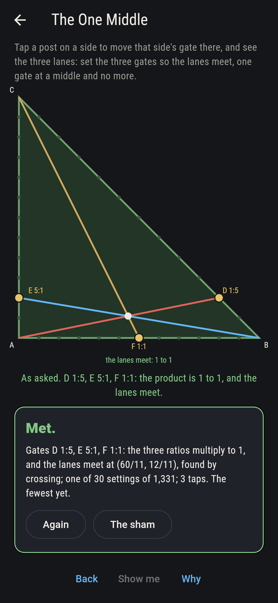
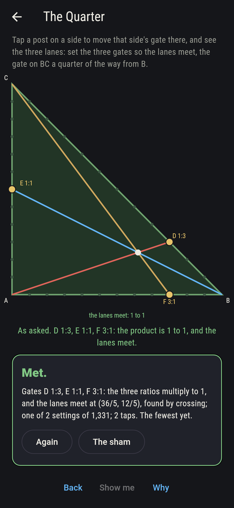
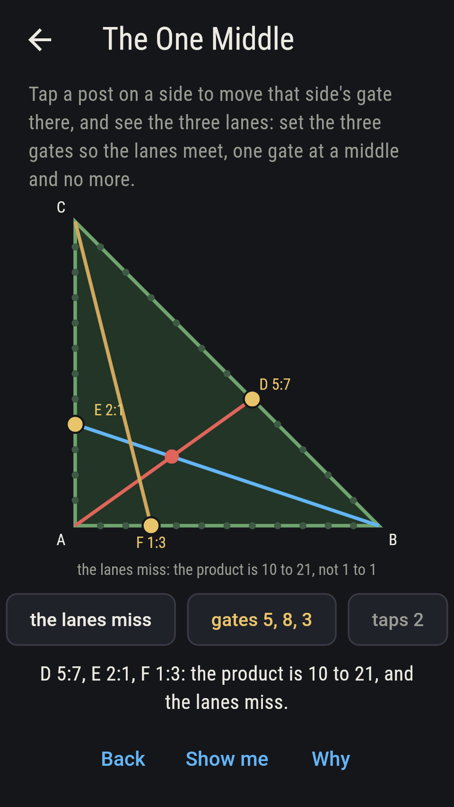
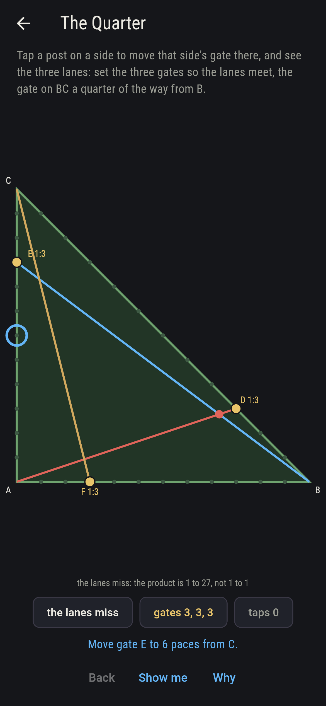
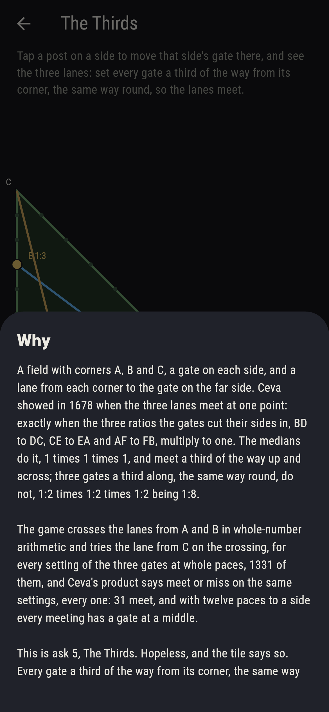

# Meetingham


A field with corners A, B and C, a gate on each side, and a lane from
each corner to the gate on the far side. Ceva showed in 1678 when the
three lanes meet at one point: exactly when the three ratios the
gates cut their sides in, BD to DC, CE to EA and AF to FB, multiply
to one. The medians do it, 1 times 1 times 1, and meet a third of the
way up and across; three gates a third along, the same way round, do
not, 1:2 times 1:2 times 1:2 being 1:8. Tap a post on a side to move
that side's gate there and watch the lanes. The game crosses the lanes
from A and B in whole-number arithmetic and tries the lane from C on
the crossing, for every setting of the three gates at whole paces on
the field of twelve, 1,331 of them, and Ceva's product says meet or
miss on the same settings, every one.

## The asks

1. **The Medians** - set the three gates so the lanes meet, every gate at the middle of its side
2. **The One Middle** - set the three gates so the lanes meet, one gate at a middle and no more
3. **The Quarter** - set the three gates so the lanes meet, the gate on BC a quarter of the way from B
4. **The Two Set** - set the three gates so the lanes meet, the gate on BC a third of the way from B and the gate on CA two thirds from C
5. **The Thirds** - set every gate a third of the way from its corner, the same way round, so the lanes meet

The medians meet at (4, 4), the centre of the field, one setting of
the 1,331; thirty more settings meet with one gate at a middle, and
those thirty are all the other meetings there are, since with twelve
paces to a side every meeting has a middle gate; the gate on BC a
quarter from B meets two ways, E at the middle and F at 3:1 or E at
3:1 and F at the middle; and D at 1:2 with E at 2:1 meets only with F
at the middle, at (24/5, 12/5). The Thirds is labeled hopeless on its
tile: 1:2 times 1:2 times 1:2 is 1:8, and the sham admits it the
moment the thirds are set, either way round.

## Two voices

The game never asserts what it has not computed, and it computes
everything at least twice:

* **The crossing** finds where the lanes from A and B cross, in
  whole-number arithmetic with the point kept as fractions, and tries
  the lane from C on that point by a cross product; every count on the
  sham is that sweep's over all 1,331 settings, and the meeting points
  named are the crossing's.
* **Ceva's product** crosses nothing: the three ratios multiplied, BD
  to DC, CE to EA and AF to FB, come to one exactly when the crossing
  finds a meeting, on every one of the 1,331 settings; 31 meet, every
  one with a gate at a middle, and two gates at middles force the
  third to the middle.

`tool/check_lanes.dart` runs the lot and refuses the bake on any
disagreement.

## The checker's ledger

What `dart run tool/check_lanes.dart` printed for the build this
README shipped with, word for word:

```
every setting of the three gates at whole paces on the field of twelve, 1,331 settings, the lanes from A and B crossed in whole-number arithmetic and the lane from C tried on the crossing, and Ceva's product of the three ratios worked beside it: the two say meet or miss alike on all 1,331; 31 settings meet, the medians at (4, 4) and thirty more, and every one of the 31 has a gate at a middle; two gates at middles force the third to the middle; the gate on BC a quarter from B meets 2 ways, E middle and F 3:1 or E 3:1 and F middle; D at 1:2 and E at 2:1 meet only with F at the middle, at (24/5, 12/5); and every gate a third along, the same way round, gives 1:8 one way and 8:1 the other and never meets

 1 The Medians    set the three gates so the lanes meet, every gate at the middle of its side: 1 of the 1,331 settings lands it
 2 The One Middle set the three gates so the lanes meet, one gate at a middle and no more: 30 of the 1,331 settings land it
 3 The Quarter    set the three gates so the lanes meet, the gate on BC a quarter of the way from B: 2 of the 1,331 settings land it
 4 The Two Set    set the three gates so the lanes meet, the gate on BC a third of the way from B and the gate on CA two thirds from C: 1 of the 1,331 settings lands it
 5 The Thirds     set every gate a third of the way from its corner, the same way round, so the lanes meet: none of the 1,331, and the product said so first
```

## Screenshots

| The sham | The two set | The thirds admitted |
| --- | --- | --- |
|  |  |  |

| The medians | The one middle | The quarter | Midway, on the small phone | Show me | The why |
| --- | --- | --- | --- | --- | --- |
|  |  |  |  |  |  |

Screenshots are drawn by `test/showcase_test.dart` at real phone
sizes with the app's own painter, then copied into `docs/` as they
came out; every gate in them was moved by a tap, so nothing pictured
is a setting the game could not reach. The logo and every launcher
icon come out of `test/mark_test.dart` the same way: the mark is the
field with the medians meeting.

## Building

```
flutter test          # 41 tests, the sweep among them
dart run tool/check_lanes.dart
flutter build apk     # or: flutter build ios
```
