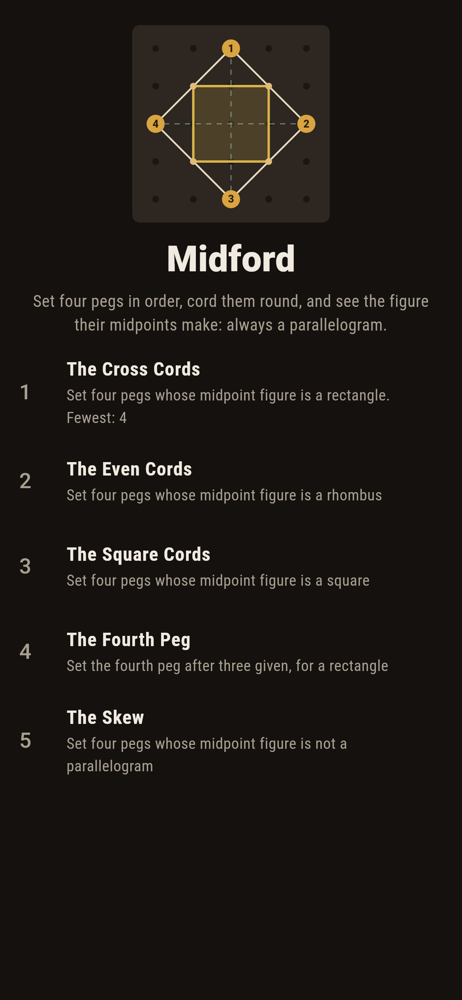
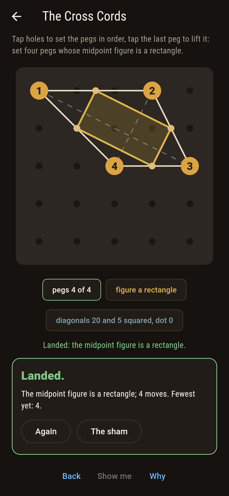
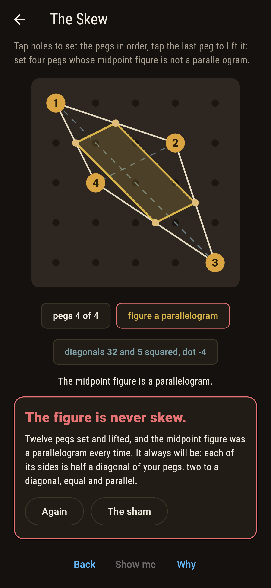
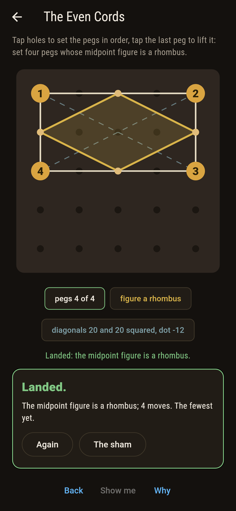
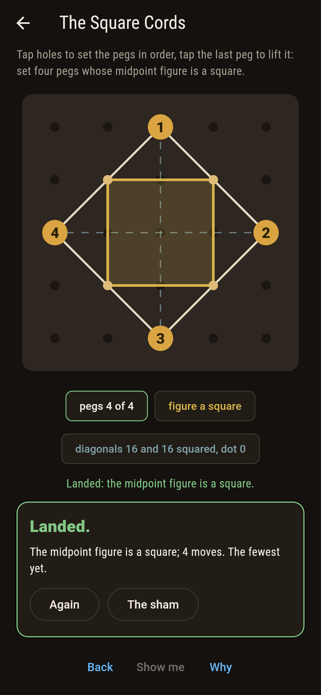
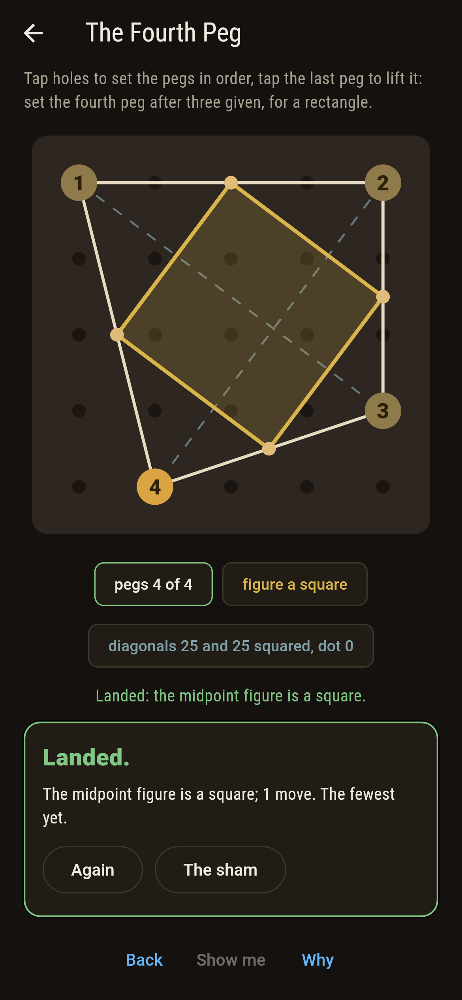
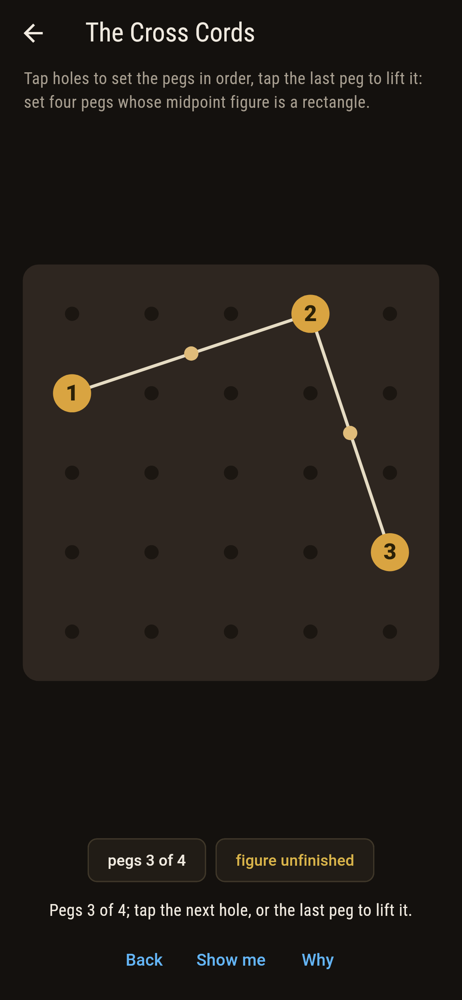
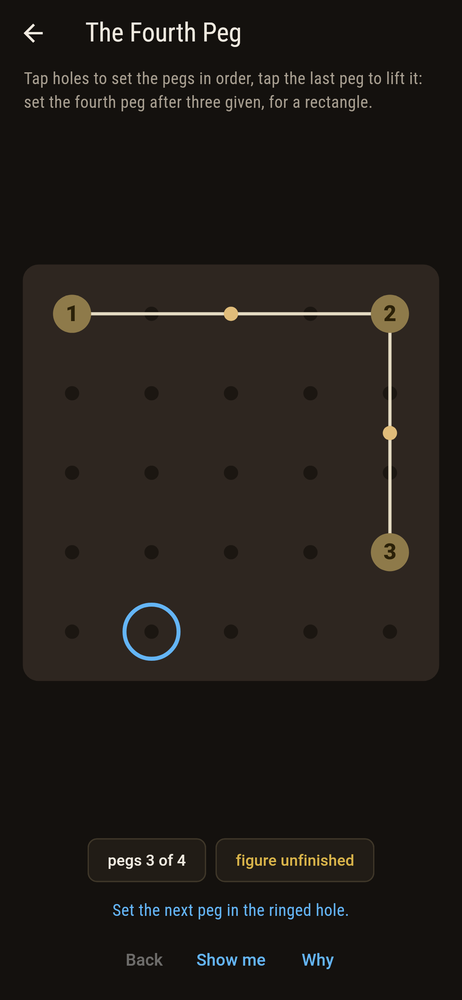
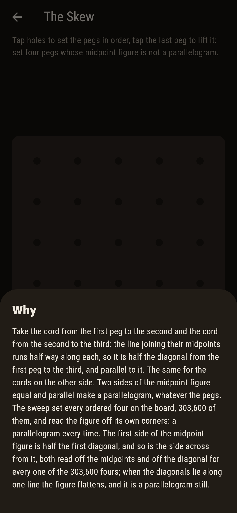

# Midford


Four pegs set in order, a cord run from each to the next and back
to the first, and the midpoints of the four cords joined in their
turn. Varignon saw in 1731 that the midpoint figure is always a
parallelogram, whatever four pegs you set: the cord from the first
midpoint to the second is half the diagonal from the first peg to
the third, and so is the cord across from it, so those two are
equal and parallel. The midpoint figure is a rectangle exactly
when the two diagonals cross square, a rhombus exactly when they
are of a length, and a square when both. It is never skew.

## The cordings

1. **The Cross Cords** - set four pegs whose midpoint figure is a rectangle
2. **The Even Cords** - set four pegs whose midpoint figure is a rhombus
3. **The Square Cords** - set four pegs whose midpoint figure is a square
4. **The Fourth Peg** - set the fourth peg after three given, for a rectangle
5. **The Skew** - set four pegs whose midpoint figure is not a parallelogram

Of the 303,600 ordered fours on the board, 27,952 make a
rectangle, 18,384 a rhombus and 11,248 a square; 27,872 lie flat,
their diagonals along one line, and none is skew. Three pegs at
the corner of the board take one fourth of twenty-two for a
rectangle. The Skew is labeled hopeless on its tile, and the why
halves the diagonal.

## Two voices

The game never asserts what it has not computed, and it computes
everything at least twice:

* **The midpoints** are read off directly: the four midpoints
  found in whole numbers, doubled, and the figure judged by its
  own corners, side against side and corner against corner.
* **The diagonals** give the same answers with no midpoint in
  sight: Varignon's halves say the first side of the figure is
  half the first diagonal and so is the third, checked on every
  one of the 303,600 fours; a rectangle exactly when the diagonals
  cross square, a rhombus exactly when they are of a length, and
  the two readings agree on every four.

`tool/check_cords.dart` runs the lot and refuses the bake on any
disagreement.

## The checker's ledger

What `dart run tool/check_cords.dart` printed for the build this
README shipped with, word for word:

```
every ordered four of pegs on the board swept, 303,600 of them, and the midpoint figure read two ways, off its own corners and off the diagonals: a parallelogram every time, Varignon's halves agreeing on all 303,600, a rectangle 27,952 times, a rhombus 18,384, a square 11,248, flat 27,872 and skew never; three pegs at the corner of the board take one fourth of twenty-two for a rectangle

 1 The Cross Cords   set four pegs whose midpoint figure is a rectangle: 27,952 of the 303,600 ordered fours land it
 2 The Even Cords    set four pegs whose midpoint figure is a rhombus: 18,384 of the 303,600 ordered fours land it
 3 The Square Cords  set four pegs whose midpoint figure is a square: 11,248 of the 303,600 ordered fours land it
 4 The Fourth Peg    set the fourth peg after three given, for a rectangle: 1 of the 22 ordered fours lands it
 5 The Skew          set four pegs whose midpoint figure is not a parallelogram: none of the 303,600, and the halves said so first
```

## Screenshots

| The sham | The cross cords landed | The skew admitted |
| --- | --- | --- |
|  |  |  |

| The even cords | The square cords | The fourth peg | Mid-cording | Show me | The why |
| --- | --- | --- | --- | --- | --- |
|  |  |  |  |  |  |

Screenshots are drawn by `test/showcase_test.dart` at real phone
sizes with the app's own painter, then copied into `docs/` as they
came out; every peg in them was tapped, so nothing pictured is a
board the game could not reach. The logo and every launcher icon
come out of `test/mark_test.dart` the same way: the mark is a kite
of pegs with a square inside.

## Building

```
flutter test          # 44 tests, the sweep among them
dart run tool/check_cords.dart
flutter build apk     # or: flutter build ios
```
