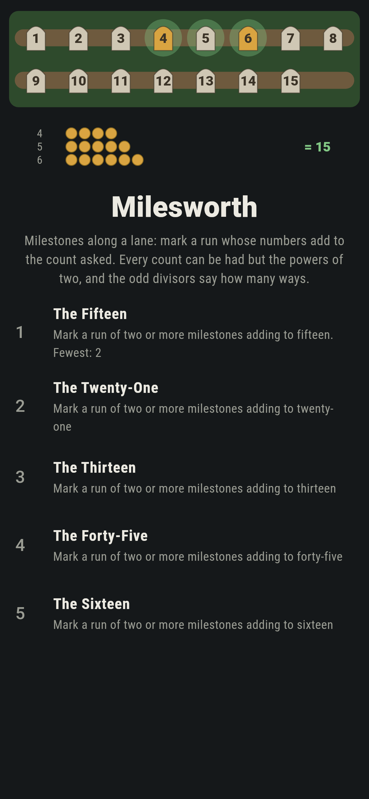
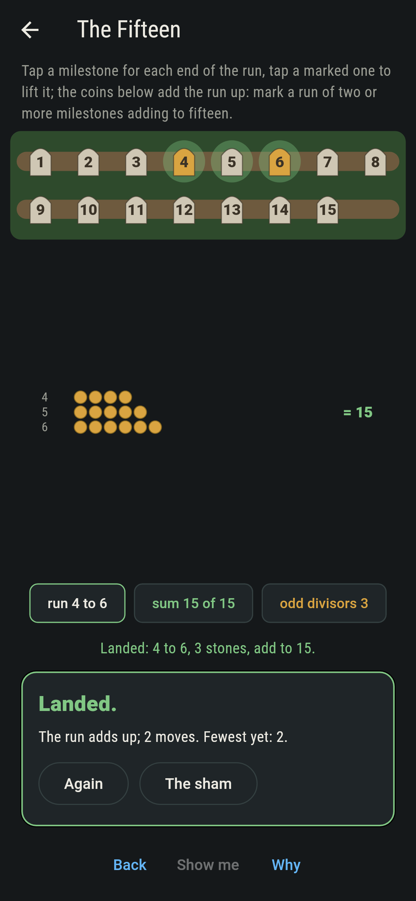
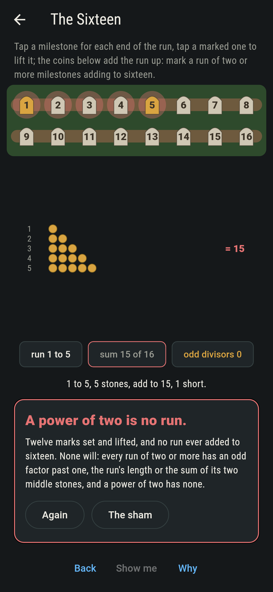
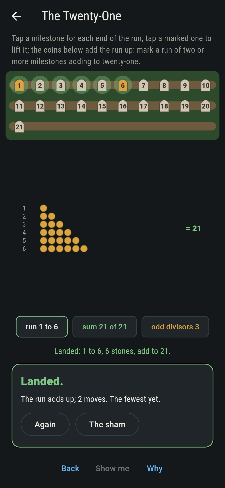
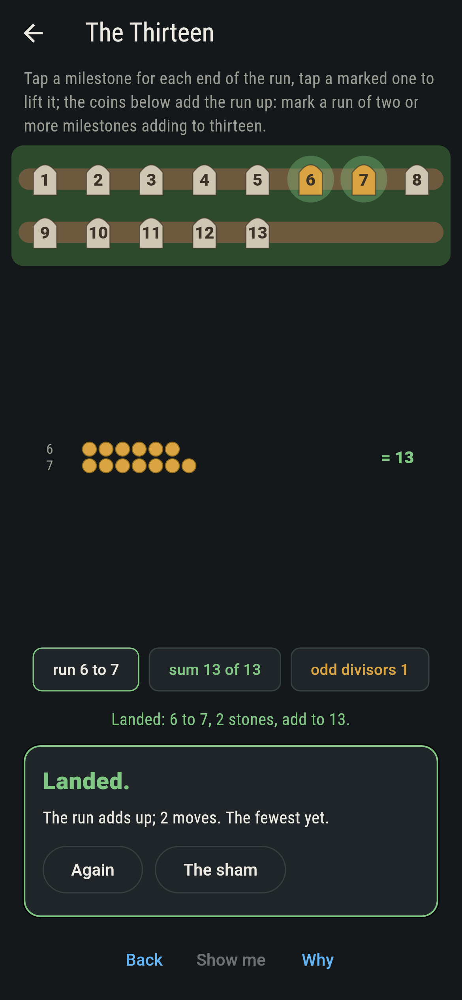
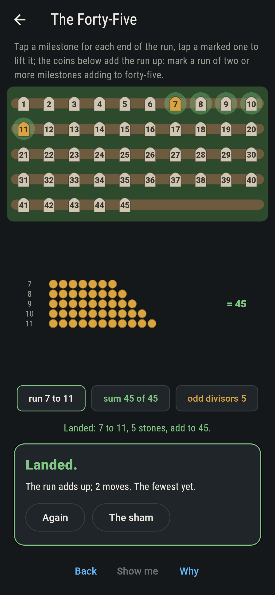
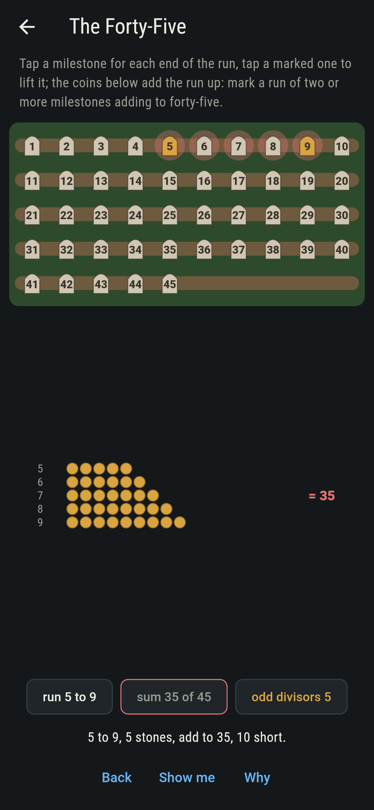
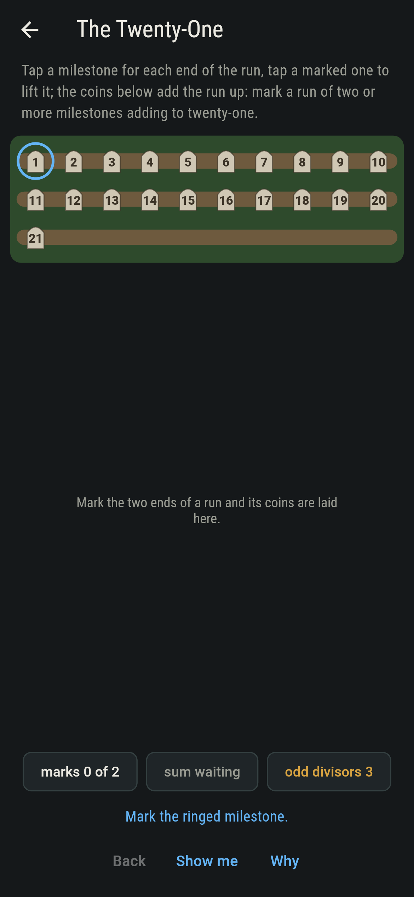
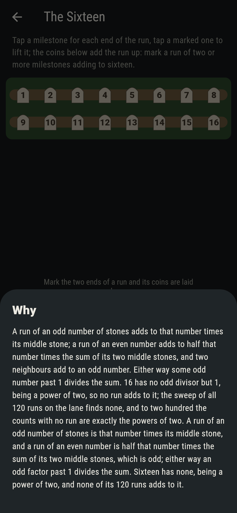

# Milesworth


Milestones along a lane, numbered from one, and a run of them to
mark: two or more in a row whose numbers add to the count asked.
Fifteen is 4, 5, 6, or 1 to 5, or 7, 8; thirteen is 6, 7 and
nothing else; sixteen is nothing at all. The rule is old and
short: a run of an odd number of stones is that number times its
middle stone, and a run of an even number is half that number
times the sum of its two middle stones, which is odd, so every run
carries an odd factor past one, and the runs of a count are one to
each odd divisor of it. A power of two has none. Every run on
every lane to two hundred is swept, and the odd divisors build the
same runs, one for one.

## The lanes

1. **The Fifteen** - mark a run of two or more milestones adding to fifteen
2. **The Twenty-One** - mark a run of two or more milestones adding to twenty-one
3. **The Thirteen** - mark a run of two or more milestones adding to thirteen
4. **The Forty-Five** - mark a run of two or more milestones adding to forty-five
5. **The Sixteen** - mark a run of two or more milestones adding to sixteen

Fifteen runs three ways of 105, one for each of its odd divisors
3, 5 and 15; twenty-one three ways of 210; thirteen once of 78,
6 and 7, as every odd count is the run of two either side of its
half; forty-five five ways of 990. The Sixteen is labeled hopeless
on its tile, and the why finds the odd factor in every run.

## Two voices

The game never asserts what it has not computed, and it computes
everything at least twice:

* **The sweep** marks every run of two or more on the lane, adds
  it up, and keeps the ones that add to the count; every count on
  the sham is that sweep's.
* **The odd divisors** build the runs with no sweep: for each odd
  divisor d past one, the run of d stones centred on the count
  over d, or, when that centre stands too near the start for d
  stones, the run that is left when the stones past the start
  fold back and cancel. On every lane to two hundred the two agree
  run for run, and the lanes with no run are exactly the powers
  of two.

`tool/check_runs.dart` runs the lot and refuses the bake on any
disagreement.

## The checker's ledger

What `dart run tool/check_runs.dart` printed for the build this
README shipped with, word for word:

```
every run of two or more milestones swept on every lane to two hundred, 1,333,300 runs on 200 lanes, and the runs that add to the count are exactly the runs the odd divisors build, one run to each odd divisor past one, so a count has none exactly when it is a power of two, eight lanes of the two hundred; fifteen runs three ways, 1 to 5, 4 to 6 and 7, 8, thirteen once as 6, 7, forty-five five ways, and every odd count is the run of two either side of its half

 1 The Fifteen    mark a run of two or more milestones adding to fifteen: 3 of the 105 runs land it
 2 The Twenty-One mark a run of two or more milestones adding to twenty-one: 3 of the 210 runs land it
 3 The Thirteen   mark a run of two or more milestones adding to thirteen: 1 of the 78 runs lands it
 4 The Forty-Five mark a run of two or more milestones adding to forty-five: 5 of the 990 runs land it
 5 The Sixteen    mark a run of two or more milestones adding to sixteen: none of the 120, and the odd divisors said so first
```

## Screenshots

| The sham | The fifteen run | The sixteen admitted |
| --- | --- | --- |
|  |  |  |

| The twenty-one | The thirteen | The forty-five | Mid-marking | Show me | The why |
| --- | --- | --- | --- | --- | --- |
|  |  |  |  |  |  |

Screenshots are drawn by `test/showcase_test.dart` at real phone
sizes with the app's own painter, then copied into `docs/` as they
came out; every mark in them was set by a tap, so nothing pictured
is a lane the game could not reach. The logo and every launcher
icon come out of `test/mark_test.dart` the same way: the mark is
the lane of fifteen with 4, 5, 6 marked and their coins below.

## Building

```
flutter test          # 46 tests, the sweep among them
dart run tool/check_runs.dart
flutter build apk     # or: flutter build ios
```
