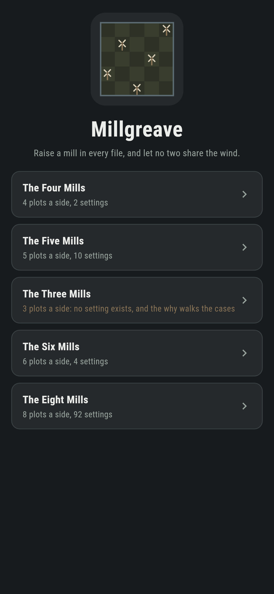
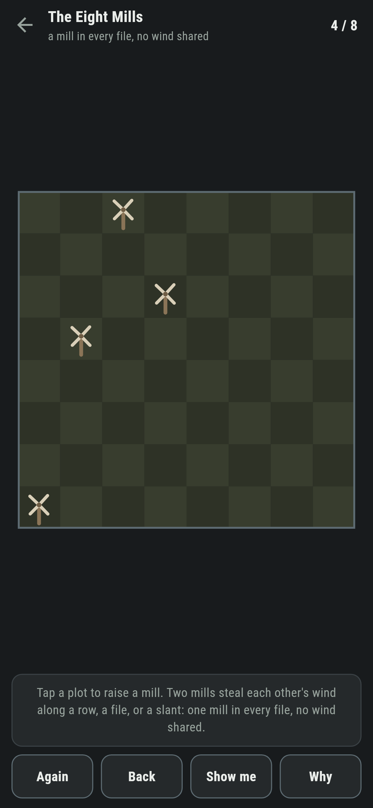
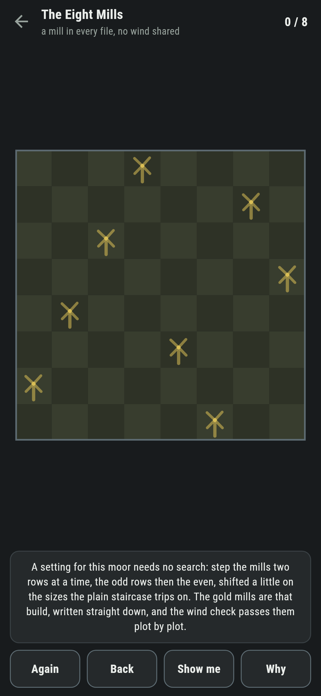
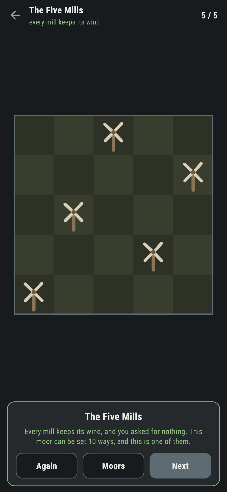
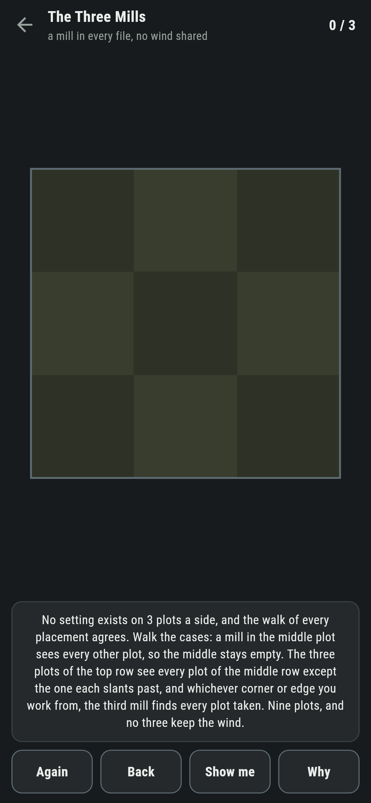
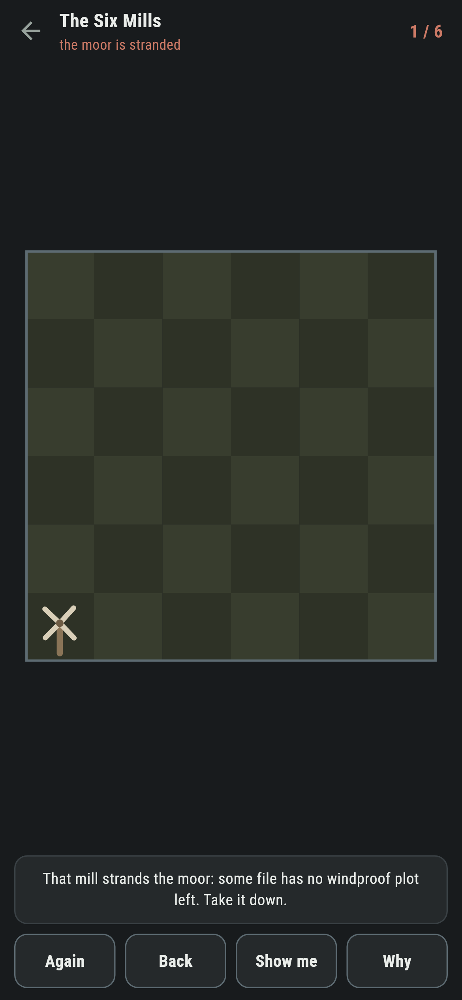

# Millgreave

A windmill puzzle for phones, in Flutter, for Android and iOS.

A square moor, a mill wanted in every file, and one law of the wind: two
mills on the same row, file, or slant steal each other's wind. Raise
them all, and every sail keeps turning. This is the old queens problem
wearing working clothes, and the moor teaches both of its faces.

| | | | |
|---|---|---|---|
|  |  |  |  |

## The counts are the counts

```
$ make moors
the built rows keep the wind on every moor from four to twelve

 1 The Four Mills   4 plots a side  2 settings  written down 2
 2 The Five Mills   5 plots a side  10 settings  written down 10
 3 The Three Mills  3 plots a side  no setting at all  written down 0
 4 The Six Mills    6 plots a side  4 settings  written down 4
 5 The Eight Mills  8 plots a side  92 settings  written down 92
```

Ninety two on eight, ten on five, and six is the spiky one: only four
settings on the whole moor, the fewest of any size past three. Every
count is by full backtracking, and every shipped number is held against
it.

## A setting needs no search

For any moor of four plots or more, a setting can be written straight
down: step the mills two rows at a time, odds then evens, shifted a
little on the sizes where that staircase trips, six-remainder two and
three, by the old rules. **Why** raises that build as gold ghost mills
on the moor in front of you, and the suite checks the built rows keep
the wind at every size from four to twelve, plot against plot.


## The Three Mills

Three plots a side has no setting at all, and the why walks the cases by
hand: the middle plot sees everything, so it stays empty, and from there
every start runs out of clear plots by the third mill. The search
agrees, all nine-choose-three of it, and the moor ships labelled in the
house tradition of maps nobody can win.



## Stranding is known at once

A mill can stand windproof and still doom the moor: some file left with
no clear plot. The game keeps a live answer to whether the rest can
still be set, and the moment a mill strands it the ledger goes red, with
Back to take it down. A refused plot names its thief, file and row.



## Building

```
make deps    # fetch packages
make check   # analyze + every test
make moors   # the built rows and the counts, then the ledger
make shots   # render the screenshots and redraw the icons
make apk     # Android release build
make ios     # iOS release build (unsigned)
```

The logo and every app icon are drawn by the game's own painter in
`test/mark_test.dart`. There is no image in this repository that was not
produced by code in it.

## How it is put together

```
lib/moor/rules.dart     the wind, the counts, and the built rows
lib/moor/moor.dart      a moor: its size and its verdict
lib/moor/moors.dart     the five moors that ship
lib/moor/play.dart      a moor being set: mills, thieves, the live answer
lib/ui/                 the painter, the screens, the mark
tool/check_moors.dart   the ledger above
```

The tests pin the classic counts to twelve, check the built rows keep
the wind size by size, verify the impossible sizes are impossible, walk
every possible moor to windproof by following the game's own pointer,
and hold the pictures against the real widget tree. If any of that
drifts, `make check` goes red before anything leaves the machine.
