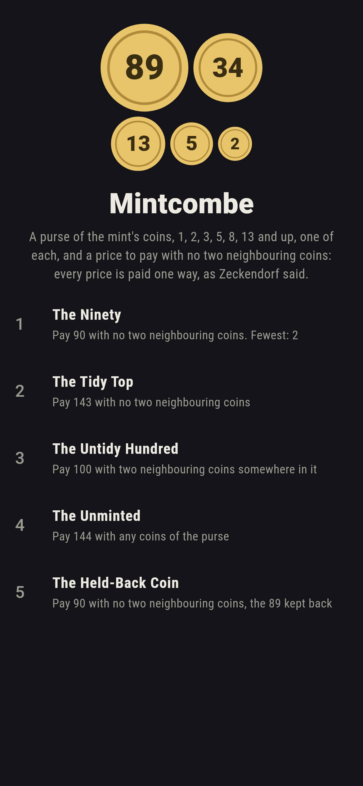
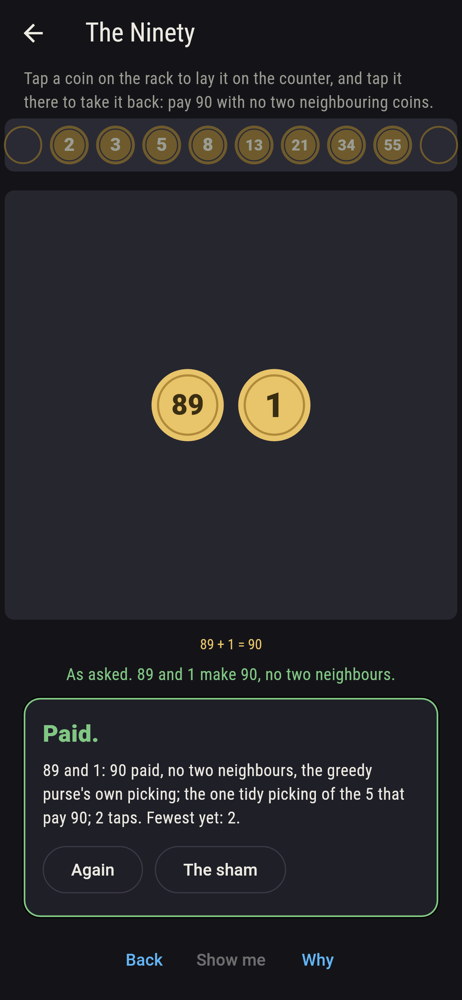
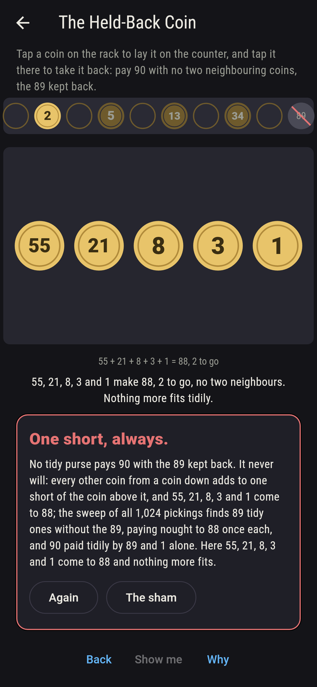
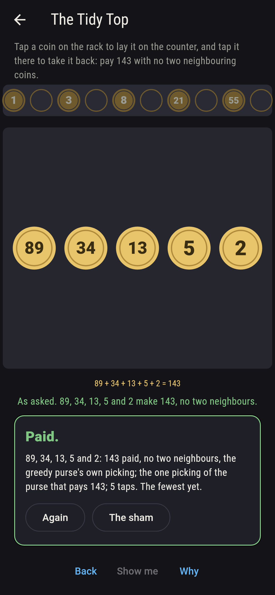
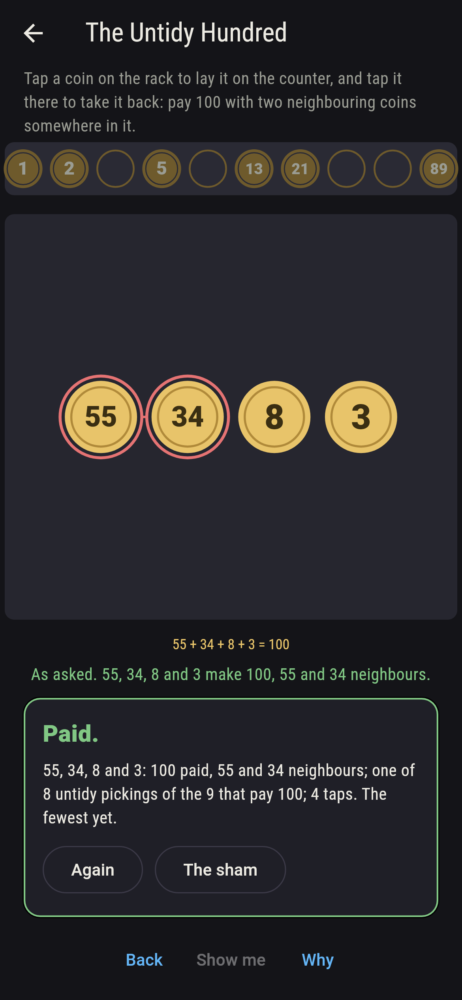
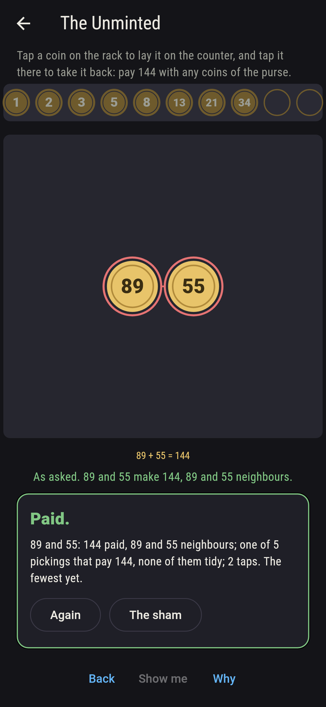
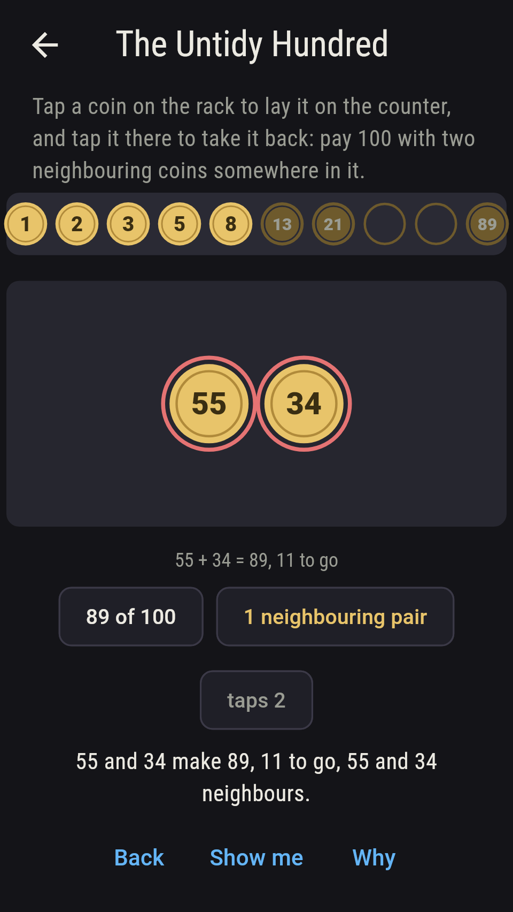
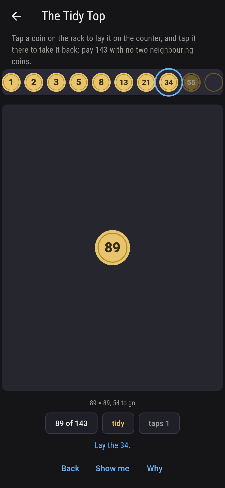
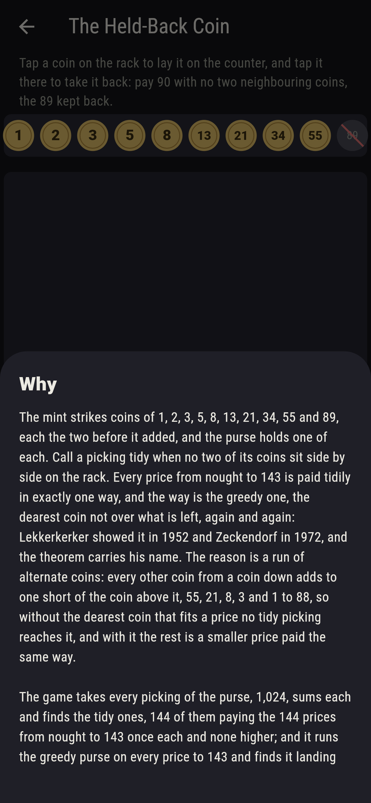

# Mintcombe


The mint strikes coins of 1, 2, 3, 5, 8, 13, 21, 34, 55 and 89, each
the two before it added, and the purse holds one of each. Call a
picking tidy when no two of its coins sit side by side on the rack.
Every price from nought to 143 is paid tidily in exactly one way,
and the way is the greedy one, the dearest coin not over what is
left, again and again: Lekkerkerker showed it in 1952 and Zeckendorf
in 1972, and the theorem carries his name. The reason is a run of
alternate coins: every other coin from a coin down adds to one short
of the coin above it, 55, 21, 8, 3 and 1 to 88, so without the
dearest coin that fits a price no tidy picking reaches it, and with
it the rest is a smaller price paid the same way. Tap a coin on the
rack to lay it on the counter, and tap it there to take it back. The
game takes every picking of the purse, 1,024, sums each and finds
the tidy ones, 144 of them paying the 144 prices from nought to 143
once each and none higher; and it runs the greedy purse on every
price to 231 and finds it landing the tidy picking every time to
143, with the fewest coins any picking uses, and paying untidily
from 144 up.

## The asks

1. **The Ninety** - pay 90 with no two neighbouring coins
2. **The Tidy Top** - pay 143 with no two neighbouring coins
3. **The Untidy Hundred** - pay 100 with two neighbouring coins somewhere in it
4. **The Unminted** - pay 144 with any coins of the purse
5. **The Held-Back Coin** - pay 90 with no two neighbouring coins, the 89 kept back

Five pickings of the purse pay 90 and one of them is tidy, 89 and 1,
the greedy purse taking the 89 first. A hundred and forty-three is
the dearest price the tidy purse pays, 89, 34, 13, 5 and 2, every
other coin from the top, and no other picking of the purse pays it
at all: the runs of alternate coins add to 1, 2, 4, 7, 12, 20, 33,
54, 88 and 143, one short of the coin above each, and those and
nought are the only prices below 144 paid one way, while 105, 113,
118 and 126 are paid ten ways, the most. Nine pickings pay 100 and
eight of them are untidy, 55, 34, 8 and 3 the shortest; the tidy one
is 89, 8 and 3, and no picking pays 100 with fewer coins. A hundred
and forty-four is 89 and 55 added, the coin the mint never struck,
and the purse pays it five ways, every one untidy. The Held-Back
Coin is labeled hopeless on its tile: with the 89 kept back the tidy
purse pays 88 at most, 55, 21, 8, 3 and 1, one short; the sham
admits it when nothing more fits tidily, or after sixteen taps.

## Two voices

The game never asserts what it has not computed, and it computes
everything at least twice:

* **The sweep** takes every picking of the ten coins, 1,024 of them,
  sums each, and sorts the tidy from the untidy; every count on the
  sham is that sweep's, and it finds every price to 231 paid, the
  tidy pickings 144 for the 144 prices to 143 once each, and the
  runs of alternate coins one short of the coin above.
* **The greedy purse** sweeps nothing: it takes the dearest coin not
  over what is left, again and again, and for every price to 143 it
  lands the sweep's one tidy picking, with as few coins as any
  picking that pays the price; from 144 to 231 it pays too, and the
  sweep agrees that no tidy picking does.

`tool/check_purses.dart` runs the lot and refuses the bake on any
disagreement.

## The checker's ledger

What `dart run tool/check_purses.dart` printed for the build this
README shipped with, word for word:

```
every picking of the purse's ten coins taken, 1,024, and every price from nought to 231 paid by one at least; the tidy pickings, no two coins neighbours on the rack, are 144 and pay the prices from nought to 143 once each and none higher, and the greedy purse, the dearest coin not over what is left again and again, pays every one of those 144 prices tidily, lands the sweep's tidy picking every time and with the fewest coins any picking uses, and pays every price from 144 to 231 as well, untidily every time; every other coin from a coin down adds to one short of the coin above it, 1, 2, 4, 7, 12, 20, 33, 54, 88 and 143, and those and nought are the prices below 144 paid one way only, while 105, 113, 118 and 126 are paid ten ways, the most; 90 is 89 and 1 tidily and five ways in all, 100 is 89, 8 and 3 tidily and nine ways, 143 is 89, 34, 13, 5 and 2 and no other way, and 144, the coin the mint never struck, is paid five ways and never tidily; without the 89 the tidy purse pays 88 at most, 89 pickings for the prices to 88

 1 The Ninety         pay 90 with no two neighbouring coins: 1 of the 1,024 pickings lands it
 2 The Tidy Top       pay 143 with no two neighbouring coins: 1 of the 1,024 pickings lands it
 3 The Untidy Hundred pay 100 with two neighbouring coins somewhere in it: 8 of the 1,024 pickings land it
 4 The Unminted       pay 144 with any coins of the purse: 5 of the 1,024 pickings land it
 5 The Held-Back Coin pay 90 with no two neighbouring coins, the 89 kept back: none of the 1,024, and the run of alternate coins said so first
```

## Screenshots

| The sham | The ninety | The held-back coin admitted |
| --- | --- | --- |
|  |  |  |

| The tidy top | The untidy hundred | The unminted | Midway, on the small phone | Show me | The why |
| --- | --- | --- | --- | --- | --- |
|  |  |  |  |  |  |

Screenshots are drawn by `test/showcase_test.dart` at real phone
sizes with the app's own painter, then copied into `docs/` as they
came out; every coin in them was laid by a tap on the rack, so
nothing pictured is a picking the game could not reach. The logo and
every launcher icon come out of `test/mark_test.dart` the same way:
the mark is the tidy top, 89, 34, 13, 5 and 2, every other coin from
the top of the purse.

## Building

```
flutter test          # 46 tests, the sweep among them
dart run tool/check_purses.dart
flutter build apk     # or: flutter build ios
```
