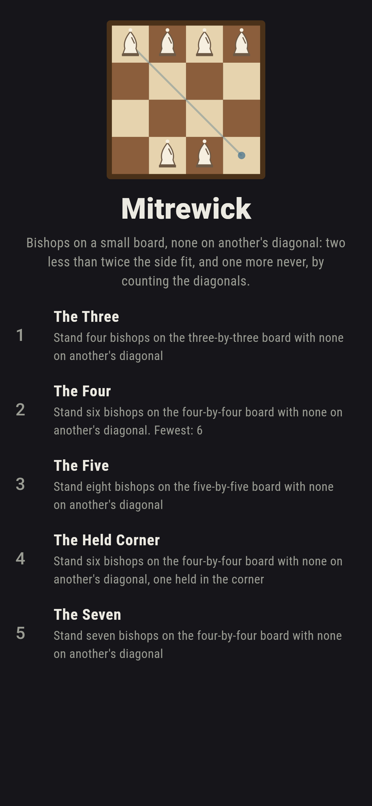
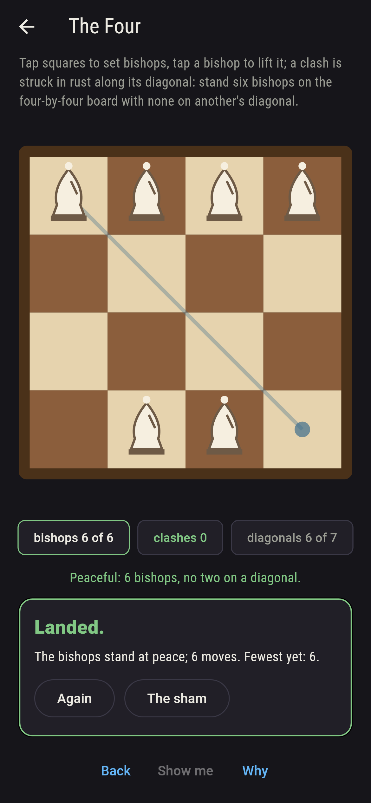
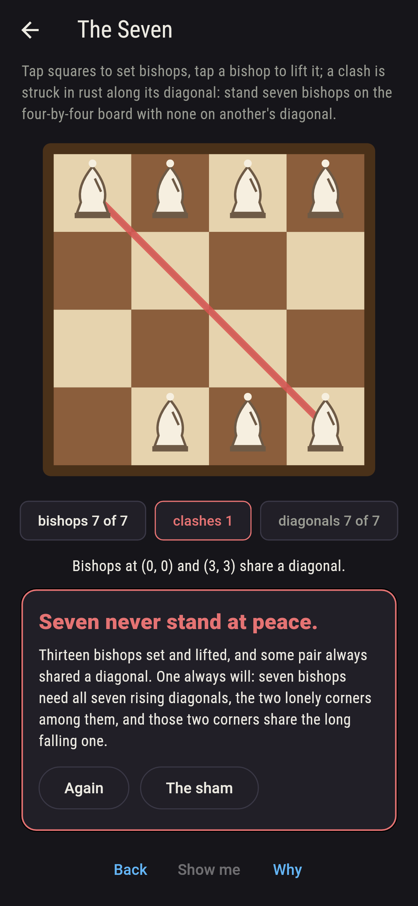
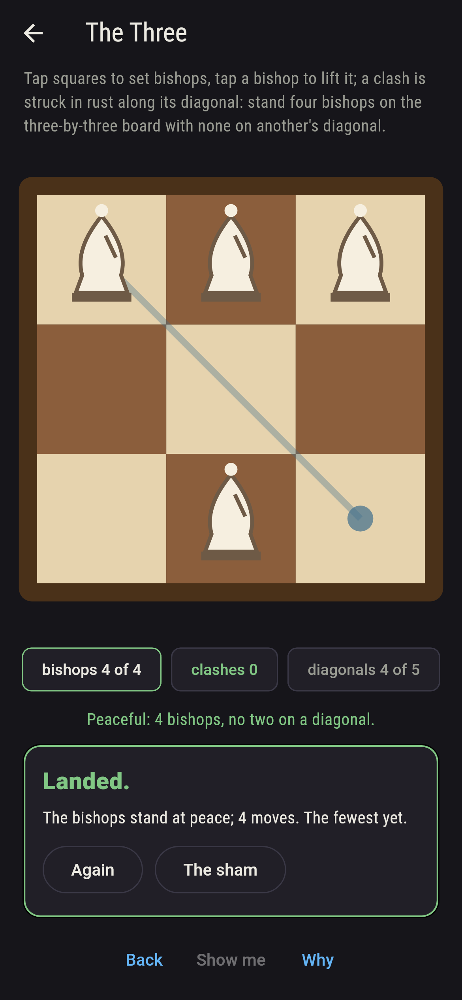
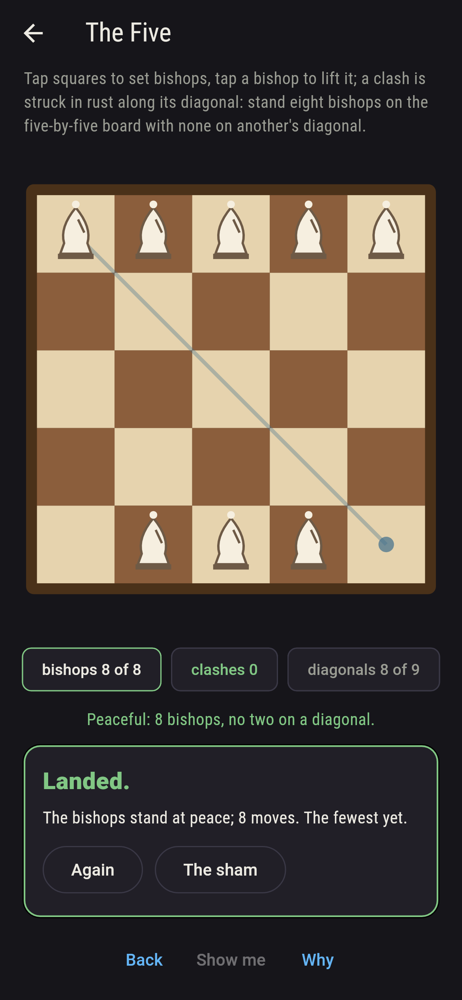
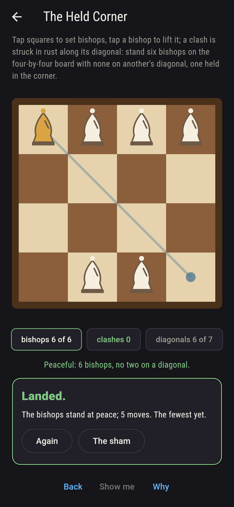
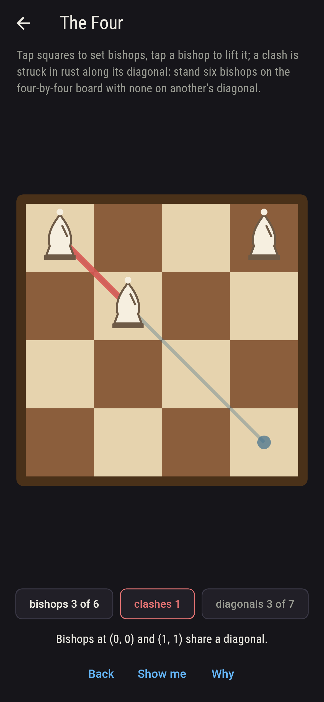
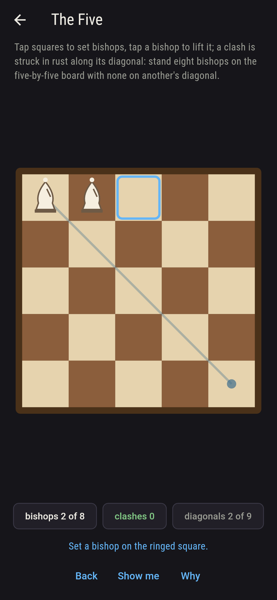
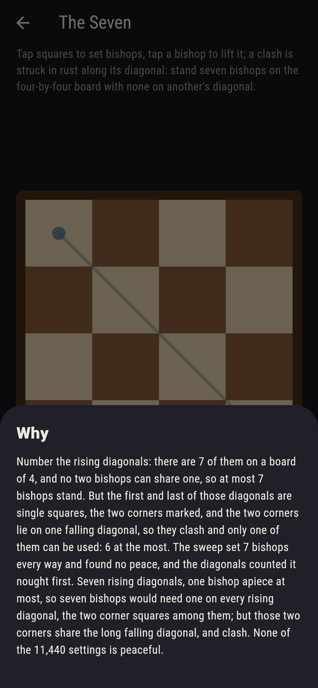

# Mitrewick


Bishops on a small board, and none may stand on another's
diagonal. How many fit? Two less than twice the side, and never
one more, and the reason fits in a sentence: number the rising
diagonals, one bishop apiece at most, 2n - 1 of them; but the
first and the last are single squares, the two corners marked on
the board, and those two corners share the long falling diagonal,
so only one of them can be used. Every setting of every board is
swept, and the count is read again diagonal by diagonal; the two
agree, and the peaceful settings of the most double with every
side, 4, 8, 16, 32, 64, 128.

## The boards

1. **The Three** - stand four bishops on the three-by-three board with none on another's diagonal
2. **The Four** - stand six bishops on the four-by-four board with none on another's diagonal
3. **The Five** - stand eight bishops on the five-by-five board with none on another's diagonal
4. **The Held Corner** - stand six bishops on the four-by-four board with none on another's diagonal, one held in the corner
5. **The Seven** - stand seven bishops on the four-by-four board with none on another's diagonal

Four bishops stand at peace on the three 8 ways of 126, six on
the four 16 ways of 8,008, eight on the five 32 ways of 1,081,575;
with a bishop held in the corner of the four, 8 of the 3,003
settings of the other five stand peaceful. Every peaceful six on
the four keeps to the edge, and a bishop in the middle four kills
it. The Seven is labeled hopeless on its tile, and the why counts
the diagonals.

## Two voices

The game never asserts what it has not computed, and it computes
everything at least twice:

* **The sweep** sets the bishops every way on the board and reads
  each setting for a pair on one diagonal; every count on the
  sham is that sweep's.
* **The diagonals** count with no sweep of squares: one bishop at
  most to each rising diagonal, the falling diagonals kept
  distinct, walked diagonal by diagonal, and the two lonely
  corners checked to share the long falling one on every board.
  Sweep and diagonals agree on every count of bishops on the
  boards of two, three and four a side and at the most on five,
  and the diagonals carry the doubling on to seven a side.

`tool/check_mitres.dart` runs the lot and refuses the bake on any
disagreement.

## The checker's ledger

What `dart run tool/check_mitres.dart` printed for the build this
README shipped with, word for word:

```
every setting of every board swept and the count read again diagonal by diagonal, the two agreeing on every count of bishops on the boards of two, three and four a side and at the most on five: two less than twice the side stand peaceful in 4, 8, 16, 32, 64 and 128 ways from two to seven a side, one less than twice the side never, since the corner squares that hold the single-square rising diagonals share the long falling one on every board; on the four every peaceful six keeps to the edge, uses six of the seven rising diagonals and never both lonely corners, and none stands with a bishop in the middle four

 1 The Three       stand four bishops on the three-by-three board with none on another's diagonal: 8 settings of the 126 land it
 2 The Four        stand six bishops on the four-by-four board with none on another's diagonal: 16 settings of the 8,008 land it
 3 The Five        stand eight bishops on the five-by-five board with none on another's diagonal: 32 settings of the 1,081,575 land it
 4 The Held Corner stand six bishops on the four-by-four board with none on another's diagonal, one held in the corner: 8 settings of the 3,003 land it
 5 The Seven       stand seven bishops on the four-by-four board with none on another's diagonal: none of the 11,440, and the diagonals said so first
```

## Screenshots

| The sham | The four at peace | The seven admitted |
| --- | --- | --- |
|  |  |  |

| The three | The five | The held corner | Mid-setting | Show me | The why |
| --- | --- | --- | --- | --- | --- |
|  |  |  |  |  |  |

Screenshots are drawn by `test/showcase_test.dart` at real phone
sizes with the app's own painter, then copied into `docs/` as they
came out; every bishop in them was set by a tap, so nothing
pictured is a board the game could not reach. The logo and every
launcher icon come out of `test/mark_test.dart` the same way: the
mark is six bishops at peace on the four, four along the top and
two along the bottom.

## Building

```
flutter test          # 47 tests, the sweep among them
dart run tool/check_mitres.dart
flutter build apk     # or: flutter build ios
```
