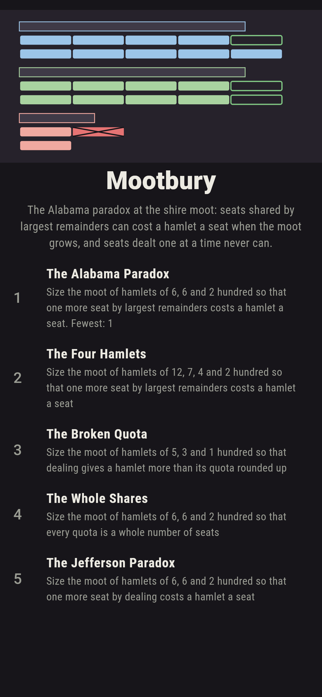
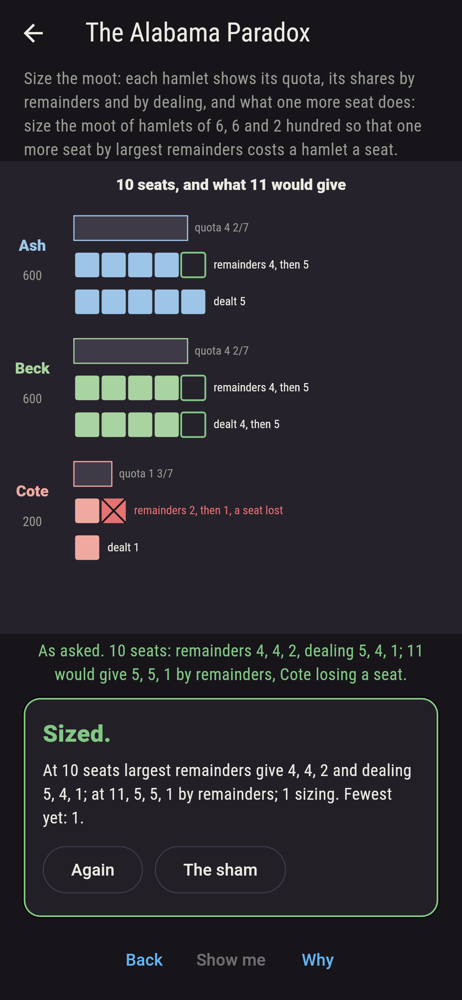
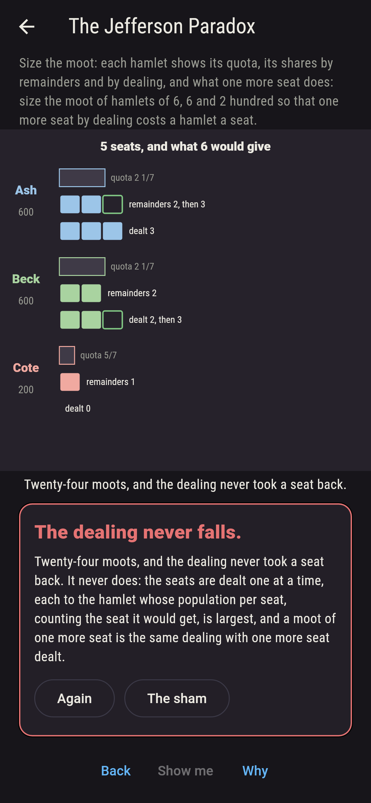
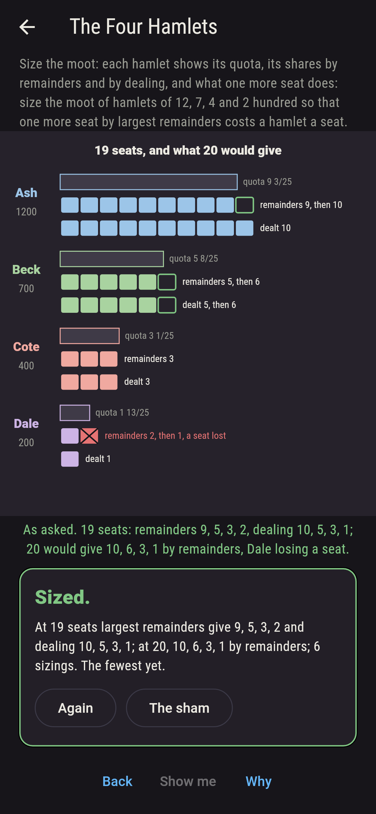
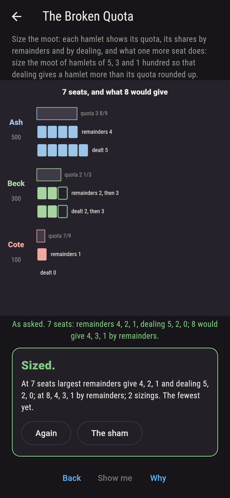
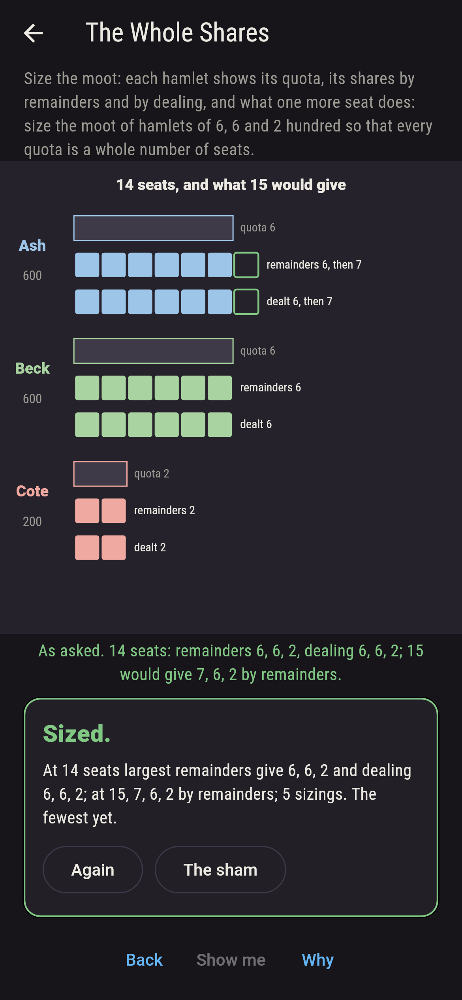
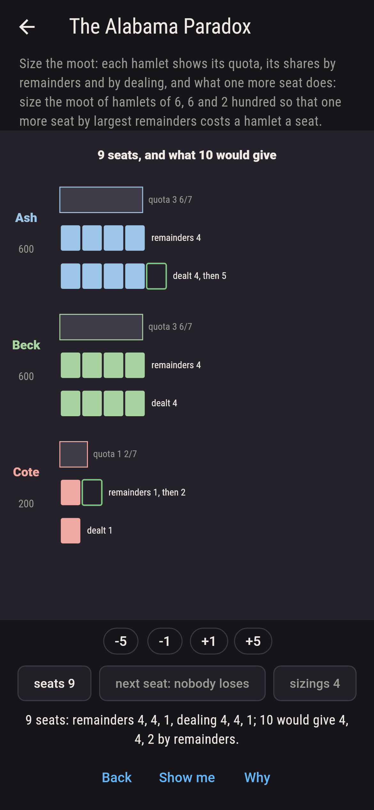
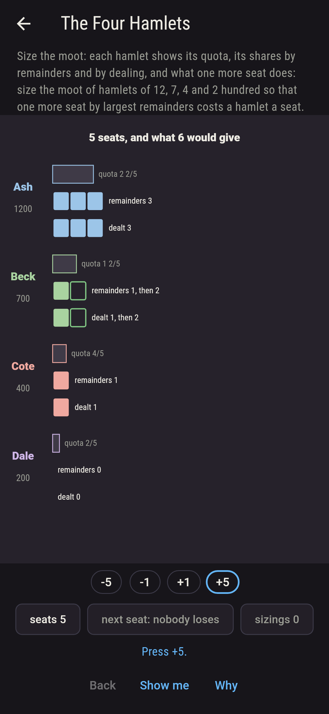
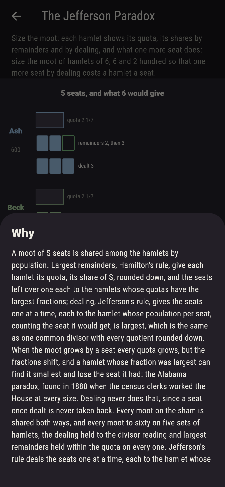

# Mootbury


The Alabama paradox at the shire moot. A moot of so many seats is
shared among the hamlets by population, and there are two ways to
do it. Largest remainders, Hamilton's rule, give each hamlet its
quota, its share of the seats, rounded down, and the seats left
over one each to the hamlets whose quotas have the largest
fractions. Dealing, Jefferson's rule, gives the seats one at a
time, each to the hamlet whose population per seat, counting the
seat it would get, is largest, which comes to the same as one
common divisor with every quotient rounded down. Size the moot,
and each hamlet shows its quota, its two shares, and what one more
seat would do. When the moot grows by a seat every quota grows, but
the fractions shift, and under largest remainders a hamlet can
lose the seat it had: among Ash and Beck of six hundred and Cote of
two, ten seats share 4, 4, 2 and eleven 5, 5, 1. That is the
paradox the census clerks found in 1880, working the House at every
size and watching Alabama lose a seat. Dealing never does it, since
a seat once dealt is never taken back; but dealing can give a
hamlet more than its quota rounded up, which largest remainders
never do. Every moot on the sham is shared both ways, and every
moot to sixty on five sets of hamlets, the dealing held to the
divisor reading and largest remainders held within the quota.

## The moots

1. **The Alabama Paradox** - size the moot of hamlets of 6, 6 and 2 hundred so that one more seat by largest remainders costs a hamlet a seat
2. **The Four Hamlets** - size the moot of hamlets of 12, 7, 4 and 2 hundred so that one more seat by largest remainders costs a hamlet a seat
3. **The Broken Quota** - size the moot of hamlets of 5, 3 and 1 hundred so that dealing gives a hamlet more than its quota rounded up
4. **The Whole Shares** - size the moot of hamlets of 6, 6 and 2 hundred so that every quota is a whole number of seats
5. **The Jefferson Paradox** - size the moot of hamlets of 6, 6 and 2 hundred so that one more seat by dealing costs a hamlet a seat

Among six, six and two hundred the paradox strikes at 3, 10, 17
and 24 seats, four moots of the 29 on the sham, Cote the loser
every time and at three seats down to none; among twelve, seven,
four and two hundred only the moot of nineteen loses a hamlet a
seat, Dale, 9, 5, 3, 2 then 10, 6, 3, 1; among five, three and one
hundred the dealing gives seven seats 5, 2, 0 against quotas of
3 8/9, 2 1/3 and 7/9, at 7, 16 and 25 seats; and six, six and two
come to whole quotas at 7, 14, 21 and 28. The Jefferson Paradox is
labeled hopeless on its tile, and the dealing is the why.

## Two voices

The game never asserts what it has not computed, and it computes
everything at least twice:

* **Largest remainders and the dealing** are both worked on every
  moot, the quotas as exact fractions, and every number on the sham
  is theirs; the shares are checked to add up to the seats, and
  largest remainders to keep every hamlet within its quota, on all
  300 moots of the five sets to sixty seats.
* **The divisor reading** deals nothing: it tries every quotient of
  a population by a count as the common divisor and rounds every
  hamlet's population over it down, and agrees with the dealing on
  every one of the 300; and since the dealing adds a seat at a time
  and takes none back, no hamlet ever falls as the moot grows, which
  is checked on every moot too.

`tool/check_moots.dart` runs the lot and refuses the bake on any
disagreement.

## The checker's ledger

What `dart run tool/check_moots.dart` printed for the build this
README shipped with, word for word:

```
every moot of two to thirty seats on the sham shared two ways, by largest remainders and by dealing a seat at a time, and every moot to sixty on five sets of hamlets besides, 300 moots, the dealing held to the divisor reading on every one and largest remainders held within the quota on every one: among Ash and Beck of six hundred and Cote of two, ten seats share 4, 4, 2 and eleven 5, 5, 1, Cote losing a seat as the moot grows, and so at 3, 17 and 24 seats, four moots of the 29; among twelve, seven, four and two hundred only the moot of nineteen loses a hamlet a seat, 9, 5, 3, 2 then 10, 6, 3, 1; among five, three and one hundred the dealing gives seven seats 5, 2, 0 against quotas of 3 8/9, 2 1/3 and 7/9, more than a quota rounded up, at 7, 16 and 25 seats, where largest remainders give 4, 2, 1; six, six and two hundred come to whole quotas at 7, 14, 21 and 28 seats; and dealt a seat at a time no hamlet ever loses a seat as the moot grows, on any of the 300

 1 The Alabama Paradox   size the moot of hamlets of 6, 6 and 2 hundred so that one more seat by largest remainders costs a hamlet a seat: 4 of the 29 moots land it
 2 The Four Hamlets      size the moot of hamlets of 12, 7, 4 and 2 hundred so that one more seat by largest remainders costs a hamlet a seat: 1 of the 29 moots lands it
 3 The Broken Quota      size the moot of hamlets of 5, 3 and 1 hundred so that dealing gives a hamlet more than its quota rounded up: 3 of the 29 moots land it
 4 The Whole Shares      size the moot of hamlets of 6, 6 and 2 hundred so that every quota is a whole number of seats: 4 of the 29 moots land it
 5 The Jefferson Paradox size the moot of hamlets of 6, 6 and 2 hundred so that one more seat by dealing costs a hamlet a seat: none of the 29, and the dealing said so first
```

## Screenshots

| The sham | The Alabama paradox | The Jefferson paradox admitted |
| --- | --- | --- |
|  |  |  |

| The four hamlets | The broken quota | The whole shares | Mid-sizing | Show me | The why |
| --- | --- | --- | --- | --- | --- |
|  |  |  |  |  |  |

Screenshots are drawn by `test/showcase_test.dart` at real phone
sizes with the app's own painter, then copied into `docs/` as they
came out; every seat in them was added by a press, so nothing
pictured is a moot the game could not reach. The logo and every
launcher icon come out of `test/mark_test.dart` the same way: the
mark is the moot of ten among six, six and two, and the seat Cote
loses at eleven.

## Building

```
flutter test          # 44 tests, the sharing among them
dart run tool/check_moots.dart
flutter build apk     # or: flutter build ios
```
