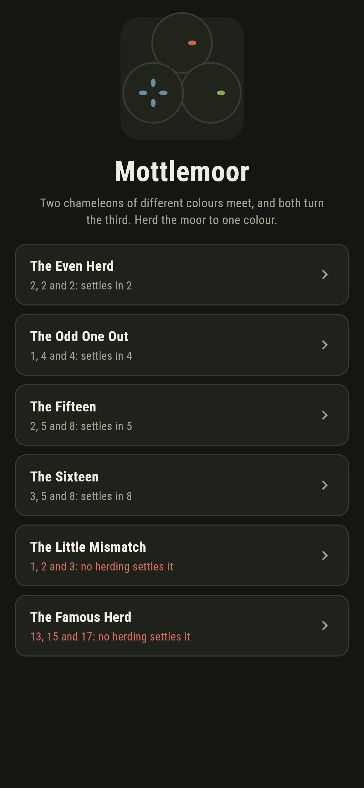
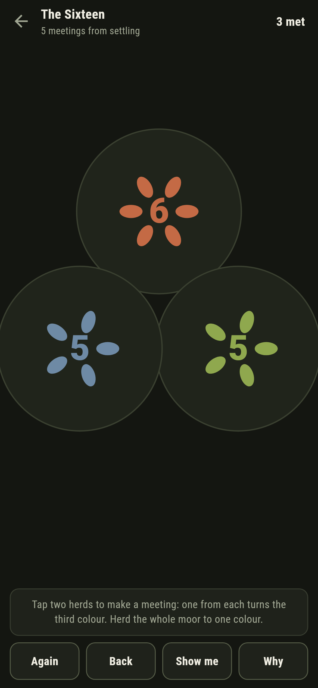
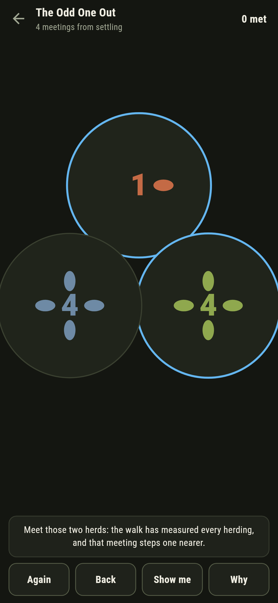
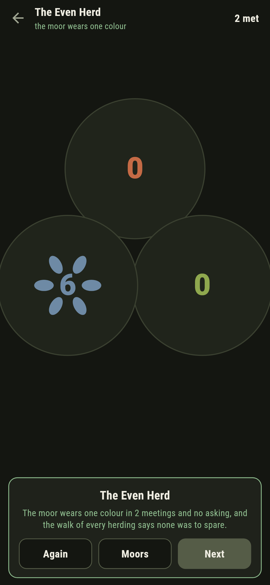
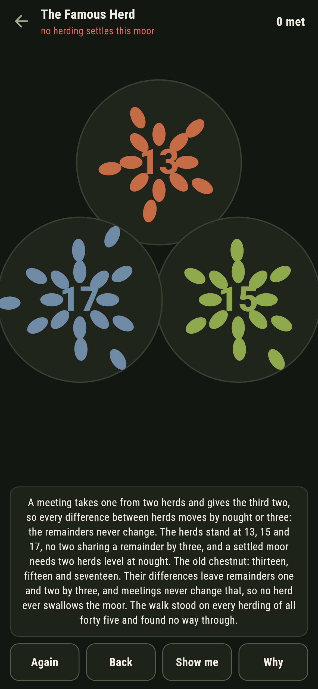
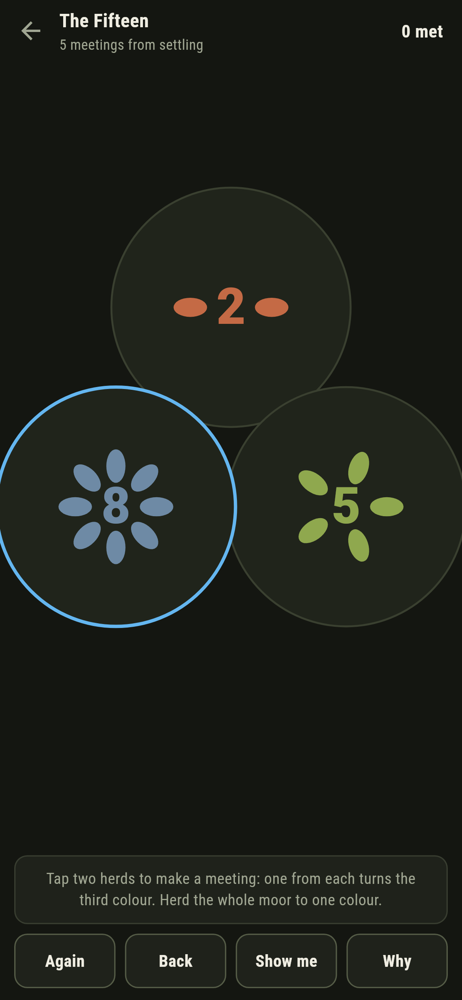

# Mottlemoor

A herding puzzle for phones, in Flutter, for Android and iOS.

Chameleons in three coats graze a moor. When two of different
colours meet, both turn the third colour: two herds shrink by one,
the third grows by two. Herd the whole moor to a single colour,
where the numbers allow it, and know exactly why where they refuse.

| | | | |
|---|---|---|---|
|  |  |  |  |

## Two ways of knowing

A meeting moves every difference between herd counts by nought or
three, so the remainders by three never change, and a settled moor
needs two herds level at nought: a moor can settle only where two
herds already share a remainder. The walk knows none of that: it
stands on every herding a moor allows and reads the fewest meetings
outright. Across every moor of fifteen or fewer chameleons, all 815
herdings, the walk settles exactly where the differences allow, and
the checker refuses the bake on the first parting.

```
$ make moors
every moor of fifteen or fewer, 815 herdings: the walk settles exactly where the differences allow

 1 The Even Herd       2/2/2  settles in 2, none to spare
 2 The Odd One Out     1/4/4  settles in 4, none to spare
 3 The Fifteen         2/5/8  settles in 5, none to spare
 4 The Sixteen         3/5/8  settles in 8, none to spare
 5 The Little Mismatch 1/2/3  never settles: no two herds share a remainder by three
 6 The Famous Herd     13/15/17  never settles: no two herds share a remainder by three
```

## The famous herd

Thirteen, fifteen and seventeen: the old chestnut, and it ships
dead, in the house tradition of maps nobody can win. The differences
leave remainders one and two by three, meetings never change that,
and the walk stood on every herding of all forty five chameleons and
found no way through. The Little Mismatch is the same refusal at
pocket size, one, two and three.



## The live moor

The ledger counts the meetings still needed from the herds as they
stand, and a meeting that steps away is called out the moment it is
made, with **Back** waiting. **Show me** points at a meeting the
walk has measured.



## Building

```
make deps    # fetch packages
make check   # analyze + every test
make moors   # walk every herding, sweep the differences, print the ledger
make shots   # render the screenshots and redraw the icons
make apk     # Android release build
make ios     # iOS release build (unsigned)
```

The logo and every app icon are drawn by the game's own painter in
`test/mark_test.dart`. There is no image in this repository that was not
produced by code in it.

## How it is put together

```
lib/herd/rules.dart     meetings, the walk, the remainders
lib/herd/moor.dart      a moor: three herds, its fewest
lib/herd/moors.dart     the six moors that ship
lib/herd/play.dart      a moor being herded: meetings, take-back,
                        the live count
lib/ui/                 the painter, the screens, the mark
tool/check_moors.dart   the walks, the sweeps, the ledger above
```

The tests meet herds by hand, sweep the walk against the remainders
over all 815 small herdings, watch a meeting leave every remainder
alone, settle every winnable moor at its fewest by following the
game's own meeting, watch both mismatches refuse forever, and hold
the pictures against the real widget tree. If any of that drifts,
`make check` goes red before anything leaves the machine.
