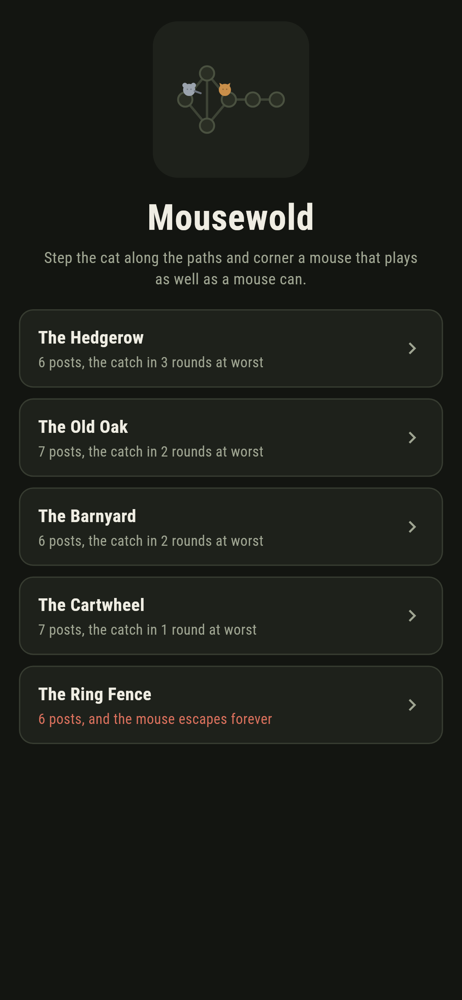
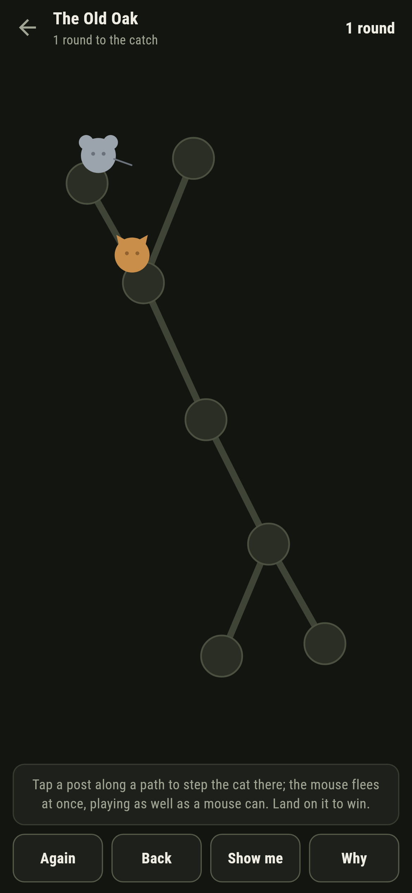
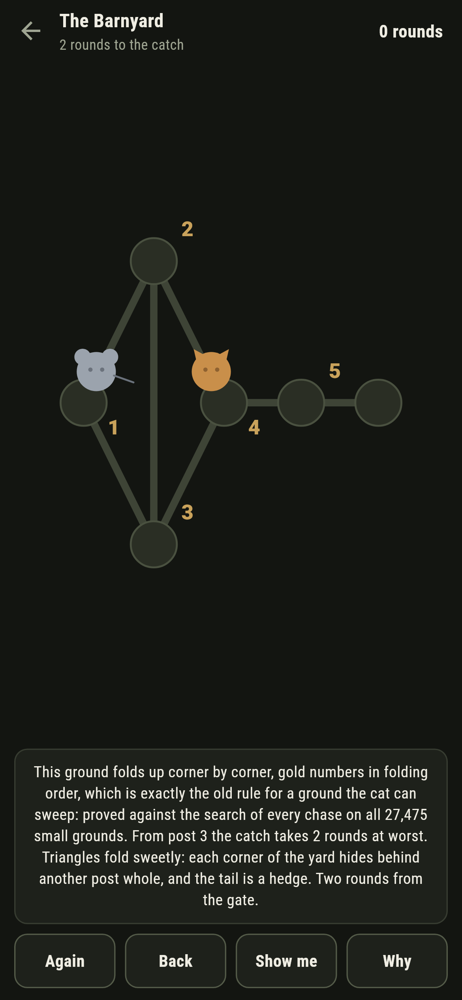
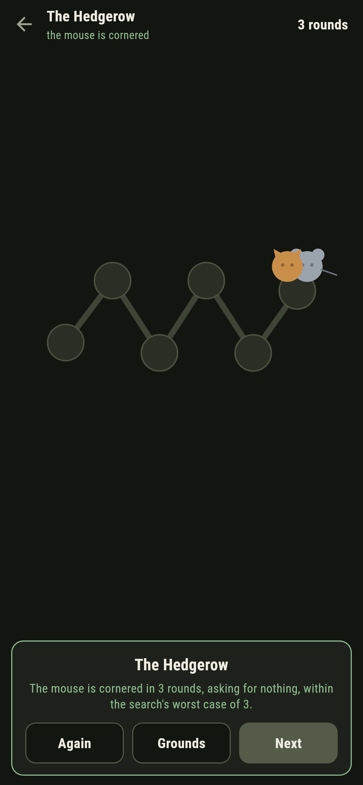
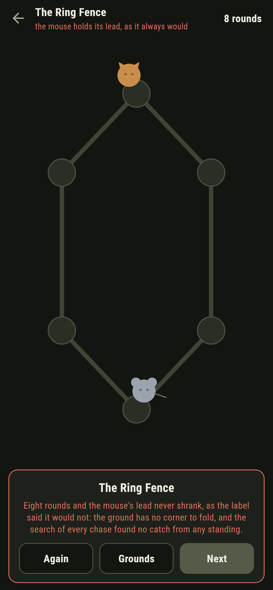
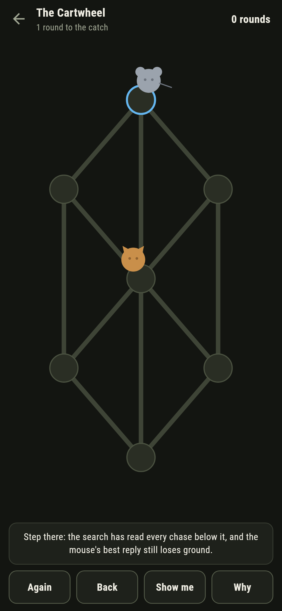

# Mousewold

A pursuit puzzle for phones, in Flutter, for Android and iOS.

A ground of posts joined by paths, a cat, and a mouse. Tap a post to
step the cat there; the mouse flees at once, and it plays as well as a
mouse can. Land on it to win. This is the cops-and-robbers game of
graph theory played with one cat, and the game's grounds carry the
theory's founding theorem: a cat can sweep a ground exactly when the
ground folds up corner by corner to a single post.

| | | | |
|---|---|---|---|
|  |  |  |  |

## Two ways of knowing

The suite knows each ground two ways that share nothing. A search
plays every chase to its end from every standing, cat moving first,
and never looks at the ground's shape; the folding rule never plays a
round, only asks whether some post's every move lies within another's
and folds it away. On every connected ground of six posts or fewer,
all 27,475 of them, the two agree exactly, and every written count
below is the search's own.

```
$ make grounds
every connected ground of six posts or fewer, 27475 of them: the ground folds to a point exactly when the cat can win

 1 The Hedgerow   6 posts  the catch in 3 rounds from post 2
 2 The Old Oak    7 posts  the catch in 2 rounds from post 0
 3 The Barnyard   6 posts  the catch in 2 rounds from post 3
 4 The Cartwheel  7 posts  the catch in 1 round from post 0
 5 The Ring Fence 6 posts  the mouse escapes forever, and the ground never folds
```

## The ring fence

Six posts in a ring, and it ships labelled hopeless in the house
tradition of maps nobody can win. A corner is a post whose every move
lies within some other post's reach, and a ring has none: each post's
two neighbours are nobody else's pair. The mouse just keeps the fence
between itself and the cat forever. The game says so on the way in,
the search confirms it from the other side, and after eight rounds of
chasing the game writes the futility down in words rather than let
anyone grind at it.



## The gold numbers

Nothing about the theorem is folklore here. **Why** lays the folding
order over the ground in gold, first corner to last, and says how many
rounds the catch takes from the cat's gate; on the ring fence it
explains the missing corner instead. **Show me** points at the step
the search closes with, and when a step of yours lets the count stand
still the game says the mouse breathed and offers the round back.



## Building

```
make deps      # fetch packages
make check     # analyze + every test
make grounds   # sweep every small ground against the folding rule
make shots     # render the screenshots and redraw the icons
make apk       # Android release build
make ios       # iOS release build (unsigned)
```

The logo and every app icon are drawn by the game's own painter in
`test/mark_test.dart`. There is no image in this repository that was not
produced by code in it.

## How it is put together

```
lib/chase/rules.dart      the search over every standing, the mouse's
                          replies, the folding rule
lib/chase/ground.dart     a ground: posts, paths, where the cat starts
lib/chase/grounds.dart    the five grounds that ship
lib/chase/play.dart       a chase in progress: steps, the count,
                          take-back
lib/ui/                   the painter, the screens, the mark
tool/check_grounds.dart   the sweep and the ledger above
```

The tests step and flee by hand, sweep the folding rule against the
search on every small ground, corner every winnable ground's mouse by
following the game's own pointer within the rounds it promises, watch
the ring fence hold its lead forever and the game admit it at the
line, and hold the pictures against the real widget tree. If any of
that drifts, `make check` goes red before anything leaves the machine.
