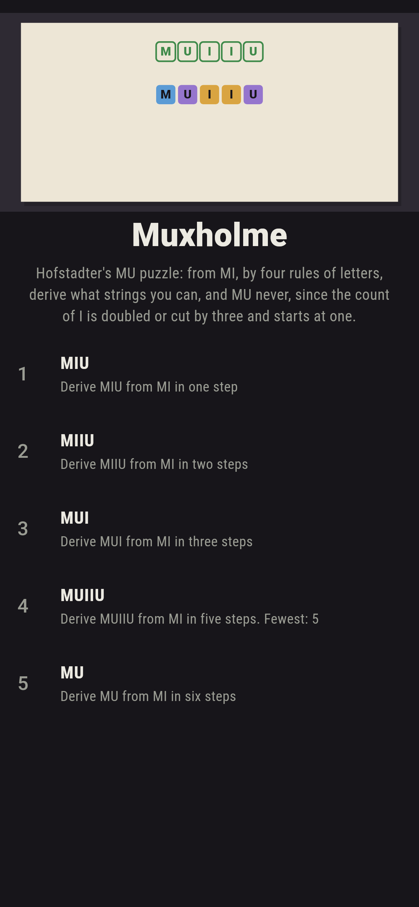
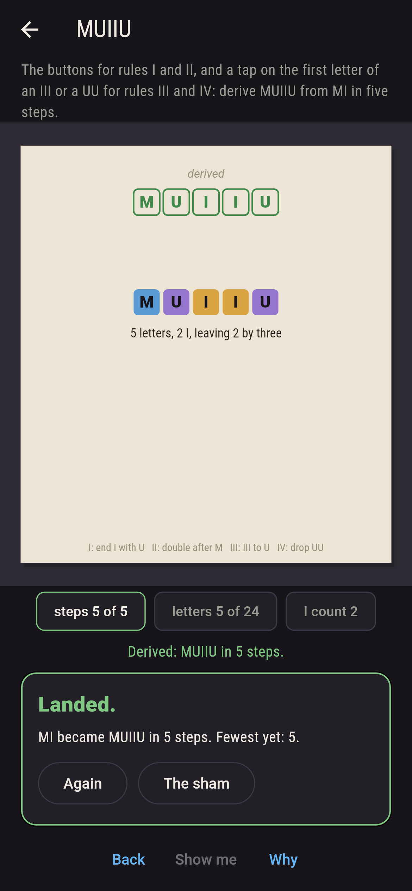
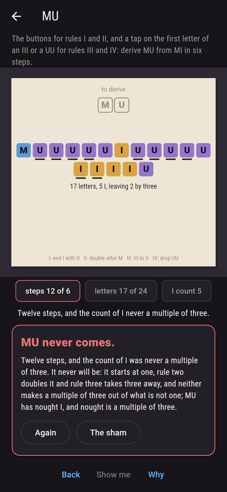
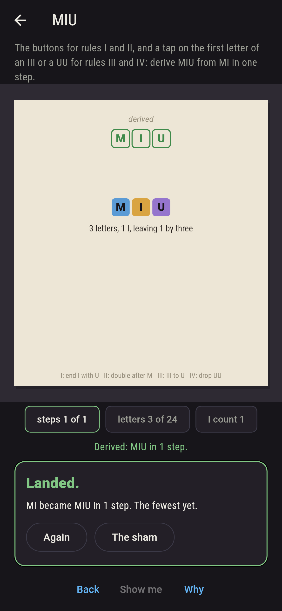
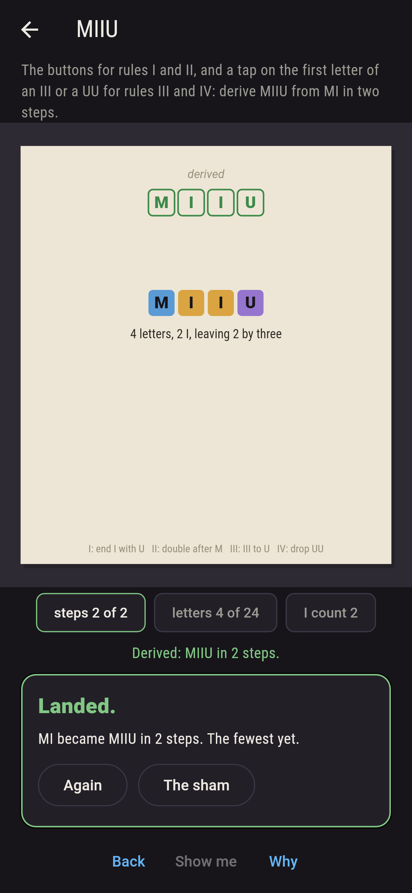
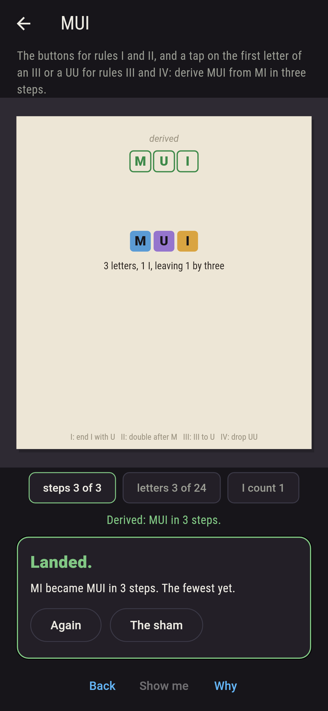
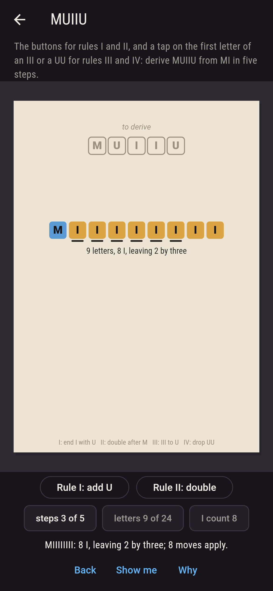
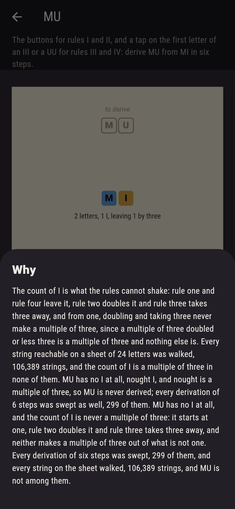

# Muxholme


Hofstadter's MU puzzle. Start with MI, and four rules of letters:
a string ending in I may take a U on the end; whatever follows the M
may be doubled; III anywhere may become U; UU anywhere may be
dropped. Tap the buttons for the first two rules and the first
letter of an III or a UU for the last two, and derive the string
asked. MIU comes in one step, MUI in three, MUIIU in five, and MU
never: the count of I is what the rules cannot shake, since two of
them leave it, one doubles it and one takes three away, and from
one, doubling and taking three never make a multiple of three; MU
has nought I, and nought is a multiple of three. The game walks
every string reachable on a sheet of twenty-four letters, 106,389
of them, finds the count of I a multiple of three in none, and
finds every string of the right shape up to eight letters among
them and nothing else, which is the whole truth about the puzzle.

## The strings

1. **MIU** - derive MIU from MI in one step
2. **MIIU** - derive MIIU from MI in two steps
3. **MUI** - derive MUI from MI in three steps
4. **MUIIU** - derive MUIIU from MI in five steps
5. **MU** - derive MU from MI in six steps

MIU comes of rule one alone, one derivation of the two of one
step; MIIU of doubling and rule one, one of three; MUI of doubling
twice and turning III to U, one of six; MUIIU of doubling three
times and turning two lots of III to U either way round, two of
fifty-seven. MU is labeled hopeless on its tile, and the why counts
the I.

## Two voices

The game never asserts what it has not computed, and it computes
everything at least twice:

* **The walk** starts at MI and makes every move on every string it
  reaches, kept to a sheet of twenty-four letters, and finds the
  fewest steps to each; the sweep makes every derivation of so many
  steps from MI, 299 of six steps and 7,873 of eight, and counts
  those ending where the sham asks. Every count on the sham is
  theirs.
* **The count of I** needs no walk: rule one and rule four are
  checked to keep it, rule two to double it and rule three to take
  three, on every move of every string walked; from one, that never
  reaches a multiple of three, and no string walked has one; and
  the strings of the right shape, an M and then I and U with a
  count of I not a multiple of three, are counted up to eight
  letters, 169 of them, and every one is found in the walk, and
  nothing else of that length is.

`tool/check_derivings.dart` runs the lot and refuses the bake on
any disagreement.

## The checker's ledger

What `dart run tool/check_derivings.dart` printed for the build this
README shipped with, word for word:

```
every string reachable from MI on a sheet of 24 letters walked, 106,389 strings, and the count of I never a multiple of three among them, MU nowhere; every string of the shape, an M and then I and U with a count of I not a multiple of three, is reached up to eight letters, 169 strings, and nothing else is; rule one and rule four keep the count of I, rule two doubles it and rule three takes three, on every move of every string walked; every derivation of six steps swept, 299, and of eight, 7,873, and none ends at MU; MIU comes in one step 1 way of 2, MIIU in two 1 of 3, MUI in three 1 of 6, MUIIU in five 2 of 57, and MU never

 1 MIU    derive MIU from MI in one step: 1 of the 2 derivations lands it
 2 MIIU   derive MIIU from MI in two steps: 1 of the 3 derivations lands it
 3 MUI    derive MUI from MI in three steps: 1 of the 6 derivations lands it
 4 MUIIU  derive MUIIU from MI in five steps: 2 of the 57 derivations land it
 5 MU     derive MU from MI in six steps: none of the 299, and the count of I said so first
```

## Screenshots

| The sham | MUIIU derived | MU admitted |
| --- | --- | --- |
|  |  |  |

| MIU | MIIU | MUI | Mid-derivation | Show me | The why |
| --- | --- | --- | --- | --- | --- |
|  |  |  |  |  |  |

Screenshots are drawn by `test/showcase_test.dart` at real phone
sizes with the app's own painter, then copied into `docs/` as they
came out; every step in them was made by a tap, so nothing pictured
is a string the game could not reach. The logo and every launcher
icon come out of `test/mark_test.dart` the same way: the mark is
MUIIU derived, the tiles under their target.

## Building

```
flutter test          # 44 tests, the walk among them
dart run tool/check_derivings.dart
flutter build apk     # or: flutter build ios
```
