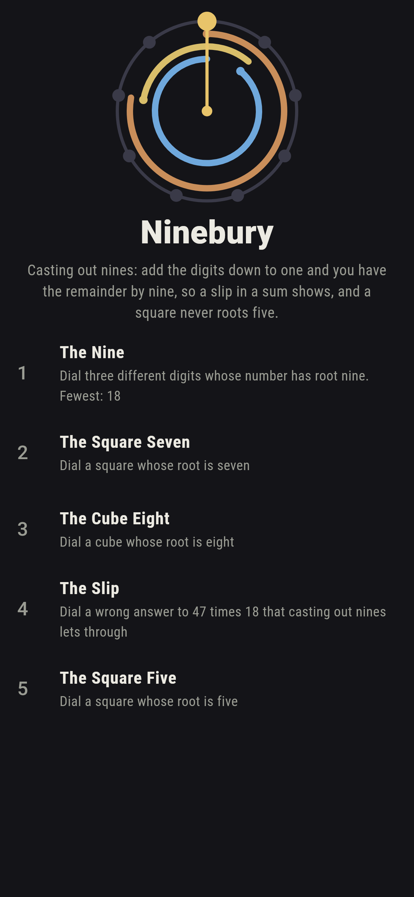
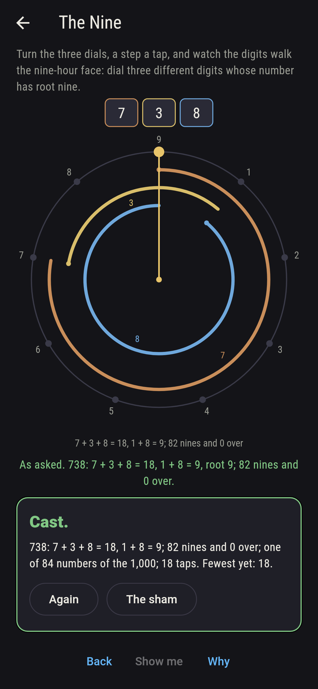
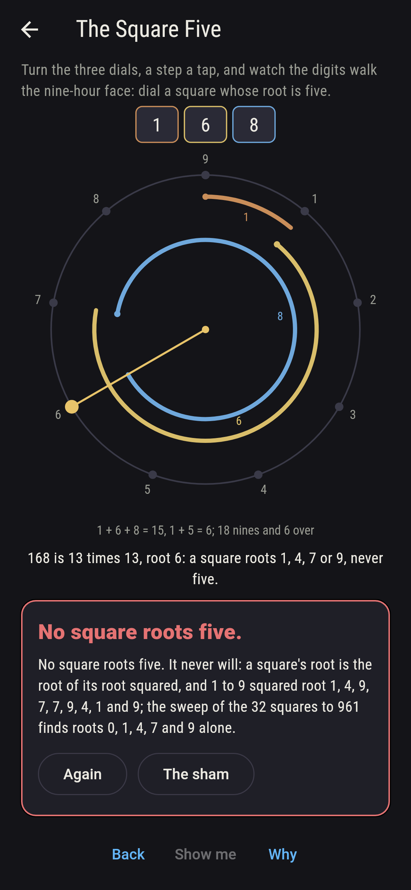
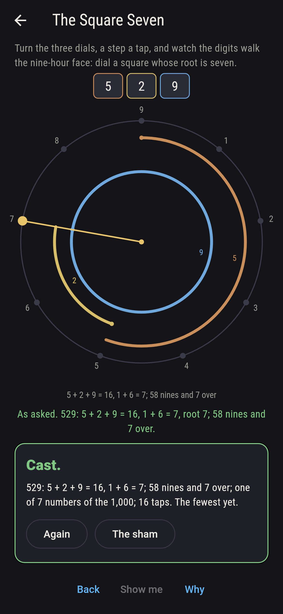
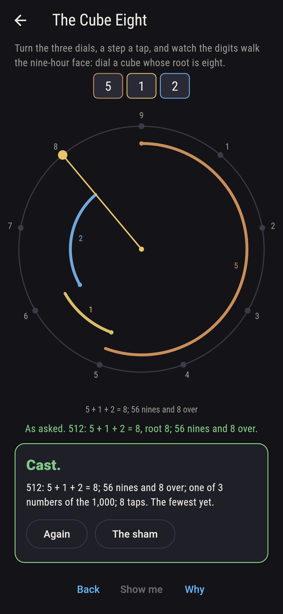
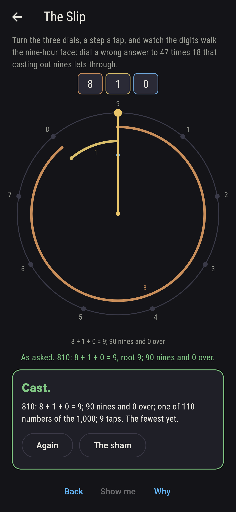
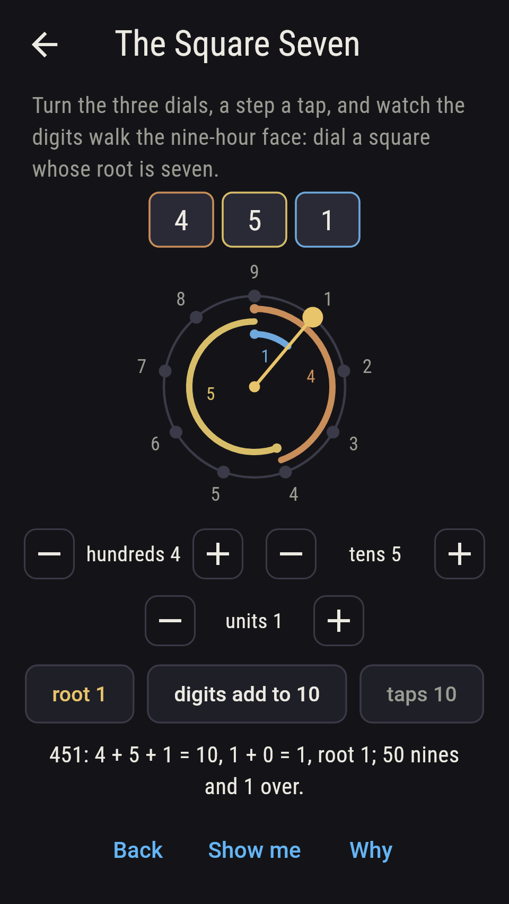
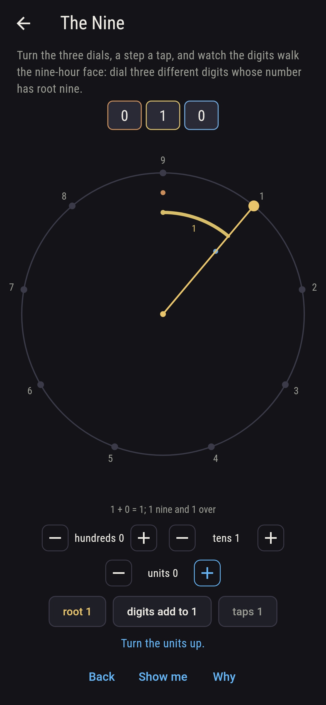
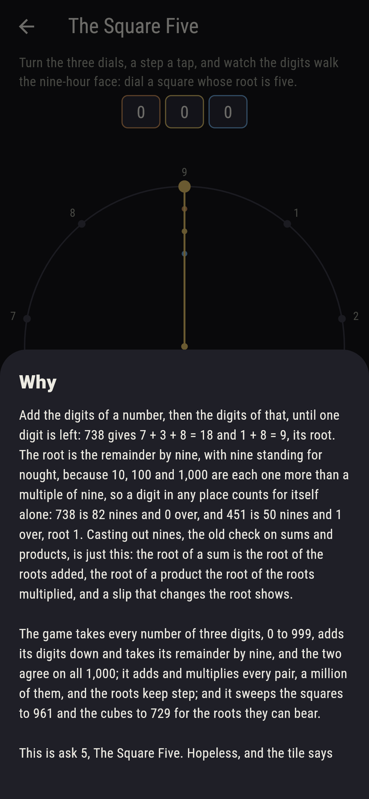

# Ninebury


Add the digits of a number, then the digits of that, until one digit
is left: 738 gives 7 + 3 + 8 = 18 and 1 + 8 = 9, its root. The root
is the remainder by nine, with nine standing for nought, because 10,
100 and 1,000 are each one more than a multiple of nine, so a digit
in any place counts for itself alone: 738 is 82 nines and 0 over,
and 451 is 50 nines and 1 over, root 1. Casting out nines, the old
check on sums and products, is just this: the root of a sum is the
root of the roots added, the root of a product the root of the roots
multiplied, and a slip that changes the root shows. Turn the three
dials and watch the digits walk the nine-hour face, each digit an
arc, the hand coming to rest on the root. The game takes every
number of three digits, 0 to 999, adds its digits down and takes its
remainder by nine, and the two agree on all 1,000; it adds and
multiplies every pair, a million of them, and the roots keep step;
and it sweeps the squares to 961 and the cubes to 729 for the roots
they can bear, which is why a square never roots five.

## The asks

1. **The Nine** - dial three different digits whose number has root nine
2. **The Square Seven** - dial a square whose root is seven
3. **The Cube Eight** - dial a cube whose root is eight
4. **The Slip** - dial a wrong answer to 47 times 18 that casting out nines lets through
5. **The Square Five** - dial a square whose root is five

Of the 1,000 numbers the dials reach, 111 have root nine, the
multiples of nine, one in nine, and 84 of those show three different
digits, 42 adding to nine and 42 to eighteen. The 32 squares to 961
have roots 0, 1, 4, 7 and 9 only, seven of them 7: 16, 25, 169, 196,
484, 529 and 961, the squares of 4, 5, 13, 14, 22, 23 and 31, whose
own roots are 4 or 5. The ten cubes to 729 root 0, 1, 8 or 9, three
of them 8: 8, 125 and 512. 47 times 18 is 846, and 47 roots 2, 18
roots 9, 2 times 9 is 18, root 9, as 846 roots 9; but 110 wrong
answers root 9 too, every ninth number, 864 with the last two digits
swapped among them, and 837 and 855, nine either side. The Square
Five is labeled hopeless on its tile: a square's root is the root of
its root squared, and 1 to 9 squared root 1, 4, 9, 7, 7, 9, 4, 1 and
9, so five never comes; the sham admits it at a square of root 4 or
7, either side of five, or after fifteen taps.

## Two voices

The game never asserts what it has not computed, and it computes
everything at least twice:

* **The digits** are added down to one on every number from 0 to
  999, the chain of sums kept whole, 738 to 18 to 9; every root on
  the sham is that chain's last, and the longest chain, 199 to 19 to
  10 to 1, is found on 45 of the thousand.
* **The nines** read no digits: the root is the remainder by nine
  with nine for nought, and it agrees with the chain on all 1,000
  numbers; on every pair of them, a million pairs, the root of the
  sum is the root of the roots added and the root of the product
  the root of the roots multiplied; and the roots share the thousand
  out 111 each from 1 to 9, and nought to 0 alone. The squares to
  961 and the cubes to 729 are swept for their roots, and the nine
  roots squared and cubed name the roots they can bear.

`tool/check_nines.dart` runs the lot and refuses the bake on any
disagreement.

## The checker's ledger

What `dart run tool/check_nines.dart` printed for the build this
README shipped with, word for word:

```
every number of three digits, 0 to 999, had its digits added down to one and its remainder by nine taken, and the two agree on all 1,000; the root of a sum is the root of the roots added and the root of a product the root of the roots multiplied on all 1,000,000 pairs; the roots share the numbers out 111 each from 1 to 9, and nought to 0 alone; the 32 squares to 961 root 0, 1, 4, 7 or 9 and never 2, 3, 5, 6 or 8, seven of them 7, and the ten cubes to 729 root 0, 1, 8 or 9, three of them 8; 84 numbers of three different digits are multiples of nine, and 110 numbers besides 846 pass the nines' check on 47 times 18, 864 among them; the longest chain of sums runs four numbers, 199 to 19 to 10 to 1, on 45 of the thousand

 1 The Nine         dial three different digits whose number has root nine: 84 of the 1,000 numbers land it
 2 The Square Seven dial a square whose root is seven: 7 of the 1,000 numbers land it
 3 The Cube Eight   dial a cube whose root is eight: 3 of the 1,000 numbers land it
 4 The Slip         dial a wrong answer to 47 times 18 that casting out nines lets through: 110 of the 1,000 numbers land it
 5 The Square Five  dial a square whose root is five: none of the 1,000, and the nine roots squared said so first
```

## Screenshots

| The sham | The nine | The square five admitted |
| --- | --- | --- |
|  |  |  |

| The square seven | The cube eight | The slip | Midway, on the small phone | Show me | The why |
| --- | --- | --- | --- | --- | --- |
|  |  |  |  |  |  |

Screenshots are drawn by `test/showcase_test.dart` at real phone
sizes with the app's own painter, then copied into `docs/` as they
came out; every number in them was set by taps on the dials, so
nothing pictured is a number the game could not reach. The logo and
every launcher icon come out of `test/mark_test.dart` the same way:
the mark is 738 walked round the nine-hour face, seven, three and
eight, home at nine.

## Building

```
flutter test          # 44 tests, the sweep among them
dart run tool/check_nines.dart
flutter build apk     # or: flutter build ios
```
