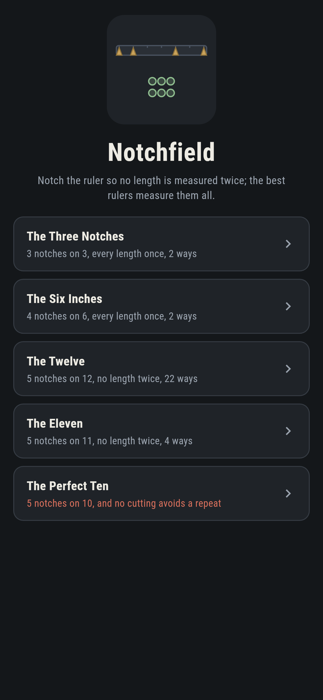
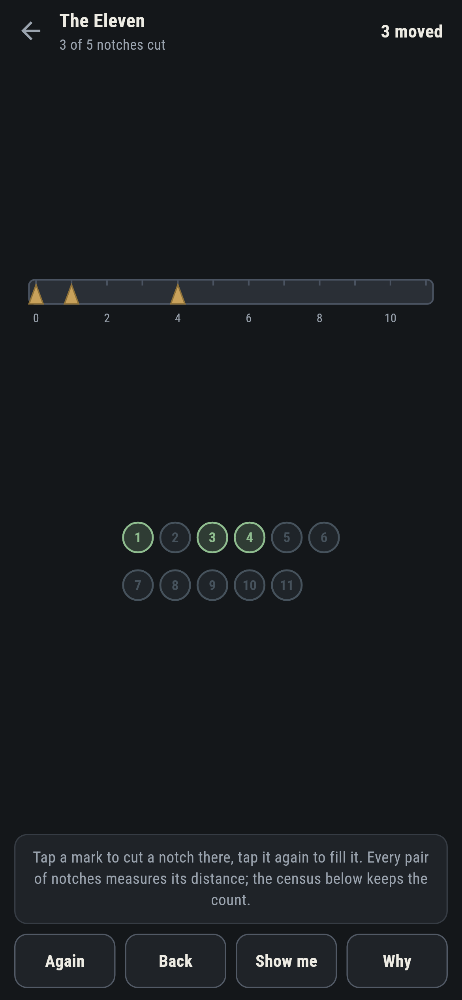
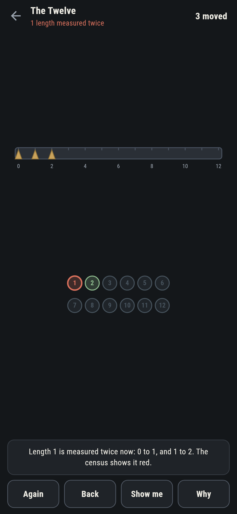
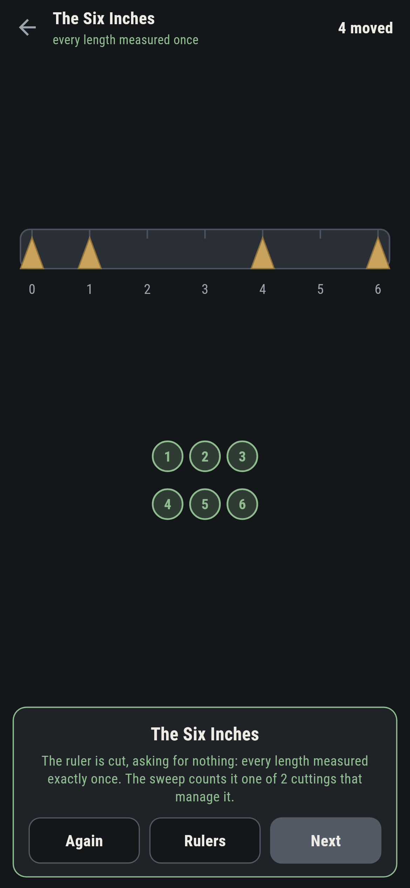
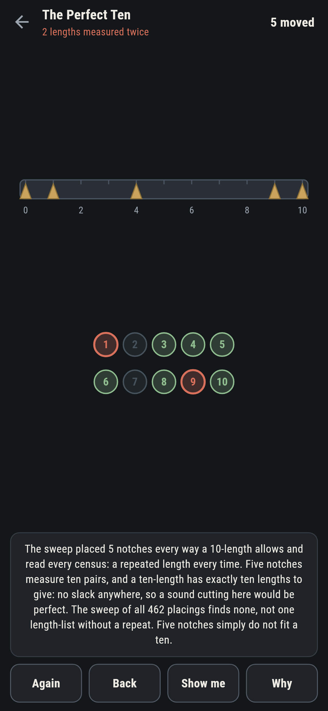
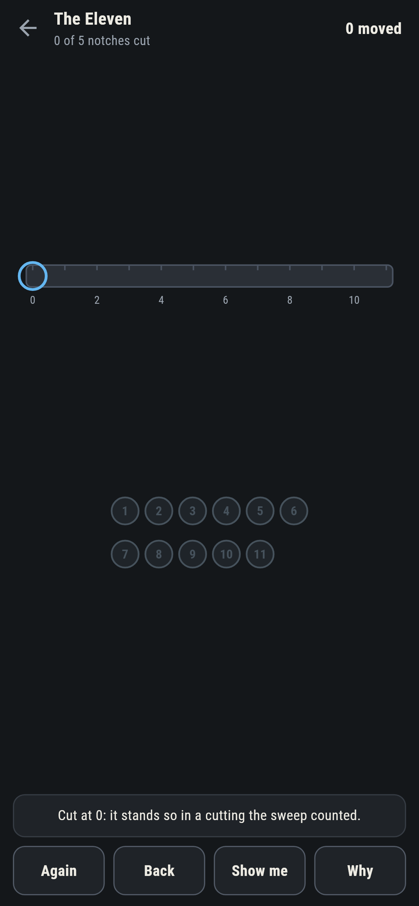

# Notchfield

A ruler-cutting puzzle for phones, in Flutter, for Android and iOS.

A blank rule and a handful of notches to cut. Every pair of notches
measures the distance between them; cut so that no length is measured
twice. The best rulers measure every length their span allows, once
each. These are Golomb rulers, cut by hand, with the census of
distances kept in front of you.

| | | | |
|---|---|---|---|
|  |  |  |  |

## The sweep

Every claim about what can be cut is a sweep of every placing there
is. The three-length has two perfect cuttings, mirrors of each other.
The six-length has the old perfect ruler and its mirror, out of all
35 placings. The eleven holds five notches soundly four ways among
792, and the ten cannot hold five at all: the sweep of its 462
placings finds a repeated length in every one, so eleven is the
shortest field five notches can share.

```
$ make rulers
 1 The Three Notches 3 notches on 3  2 cuttings perfect
 2 The Six Inches    4 notches on 6  2 cuttings perfect
 3 The Twelve        5 notches on 12  22 cuttings sound
 4 The Eleven        5 notches on 11  4 cuttings sound
 5 The Perfect Ten   5 notches on 10  no sound cutting at all

a ten cannot hold five notches soundly, all 462 placings tried: eleven is the shortest field five notches can share
```

## The perfect ten

Five notches measure ten pairs, and a ten-length has exactly ten
lengths to give: no slack anywhere, so a sound cutting would have to
be perfect. There is none, and the level ships labelled, in the house
tradition of maps nobody can win, the counting on the label and the
sweep behind it.



## The census

Under the rule, one chip per length: grey unmeasured, green measured
once, red the moment two pairs measure alike, with the words naming
both pairs. **Show me** mends toward a cutting the sweep counted,
filling stray notches before cutting new ones.



## Building

```
make deps    # fetch packages
make check   # analyze + every test
make rulers  # sweep every placing, print the ledger
make shots   # render the screenshots and redraw the icons
make apk     # Android release build
make ios     # iOS release build (unsigned)
```

The logo and every app icon are drawn by the game's own painter in
`test/mark_test.dart`. There is no image in this repository that was not
produced by code in it.

## How it is put together

```
lib/ruler/rules.dart    the census, the clashes, the sweep
lib/ruler/cut.dart      a ruler: length, notches, the ask, its count
lib/ruler/cuts.dart     the five rulers that ship
lib/ruler/play.dart     a rule being cut: notches, take-back, the
                        mend
lib/ui/                 the painter, the screens, the mark
tool/check_cuts.dart    the sweeps and the ledger above
```

The tests read the census of the book rulers by hand, sweep every
shipped count, watch the ten stay unsound across all 462 placings,
note that every sound six-length cutting is perfect, cut every
winnable ruler by following the game's own mend, and hold the
pictures against the real widget tree. If any of that drifts,
`make check` goes red before anything leaves the machine.
