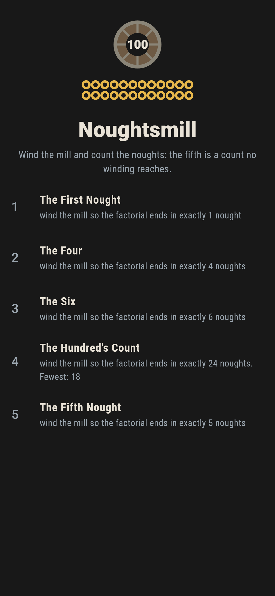
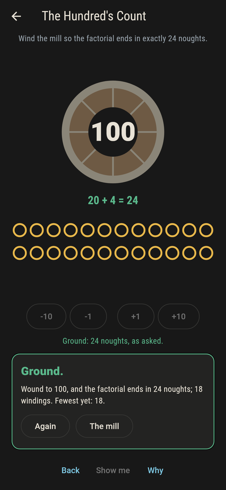
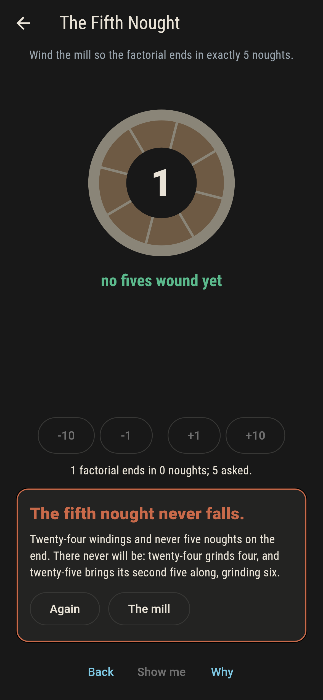
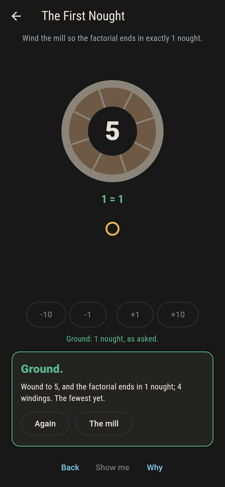
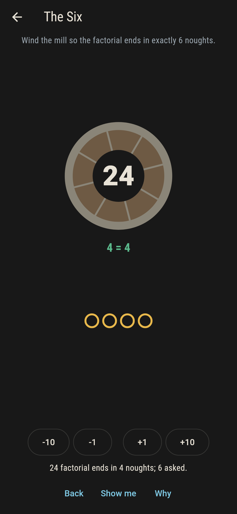
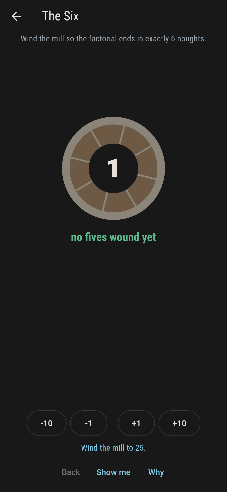
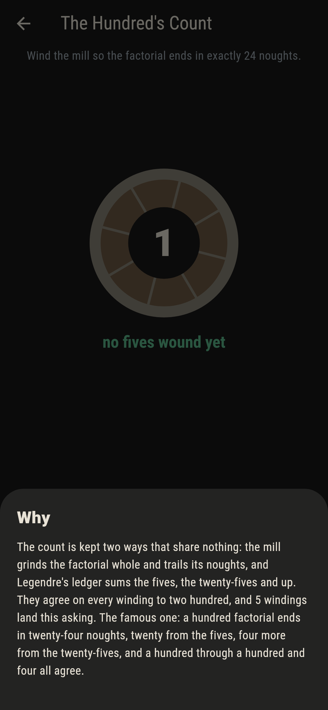

# Noughtsmill


Wind the mill to n and it grinds n factorial; the count that
matters is the noughts on the end. Legendre's ledger totals them
without grinding, the fives plus the twenty-fives plus up, and
the mill checks the ledger by grinding the factorial whole. The
counts climb in runs of five, skip a value at every twenty-five,
and exactly five noughts is a count no winding reaches.

## The grinds

1. **The First Nought** - wind the mill so the factorial ends in exactly 1 nought
2. **The Four** - wind the mill so the factorial ends in exactly 4 noughts
3. **The Six** - wind the mill so the factorial ends in exactly 6 noughts
4. **The Hundred's Count** - wind the mill so the factorial ends in exactly 24 noughts
5. **The Fifth Nought** - wind the mill so the factorial ends in exactly 5 noughts

Twenty-four grinds four noughts and twenty-five grinds six: the
second five in twenty-five arrives all at once, and the count of
five is skipped clean over. So are 11, 17, 23 and 29, one at
every twenty-five. A hundred factorial ends in twenty-four,
twenty from the fives and four from the twenty-fives, and the
famous count holds from a hundred through a hundred and four.

## Two voices

The game never asserts what it has not computed, and it computes
everything twice:

* **The grindstone** builds the factorial whole, in big integers,
  and counts the noughts off its tail.
* **The ledger** sums n over 5, n over 25, n over 125, each
  rounded down, and lands on the same count at every winding to
  two hundred.

`tool/check_mills.dart` runs both, checks the runs of five and
the skipped counts, and refuses the bake on any disagreement.

## The checker's ledger

What `dart run tool/check_mills.dart` printed for the build this
README shipped with, word for word:

```
every winding to two hundred ground twice, the whole factorial against Legendre's ledger, and never a disagreement: the counts run five windings each, skip 5, 11, 17, 23 and 29 where the twenty-fives land, and a hundred factorial ends in twenty-four noughts, twenty from the fives and four from the twenty-fives

 1 The First Nought     wind the mill so the factorial ends in exactly 1 nought: 5 windings of the sweep land it
 2 The Four             wind the mill so the factorial ends in exactly 4 noughts: 5 windings of the sweep land it
 3 The Six              wind the mill so the factorial ends in exactly 6 noughts: 5 windings of the sweep land it
 4 The Hundred's Count  wind the mill so the factorial ends in exactly 24 noughts: 5 windings of the sweep land it
 5 The Fifth Nought     wind the mill so the factorial ends in exactly 5 noughts: none to two hundred, and twenty-five is the reason
```

## Screenshots

| The mill | The hundred ground | The fifth nought admitted |
| --- | --- | --- |
|  |  |  |

| The first nought | The jump at twenty-five | Show me | The why |
| --- | --- | --- | --- |
|  |  |  |  |

Screenshots are drawn by `test/showcase_test.dart` at real phone
sizes with the app's own painter, then copied into `docs/` as
they came out; every winding in them was pressed, so nothing
pictured is a mill the game could not reach. The logo and every
launcher icon come out of `test/mark_test.dart` the same way:
the mark is the hundred wound.

## Building

```
flutter test          # 41 tests, the grindstone among them
dart run tool/check_mills.dart
flutter build apk     # or: flutter build ios
```
