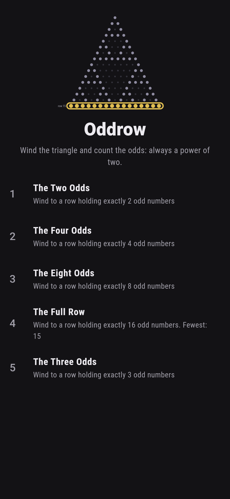
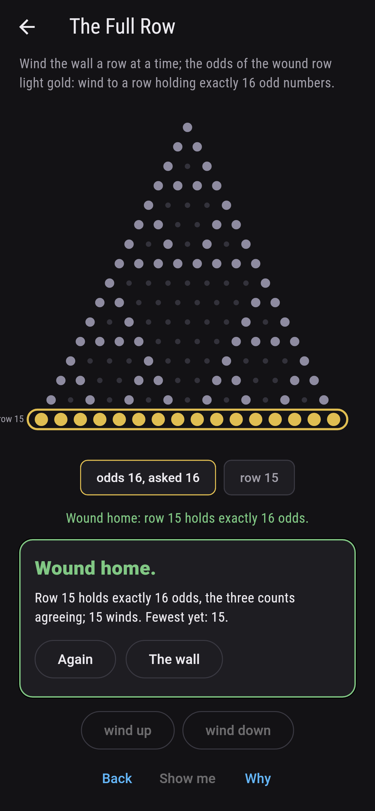
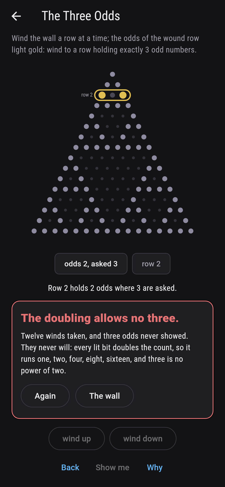
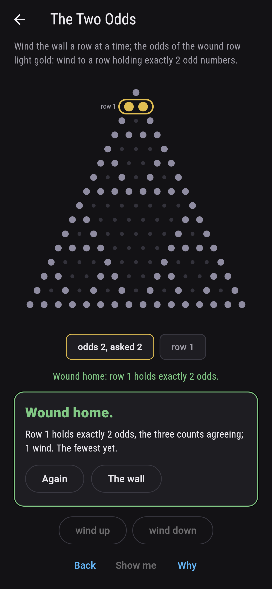
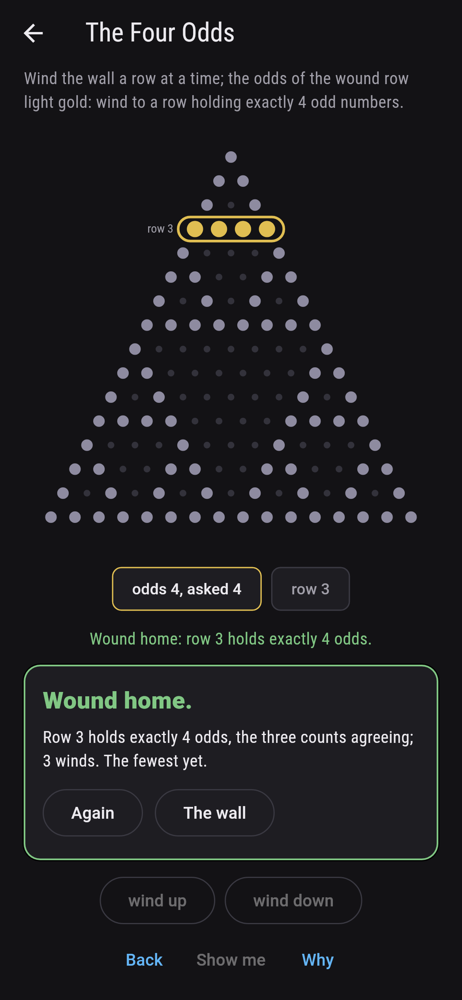
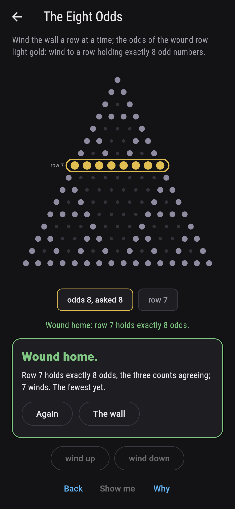
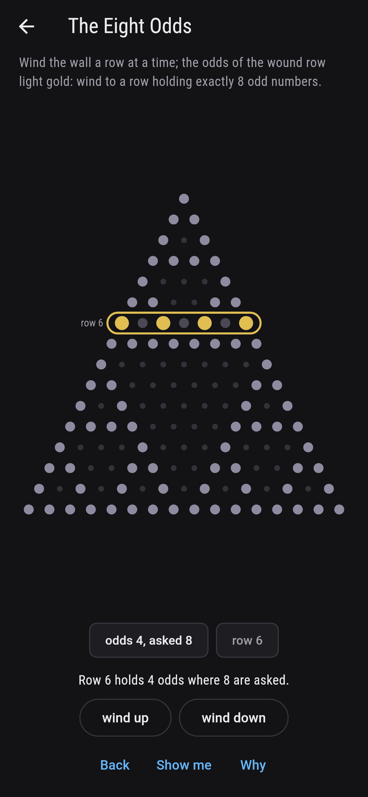
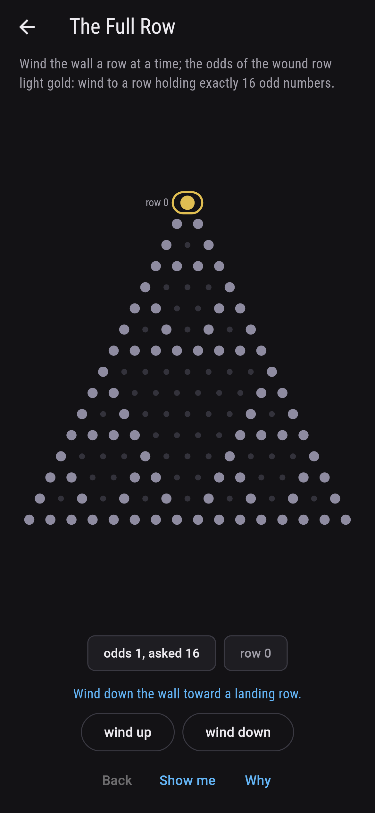
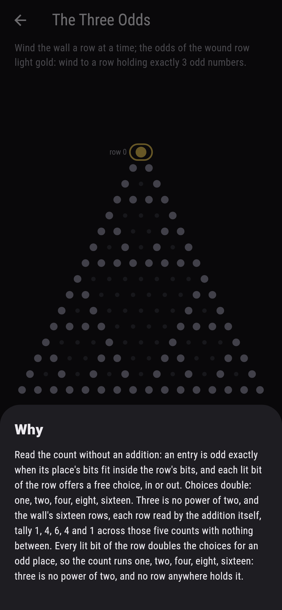

# Oddrow


Pascal's triangle on a wall, rows nought to fifteen, and in
every row the odd numbers counted. Lucas' law reads the count
without a single addition: an entry is odd exactly when its
place's bits fit inside the row's bits, so each lit bit of the
row doubles the count. Powers of two only, and the lit rows
draw Sierpinski's lace all by themselves.

## The askings

1. **The Two Odds** - wind to a row holding exactly 2 odd numbers
2. **The Four Odds** - wind to a row holding exactly 4 odd numbers
3. **The Eight Odds** - wind to a row holding exactly 8 odd numbers
4. **The Full Row** - wind to a row holding exactly 16 odd numbers
5. **The Three Odds** - wind to a row holding exactly 3 odd numbers

The two-odd rows are one, two, four and eight, their odds
sitting at the ends. Six rows hold four odds and four rows hold
eight. Row fifteen alone lights everything. The Three Odds is
labeled hopeless on its tile: the count doubles per lit bit,
and three is no power of two.

## Two voices

The game never asserts what it has not computed, and it computes
everything at least twice, here three times:

* **Pascal's addition** builds every row entry by entry and
  the odds are read straight off the numbers.
* **Lucas' bit rule** lights a place exactly when its bits fit
  the row's, no addition anywhere; and **the doubling**
  multiplies two per lit bit. All three agree on every row of
  the wall, and the tally runs 1, 4, 6, 4 and 1 across the
  five counts with nothing between.

`tool/check_rows.dart` runs the lot and refuses the bake on any
disagreement.

## The checker's ledger

What `dart run tool/check_rows.dart` printed for the build this
README shipped with, word for word:

```
every row of the wall read three ways, the addition, the bit rule and the doubling, and never apart: the odd counts run one, two, four, eight and sixteen over rows nought to fifteen, tallying 1, 4, 6, 4 and 1 rows apiece, and no power of two means no row: three odds belong to nobody

 1 The Two Odds       wind to a row holding exactly 2 odd numbers: 4 rows of the wall hold it
 2 The Four Odds      wind to a row holding exactly 4 odd numbers: 6 rows of the wall hold it
 3 The Eight Odds     wind to a row holding exactly 8 odd numbers: 4 rows of the wall hold it
 4 The Full Row       wind to a row holding exactly 16 odd numbers: 1 row of the wall holds it
 5 The Three Odds     wind to a row holding exactly 3 odd numbers: none of the sixteen, and the doubling said so first
```

## Screenshots

| The wall | The full row | The three odds admitted |
| --- | --- | --- |
|  |  |  |

| The two odds | The four odds | The eight odds | Mid-wind | Show me | The why |
| --- | --- | --- | --- | --- | --- |
|  |  |  |  |  |  |

Screenshots are drawn by `test/showcase_test.dart` at real phone
sizes with the app's own painter, then copied into `docs/` as
they came out; every wind in them was tapped, so nothing
pictured is a row the game could not reach. The logo and every
launcher icon come out of `test/mark_test.dart` the same way:
the mark is the wall wound to the full row, sixteen golden odds
under the whole lace.

## Building

```
flutter test          # 42 tests, the sweep among them
dart run tool/check_rows.dart
flutter build apk     # or: flutter build ios
```
