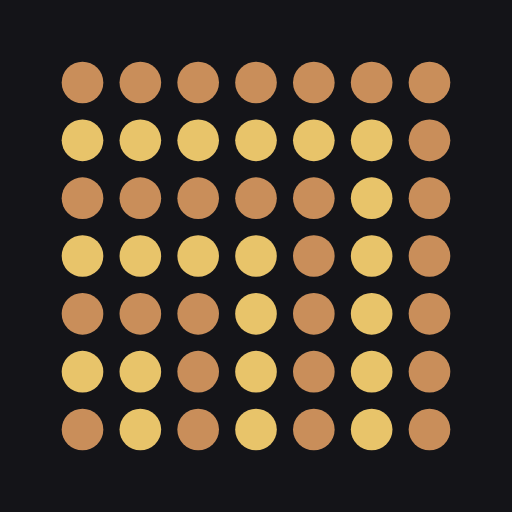
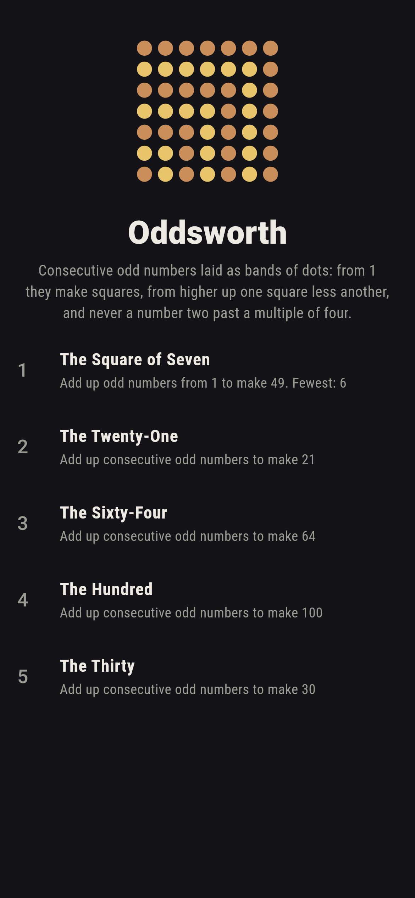
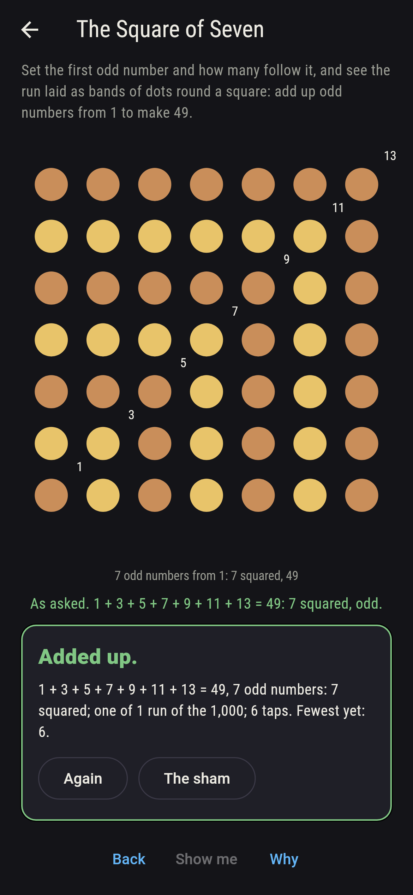
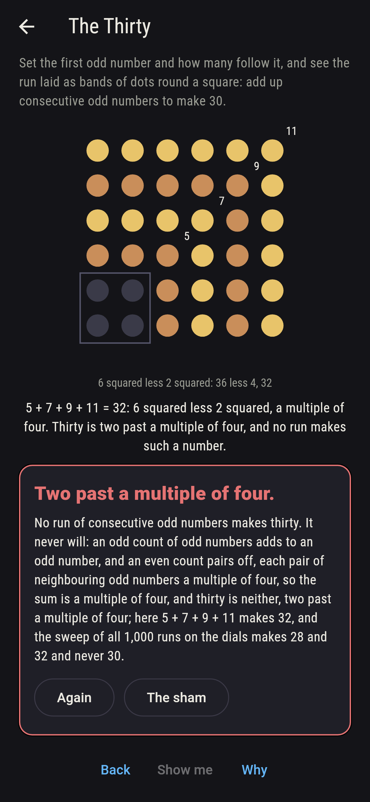
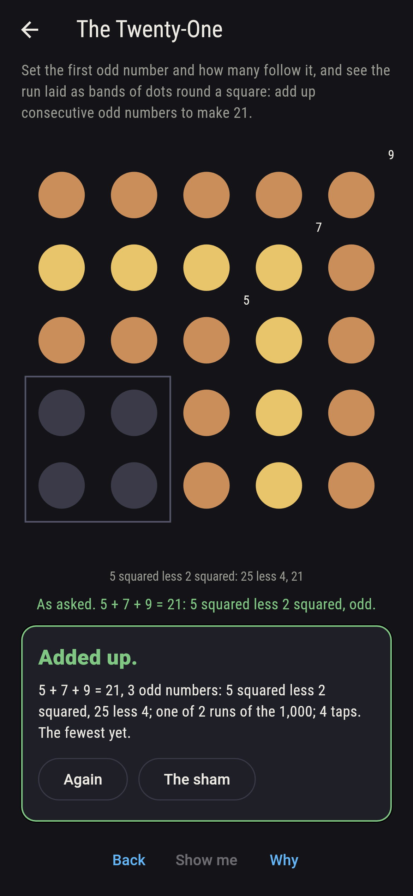
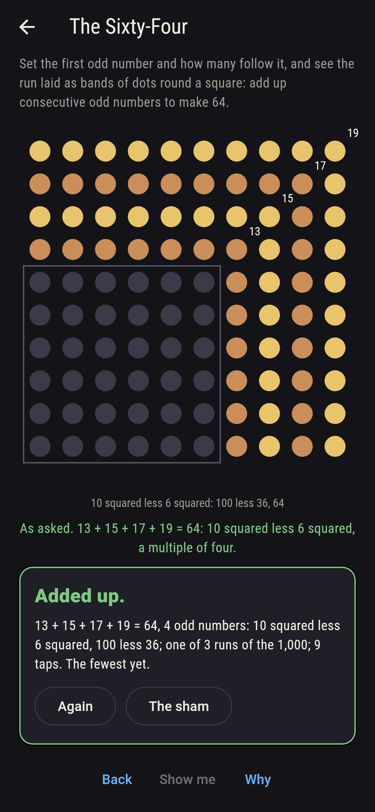
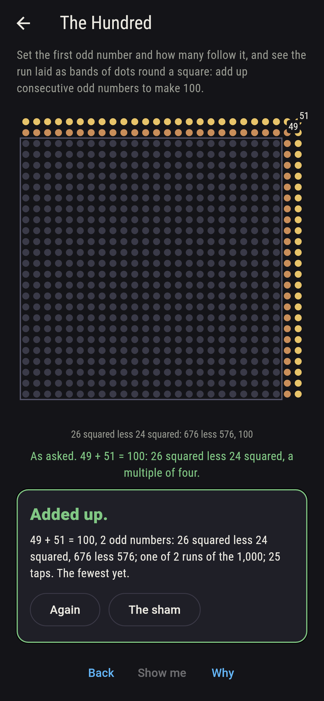
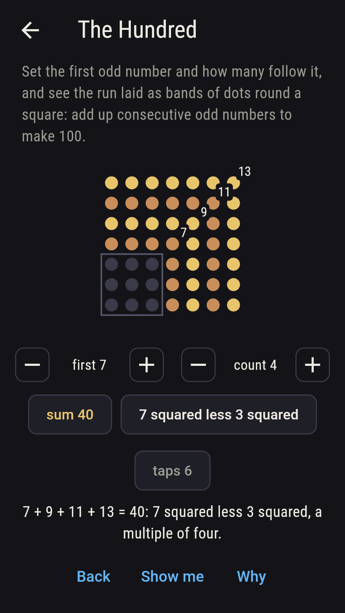
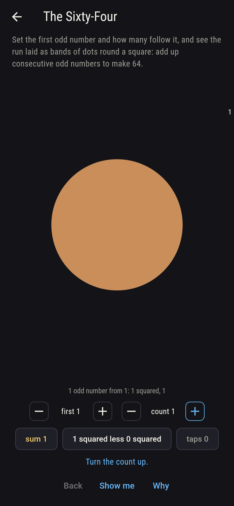
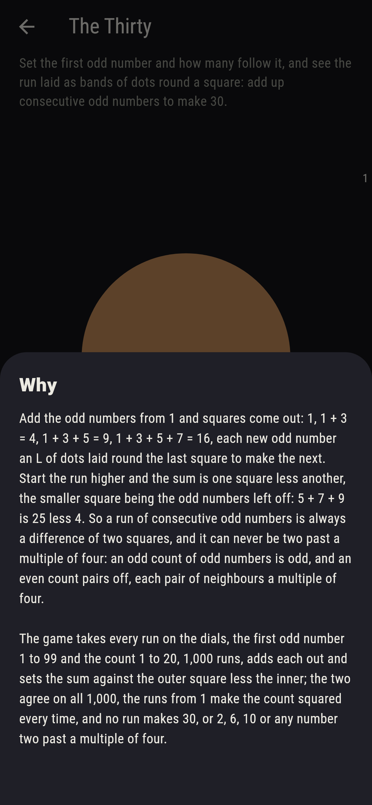

# Oddsworth



Add the odd numbers from 1 and squares come out: 1, 1 + 3 = 4,
1 + 3 + 5 = 9, 1 + 3 + 5 + 7 = 16, each new odd number an L of dots
laid round the last square to make the next. Start the run higher
and the sum is one square less another, the smaller square being
the odd numbers left off: 5 + 7 + 9 is 25 less 4. So a run of
consecutive odd numbers is always a difference of two squares, and
it can never be two past a multiple of four: an odd count of odd
numbers is odd, and an even count pairs off, each pair of neighbours
a multiple of four. Set the first odd number and how many follow it,
and see the run laid as bands of dots round a square. The game takes
every run on the dials, the first odd number 1 to 99 and the count 1
to 20, 1,000 runs, adds each out and sets the sum against the outer
square less the inner; the two agree on all 1,000, the runs from 1
make the count squared every time, and no run makes 30, or 2, 6, 10
or any number two past a multiple of four.

## The asks

1. **The Square of Seven** - add up odd numbers from 1 to make 49
2. **The Twenty-One** - add up consecutive odd numbers to make 21
3. **The Sixty-Four** - add up consecutive odd numbers to make 64
4. **The Hundred** - add up consecutive odd numbers to make 100
5. **The Thirty** - add up consecutive odd numbers to make 30

Seven odd numbers from 1, 1 to 13, make 49, seven squared, and every
count from 1 makes the count squared. Twenty-one is 5 + 7 + 9, 25
less 4, or 21 alone, 121 less 100; sixty-four is 31 + 33, 13 + 15 +
17 + 19 or 1 to 15, three runs; a hundred is 1 to 19, ten squared,
or 49 + 51, 26 squared less 24 squared. Of the numbers to a hundred,
45, 48, 72 and 80 have three runs each and 96 four, the most, and
the twenty-five numbers two past a multiple of four, 2, 6, 10 and on
to 98, have none. The Thirty is labeled hopeless on its tile: an odd
count of odd numbers is odd and an even count a multiple of four;
the sham admits it at 28 or 32, two either side, or after twelve
taps.

## Two voices

The game never asserts what it has not computed, and it computes
everything at least twice:

* **The adding** writes each run out, the first odd number and its
  neighbours after it, and adds it up; every sum on the sham is that
  adding's, and every run is checked to be odd numbers two apart,
  odd in sum for an odd count and a multiple of four for an even one.
* **The squares** add nothing: the inner square's side is the odd
  numbers left off, half of one less than the first, the outer's side
  is that and the count together, and the sum is the outer squared
  less the inner squared; it agrees with the adding on all 1,000
  runs, the runs from 1 come to the count squared, and the sweep of
  what the runs make finds every number to a hundred with no run to
  be two past a multiple of four, twenty-five of them, and 96 the
  number with the most runs, four.

`tool/check_odds.dart` runs the lot and refuses the bake on any
disagreement.

## The checker's ledger

What `dart run tool/check_odds.dart` printed for the build this
README shipped with, word for word:

```
every run of consecutive odd numbers on the dials added out, the first odd number 1 to 99 and the count 1 to 20, 1,000 runs, and each sum set against the outer square less the inner, the outer's side the inner's and the count together, the two agreeing on all 1,000; every run from 1 adds to its count squared, an odd count adds to an odd number and an even count to a multiple of four, and no run adds to a number two past a multiple of four, the twenty-five such numbers to a hundred, 2, 6, 10 and on to 98, being exactly the numbers to a hundred with no run; 49 is 1 to 13 or 49 alone, 21 is 5 + 7 + 9 or 21 alone, 64 is 31 + 33, 13 to 19 or 1 to 15, a hundred is 1 to 19 or 49 + 51, 45, 48, 72 and 80 have three runs each and 96 four, the most to a hundred, and thirty has none, though 28 is 13 + 15 and 32 is 15 + 17 or 5 to 11

 1 The Square of Seven add up odd numbers from 1 to make 49: 1 of the 1,000 runs lands it
 2 The Twenty-One      add up consecutive odd numbers to make 21: 2 of the 1,000 runs land it
 3 The Sixty-Four      add up consecutive odd numbers to make 64: 3 of the 1,000 runs land it
 4 The Hundred         add up consecutive odd numbers to make 100: 2 of the 1,000 runs land it
 5 The Thirty          add up consecutive odd numbers to make 30: none of the 1,000, and the pairs of odd numbers said so first
```

## Screenshots

| The sham | The square of seven | The thirty admitted |
| --- | --- | --- |
|  |  |  |

| The twenty-one | The sixty-four | The hundred | Midway, on the small phone | Show me | The why |
| --- | --- | --- | --- | --- | --- |
|  |  |  |  |  |  |

Screenshots are drawn by `test/showcase_test.dart` at real phone
sizes with the app's own painter, then copied into `docs/` as they
came out; every run in them was dialled by taps, so nothing pictured
is a run the game could not reach. The logo and every launcher icon
come out of `test/mark_test.dart` the same way: the mark is the
square of seven, 1 + 3 + 5 + 7 + 9 + 11 + 13 laid as seven L-shaped
bands of dots.

## Building

```
flutter test          # 44 tests, the sweep among them
dart run tool/check_odds.dart
flutter build apk     # or: flutter build ios
```
