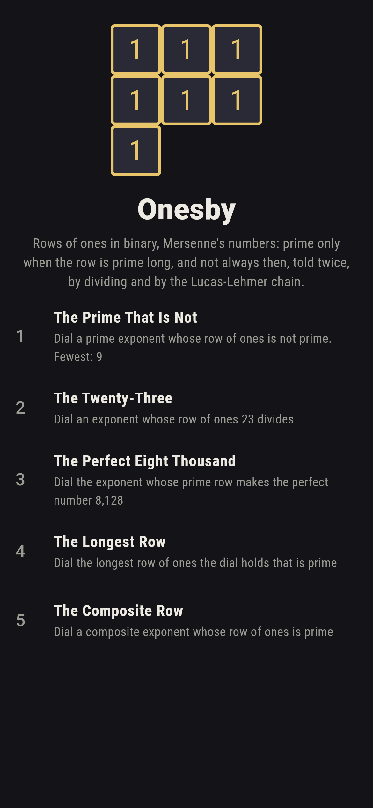
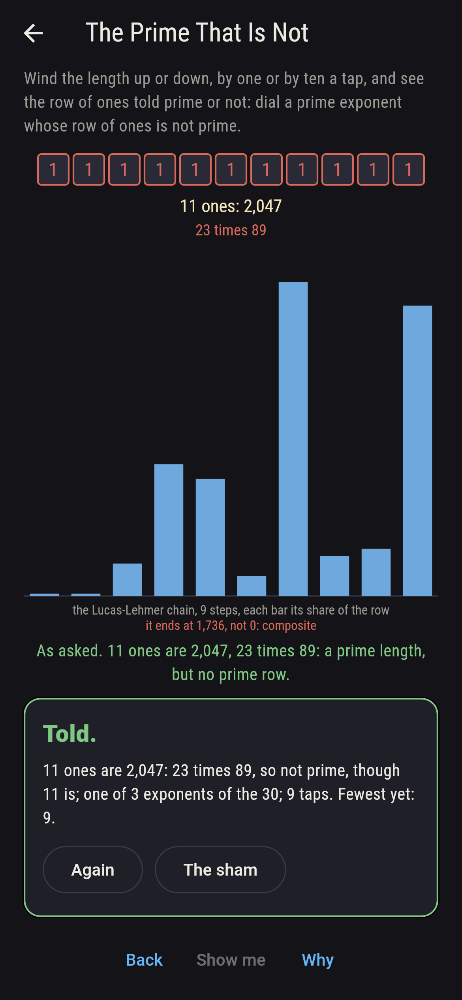
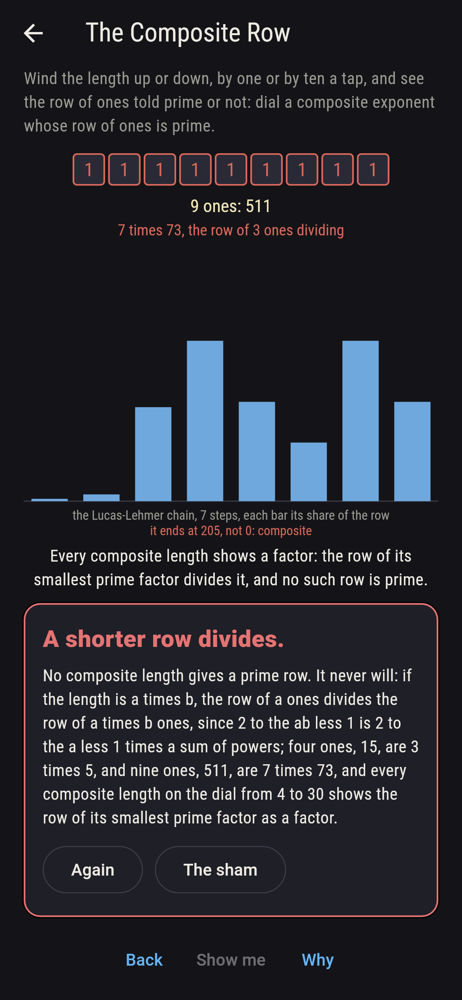
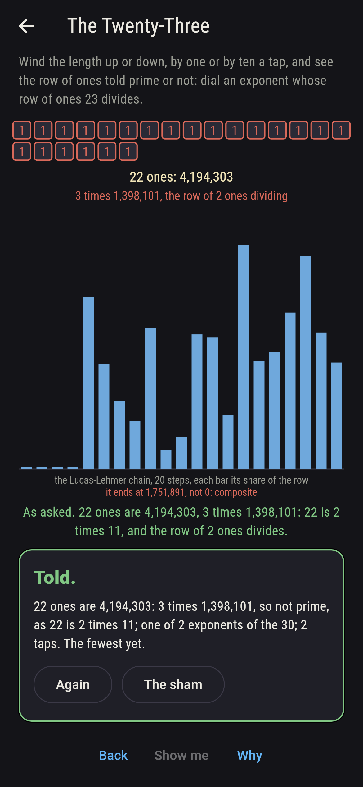
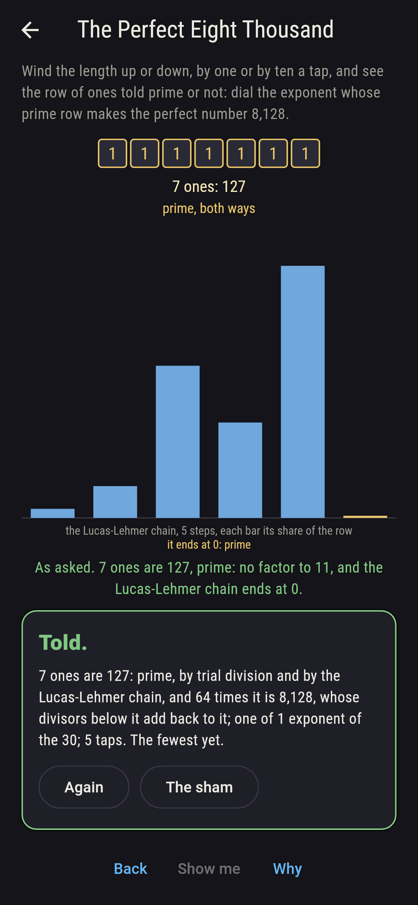
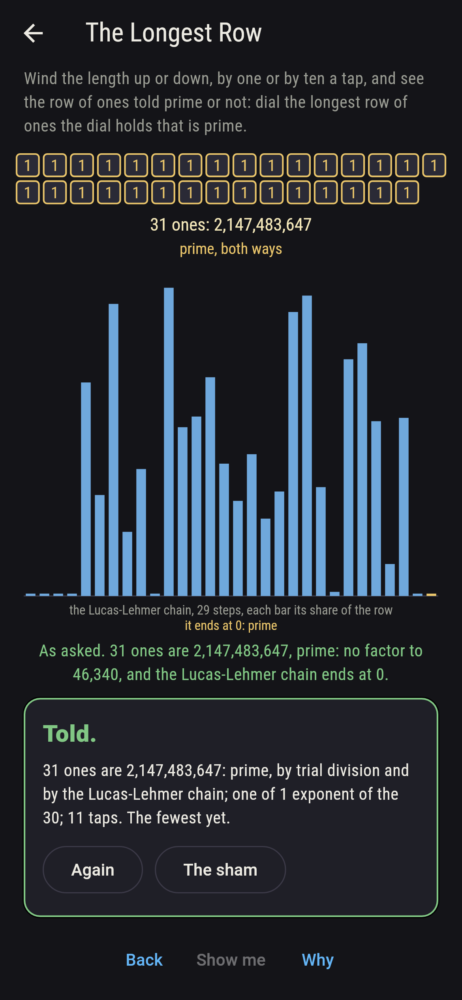
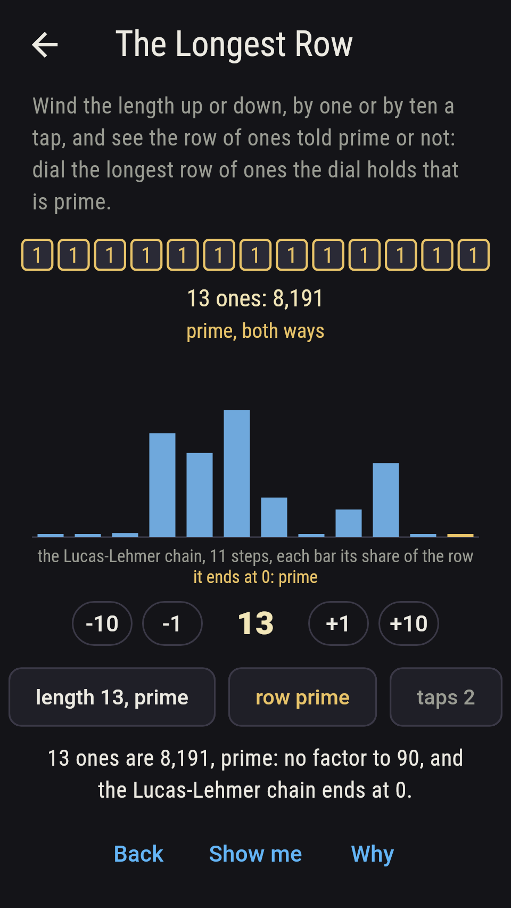
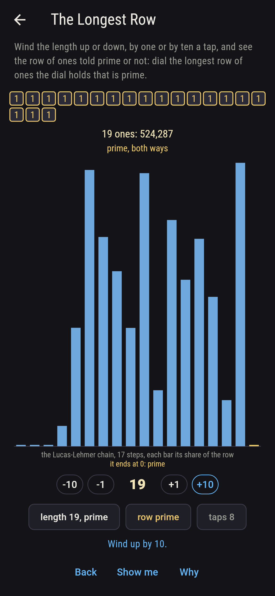
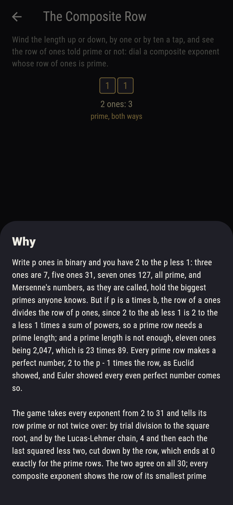

# Onesby


Write p ones in binary and you have 2 to the p less 1: three ones
are 7, five ones 31, seven ones 127, all prime, and Mersenne's
numbers, as they are called, hold the biggest primes anyone knows.
But if p is a times b, the row of a ones divides the row of p ones,
since 2 to the ab less 1 is 2 to the a less 1 times a sum of powers,
so a prime row needs a prime length; and a prime length is not
enough, eleven ones being 2,047, which is 23 times 89. Every prime
row makes a perfect number, 2 to the p - 1 times the row, as Euclid
showed, and Euler showed every even perfect number comes so. Wind
the length up or down and see the row told prime or not. The game
takes every exponent from 2 to 31 and tells its row twice over: by
trial division to the square root, and by the Lucas-Lehmer chain, 4
and then each the last squared less two, cut down by the row, which
ends at 0 exactly for the prime rows. The two agree on all thirty;
every composite exponent shows the row of its smallest prime factor
as a factor, and the perfect numbers made, up to 137,438,691,328,
are checked by adding their divisors.

## The asks

1. **The Prime That Is Not** - dial a prime exponent whose row of ones is not prime
2. **The Twenty-Three** - dial an exponent whose row of ones 23 divides
3. **The Perfect Eight Thousand** - dial the exponent whose prime row makes the perfect number 8,128
4. **The Longest Row** - dial the longest row of ones the dial holds that is prime
5. **The Composite Row** - dial a composite exponent whose row of ones is prime

Of the eleven prime exponents on the dial, eight give prime rows and
three do not: 11 gives 2,047, 23 times 89, 23 gives 8,388,607, 47
times 178,481, and 29 gives 536,870,911, 233 times 2,304,167.
Twenty-three divides the rows of eleven and twenty-two ones only.
Seven ones are 127, and 64 times 127 is 8,128, the fourth perfect
number; the dial's prime rows make 6, 28, 496, 8,128, 33,550,336,
8,589,869,056, 137,438,691,328 and 2,305,843,008,139,952,128. The
row of thirty-one ones, 2,147,483,647, is prime, as Euler showed in
1772, its chain ending at 0 after 29 steps and no factor found to
46,340, and it is the longest prime row the dial holds. The
Composite Row is labeled hopeless on its tile: the row of a shorter
length divides it, four ones being 3 times 5 and nine ones 7 times
73, and the sham admits it after four composite lengths have shown
their factor, or after twelve taps.

## Two voices

The game never asserts what it has not computed, and it computes
everything at least twice:

* **Trial division** tries every divisor to the square root of the
  row, under 46,341 for the longest, and names the smallest factor of
  every composite row; every verdict on the sham is that division's,
  and for every composite length the smallest factor comes out as the
  row of the length's smallest prime factor.
* **The Lucas-Lehmer chain** divides by nothing: 4, then each the
  last squared less two, cut down by the row, p - 2 steps, and the
  row is prime exactly when the chain ends at 0; it agrees with the
  division on all thirty exponents. The perfect numbers the prime
  rows make are checked by adding their divisors, up to
  137,438,691,328, and 23 is checked to divide the rows of eleven
  and twenty-two ones and no other on the dial.

`tool/check_ones.dart` runs the lot and refuses the bake on any
disagreement.

## The checker's ledger

What `dart run tool/check_ones.dart` printed for the build this
README shipped with, word for word:

```
every row of ones from 2 to 31 long told prime or not by trial division to its square root and again by the Lucas-Lehmer chain, the two agreeing on all 30: the prime rows are 2, 3, 5, 7, 13, 17, 19 and 31 ones long, the prime lengths 11, 23 and 29 give composite rows, 23 times 89, 47 times 178,481 and 233 times 2,304,167, and every composite length gives a row whose smallest factor is the row of its smallest prime factor; the eight prime rows make the perfect numbers 6, 28, 496, 8,128, 33,550,336, 8,589,869,056, 137,438,691,328 and 2,305,843,008,139,952,128, the first seven checked by adding their divisors; 23 divides the rows of 11 and 22 ones only; and the row of 31 ones, 2,147,483,647, is prime, its chain ending at 0 after 29 steps and no factor found to 46,340

 1 The Prime That Is Not      dial a prime exponent whose row of ones is not prime: 3 of the 30 exponents land it
 2 The Twenty-Three           dial an exponent whose row of ones 23 divides: 2 of the 30 exponents land it
 3 The Perfect Eight Thousand dial the exponent whose prime row makes the perfect number 8,128: 1 of the 30 exponents lands it
 4 The Longest Row            dial the longest row of ones the dial holds that is prime: 1 of the 30 exponents lands it
 5 The Composite Row          dial a composite exponent whose row of ones is prime: none of the 30, and the row of the smaller length said so first
```

## Screenshots

| The sham | The prime that is not | The composite row admitted |
| --- | --- | --- |
|  |  |  |

| The twenty-three | The perfect eight thousand | The longest row | Midway, on the small phone | Show me | The why |
| --- | --- | --- | --- | --- | --- |
|  |  |  |  |  |  |

Screenshots are drawn by `test/showcase_test.dart` at real phone
sizes with the app's own painter, then copied into `docs/` as they
came out; every row in them was wound to by taps, so nothing pictured
is a row the game could not reach. The logo and every launcher icon
come out of `test/mark_test.dart` the same way: the mark is seven
ones, 127, prime, the row that makes 8,128.

## Building

```
flutter test          # 44 tests, the sweep among them
dart run tool/check_ones.dart
flutter build apk     # or: flutter build ios
```
