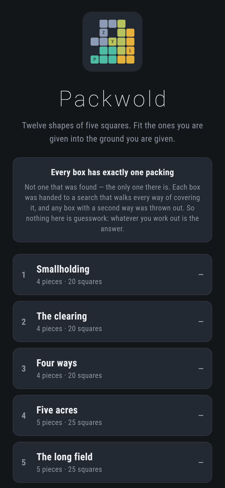
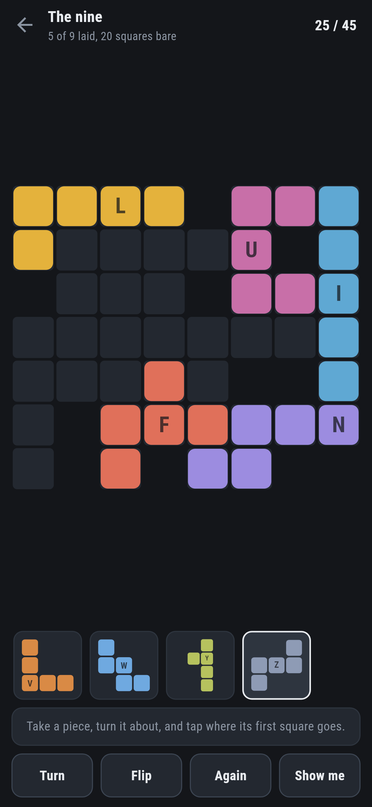
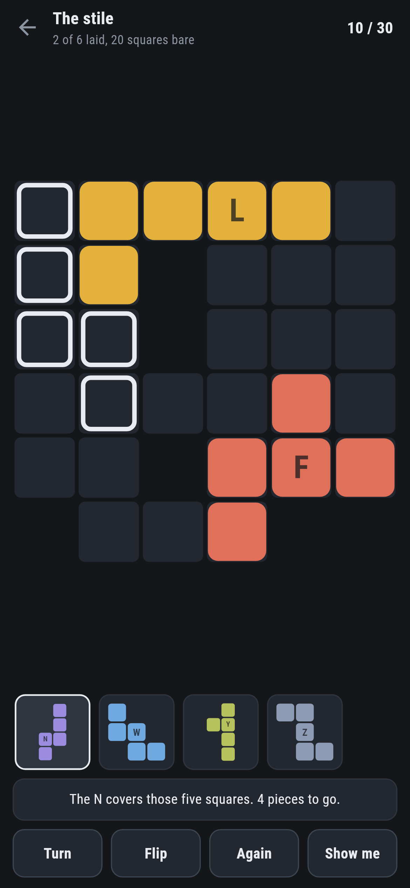
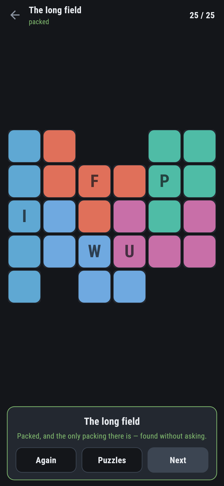
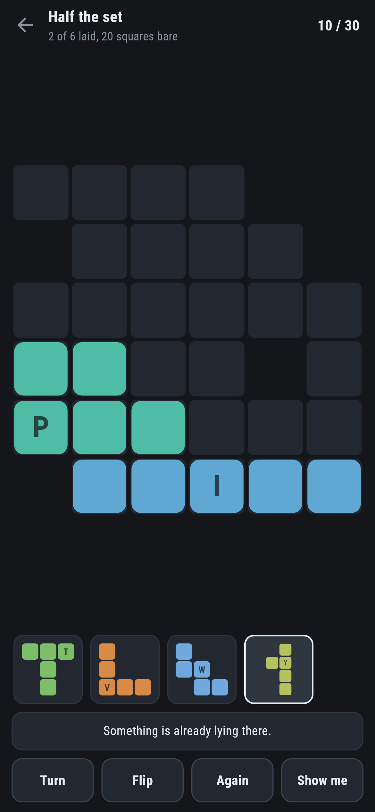

# Packwold

A packing puzzle for phones, in Flutter, for Android and iOS.

Twelve shapes of five squares each. Fit the ones you are given into the ground
you are given. There is exactly one way to do it, and that is checked rather
than hoped.

| | | | |
|---|---|---|---|
|  |  |  |  |

## It is an exact cover, and Knuth wrote the algorithm for it

Every square of the box has to be covered exactly once, and every piece used
exactly once. Write that down as a matrix, with a column for each square and
each piece and a row for every way a piece could lie somewhere, and it is not
*like* the exact cover problem, it **is** the exact cover problem. So the solver is
Algorithm X with dancing links, which is the answer to that problem and has
been since 2000.

The dancing links are the trick that makes it fast: taking a column out of a
doubly linked list and putting it back are both four assignments, so undoing a
choice costs exactly what making it did. And choosing the column with the
fewest rows left is the whole of the cleverness. It makes the search notice a
square nothing can cover the moment that becomes true, rather than a dozen
pieces later.

## The numbers agree with numbers nobody here worked out

The twelve pentominoes fit into four rectangles, and how many ways they do it
has been known for decades. `make counts` counts them:

```
$ make counts
rect   cells  packings  and up to turning and flipping
3x20     60         8         2   9320 steps, 123ms
4x15     60      1472       368   259534 steps, 2339ms
5x12     60      4040      1010   727645 steps, 6436ms
6x10     60      9356      2339   1201811 steps, 10828ms
```

**2, 368, 1010 and 2339.** Those are the published figures, and each packing
has three more like it, turned round and flipped over, so the search finds
four times as many. A test asserts the first two on every run.

That is the one thing here checked against somebody else's work rather than
against itself. If a pentomino were written down with a square in the wrong
place, or a piece could not be flipped, or the search double-counted, these
numbers would not come out, and it is very hard to imagine an error that
leaves all four of them intact.

## Exactly one packing

Not one that was found: the only one there is. `test/fit_test.dart` counts
the packings of every box that ships and fails if there are two:

```dart
final found = Cover(puzzle.box, letters: puzzle.letters).solve(enough: 3);
expect(found.count, 1, reason: '${puzzle.name} has ${found.count} packings');
```

Finding such boxes is nearly all throwing them away. `make find` scatters
pieces at random, takes the ground they cover as the box, and keeps it only if
the solver says one:

```
$ make find ARGS="6 6 6 3"
kept 3 of 95
```

A box of five or six pieces usually has half a dozen packings, and those are
no puzzle: a guess is as right as a reason.

## The hint knows the answer, so it can point at what is wrong


The packing is worked out once when a puzzle opens and then only looked at. So
**Show me** does not search a half-packed box. It reads a piece off the one
answer there is, hands it to you, and rings the five squares it covers.

And it puts pieces in the *wrong* place first, because a piece in the wrong
place is on ground somebody else needs:

> The W is not where it belongs. Take it off.

## Letters as well as colours



Each piece keeps its colour everywhere it appears, so the T is the same green
in the tray, on the box, and two puzzles later. But twelve colours is more
than anybody should have to tell apart, so the letter is painted on as well. They
are the names these shapes have had since Solomon Golomb gave them out in
1953: F I L N P T U V W X Y Z, each one the letter it looks like.

A piece that will not go says which of the three reasons it is: over the edge,
on ground the box does not have, or on top of something already down.

## Running it

```
make deps    # flutter pub get
make test    # everything
make analyze
make shots   # render the screens into build/showcase, redraw the logo and icons
make counts  # the four rectangles, counted right through (about half a minute)
make boxes   # walk every shipped box and count its packings
make find    # look for new boxes with exactly one packing
make apk     # release APK
make ios     # release iOS build, unsigned
```

## Tests

`flutter test` runs the pieces (all twelve are five squares, all different,
each one joined up, and each lies the number of ways its symmetry allows:
eight for the F, four for the T, two for the I, one for the X), the search
(the two published rectangle counts, and a rectangle nothing fits in), every
shipped box (exactly one packing, room for its pieces and no more, one piece
of ground rather than two), and the laying (down where it was asked, turned a
quarter at a time and back round in four, flipped and back in two, picked up
again, and the three reasons a piece will not go).

Then the game through the screen: taking a piece from the tray, turning and
flipping it, tapping it down, tapping it up again, the three refusals, **Show
me** naming a piece and pointing at a piece in the wrong place, and every box
packed to the last square.

Screenshots come from `test/showcase_test.dart`, and every piece lying on a
box in them was put there through the screen: out of the tray, turned about,
and tapped down. `test/mark_test.dart` draws the logo, the launcher icons at
every density Android asks for and every size the iOS icon set asks for; there
is no image in this repository that was not produced by it.
